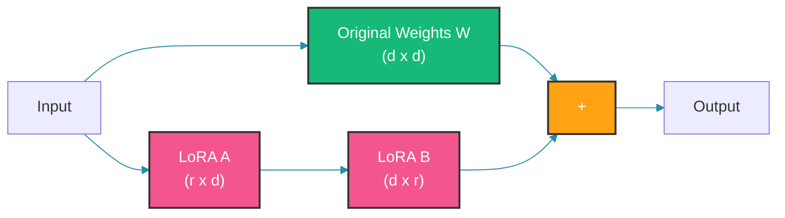
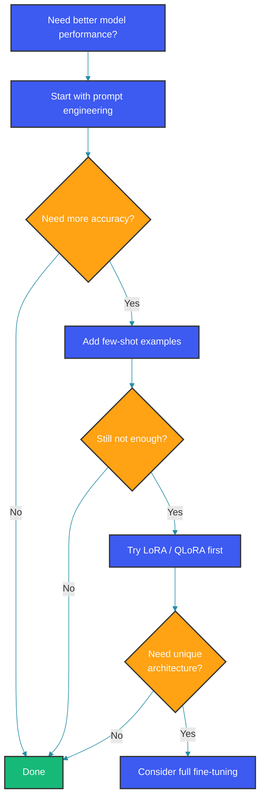

# Fine-Tuning Large Language Models

Fine-tuning adapts pre-trained LLMs to specific tasks or domains. This guide covers when to fine-tune, common methods, and practical implementation.

## When to Fine-Tune vs Prompt Engineering

| Approach | Best For | Cost | Data Required |
|----------|----------|------|---------------|
| Prompt Engineering | Quick iteration, general tasks | Low | None |
| Few-shot Learning | Moderate specificity | Low | 10-100 examples |
| Fine-tuning | Domain adaptation, specific behaviors | High | 1K-100K examples |
| RLHF | Aligning with human preferences | Very High | Large human feedback |

## Fine-Tuning Methods

### 1. Full Fine-Tuning

Updates all model parameters:

```python
from transformers import AutoModelForCausalLM, TrainingArguments

model = AutoModelForCausalLM.from_pretrained("gpt2")
training_args = TrainingArguments(
    output_dir="./results",
    num_train_epochs=3,
    per_device_train_batch_size=4,
    learning_rate=5e-5,
)
```

**Pros:** Maximum adaptation
**Cons:** Expensive, risk of catastrophic forgetting

### 2. LoRA (Low-Rank Adaptation)

Trains only small adapter matrices. Instead of updating the full weight matrix W (d x d), LoRA learns two low-rank matrices B and A such that the update is W + BA where B (d x r) and A (r x d), with rank r much smaller than d. This reduces trainable parameters by orders of magnitude.



```python
from peft import LoraConfig, get_peft_model

lora_config = LoraConfig(
    r=16,
    lora_alpha=32,
    target_modules=["q_proj", "v_proj"],
    lora_dropout=0.05,
    bias="none",
    task_type="CAUSAL_LM",
)

model = get_peft_model(base_model, lora_config)
model.print_trainable_parameters()
# trainable params: 4M || all params: 124M || trainable%: 0.3%
```

### 3. QLoRA (Quantized LoRA)

Combines quantization with LoRA for memory efficiency. The base model is loaded in 4-bit precision, cutting memory by 4x, while the LoRA adapters remain in full precision for training.

```python
from transformers import BitsAndBytesConfig
from peft import prepare_model_for_kbit_training

quantization_config = BitsAndBytesConfig(
    load_in_4bit=True,
    bnb_4bit_compute_dtype=torch.float16,
)

model = AutoModelForCausalLM.from_pretrained(
    "meta-llama/Llama-2-7b",
    quantization_config=quantization_config,
)
model = prepare_model_for_kbit_training(model)
```

### 4. Adapter Methods

Add small trainable modules to frozen layers. The adapter sits between the frozen LLM layers, learning task-specific transformations while preserving the base model's general knowledge.

## Preparing Training Data

### Format for Instruction Fine-Tuning

```json
{
  "instruction": "Summarize the following text",
  "input": "Long article about climate change...",
  "output": "Concise summary of key points..."
}
```

### Dataset Preparation Code

```python
def format_example(example):
    return f"""### Instruction:
{example['instruction']}

### Input:
{example.get('input', 'None')}

### Response:
{example['output']}

### End"""
```

### Data Quality Guidelines

- **Quality over quantity** - 1K high-quality > 10K noisy examples
- **Diverse examples** - Cover edge cases and variations
- **Consistent format** - Clear instructions, correct outputs
- **No leakage** - Don't include answers in inputs

## Training Pipeline

```python
from transformers import Trainer, DataCollator

trainer = Trainer(
    model=model,
    args=training_args,
    train_dataset=tokenized_train,
    eval_dataset=tokenized_eval,
    data_collator=DataCollatorForLanguageModeling(
        tokenizer=tokenizer,
        mlm=False,
    ),
)

trainer.train()
```

## Evaluating Fine-Tuned Models

### Metrics to Track

| Metric | Purpose |
|--------|---------|
| Perplexity | General language fluency |
| Task Accuracy | Task-specific performance |
| Rouge/BLEU | For generation tasks |
| Human Evaluation | Quality and safety |

```python
from datasets import load_metric

rouge = load_metric("rouge")

def evaluate_model(model, test_dataset):
    predictions = []
    references = []
    
    for example in test_dataset:
        output = generate_text(example["input"])
        predictions.append(output)
        references.append(example["reference"])
    
    return rouge.compute(predictions=predictions, references=references)
```

## Common Pitfalls

1. **Overfitting** - Too many epochs on small data
2. **Catastrophic forgetting** - Losing general capabilities
3. **Data leakage** - Test data in training set
4. **Alignment degradation** - Model becomes less helpful

### Mitigation Strategies

```python
# Regularization through lower learning rate
training_args = TrainingArguments(
    learning_rate=1e-4,  # Lower than pre-training
    weight_decay=0.01,
    warmup_ratio=0.1,
)

# Multi-task learning to prevent forgetting
mixed_dataset = combine_datasets([
    domain_data,      # 20%
    general_data,     # 80%
])
```

## Saving and Deployment

```python
# Save adapter weights
model.save_pretrained("./lora_adapter")

# Save full model
trainer.save_model("./final_model")

# Push to hub
model.push_to_hub("username/my-finetuned-model")
tokenizer.push_to_hub("username/my-finetuned-model")
```

## Inference with Fine-Tuned Model

```python
from peft import PeftModel

base_model = AutoModelForCausalLM.from_pretrained("base_model")
model = PeftModel.from_pretrained(base_model, "./lora_adapter")

output = model.generate(
    tokenizer.encode("Input prompt", return_tensors="pt"),
    max_new_tokens=100,
)
```

## Cost Comparison

| Method | GPU Memory | Training Time | Cost |
|--------|-----------|---------------|------|
| Full FT (7B) | ~28GB | Hours | $$$ |
| LoRA (7B) | ~8GB | 1-2 hours | $$ |
| QLoRA (7B) | ~6GB | 2-4 hours | $ |
| Prompt Eng | 0 | Minutes | Free |

## Decision Flow



## Summary

- Fine-tuning adapts LLMs to specific tasks
- LoRA/QLoRA are cost-effective options
- Quality data matters more than quantity
- Always evaluate for overfitting and alignment
- Start simple, increase complexity as needed

Happy Coding
