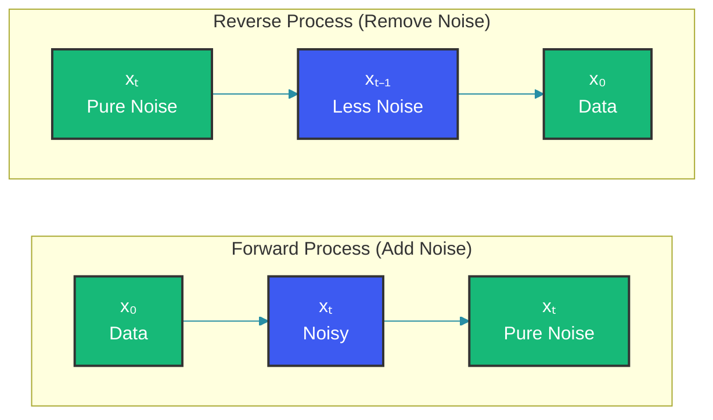
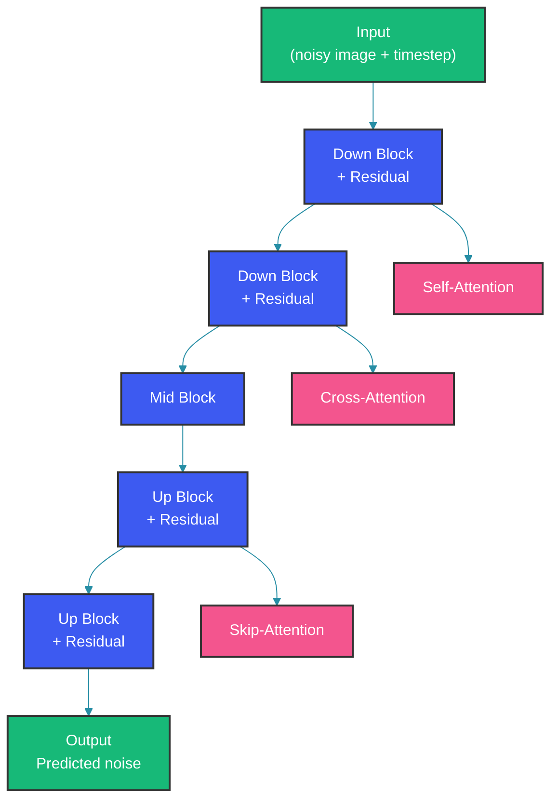

# Diffusion Models Explained

Diffusion models generate data by learning to reverse a gradual noising process. They're the foundation of modern image generators like Stable Diffusion and DALL-E 3.

## The Core Idea



The forward process gradually adds Gaussian noise to data over T timesteps until the signal is destroyed. The reverse process learns to denoise step by step, starting from pure noise and recovering the original data distribution.

### Forward Process (q)

```python
def forward_process(x_0, t):
    """Add noise to image at timestep t"""
    noise = torch.randn_like(x_0)
    alpha_bar = alphas_cumprod[t]
    
    # At t=T, image is pure noise
    x_t = torch.sqrt(alpha_bar) * x_0 + torch.sqrt(1 - alpha_bar) * noise
    return x_t
```

### Reverse Process (p)

```python
def reverse_step(x_t, t, model):
    """Remove one step of noise"""
    noise_pred = model(x_t, t)
    alpha = alphas[t]
    alpha_bar = alphas_cumprod[t]
    
    # Predict and remove noise
    x_{t-1} = (x_t - torch.sqrt(1-alpha_bar) * noise_pred) / torch.sqrt(alpha_bar)
    x_{t-1} += torch.sqrt(1-alpha) * noise * (t > 0)
    return x_{t-1}
```

## Architecture Overview



The U-Net architecture with attention blocks is the backbone of most diffusion models. It processes the noisy input through a downsampling path, a bottleneck, and an upsampling path with skip connections. Attention layers enable conditioning on text prompts and other modalities.

## Conditioning with Classifier-Free Guidance

```python
def classifier_free_guidance(model, x_t, t, cond, cfg_scale=7.5):
    """Combine conditional and unconditional predictions"""
    
    # Unconditional prediction (no conditioning)
    noise_uncond = model(x_t, t, None)
    
    # Conditional prediction (with conditioning)
    noise_cond = model(x_t, t, cond)
    
    # Blend based on guidance scale
    noise = noise_uncond + cfg_scale * (noise_cond - noise_uncond)
    
    return noise
```

## Text-to-Image Pipeline

```python
class StableDiffusionPipeline:
    def __init__(self, tokenizer, encoder, diffusion, decoder, cfg_scale=7.5):
        self.tokenizer = tokenizer
        self.encoder = encoder
        self.diffusion = diffusion
        self.decoder = decoder
        self.cfg_scale = cfg_scale
    
    @torch.no_grad()
    def generate(self, prompt, num_inference_steps=50):
        # Encode text prompt
        text_embeddings = self.encoder(prompt)
        
        # Start from random noise
        latents = torch.randn((1, 4, 64, 64))
        
        # Denoise in latent space
        for t in reversed(range(num_inference_steps)):
            noise_pred = self.diffusion(latents, t, text_embeddings)
            latents = self.reverse_step(latents, noise_pred, t)
        
        # Decode latent space to image
        image = self.decoder(latents)
        return image
```

## Key Techniques

### 1. Latent Diffusion

Running diffusion in compressed latent space reduces computation by 8x while maintaining quality:

```mermaid
graph LR
    Image["Image<br/>(512x512x3)"] --> Encoder["Encoder"]
    Encoder --> Latents["Latents<br/>(64x64x4)"]
    Latents --> Diffusion["Diffusion Process"]
    Diffusion --> Decoder["Decoder"]
    Decoder --> Result["Generated Image<br/>(512x512x3)"]

    classDef green fill:#17b978,stroke:#333,stroke-width:2px,color:#fff
    classDef blue fill:#3d5af1,stroke:#333,stroke-width:2px,color:#fff
    classDef pink fill:#f3558e,stroke:#333,stroke-width:2px,color:#fff
    classDef yellow fill:#FFA213,stroke:#333,stroke-width:2px,color:#fff
    linkStyle default stroke:#278ea5

    class Image,Result green
    class Encoder,Decoder pink
    class Latents, Diffusion blue
```

### 2. Noise Schedules

```python
def get_schedule(num_train_timesteps=1000, beta_start=0.0001, beta_end=0.02):
    betas = torch.linspace(beta_start, beta_end, num_train_timesteps)
    alphas = 1 - betas
    alphas_cumprod = torch.cumprod(alphas, dim=0)
    return alphas, alphas_cumprod
```

### 3. Sampling Strategies

| Method | Steps | Quality | Speed |
|--------|-------|---------|-------|
| DDPM | 1000 | Best | Slowest |
| DDIM | 20-50 | Good | Fast |
| Euler | 20-50 | Good | Fastest |
| DPM-Solver | 10-20 | Good | Very Fast |

```python
# DDIM sampling
@torch.no_grad()
def ddim_step(x_t, t, model, eta=0):
    noise_pred = model(x_t, t)
    alpha = alphas[t]
    alpha_bar = alphas_cumprod[t]
    
    pred_x0 = (x_t - torch.sqrt(1-alpha_bar) * noise_pred) / torch.sqrt(alpha_bar)
    
    if t > 0:
        noise = torch.randn_like(x_t)
        x_{t-1} = torch.sqrt(alpha_bar) * pred_x0 + torch.sqrt(1-alpha_bar) * noise
    return x_{t-1}
```

## Training

```python
def training_step(batch, model):
    images = batch["image"]
    noise = torch.randn_like(images)
    batch_size = images.shape[0]
    
    # Random timestep
    t = torch.randint(0, num_timesteps, (batch_size,))
    
    # Add noise at timestep t
    noisy_images = forward_process(images, t)
    
    # Predict noise
    noise_pred = model(noisy_images, t)
    
    # L2 loss
    loss = nn.functional.mse_loss(noise_pred, noise)
    loss.backward()
```

## Variations and Extensions

### 1. Inpainting

```python
def inpaint(noisy_image, mask, model):
    """Fill masked regions"""
    # Keep unmasked regions fixed
    x_t = noisy_image * mask + random_noise * (1 - mask)
    
    # Denoise (mask prevents changes to unmasked regions)
    for t in reversed(range(num_steps)):
        noise_pred = model(x_t, t)
        x_t = reverse_step(x_t, noise_pred, t)
        x_t = x_t * mask + noisy_image * (1 - mask)  # Keep original unmasked
    
    return x_t
```

### 2. ControlNet Conditioning

```python
def controlnet_conditioning(pose_image, model):
    """Add spatial control to generation"""
    # Pose/image provides structure
    control = pose_encoder(pose_image)
    
    # Inject into each block of U-Net
    for block in model.down_blocks:
        block.control = control
```

## Comparing Generative Models

| Model Type | Pros | Cons | Best For |
|-----------|------|------|----------|
| GAN | Fast | Mode collapse | Fast inference |
| VAE | Stable | Blurry | Latent interpolation |
| Flow | Exact likelihood | Slow | Density estimation |
| Diffusion | High quality | Slow | Photorealistic images |

## Summary

- Diffusion models learn to reverse a noising process
- U-Net architecture predicts noise at each timestep
- Latent diffusion reduces computation
- Classifier-free guidance enables text conditioning
- Key tradeoff: quality vs speed (sampling steps)

Happy Coding
