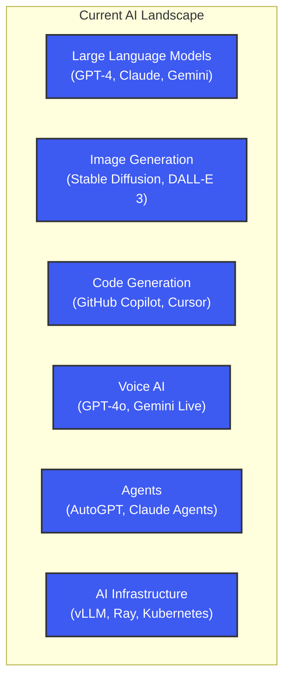
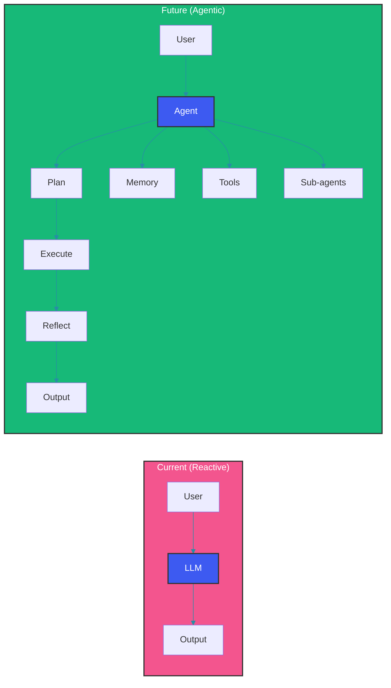
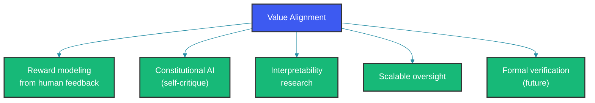
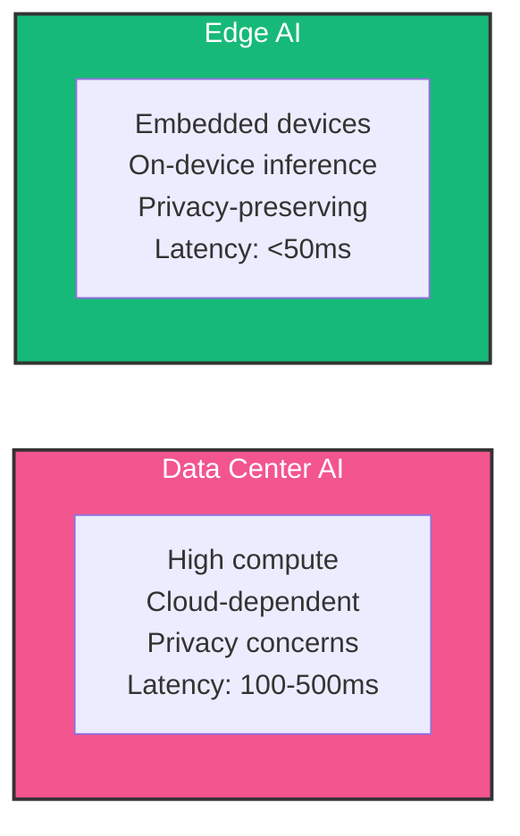

# The Future of AI Systems

Where is AI heading? This post explores emerging trends, research directions, and predictions for the next era of AI.

## Current State (2024-2025)



## Emerging Trends

### 1. Larger Context Windows

| Year | Model | Context Window |
|------|-------|----------------|
| 2022 | GPT-3.5 | 4K tokens |
| 2023 | GPT-4 | 128K tokens |
| 2024 | Claude 3.5 | 200K tokens |
| 2025+ | Gemini 1.5 | 1M+ tokens |

**Implications:**
- Entire codebases fit in context
- Full conversations without summarization
- Video comprehension (frame sampling)

### 2. Agentic Systems



**Key capabilities emerging:**
- Multi-step reasoning with tool use
- Persistent memory across sessions
- Self-correction and self-improvement
- Collaborative multi-agent systems

### 3. Multimodal Integration

Next-generation models will seamlessly handle text, images, audio, video, 3D, code, and actions through unified understanding and generation.

### 4. Specialized Models

| Approach | When to Use | Tradeoffs |
|----------|-------------|-----------|
| General LLM | Broad tasks | Good at everything, great at nothing |
| Fine-tuned | Specific domains | Better but less flexible |
| Mixture of Experts | Mixed workloads | Efficient for diverse tasks |
| Model routing | Dynamic selection | Complexity, latency |

## Research Frontiers

### 1. Reasoning and Planning

```python
# Current: Chain-of-thought
"Think step by step..."

# Emerging: Tree-of-thought, Graph-of-thought
# Enables backtracking, exploration of alternatives
# Self-correction during generation
```

### 2. Constitutional AI and Alignment



### 3. Efficient Architectures

| Architecture | Innovation | Efficiency Gain |
|--------------|------------|----------------|
| LoRA | Low-rank adapters | 100x fewer params |
| MoE | Mixture of Experts | Sparsity benefits |
| SSM (Mamba) | State space models | Linear complexity |
| RWKV | Recurrence + Attention | Constant memory |

### 4. Knowledge Editing

```python
# Update model knowledge without retraining
class KnowledgeEditor:
    def edit_knowledge(self, model, target, new_value):
        # Locate knowledge in weights
        location = self.locate_knowledge(model, target)
        
        # Apply precise update
        self.apply_edit(model, location, new_value)
        
        # Preserve unrelated knowledge
        self.restore_factual_consistency(model)
```

## Infrastructure Evolution

### 1. Edge AI



**Applications:** Mobile keyboards, camera apps, IoT devices

### 2. AI Accelerators

| Chip | Provider | Peak Performance |
|------|---------|-------------------|
| H100 | NVIDIA | 3958 TFLOPS |
| TPU v5 | Google | 459 TFLOPS |
| Gaudi 3 | Intel | 1835 TFLOPS |
| Trainium 2 | AWS | Unknown |

### 3. Inference Optimization

```python
# Current optimizations
quantization          # 4-bit, 8-bit inference
pruning               # Remove redundant weights
batch inference       # Share compute across requests
caching               # KV-cache, semantic cache

# Emerging
speculative decoding  # Draft + verify
branch-and-verify     # Parallel hypothesis testing
neural architecture search # Auto-optimize for target
```

## Predictions for 2025-2030

### Near-term (1-2 years)

1. **Agent dominance** - Productivity agents become mainstream
2. **Multimodal ubiquity** - All models handle all modalities
3. **Context windows** - 1M+ tokens standard, books in memory
4. **Lower costs** - 10x cost reduction per token
5. **Specialization** - Domain-specific models beat generalists

### Medium-term (3-5 years)

1. **Persistent agents** - AI that remembers and learns
2. **Physical AI** - Robots with LLM brains
3. **AI-software symbiosis** - AI embedded in IDEs, OS, productivity tools
4. **Personalized AI** - Models trained on your data
5. **Regulation** - Government frameworks for AI governance

### Long-term (5-10 years)

1. **AGI milestones** - Narrow AGI in specific domains
2. **Scientific AI** - AI co-researcher for drug discovery, materials
3. **Brain-computer interfaces** - Neural linking with AI
4. **AI consciousness** - Philosophical and technical debates
5. **Existential considerations** - Alignment becomes critical

## Skills for the Future

| Skill | Importance | Description |
|-------|------------|-------------|
| AI literacy | Critical | Understanding capabilities and limitations |
| Prompt engineering | High | Effective interaction with AI |
| AI-assisted coding | High | IDE-integrated AI tools |
| Evaluation | High | Measuring AI output quality |
| System design | Medium | Building AI-powered applications |
| Ethics and safety | Medium | Responsible AI development |

## Preparing for the Future

```python
# Recommended learning path
future_skills = [
    "Prompt engineering best practices",
    "Agent frameworks (LangChain, LangGraph)",
    "Vector databases and retrieval",
    "MLOps and deployment",
    "AI safety and alignment basics",
    "Domain-specific AI applications",
    "AI ethics and governance",
]

# Stay current
resources = [
    "ArXiv (cs.CL, cs.LG)",
    "AI conferences (NeurIPS, ICML, ACL)",
    "Industry research (OpenAI, Anthropic, Google)",
    "Open source projects",
    "Communities (Hugging Face, Reddit, Discord)",
]
```

## Open Questions

1. **Context window limits** - Will we ever need more than full document understanding?
2. **Knowledge cutoff** - Real-time knowledge vs. model weights
3. **Reasoning vs. memorization** - Can current architectures truly reason?
4. **Alignment** - Will we solve value alignment before AGI?
5. **Economic impact** - Job displacement vs. new opportunities

## Summary

- AI is evolving from tools to agents
- Multimodal and long-context are becoming standard
- Efficiency innovations enable broader deployment
- Alignment and safety become critical
- Continuous learning is essential for practitioners

The future of AI isn't just about bigger models—it's about smarter systems that understand context, reason reliably, and work alongside humans effectively.

Happy Coding
