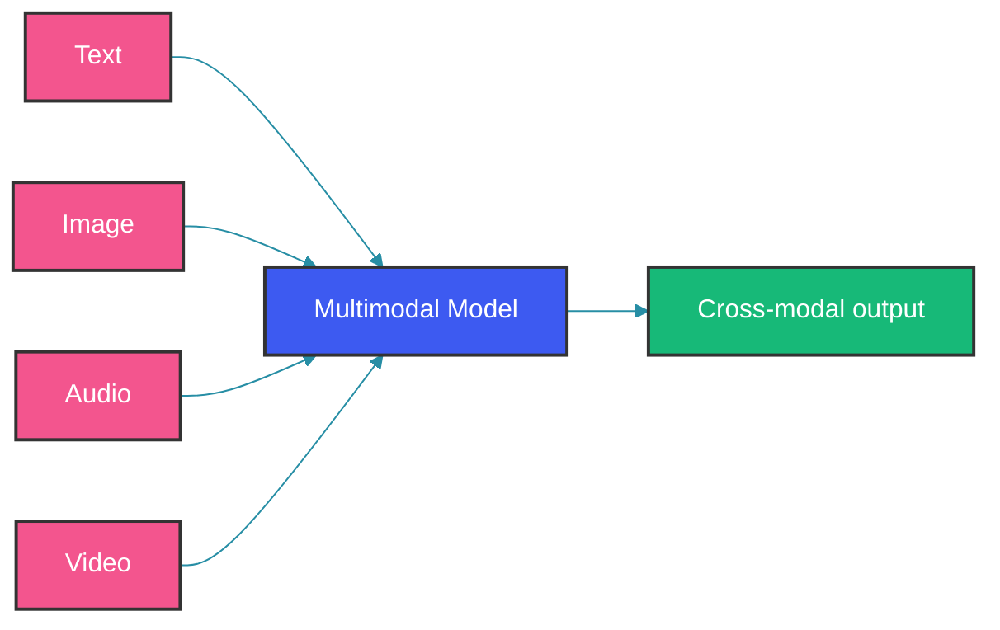
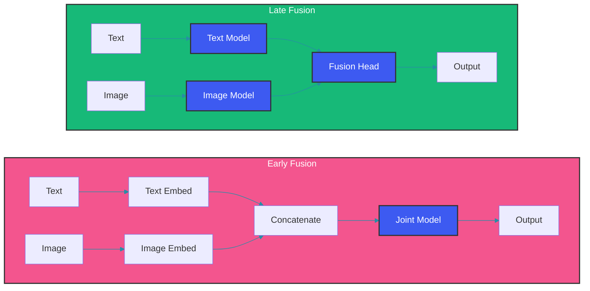

# Multimodal Models

Multimodal models process and generate content across multiple data types: text, images, audio, video, and more.

## What Are Multimodal Models?



Multimodal models fuse information from different modalities to produce cross-modal understanding and generation.

## Key Architectures

### 1. Early Fusion

Combine all modalities at input level:

```python
class EarlyFusionModel(nn.Module):
    def __init__(self):
        self.text_encoder = TextEncoder()
        self.image_encoder = ImageEncoder()
        self.fusion_layer = nn.TransformerEncoderLayer(d_model=768)
        
    def forward(self, text, image):
        text_emb = self.text_encoder(text)
        image_emb = self.image_encoder(image)
        
        # Concatenate at feature level
        combined = torch.cat([text_emb, image_emb], dim=1)
        
        return self.fusion_layer(combined)
```

### 2. Late Fusion

Process modalities separately, combine at output:

```python
class LateFusionModel(nn.Module):
    def forward(self, text, image):
        text_output = self.text_model(text)
        image_output = self.image_model(image)
        
        # Combine at decision level
        return self.fusion_head(text_output, image_output)
```

### 3. Cross-Attention Fusion

```python
class CrossAttentionFusion(nn.Module):
    def forward(self, text_features, image_features):
        # Image features as keys/values, text as queries
        cross_output = self.cross_attention(
            query=text_features,
            key=image_features,
            value=image_features,
        )
        return cross_output
```

## Fusion Architecture Comparison



## Vision-Language Models

### CLIP-style Architecture

```python
class CLIPModel(nn.Module):
    def __init__(self):
        self.image_encoder = VisionTransformer()
        self.text_encoder = Transformer()
        self.projection_dim = 512
        
    def encode_image(self, image):
        features = self.image_encoder(image)
        return self.image_projection(features)
    
    def encode_text(self, text):
        features = self.text_encoder(text)
        return self.text_projection(features)
    
    def forward(self, image, text):
        image_emb = self.encode_image(image)
        text_emb = self.encode_text(text)
        
        # Contrastive learning objective
        logits = torch.matmul(image_emb, text_emb.T) * self.temperature
        return logits
```

### Image-to-Text (Captioning, VQA)

```python
class ImageCaptioningModel(nn.Module):
    def __init__(self):
        self.vision_encoder = timm.create_model('vit-base')
        self.decoder = TransformerDecoder()
        self.vocab_size = 50000
        
    def generate_caption(self, image, tokenizer):
        image_features = self.vision_encoder(image)
        
        # Autoregressive generation
        tokens = [tokenizer.bos_token_id]
        for _ in range(max_length):
            logits = self.decoder(
                torch.tensor(tokens),
                image_features
            )
            next_token = logits[-1].argmax()
            if next_token == tokenizer.eos_token_id:
                break
            tokens.append(next_token)
        
        return tokenizer.decode(tokens)
```

### Text-to-Image Generation

```python
class TextToImageModel(nn.Module):
    def __init__(self):
        self.text_encoder = CLIPTextEncoder()
        self.image_decoder = DiffusionUNet()
        
    def generate(self, prompt):
        text_emb = self.text_encoder(prompt)
        
        # Text conditioning for diffusion
        noisy_image = torch.randn(1, 3, 256, 256)
        for t in reversed(range(num_steps)):
            noise_pred = self.image_decoder(noisy_image, t, text_emb)
            noisy_image = self.denoise_step(noisy_image, noise_pred, t)
        
        return noisy_image
```

## Audio Models

### Speech Recognition

```python
class WhisperModel:
    def __init__(self):
        self.encoder = AudioEncoder()  # Mel spectrogram input
        self.decoder = TransformerDecoder()  # Text output
        
    def transcribe(self, audio):
        mel_spec = self.audio_processor(audio)
        tokens = self.decoder.generate(mel_spec)
        return self.tokenizer.decode(tokens)
```

### Text-to-Speech

```python
class TTSModel(nn.Module):
    def __init__(self):
        self.text_encoder = TextEncoder()
        self.duration_predictor = DurationPredictor()
        self.flow_matcher = FlowMatching()
        self.hifigan = HiFiGANVocoder()
        
    def synthesize(self, text):
        text_emb = self.text_encoder(text)
        durations = self.duration_predictor(text_emb)
        
        # Expand to audio length
        expanded = expand_by_duration(text_emb, durations)
        
        # Generate audio with flow matching
        audio = self.flow_matcher(expanded)
        return self.hifigan(audio)
```

## Video Understanding

```python
class VideoModel(nn.Module):
    def __init__(self):
        self.frame_encoder = VisionTransformer()
        self.temporal_aggregator = TemporalTransformer()
        self.classifier = ClassificationHead()
        
    def forward(self, frames):  # frames: [B, T, C, H, W]
        batch, T = frames.shape[:2]
        
        # Encode each frame
        frame_features = self.frame_encoder(frames.view(-1, 3, 224, 224))
        frame_features = frame_features.view(batch, T, -1)
        
        # Model temporal dynamics
        temporal_features = self.temporal_aggregator(frame_features)
        
        return self.classifier(temporal_features)
```

## Multimodal Benchmarks

| Benchmark | Tasks | Metrics |
|-----------|-------|---------|
| MMBench | Multiple choice | Accuracy |
| MM-Vet | VQA, generation | GPT-4 score |
| MathVista | Math problems | Accuracy |
| MMMU | Multi-subject | Accuracy |
| VideoQA | Video understanding | Accuracy |

## Practical Applications

| Application | Input | Output |
|-------------|-------|--------|
| Image search | Text + Image DB | Ranked images |
| Document understanding | PDF (text+charts) | Extracted info |
| Video captioning | Video | Descriptions |
| Music generation | Text | Audio |
| Robotics | Text + Vision | Actions |

## Implementation Example

```python
from transformers import AutoProcessor, AutoModel

processor = AutoProcessor.from_pretrained("llava-hf/llava-1.5-7b")
model = AutoModel.from_pretrained("llava-hf/llava-1.5-7b")

def multimodal_inference(image, prompt):
    inputs = processor(text=prompt, images=image, return_tensors="pt")
    output = model.generate(**inputs, max_new_tokens=100)
    return processor.batch_decode(output, skip_special_tokens=True)
```

## Summary

- Multimodal models fuse information from different sources
- Early fusion combines at input, late fusion at output
- CLIP-style contrastive learning for alignment
- Enable applications: image search, VQA, TTS, video understanding
- Key challenge: aligning heterogeneous representations

Happy Coding
