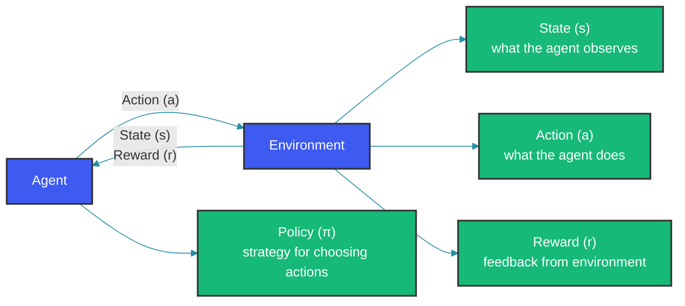
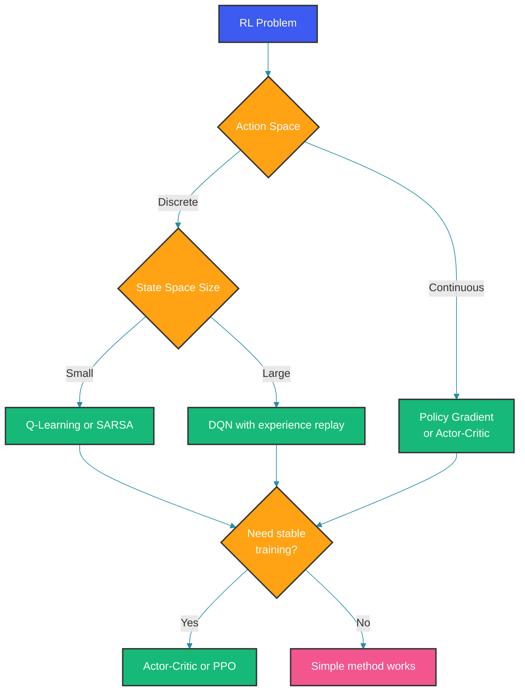

# Reinforcement Learning Basics

Reinforcement Learning (RL) is a paradigm where agents learn by interacting with an environment, receiving rewards or penalties for their actions.

## The RL Framework



The agent observes the environment state, selects an action according to its policy, and receives a reward. The environment transitions to a new state. This loop repeats until the episode ends.

## Key Concepts

### 1. The Reward Hypothesis

> All goals can be described as the maximization of expected cumulative reward.

```python
# Cumulative reward (return)
G_t = r_t + r_{t+1} + r_{t+2} + ...

# Discounted return (common in continuous tasks)
G_t = r_t + γr_{t+1} + γ²r_{t+2} + ...
```

### 2. Value Functions

**State Value Function V(s):** Expected return from state s following policy π

```python
V_π(s) = E_π[G_t | S_t = s]
```

**Action Value Function Q(s,a):** Expected return from state s, taking action a

```python
Q_π(s,a) = E_π[G_t | S_t = s, A_t = a]
```

### 3. The Bellman Equations

```python
V_π(s) = Σ_a π(a|s) * Σ_{s'} P(s'|s,a) * [R(s,a,s') + γV_π(s')]

Q_π(s,a) = Σ_{s'} P(s'|s,a) * [R(s,a,s') + γ * Σ_{a'} π(a'|s') * Q_π(s',a')]
```

## Main RL Algorithms

### Model-Free Methods

| Algorithm | Type | When to Use |
|-----------|------|-------------|
| Q-Learning | Off-policy | Discrete actions, small state spaces |
| SARSA | On-policy | When online learning matters |
| DQN | Off-policy | Large state spaces, images |
| Policy Gradient | On-policy | Continuous actions |
| Actor-Critic | Hybrid | Stable, efficient learning |

### 1. Q-Learning

```python
import numpy as np

class QLearningAgent:
    def __init__(self, n_states, n_actions, alpha=0.1, gamma=0.95, epsilon=0.1):
        self.q_table = np.zeros((n_states, n_actions))
        self.alpha = alpha      # Learning rate
        self.gamma = gamma      # Discount factor
        self.epsilon = epsilon  # Exploration rate
    
    def choose_action(self, state):
        if np.random.random() < self.epsilon:
            return np.random.randint(len(self.q_table[state]))
        return np.argmax(self.q_table[state])
    
    def learn(self, state, action, reward, next_state):
        current_q = self.q_table[state, action]
        max_next_q = np.max(self.q_table[next_state])
        
        # Q-Learning update rule
        self.q_table[state, action] = current_q + self.alpha * (
            reward + self.gamma * max_next_q - current_q
        )
```

### 2. Deep Q-Network (DQN)

```python
import torch
import torch.nn as nn

class DQN(nn.Module):
    def __init__(self, input_dim, output_dim):
        super().__init__()
        self.network = nn.Sequential(
            nn.Linear(input_dim, 128),
            nn.ReLU(),
            nn.Linear(128, 128),
            nn.ReLU(),
            nn.Linear(128, output_dim),
        )
    
    def forward(self, x):
        return self.network(x)

class DQNAgent:
    def __init__(self, state_dim, action_dim):
        self.q_network = DQN(state_dim, action_dim)
        self.target_network = DQN(state_dim, action_dim)
        self.replay_buffer = ReplayBuffer(10000)
        self.optimizer = torch.optim.Adam(self.q_network.parameters())
    
    def learn(self, batch):
        states, actions, rewards, next_states, dones = batch
        
        current_q = self.q_network(states).gather(1, actions)
        next_q = self.target_network(next_states).max(1)[0].detach()
        target_q = rewards + self.gamma * next_q * (1 - dones)
        
        loss = nn.MSELoss()(current_q, target_q.unsqueeze(1))
        loss.backward()
        self.optimizer.step()
```

### 3. Policy Gradient (REINFORCE)

```python
class REINFORCEAgent:
    def __init__(self, state_dim, action_dim):
        self.policy = PolicyNetwork(state_dim, action_dim)
        self.optimizer = torch.optim.Adam(self.policy.parameters())
    
    def compute_loss(self, states, actions, rewards):
        log_probs = self.policy.log_prob(states, actions)
        returns = self.compute_returns(rewards)
        
        # Policy gradient loss
        loss = -(log_probs * returns).mean()
        return loss
    
    def update(self, trajectory):
        loss = self.compute_loss(*trajectory)
        loss.backward()
        self.optimizer.step()
```

### 4. Actor-Critic

```python
class ActorCritic:
    def __init__(self, state_dim, action_dim):
        self.actor = PolicyNetwork(state_dim, action_dim)
        self.critic = ValueNetwork(state_dim)
    
    def update(self, states, actions, rewards):
        values = self.critic(states)
        returns = self.compute_gae(rewards)
        
        # Actor loss (policy gradient)
        actor_loss = -(self.actor.log_prob(states, actions) * (returns - values)).mean()
        
        # Critic loss (value estimation)
        critic_loss = nn.MSELoss()(values, returns)
        
        total_loss = actor_loss + 0.5 * critic_loss
        total_loss.backward()
```

## RL Algorithm Decision Flow



## Exploration vs Exploitation

```python
# Epsilon-greedy
def choose_action(self, state, epsilon):
    if np.random.random() < epsilon:
        return np.random.randint(self.n_actions)  # Explore
    return np.argmax(self.q_table[state])         # Exploit

# Decaying epsilon
epsilon = epsilon_end + (epsilon_start - epsilon_end) * exp(-decay * step)
```

## Advanced Techniques

### 1. Proximal Policy Optimization (PPO)

```python
class PPOAgent:
    def __init__(self):
        self.clip_ratio = 0.2
        self.policy = PolicyNetwork()
    
    def compute_loss(self, old_log_probs, new_log_probs, advantages):
        ratio = torch.exp(new_log_probs - old_log_probs)
        
        clipped = torch.clamp(ratio, 1-self.clip_ratio, 1+self.clip_ratio)
        loss = -torch.min(ratio * advantages, clipped * advantages).mean()
        return loss
```

### 2. Reward Shaping

When sparse rewards are problematic:

```python
# Original: only +1 for winning
# Shaped: +0.1 for each move toward goal

def shaped_reward(state, action, next_state):
    base_reward = 1 if won else 0
    distance_reward = -0.1 * (distance_to_goal(next_state) - distance_to_goal(state))
    return base_reward + distance_reward
```

## Applications of RL

| Domain | Example |
|--------|---------|
| Games | AlphaGo, Atari agents |
| Robotics | Manipulation, locomotion |
| NLP | Dialogue systems, text generation |
| RecSys | Recommendation engines |
| Finance | Trading, portfolio optimization |

## Common Challenges

1. **Credit assignment** - Which action caused the reward?
2. **Exploration** - Finding the optimal strategy
3. **Sample efficiency** - Needing many interactions
4. **Stability** - Training can be unstable
5. **Reward hacking** - Exploiting reward functions

## Debugging RL Agents

```python
# Track key metrics
metrics = {
    "episode_length": [],
    "episode_reward": [],
    "q_value": [],
    "policy_entropy": [],
}

# Warning signs
if variance(episode_rewards) > threshold:
    print("WARNING: High variance - consider replay buffer")
if policy_entropy < min_entropy:
    print("WARNING: Policy collapsed - increase exploration")
```

## Summary

- RL learns through trial and error with rewards
- Value functions estimate future returns
- Q-Learning for discrete, DQN for large state spaces
- Policy gradient for continuous actions
- Balance exploration with exploitation

Happy Coding
