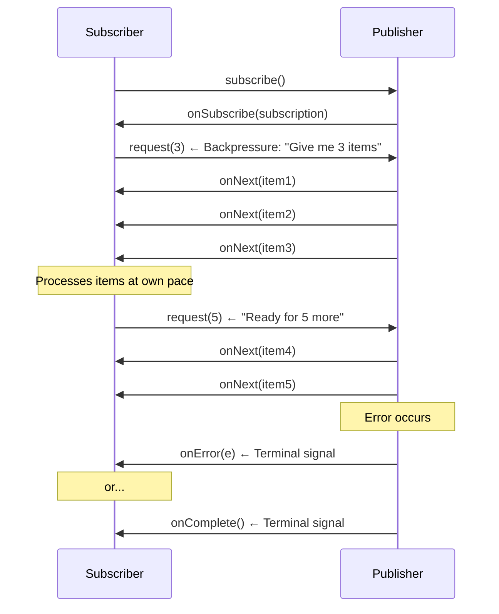
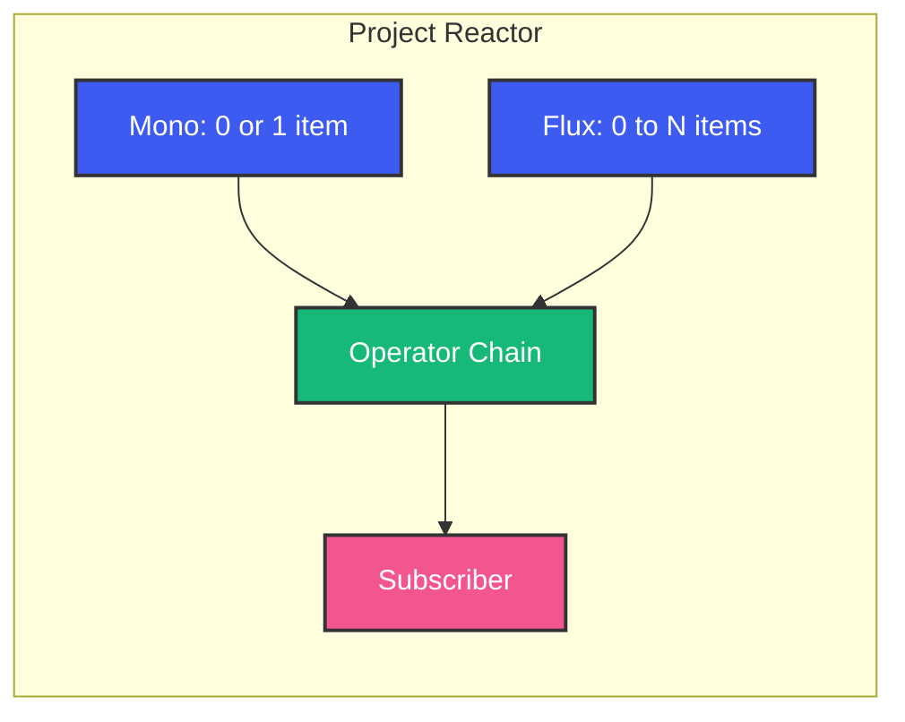

# Reactive Programming in Java

## Overview

Traditional Java backends allocate one thread per request. When that request makes three downstream calls (DB, Redis, external API), the thread sits idle for 80% of its lifetime — waiting for I/O. Reactive programming reclaims that wasted capacity by processing events asynchronously with minimal threads.

This guide explains reactive programming from the ground up: the problem it solves, the Reactive Streams specification, Project Reactor's Mono and Flux, backpressure, error handling, and real-world pipeline patterns.

---

## Problem Statement

Your e-commerce API has 1,000 concurrent users. Each request:
- 10ms CPU (validation, serialization)
- 50ms waiting for PostgreSQL
- 30ms waiting for Redis cache
- 80ms waiting for payment gateway

That's 90ms of CPU vs 160ms of waiting. With 1,000 threads (Tomcat default), you're burning 1GB of stack memory just to wait. With reactive programming, you handle 10,000 concurrent requests with ~12 threads.

---

## The Reactive Manifesto

Reactive systems are:
- **Responsive**: Fast, consistent response times
- **Resilient**: Stay responsive under failure
- **Elastic**: Scale up/down with load
- **Message-Driven**: Async message passing (not blocking calls)

---

## Reactive Streams Specification

The Reactive Streams spec defines four interfaces:

```java
public interface Publisher<T> {
    void subscribe(Subscriber<? super T> subscriber);
}

public interface Subscriber<T> {
    void onSubscribe(Subscription subscription);
    void onNext(T item);
    void onError(Throwable throwable);
    void onComplete();
}

public interface Subscription {
    void request(long n);   // Backpressure: ask for N items
    void cancel();
}

public interface Processor<T, R> extends Publisher<R>, Subscriber<T> {}
```

### The Reactive Streams Flow



**Key insight**: The subscriber controls the rate. Not the publisher. This is backpressure — the consumer pushes back when overwhelmed.

Project Reactor (and RxJava) implement this spec with richer APIs so you rarely touch the low-level interfaces.

---

## Mono and Flux



### Mono — 0 or 1 item

Use when you expect zero or one result.

```java
// Creating Monos
Mono<String> just = Mono.just("hello");
Mono<String> empty = Mono.empty();
Mono<String> fromCallable = Mono.fromCallable(() -> db.findById(id));
Mono<String> error = Mono.error(new RuntimeException("fail"));

// Chaining
Mono<User> user = Mono.fromCallable(() -> findUser(id))
    .map(u -> u.withLastLogin(Instant.now()))
    .flatMap(u -> Mono.fromCallable(() -> saveUser(u)));

// Subscribe (triggers execution)
user.subscribe(
    result -> System.out.println("Saved: " + result),
    error -> log.error("Failed", error),
    () -> log.info("Completed")
);
```

### Flux — 0 to N items

Use for collections, streams, events.

```java
// Creating Fluxes
Flux<String> fromIterable = Flux.fromIterable(orders);
Flux<Integer> range = Flux.range(1, 100);
Flux<String> fromStream = Flux.fromStream(fetchAll().stream());

// Flux with interval (ticks every second)
Flux<Long> ticker = Flux.interval(Duration.ofSeconds(1));

// Transforming
Flux<Order> processed = Flux.fromIterable(rawOrders)
    .filter(o -> o.status() != Status.CANCELLED)
    .map(o -> enrichWithDiscount(o))
    .flatMap(o -> saveOrderAsync(o));  // 1-to-N async
```

---

## Core Operators

### map — Synchronous 1-to-1 Transform

```java
Flux<String> upper = Flux.just("hello", "world")
    .map(String::toUpperCase);
// HELLO, WORLD
```

### flatMap — Async 1-to-N Transform

```java
// Each order → Mono<Invoice> (async call)
Flux<Invoice> invoices = Flux.fromIterable(orders)
    .flatMap(order ->
        Mono.fromCallable(() -> invoiceService.generate(order))
            .subscribeOn(Schedulers.boundedElastic())
    );
```

**Key difference from `map`**: `flatMap` returns a `Publisher` for each element. Reactor subscribes to all and merges results (interleaved). Use `concatMap` for order-preserving version.

### filter — Conditional Inclusion

```java
Flux<Order> highValue = Flux.fromIterable(orders)
    .filter(o -> o.amount() > 1000);
```

### zip — Combine Multiple Sources

```java
// Wait for ALL three, then combine
Mono<OrderSummary> summary = Mono.zip(
    Mono.fromCallable(() -> orderService.get(id)),
    Mono.fromCallable(() -> paymentService.getStatus(id)),
    Mono.fromCallable(() -> shippingService.getTracking(id))
).map(tuple -> new OrderSummary(
    tuple.getT1(), tuple.getT2(), tuple.getT3()
));
```

### merge — Interleaved Multi-Source

```java
// Two independent event streams, merged
Flux<Event> events = Flux.merge(
    orderEventStream(),
    notificationEventStream()
);
```

---

## Backpressure Strategies

When a publisher produces faster than the subscriber can consume, you need a strategy:

### BUFFER

```java
Flux.interval(Duration.ofMillis(1))
    .onBackpressureBuffer(1000) // Buffer up to 1000 items
    .subscribe(slowConsumer());
```

Default. Buffers in memory. Risk: `OutOfMemoryError` if producer is much faster.

### DROP

```java
Flux.interval(Duration.ofMillis(1))
    .onBackpressureDrop(item -> log.warn("Dropped: {}", item))
    .subscribe(slowConsumer());
```

Drop items when downstream can't keep up. Use for metrics, sampling (you don't need every data point).

### LATEST

```java
Flux.interval(Duration.ofMillis(1))
    .onBackpressureLatest()
    .subscribe(slowConsumer());
```

Only keep the most recent value. Discard all intermediate. Good for stock tickers, sensor readings.

### ERROR

```java
Flux.interval(Duration.ofMillis(1))
    .onBackpressureError()
    .subscribe(slowConsumer());
```

Throw `OverflowException` if downstream can't keep up. Use when you MUST handle every item and cannot buffer.

---

## Error Handling

Reactive errors are data — they flow through the pipeline like any other signal.

### onErrorReturn — Default Value

```java
Mono<String> result = Mono.fromCallable(() -> riskyCall())
    .onErrorReturn("fallback");
```

### onErrorResume — Fallback Publisher

```java
Mono<String> result = Mono.fromCallable(() -> riskyCall())
    .onErrorResume(NetworkException.class, e ->
        Mono.fromCallable(() -> cacheFallback())
    );
```

### retry — Retry on Failure

```java
Mono<String> result = Mono.fromCallable(() -> riskyCall())
    .retry(3) // Retry up to 3 times
    .onErrorResume(e -> Mono.just("default"));
```

### Exponential Backoff Retry

```java
Mono.fromCallable(() -> paymentGateway.charge(order))
    .retryWhen(Retry.backoff(3, Duration.ofSeconds(1))
        .maxBackoff(Duration.ofSeconds(10))
        .jitter(0.5) // Add jitter to prevent thundering herd
    );
```

### doOnError — Side Effect (Logging)

```java
Mono.fromCallable(() -> riskyCall())
    .doOnError(e -> log.error("Operation failed", e))
    .onErrorResume(e -> Mono.just(fallback()));
```

---

## Scheduling — Thread Management

Reactor is single-threaded by default. `Schedulers` control where work runs.

```java
// Bounded elastic thread pool (for blocking I/O)
Mono.fromCallable(() -> db.query())
    .subscribeOn(Schedulers.boundedElastic());

// Parallel (N CPU-bound threads)
Flux.range(1, 1_000_000)
    .parallel()
    .runOn(Schedulers.parallel())
    .map(this::cpuIntensiveTask)
    .sequential();

// Immediate (current thread — testing)
Mono.just("test")
    .subscribeOn(Schedulers.immediate());

// Single dedicated thread
Mono.fromRunnable(() -> fileWriter.write(data))
    .subscribeOn(Schedulers.single());
```

**Rule of thumb**:
- CPU-bound: `Schedulers.parallel()` (fixed pool = cores)
- Blocking I/O: `Schedulers.boundedElastic()` (bounded pool, default 10x cores)
- Testing: `Schedulers.immediate()` (no thread hop)

---

## Hot vs Cold Publishers

### Cold Publisher

Each subscriber gets its own data stream from scratch.

```java
Flux<Integer> cold = Flux.range(1, 5);
cold.subscribe(i -> System.out.println("Sub1: " + i));
cold.subscribe(i -> System.out.println("Sub2: " + i));
// Both subscribers see 1,2,3,4,5
```

### Hot Publisher

All subscribers share the same stream. Late subscribers miss earlier events.

```java
Flux<Long> hot = Flux.interval(Duration.ofSeconds(1))
    .share(); // Convert cold to hot

Thread.sleep(3000);
hot.subscribe(i -> System.out.println("Late: " + i));
// Late subscriber sees 3,4,5... (missed 0,1,2)
```

**Use hot publishers for**: WebSocket streams, user click events, stock tickers — where late subscribers should only see future data.

### ConnectableFlux

```java
ConnectableFlux<Integer> hot = Flux.range(1, 10)
    .publish(); // Don't start yet

hot.subscribe(v -> System.out.println("A: " + v));
hot.subscribe(v -> System.out.println("B: " + v));

hot.connect(); // NOW start producing
```

---

## Real-World Reactive Pipeline

### E-commerce Order Fulfillment

```java
public Mono<OrderConfirmation> fulfillOrder(OrderRequest request) {
    return Mono.fromCallable(() -> validateOrder(request))
        .subscribeOn(Schedulers.boundedElastic())

        // Step 1: Reserve inventory
        .flatMap(validated ->
            Mono.fromCallable(() -> inventoryService.reserve(validated))
                .subscribeOn(Schedulers.boundedElastic())
        )

        // Step 2: Process payment (in parallel with step 1)
        .flatMap(reserved ->
            Mono.zip(
                Mono.just(reserved),
                Mono.fromCallable(() -> paymentGateway.charge(reserved))
                    .subscribeOn(Schedulers.boundedElastic())
            )
        )

        // Step 3: Generate invoice + schedule shipping (parallel)
        .flatMap(tuple -> {
            var inv = tuple.getT1();
            var payment = tuple.getT2();
            return Mono.zip(
                Mono.fromCallable(() -> invoiceService.generate(inv, payment))
                    .subscribeOn(Schedulers.boundedElastic()),
                Mono.fromCallable(() -> shippingService.schedule(inv))
                    .subscribeOn(Schedulers.boundedElastic())
            );
        })

        // Step 4: Notify customer
        .flatMap(tuple -> Mono.fromRunnable(() ->
            notificationService.sendConfirmation(
                tuple.getT1(), tuple.getT2()
            )
        ))

        // Error handling
        .onErrorResume(PaymentException.class, e ->
            Mono.fromCallable(() -> refundAndNotify(request))
                .subscribeOn(Schedulers.boundedElastic())
        )
        .retryWhen(Retry.backoff(2, Duration.ofMillis(500))
            .filter(NetworkException.class::isInstance))

        // Map to response
        .map(result -> new OrderConfirmation(
            request.orderId(),
            "CONFIRMED",
            Instant.now()
        ));
}
```

Notice: No blocking. No explicit thread management. The entire pipeline is assembled from operators and executed when subscribed.

---

## Testing with StepVerifier

```java
@Test
void shouldProcessOrders() {
    Flux<Order> orders = Flux.just(
        new Order("1", BigDecimal.TEN),
        new Order("2", BigDecimal.valueOf(2000)),
        new Order("3", BigDecimal.valueOf(50))
    );

    Flux<Order> highValue = orders
        .filter(o -> o.amount().compareTo(BigDecimal.valueOf(100)) > 0);

    StepVerifier.create(highValue)
        .expectNextMatches(o -> o.id().equals("2"))
        .verifyComplete();
}

@Test
void shouldHandleErrors() {
    Mono<String> result = Mono.error(new RuntimeException("fail"))
        .onErrorReturn("fallback");

    StepVerifier.create(result)
        .expectNext("fallback")
        .verifyComplete();
}

@Test
void shouldRespectBackpressure() {
    Flux<Integer> source = Flux.range(1, 100);

    StepVerifier.create(source, 0) // Start with 0 demand
        .expectSubscription()
        .thenRequest(5)
        .expectNext(1, 2, 3, 4, 5)
        .thenRequest(3)
        .expectNext(6, 7, 8)
        .thenCancel()
        .verify();
}
```

---

## Reactive vs Virtual Threads

Java 21+ virtual threads solve the same problem (I/O scalability) with simpler code:

| Aspect | Reactive | Virtual Threads |
|--------|----------|----------------|
| Code style | Declarative pipeline | Imperative (synchronous) |
| Learning curve | Steep (operators, backpressure) | Shallow (just like sync code) |
| Thread utilization | Fixed small pool | Millions of virtual threads |
| Debugging | Harder (stack traces across operators) | Normal stack traces |
| Blocking operations | Must use `block()` carefully | Just write blocking code |
| CPU-bound parallelism | `Schedulers.parallel()` | Parallel streams, ForkJoinPool |

**When to choose what**:
- New project, Java 21+, standard I/O → Virtual threads
- Existing reactive codebase → Stay reactive (no benefit migrating)
- High-throughput stream processing (Kafka, WebSocket) → Reactive shines
- Need backpressure as a core feature → Reactive

---

## Common Mistakes

1. **Calling `block()` inside a reactive pipeline**: Blocks the (limited) reactive thread. Use `subscribeOn` for blocking work.
2. **No `subscribeOn` for blocking calls**: DB queries, HTTP calls on the event loop thread = blocked pipeline.
3. **Ignoring backpressure**: An infinite `Flux.interval()` with a slow consumer = OOM.
4. **Shared mutable state in operators**: Lambdas in `map`/`flatMap` can run on different threads. Don't mutate shared objects.
5. **Not handling errors**: An unhandled error terminates the entire pipeline. Always add `onErrorResume` or `onErrorReturn`.
6. **Using Reactor for everything**: Simple CRUD doesn't need reactive. Virtual threads or even Tomcat work fine.

---

## Best Practices

1. Always end pipelines with a subscriber or `subscribe()`.
2. Use `Schedulers.boundedElastic()` for blocking I/O, `Schedulers.parallel()` for CPU.
3. Name your threads: `Schedulers.newBoundedElastic(10, 100, "db-pool")`.
4. Prefer `flatMap` over `map` + `Mono.fromCallable` for async operations.
5. Use `concatMap` when order matters (slower but preserves order).
6. Log at pipeline boundaries, not inside operators.
7. Test with `StepVerifier` — it simulates backpressure and timing.

---

## Interview Perspective

Reactive interviews test:
- "Explain backpressure. Why is it important?"
- "Mono vs Flux: when would you use each?"
- "How does Reactor handle errors differently from imperative code?" (errors are data)
- "What happens if you call `block()` on a parallel scheduler thread?" (potentially scheduler shutdown)
- "How would you implement a circuit breaker in a reactive pipeline?" (onErrorResume + retryWhen)
- "Reactive vs virtual threads: compare and contrast"

---

## Conclusion

Reactive programming is not about speed — it's about efficient resource usage. By eliminating idle threads, you handle more concurrent work with fewer resources. The tradeoff is a steeper learning curve and more complex debugging. For high-throughput I/O-bound systems (APIs, stream processing, event-driven microservices), reactive is a game-changer. For simple CRUD with Java 21+, virtual threads give you the same benefit with simpler code. Choose based on your team and problem.

Happy Coding
