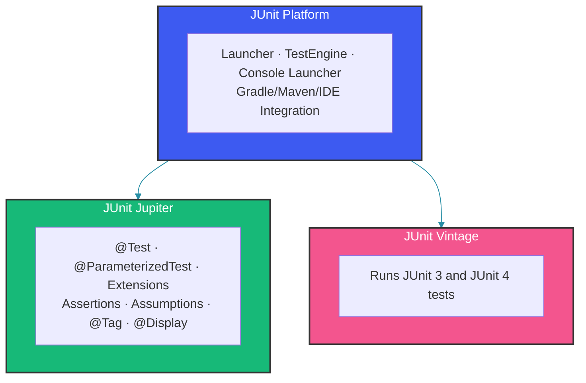

# JUnit 5 Deep Dive

## Overview

JUnit 5 is a complete rewrite of the JUnit testing framework, divided into three modules: JUnit Platform (launching), JUnit Jupiter (programming model), and JUnit Vintage (backward compatibility). This guide covers JUnit 5's architecture, extension model, parameterized tests, and advanced assertion capabilities.

---

## Architecture



The modular architecture of JUnit 5 is a significant improvement over JUnit 4. The Platform layer provides a standard mechanism for discovering and executing tests—tools like Maven Surefire, Gradle, and IDEs all talk to this layer. Jupiter implements the actual test programming model (annotations, assertions, extensions). Vintage ensures existing JUnit 4 tests continue to run without modification, enabling incremental migration.

---

## Core Annotations

```java
import org.junit.jupiter.api.*;

class OrderServiceTest {

    @BeforeAll
    static void setupAll() {
        // Runs once before ALL tests (must be static)
        System.out.println("Initialize database connection");
    }

    @AfterAll
    static void tearDownAll() {
        // Runs once after ALL tests (must be static)
        System.out.println("Close database connection");
    }

    @BeforeEach
    void setup() {
        // Runs before EACH test method
        System.out.println("Setup test data");
    }

    @AfterEach
    void tearDown() {
        // Runs after EACH test method
        System.out.println("Clean up test data");
    }

    @Test
    @DisplayName("Should calculate order total correctly")
    void shouldCalculateOrderTotal() {
        Order order = new Order();
        order.addItem(new OrderItem("item-1", 2, 10.00));
        order.addItem(new OrderItem("item-2", 1, 25.00));

        double total = order.calculateTotal();

        assertEquals(45.00, total, 0.001);
    }

    @Test
    @Disabled("Feature not implemented yet")
    void testDiscountCalculation() {
        // This test will be skipped
    }
}
```

Note that `@BeforeAll` and `@AfterAll` must be `static` by default. They execute once per test class, making them suitable for expensive setup like database connections. If you prefer per-test-instance lifecycle (where these methods can be instance methods), use `@TestInstance(Lifecycle.PER_CLASS)` on the class.

---

## Lifecycle Methods Order

```java
class LifecycleTest {

    LifecycleTest() {
        System.out.println("Constructor");
    }

    @BeforeAll
    static void beforeAll() { System.out.println("BeforeAll"); }

    @BeforeEach
    void beforeEach() { System.out.println("BeforeEach"); }

    @Test
    void testOne() { System.out.println("Test 1"); }

    @Test
    void testTwo() { System.out.println("Test 2"); }

    @AfterEach
    void afterEach() { System.out.println("AfterEach"); }

    @AfterAll
    static void afterAll() { System.out.println("AfterAll"); }
}

// Output:
// Constructor
// BeforeAll
// Constructor
// BeforeEach
// Test 1
// AfterEach
// Constructor
// BeforeEach
// Test 2
// AfterEach
// AfterAll
```

---

## Assertions Deep Dive

### Standard Assertions

```java
class AssertionExamplesTest {

    private final Calculator calculator = new Calculator();

    @Test
    void standardAssertions() {
        assertEquals(4, calculator.add(2, 2));
        assertNotEquals(5, calculator.add(2, 2));
        assertTrue(calculator.add(2, 2) > 0);
        assertFalse(calculator.add(0, 0) > 0);
        assertNull(calculator.getHistory());
        assertNotNull(calculator);
    }

    @Test
    void groupedAssertions() {
        User user = new User("alice", "alice@example.com", Role.USER);

        // All assertions execute, reporting all failures
        assertAll("user",
            () -> assertEquals("alice", user.getUsername()),
            () -> assertEquals("alice@example.com", user.getEmail()),
            () -> assertEquals(Role.USER, user.getRole())
        );
    }

    @Test
    void exceptionAssertions() {
        Exception exception = assertThrows(IllegalArgumentException.class,
            () -> calculator.divide(1, 0));

        assertEquals("Division by zero", exception.getMessage());
    }

    @Test
    void timeoutAssertions() {
        assertTimeout(Duration.ofMillis(100),
            () -> calculator.slowOperation());
    }

    @Test
    void timeoutPreemptively() {
        assertTimeoutPreemptively(Duration.ofMillis(100),
            () -> calculator.slowOperation());
    }

    @Test
    void iterableAssertions() {
        List<String> items = List.of("a", "b", "c");

        assertIterableEquals(List.of("a", "b", "c"), items);
        assertLinesMatch(List.of("a", "b", "c"), items);
    }

    @Test
    void arrayAssertions() {
        int[] expected = {1, 2, 3};
        int[] actual = calculator.computeArray();
        assertArrayEquals(expected, actual);
    }
}
```

`assertAll` is particularly valuable because it executes every assertion within its lambda, collecting all failures before reporting. This differs from standard assertions that short-circuit on the first failure, making `assertAll` ideal for validating compound objects where you want to see every violated constraint in a single test run.

---

## Assumptions

```java
class AssumptionExamplesTest {

    @Test
    void skipOnCi() {
        // Test only runs if condition is true
        Assume.assumeFalse("CI".equals(System.getenv("ENVIRONMENT")));
        // Only runs locally, not on CI
        assertEquals("local", System.getenv("ENVIRONMENT"));
    }

    @Test
    void runOnlyOnLinux() {
        Assume.assumeTrue(System.getProperty("os.name").contains("Linux"));
        // Linux-specific test
    }

    @Test
    void assumingThat() {
        // Assume.assumingThat runs the assertions only if condition is true
        // but doesn't fail the test if condition is false
        Assume.assumingThat(
            () -> "production".equals(System.getenv("ENV")),
            () -> {
                // Production-specific assertions
                assertEquals("prod-db", System.getenv("DATABASE_URL"));
            }
        );
        // This assertion always runs
        assertNotNull(System.getenv("DATABASE_URL"));
    }
}
```

Assumptions are ideal for environment-specific tests. Unlike assertions, a failing assumption skips the test rather than failing it. The `assumingThat` variant is particularly useful when you want to conditionally run extra assertions without skipping the whole test.

---

## Test Interfaces and Default Methods

```java
// Define reusable test interface
interface Validatable<T> {
    T createValidInstance();
    T createInvalidInstance();

    @Test
    default void shouldCreateValidInstance() {
        assertNotNull(createValidInstance());
    }

    @Test
    default void shouldRejectInvalidInstance() {
        assertThrows(ValidationException.class,
            () -> createInvalidInstance());
    }
}

// Implement for different domain objects
class UserValidationTest implements Validatable<User> {

    @Override
    public User createValidInstance() {
        return new User("john", "john@example.com", "password123");
    }

    @Override
    public User createInvalidInstance() {
        return new User("", "", "");
    }
}

class OrderValidationTest implements Validatable<Order> {

    @Override
    public Order createValidInstance() {
        return new Order("customer-1", List.of(new OrderItem("item-1", 1, 10.0)));
    }

    @Override
    public Order createInvalidInstance() {
        return new Order(null, List.of());
    }
}
```

---

## Nested Tests

```java
class OrderServiceNestedTest {

    private OrderService orderService;
    private Order testOrder;

    @BeforeEach
    void setup() {
        orderService = new OrderService();
        testOrder = new Order("customer-1");
    }

    @Nested
    @DisplayName("When order is empty")
    class EmptyOrder {

        @BeforeEach
        void setup() {
            // Order has no items yet
        }

        @Test
        @DisplayName("Should have zero total")
        void shouldHaveZeroTotal() {
            assertEquals(0.0, testOrder.calculateTotal());
        }

        @Test
        @DisplayName("Cannot be submitted")
        void cannotBeSubmitted() {
            assertThrows(IllegalStateException.class,
                () -> orderService.submitOrder(testOrder));
        }
    }

    @Nested
    @DisplayName("When order has items")
    class OrderWithItems {

        @BeforeEach
        void setup() {
            testOrder.addItem(new OrderItem("item-1", 2, 10.00));
            testOrder.addItem(new OrderItem("item-2", 1, 15.00));
        }

        @Test
        @DisplayName("Should calculate correct total")
        void shouldCalculateCorrectTotal() {
            assertEquals(35.00, testOrder.calculateTotal());
        }

        @Test
        @DisplayName("Can be submitted")
        void canBeSubmitted() {
            assertDoesNotThrow(() -> orderService.submitOrder(testOrder));
        }

        @Nested
        @DisplayName("With discount applied")
        class WithDiscount {

            @BeforeEach
            void setup() {
                testOrder.setDiscountCode("SAVE10");
            }

            @Test
            @DisplayName("Should apply 10% discount")
            void shouldApplyDiscount() {
                assertEquals(31.50, testOrder.calculateTotal());
            }
        }
    }
}
```

Nested tests allow you to structure test classes to mirror the scenarios being tested. Each `@Nested` class can have its own `@BeforeEach`, creating a setup hierarchy that builds on the parent state. This is especially useful for testing state machines or multi-step workflows where each stage has different valid behaviors.

---

## Repeated Tests

```java
class RepeatedTestExamples {

    @RepeatedTest(value = 5, name = "Attempt {currentRepetition} of {totalRepetitions}")
    void testConcurrentAccess(RepetitionInfo repetitionInfo) {
        // Run same test multiple times to detect flaky behavior
        System.out.println("Repetition: " + repetitionInfo.getCurrentRepetition());
        assertTrue(orderService.processOrder(generateRandomOrder()));
    }

    @RepeatedTest(10)
    void testRandomizedInput() {
        String input = generateRandomString();
        assertDoesNotThrow(() -> validator.validate(input));
    }
}
```

---

## Tagging and Filtering

```java
import org.junit.jupiter.api.Tag;
import org.junit.jupiter.api.Test;

@Tag("unit")
class UnitTests {

    @Test
    @Tag("fast")
    void fastUnitTest() { }

    @Test
    @Tag("slow")
    void slowUnitTest() { }
}

@Tag("integration")
class IntegrationTests {

    @Test
    @Tag("database")
    void databaseTest() { }

    @Test
    @Tag("external-service")
    void externalServiceTest() { }
}

// Running specific tags:
// mvn test -Dgroups="unit"
// mvn test -Dgroups="unit&fast"
// mvn test -DexcludedGroups="slow"
```

---

## Extensions

JUnit 5 replaces JUnit 4's @RunWith with a more flexible Extension API.

### Built-in Extensions

```java
@ExtendWith(SpringExtension.class)
@SpringBootTest
class SpringServiceTest {

    @Autowired
    private OrderService orderService;
}
```

### Custom Extension Example

```java
public class TimingExtension implements BeforeEachCallback, AfterEachCallback {

    private static final Logger log = LoggerFactory.getLogger(TimingExtension.class);

    @Override
    public void beforeEach(ExtensionContext context) {
        context.getStore(ExtensionContext.Namespace.GLOBAL)
            .put("startTime", System.nanoTime());
    }

    @Override
    public void afterEach(ExtensionContext context) {
        long startTime = context.getStore(ExtensionContext.Namespace.GLOBAL)
            .get("startTime", long.class);
        long duration = System.nanoTime() - startTime;

        log.info("Test {} executed in {} ms",
            context.getRequiredTestMethod().getName(),
            TimeUnit.NANOSECONDS.toMillis(duration));

        if (duration > TimeUnit.SECONDS.toNanos(1)) {
            log.warn("Test {} took too long!", 
                context.getRequiredTestMethod().getName());
        }
    }
}

// Usage
@ExtendWith(TimingExtension.class)
class SlowServiceTest {

    @Test
    void testSlowOperation() {
        // Execution time will be logged
    }
}
```

### Conditional Execution Extensions

```java
public class EnvironmentExtension implements ExecutionCondition {

    @Override
    public ConditionEvaluationResult evaluateExecutionCondition(
            ExtensionContext context) {
        Optional<EnabledOnEnvironment> annotation = 
            findAnnotation(context, EnabledOnEnvironment.class);

        if (annotation.isPresent()) {
            String requiredEnv = annotation.get().value();
            String currentEnv = System.getProperty("env");

            if (!requiredEnv.equals(currentEnv)) {
                return ConditionEvaluationResult.disabled(
                    "Test disabled on " + currentEnv + 
                    ", requires " + requiredEnv);
            }
        }

        return ConditionEvaluationResult.enabled("Environment matches");
    }
}

@Target(ElementType.METHOD)
@Retention(RetentionPolicy.RUNTIME)
@ExtendWith(EnvironmentExtension.class)
@interface EnabledOnEnvironment {
    String value();
}

// Usage
@Test
@EnabledOnEnvironment("staging")
void stagingOnlyTest() {
    // Only runs when -Denv=staging
}
```

---

## Test Templates

For programmatic test generation:

```java
public class OrderTestFactory implements TestTemplateInvocationContextProvider {

    @Override
    public boolean supportsTestTemplate(ExtensionContext context) {
        return true;
    }

    @Override
    public Stream<TestTemplateInvocationContext> provideTestTemplateInvocationContexts(
            ExtensionContext context) {
        return Stream.of(
            contextFor("NEW", OrderStatus.NEW, true),
            contextFor("PROCESSING", OrderStatus.PROCESSING, true),
            contextFor("CANCELLED", OrderStatus.CANCELLED, false),
            contextFor("SHIPPED", OrderStatus.SHIPPED, false)
        );
    }

    private TestTemplateInvocationContext contextFor(
            String name, OrderStatus status, boolean cancellable) {
        return new TestTemplateInvocationContext() {
            @Override
            public String getDisplayName(int invocationIndex) {
                return name;
            }

            @Override
            public List<Extension> getAdditionalExtensions() {
                return List.of(new ParameterResolver() {
                    @Override
                    public boolean supportsParameter(
                            ParameterContext parameterContext,
                            ExtensionContext extensionContext) {
                        return parameterContext.getParameter()
                            .getType() == OrderStatus.class;
                    }

                    @Override
                    public Object resolveParameter(
                            ParameterContext parameterContext,
                            ExtensionContext extensionContext) {
                        return status;
                    }
                });
            }
        };
    }
}

// Usage
class OrderStatusTest {

    @TestTemplate
    @ExtendWith(OrderTestFactory.class)
    void testCancellable(OrderStatus status) {
        // Runs for each status in the factory
    }
}
```

---

## Summary

JUnit 5 provides a modular, extensible testing framework. Key features include: the Three-Module Architecture, dynamic assertions with `assertAll`, assumptions for conditional execution, nested tests for hierarchical organization, repeated tests for flaky detection, tag-based filtering, and a powerful extension API for custom behavior.

---

## References

- [JUnit 5 User Guide](https://junit.org/junit5/docs/current/user-guide/)
- [JUnit 5 API Documentation](https://junit.org/junit5/docs/current/api/)
- [JUnit 5 Samples](https://github.com/junit-team/junit5-samples)
- [Baeldung - JUnit 5 Guide](https://www.baeldung.com/junit-5)

Happy Coding
