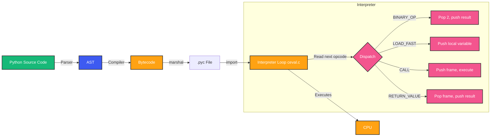
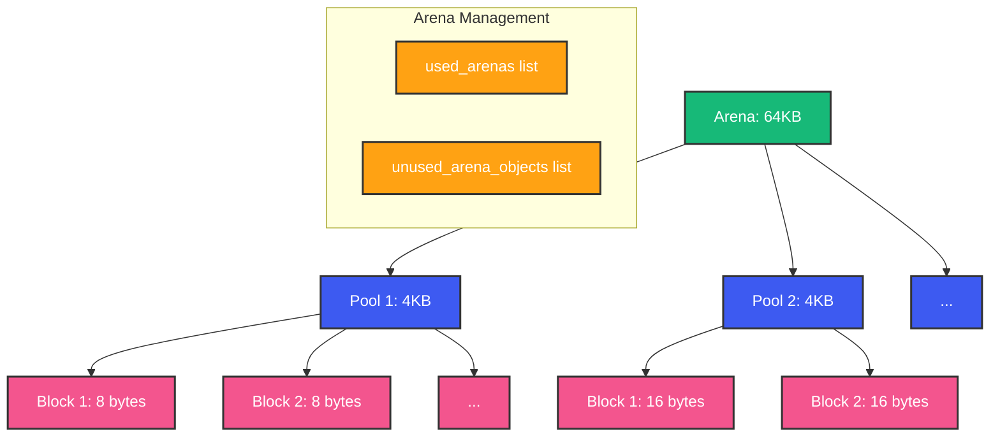

# Python Internals: CPython, Bytecode, GIL, and Memory Model

## Overview

When you run `python app.py` and a request comes in, what actually happens? The source code is read, parsed, compiled, and executed by the CPython interpreter. But between your Python code and the CPU, there is a stack of abstractions -- each with performance implications.

Understanding CPython internals is not academic trivia. It directly impacts how you write backend services. Why is `for i in range(n)` faster than `while i < n`? Why does creating millions of objects cause memory pressure? Why can't threads speed up CPU work? The answers live in CPython's bytecode, memory allocator, and GIL implementation.

## Mental Model: CPython Is a Stack-Based Bytecode Interpreter

CPython does not execute your Python code directly. It compiles it to bytecode -- a set of instructions for a virtual machine -- and then interprets those instructions in a C loop. Think of it as a mini-CPU implemented in C, with:

- A **value stack** for intermediate computation results
- A **frame stack** for function call management
- A **block stack** for exception handling and loops
- **Registers** (Python's fast locals are stored in an array for O(1) access)

## CPython Execution Pipeline



### Step 1: Source to AST

```python
import ast

code = """
def add(a, b):
    return a + b
"""

tree = ast.parse(code)
print(ast.dump(tree, indent=2))
# Module(
#   body=[
#     FunctionDef(
#       name='add',
#       args=arguments(args=[arg(arg='a'), arg(arg='b')]),
#       body=[Return(value=BinOp(left=Name(id='a'), op=Add(), right=Name(id='b')))]
#     )
#   ]
# )
```

The parser (C code in `Parser/` directory) tokenizes the source and builds an Abstract Syntax Tree. This is where syntax errors are caught.

### Step 2: AST to Bytecode

```python
import dis
import compiler  # compile is built-in

def add(a: int, b: int) -> int:
    return a + b

# Compile to code object
code_obj = compile(add, '<string>', 'exec')

# Disassemble to see bytecode
dis.dis(add)
```

Output:
```
  2           0 RESUME                   0
              2 LOAD_FAST                0 (a)
              4 LOAD_FAST                1 (b)
              6 BINARY_OP                0 (+)
             10 RETURN_VALUE
```

Each instruction has:
- **Line number** (2)
- **Offset** (0, 2, 4, 6, 10 -- each instruction takes 2 bytes)
- **Opcode name** (LOAD_FAST, BINARY_OP, RETURN_VALUE)
- **Argument** (0, 1, or the operation for BINARY_OP)
- **Human-readable name** (a, b)

### Step 3: Bytecode Execution

The interpreter loop in `ceval.c` is a massive `switch` statement:

```c
// Simplified from ceval.c
PyObject* _PyEval_EvalFrameDefault(PyThreadState *tstate, PyFrameObject *f, int throwflag) {
    PyObject *retval = NULL;
    unsigned char *next_instr = f->f_code->co_code->ob_bytes;

    for (;;) {
        unsigned char opcode = *next_instr++;
        unsigned char oparg = 0;
        if (HAS_ARG(opcode)) {
            oparg = *next_instr++;
        }

        switch (opcode) {
            case LOAD_FAST:
                PyObject *value = GETLOCAL(oparg);
                Py_INCREF(value);
                PUSH(value);
                break;

            case BINARY_OP:
                PyObject *right = POP();
                PyObject *left = POP();
                PyObject *result = PyNumber_Add(left, right);
                PUSH(result);
                Py_DECREF(left);
                Py_DECREF(right);
                break;

            case RETURN_VALUE:
                retval = POP();
                goto exit;
        }
    }
exit:
    return retval;
}
```

## Object Model: PyObject

Every Python object is a `PyObject` in C:

```c
typedef struct _object {
    Py_ssize_t ob_refcnt;     // Reference count
    PyTypeObject *ob_type;    // Type pointer
} PyObject;

// For objects that hold data (like integers with small values):
typedef struct {
    PyObject ob_base;         // PyObject header (refcount + type)
    Py_ssize_t ob_size;       // Number of items (for variable-length)
} PyVarObject;

// Example: Python int is a C struct
typedef struct {
    PyObject_HEAD             // ob_refcnt + ob_type
    uint32_t ob_digit[1];     // Array of "digits" (base 2^30)
} PyLongObject;
```

**Key implications**:
- Every Python object is at least 32 bytes (on 64-bit)
- Object identity is memory address (`id(x)`)
- Type checking is pointer comparison (`ob_type`)


## Reference Counting

```python
import sys

x = []
print(sys.getrefcount(x))  # 2 (one from x, one from getrefcount arg)

y = x
print(sys.getrefcount(x))  # 3

del y
print(sys.getrefcount(x))  # 2
```

Each `Py_INCREF` and `Py_DECREF` call adjusts the count. When it reaches 0, the memory is freed immediately:

```c
#define Py_DECREF(op)                                   \
    do {                                                \
        if (--((PyObject*)(op))->ob_refcnt == 0) {      \
            _Py_Dealloc((PyObject*)(op));               \
        }                                               \
    } while (0)
```

This is deterministic -- unlike tracing GC in Java or Go, you know exactly when memory is freed (when the last reference goes out of scope).

### The Cycle Problem

```python
class Node:
    def __init__(self) -> None:
        self.parent: Node | None = None
        self.children: list[Node] = []

a = Node()
b = Node()
a.children.append(b)  # b refcount: 2 (b + a.children)
b.parent = a          # a refcount: 2 (a + b.parent)

del a
del b
# Both refcounts are still 1! Reference cycles!
# Objects are never freed by refcounting alone.
```

This is why Python has a generational garbage collector.

## The GIL: Global Interpreter Lock

### What It Is

```c
// In ceval.c
static PyThread_type_lock gil_lock;

void take_gil(PyThreadState *tstate) {
    int err = PyThread_acquire_lock(gil_lock, NOWAIT);
    if (err) {
        // Got the GIL
        return;
    }
    // Signal other threads to drop the GIL
    SET_GIL_DROP_REQUEST(tstate->interp);
    // Wait for GIL
    PyThread_acquire_lock(gil_lock, WAIT);
}

void drop_gil(PyThreadState *tstate) {
    PyThread_release_lock(gil_lock);
}
```

The GIL ensures that only one thread executes Python bytecode at any time. It exists because:
1. **Reference counting** is not thread-safe
2. **Single-threaded performance** would suffer from fine-grained locking
3. **C extensions** assume thread safety from the GIL

### Why It Exists

Without the GIL, every `Py_INCREF`/`Py_DECREF` would need an atomic operation or a lock. On a 1% refcount-heavy workload, that is a 5-10% single-threaded performance hit. The Python core developers decided this tradeoff (no free threading, but fast single-thread) was correct for the 1990s.

### How It Is Being Removed

PEP 703 (nogil CPython) proposes making the GIL optional by:
1. **Per-object reference counting** with deferred reference counting
2. **Immortal objects** that never need refcounting (interned strings, small integers)
3. **Thread-safe GC** using biased reference counting

As of Python 3.13, there is a `--disable-gil` build option (experimental).

## Memory Management: Arenas, Pools, Blocks

CPython uses a three-level allocator for objects smaller than 512 bytes:



```c
// Allocator structure (simplified)
struct pool_header {
    uint32_t refcount;            // Number of allocated blocks
    uint32_t freeblocks;          // Number of free blocks
    struct pool_header *nextpool; // Next pool in used/full/empty list
    uint32_t szidx;              // Size class index (0-63)
    uint32_t capacity;           // Total blocks in this pool
    unsigned char *freeblock;    // Pointer to first free block
};

struct arena_object {
    uintptr_t address;           // Memory address
    pool_header *freepools;      // List of pools with free space
    int nfreepools;             // Count of free pools
};
```

**Why three levels?**
- **System `malloc` is slow** for millions of small allocations
- **Pool-level allocation** groups same-sized objects together (no fragmentation)
- **Arena-level management** returns memory to the OS in bulk

### Free Lists

Beyond PyMalloc, CPython keeps free lists for frequently-used types:

```c
// Integers pool (free list for small ints)
static PyLongObject *small_ints[NSMALLNEGINTS + NSMALLPOSINTS];

// Tuple pool
static PyTupleObject *free_list[PyTuple_MAXSAVESIZE];
static int num_free_tuples[PyTuple_MAXSAVESIZE];
```

When you create and destroy many small objects of the same type, they are recycled from free lists instead of going through the full allocator.

## Garbage Collection

```python
import gc

# Manual GC control
gc.set_threshold(700, 10, 10)
# Generation 0: after 700 allocations
# Generation 1: after 10 collections of gen 0
# Generation 2: after 10 collections of gen 1

# Manual collection
collected = gc.collect()
print(f"Collected {collected} objects")

# Debug cycles
gc.set_debug(gc.DEBUG_SAVEALL | gc.DEBUG_STATS)
```

### Generational GC Algorithm

```
Algorithm: collect_generation(gen)
  Input: generation number to collect
  
  1. Find all objects in gen
  2. Move objects from younger generations to gen
  3. Compute reachable objects starting from GC roots
     (global variables, stack frames, registers)
  4. Mark all reachable objects
  5. Sweep: free all unmarked objects in gen
  6. Move surviving objects to next generation
```

```python
# Visualizing GC generations
import gc

# Show objects tracked by GC per generation
for gen in range(3):
    objs = gc.get_objects(gen)  # type: ignore
    print(f"Generation {gen}: {len(objs)} objects")
```

## Performance Implications of Internals

### Attribute Access

```python
class Point:
    __slots__ = ("x", "y")  # No __dict__

    def __init__(self, x: float, y: float) -> None:
        self.x = x
        self.y = y

# Without __slots__:
#   Point.__dict__ is a dict (hash table lookup)
#   p.x = LOAD_ATTR -> dict lookup -> hash, index, return
# With __slots__:
#   p.x = LOAD_ATTR -> descriptor -> offset in object memory
#   ~30% faster attribute access, ~50% less memory
```

### Local vs Global Variable Access

```python
# FAST (local)
def local_sum(n: int) -> int:
    total = 0
    for i in range(n):
        total += i
    return total

# SLOW (global)
total = 0
def global_sum(n: int) -> int:
    global total
    for i in range(n):
        total += i
    return total

# Local uses LOAD_FAST (array index), global uses LOAD_GLOBAL (dict lookup)
```

### Function Call Overhead

```python
import time

def empty():
    pass

# Each function call:
# 1. Create new frame object
# 2. Push frame onto frame stack
# 3. Execute bytecode
# 4. Pop frame

# Better: inline or use local bindings
def tight_loop(n: int) -> int:
    s = 0
    for i in range(n):
        # Function call in inner loop is expensive
        s += i
    return s
```

### Bytecode Optimization Tricks

```python
# Python does NOT optimize this:
result = [i * 2 for i in range(1000)]
# vs
result = []
for i in range(1000):
    result.append(i * 2)
# Both generate similar bytecode. List comprehensions are slightly faster
# because they avoid .append attribute lookup.

# Set membership is optimized:
if x in {1, 2, 3}:  # CPython makes this a frozenset
    pass
```

## Common Mistakes

- **Assuming Python optimizes like a compiler**: It does not. `a + b + c` creates two new objects. No constant folding across statements.
- **Ignoring object overhead**: A list of 10 million ints is 80MB for the data + 80MB for PyObject pointers + 280MB for the PyLong objects.
- **Modifying lists while iterating**: Creates subtle bugs because iteration uses index, not a snapshot.
- **Thinking the GIL protects everything**: The GIL protects bytecode execution, not logical atomicity.
- **Using `sys.getrefcount` without understanding it**: It returns the count + 1 because the argument itself is a reference.

## Interview Perspective

- **How does `a = b = []` work?** Both names point to the same list. `a.append(1)` affects `b`. Explain reference semantics.
- **What is the difference between `is` and `==`?** `is` compares `id()` (memory address). `==` calls `__eq__`. Explain interned strings: `'hello' is 'hello'` may be True due to string interning.
- **How does Python handle large integers?** Ints in Python are arbitrary precision. They grow beyond 64 bits. Each digit is 30 bits (base 2^30). Operations are O(n) in digits.
- **What happens when you slice a list?** `a[1:3]` creates a new list (shallow copy). O(k) where k is slice length.
- **Why is tuple faster than list?** Tuple uses less memory (no overallocation), and creation is simpler (no resize logic).
- **How does import work?** `import foo` → find module → compile to bytecode → create module object → exec in module namespace → cache in `sys.modules`.

## Summary

CPython is a surprisingly simple bytecode interpreter. Understanding its architecture -- the PyObject structure, reference counting, the GIL, and the memory allocator -- directly translates to writing faster, more memory-efficient backend code.

The most important takeaway: CPython prioritizes simplicity and correctness over performance. Every feature (dynamic typing, garbage collection, GIL) has a performance cost. Knowing where these costs are lets you work with the interpreter instead of against it.

Happy Coding
