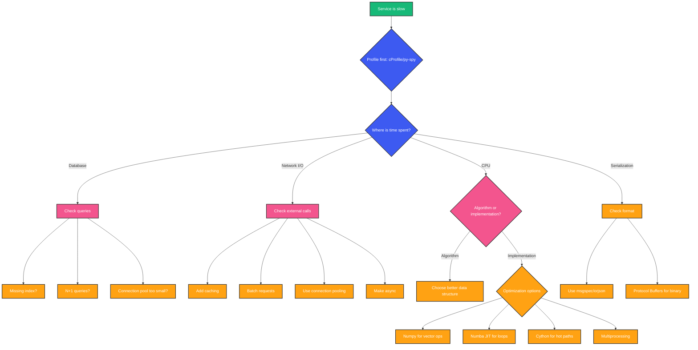

# Python Performance Optimization

## Overview

Your API endpoint takes 2 seconds. The database query is fast (20ms), but the Python processing takes the rest. You need it under 200ms. Where do you start?

The answer is not "rewrite in Go." The answer is: measure, identify the bottleneck, and apply the right optimization for that bottleneck. Python is not fast by default, but it is fast enough for most workloads when you understand where the time goes.

## Mental Model: The Three Levers of Optimization

```
Performance Gains
        |
        ├── Algorithmic (Big-O)        → 10-1000x
        ├── I/O Optimization           → 10-100x
        └── Micro-optimization         → 1.1-2x
```

**Always start at the top.** A better algorithm beats any micro-optimization. A cached I/O call beats any loop optimization. Only after you exhaust algorithmic and I/O improvements should you consider C extensions or bytecode hacks.

## Measure Before Optimizing

### cProfile: Built-in Statistical Profiler

```python
import cProfile
import pstats
from pstats import SortKey

def slow_endpoint():
    result = []
    for i in range(1000):
        result.append(process_item(i))
    return result

def process_item(n: int) -> dict:
    # Simulate complex processing
    return {f"key_{k}": n * k for k in range(100)}

# Profile
profiler = cProfile.Profile()
profiler.enable()
result = slow_endpoint()
profiler.disable()

# Analysis
stats = pstats.Stats(profiler)
stats.sort_stats(SortKey.CUMULATIVE)
stats.print_stats(20)
```

Output:
```
   ncalls  tottime  percall  cumtime  percall filename:lineno(function)
        1    0.000    0.000    0.452    0.452 test.py:5(slow_endpoint)
     1000    0.312    0.000    0.452    0.000 test.py:11(process_item)
   100000    0.140    0.000    0.140    0.000 test.py:15(<dictcomp>)
```

**What to look for**: High `cumtime` = where time is spent. High `ncalls` with low `percall` = overhead from many small calls.

### py-spy: Production Profiling (No Code Changes)

```bash
# Profile a running process (no restart needed)
py-spy record -o profile.svg --pid 12345 --duration 30

# Real-time top-like view
py-spy top --pid 12345

# Profile a Python script
py-spy record -o profile.svg -- python myapp.py
```

### line_profiler: Line-by-Line

```python
# pip install line_profiler
# @profile decorator added by kernprof

@profile
def expensive_function(n: int) -> list:
    result = []
    for i in range(n):
        processed = heavy_computation(i)
        result.append(processed)
    return result

# Run: kernprof -l -v my_script.py
# Output:
# Line #    Hits    Time    Per Hit   % Time   Line Contents
# ==========================================================
#      4                              @profile
#      5                              def expensive_function(n):
#      6      1       5.0      5.0     0.0     result = []
#      7   1001    1500.0      1.5    15.0     for i in range(n):
#      8   1000    7500.0      7.5    75.0         processed = heavy_computation(i)
#      9   1000    1000.0      1.0    10.0         result.append(processed)
#     10      1       1.0      1.0     0.0     return result
```

## Algorithmic Optimization

### Choose the Right Data Structure

```python
import time

# WRONG: List for membership tests
def check_status_list(statuses: list[str], target: str) -> bool:
    # O(n) per check
    return target in statuses

# RIGHT: Set for membership tests
def check_status_set(statuses: set[str], target: str) -> bool:
    # O(1) per check
    return target in statuses

# Benchmark
n = 100_000
statuses = [f"status_{i}" for i in range(n)]
status_set = set(statuses)

start = time.perf_counter()
for _ in range(1000):
    f"status_{n - 1}" in statuses  # Worst case
print(f"List: {time.perf_counter() - start:.3f}s")  # ~0.5s

start = time.perf_counter()
for _ in range(1000):
    f"status_{n - 1}" in status_set  # O(1)
print(f"Set: {time.perf_counter() - start:.3f}s")   # ~0.0001s
```

### Use Generators for Large Datasets

```python
from collections.abc import Iterator

# BAD: Creates huge intermediate lists
def process_all_bad(items: list[int]) -> int:
    doubled = [x * 2 for x in items]      # O(n) memory
    filtered = [x for x in doubled if x > 10]  # O(n) memory
    return sum(filtered)

# GOOD: Chain iterators
def process_all_good(items: list[int]) -> int:
    doubled = (x * 2 for x in items)       # O(1) memory
    filtered = (x for x in doubled if x > 10)  # O(1) memory
    return sum(filtered)

import sys
items = list(range(10_000_000))

# Memory comparison (would OOM for list version)
# process_all_bad(items)  # 2 x 80MB lists
# process_all_good(items)  # Constant memory
```

### Use Built-in Functions

```python
from functools import reduce
import operator

# SLOW: Manual loop
def product_loop(numbers: list[int]) -> int:
    result = 1
    for n in numbers:
        result *= n
    return result

# FAST: Built-in reduce
def product_builtin(numbers: list[int]) -> int:
    return reduce(operator.mul, numbers, 1)

# SLOW: Manual mapping
def squares_loop(numbers: list[int]) -> list[int]:
    return [n ** 2 for n in numbers]

# FAST: map (returns iterator)
def squares_map(numbers: list[int]) -> list[int]:
    return list(map(lambda n: n ** 2, numbers))

# Actually the comprehension is fine -- map without lambda is faster
def squares_pow(numbers: list[int]) -> list[int]:
    return list(map(pow, numbers, [2] * len(numbers)))
```

## I/O Optimization

### Connection Pooling

```python
import asyncpg
from typing import Any

class ConnectionManager:
    def __init__(self, dsn: str, min_size: int = 10, max_size: int = 50):
        self._dsn = dsn
        self._min = min_size
        self._max = max_size
        self._pool: asyncpg.Pool | None = None

    async def start(self) -> None:
        self._pool = await asyncpg.create_pool(
            self._dsn,
            min_size=self._min,
            max_size=self._max,
            command_timeout=30,
        )

    async def execute(self, query: str, *args: Any) -> list[asyncpg.Record]:
        assert self._pool is not None
        async with self._pool.acquire() as conn:
            return await conn.fetch(query, *args)

    async def stop(self) -> None:
        if self._pool:
            await self._pool.close()

# Without pooling: new TCP connection per request (3x handshake = ~30ms per request)
# With pooling: reuse existing connections (~0ms per request)
```

### Batch Operations

```python
# SLOW: One query per item
async def update_users_slow(users: list[dict]) -> None:
    for user in users:
        await db.execute(
            "UPDATE users SET name = $1 WHERE id = $2",
            user["name"], user["id"],
        )

# FAST: Batch update with executemany
async def update_users_fast(users: list[dict]) -> None:
    await db.executemany(
        "UPDATE users SET name = $1 WHERE id = $2",
        [(u["name"], u["id"]) for u in users],
    )

# For very large batches, use COPY:
async def bulk_insert(records: list[tuple]) -> None:
    import io
    import csv

    buffer = io.StringIO()
    writer = csv.writer(buffer)
    writer.writerows(records)

    await db.copy_to_table(
        "users",
        columns=["name", "email", "status"],
        source=buffer,
    )
```

### Caching

```python
from functools import lru_cache
import hashlib
from typing import Any

# In-memory cache for expensive computations
@lru_cache(maxsize=1024)
def compute_expensive(data_hash: str) -> dict:
    # Imagine heavy computation here
    return {"hash": data_hash, "result": "processed"}

# Multi-level caching
class CacheStrategy:
    def __init__(self, redis_url: str):
        import redis.asyncio as redis
        self._redis: redis.Redis = redis.from_url(redis_url)
        self._local: dict[str, tuple[float, Any]] = {}
        self._ttl: float = 60.0

    async def get(self, key: str) -> Any | None:
        # L1: local memory cache (nanoseconds)
        if key in self._local:
            expires, value = self._local[key]
            if expires > __import__("time").time():
                return value
            del self._local[key]

        # L2: Redis cache (milliseconds)
        value = await self._redis.get(key)
        if value is not None:
            import json
            parsed = json.loads(value)
            self._local[key] = (__import__("time").time() + self._ttl, parsed)
            return parsed
        return None
```

## CPU Optimization

### Multiprocessing

```python
from concurrent.futures import ProcessPoolExecutor
import multiprocessing as mp

def cpu_intensive(data: bytes) -> bytes:
    import hashlib
    return hashlib.sha256(data).digest()

# Parallel processing
def parallel_hash(chunks: list[bytes]) -> list[bytes]:
    with ProcessPoolExecutor(max_workers=mp.cpu_count()) as executor:
        results = list(executor.map(cpu_intensive, chunks))
    return results

# ~4x faster on 4 cores for CPU-bound work
```

### NumPy for Vectorized Operations

```python
import numpy as np

# SLOW: Pure Python loop
def normalize_python(data: list[float]) -> list[float]:
    mean = sum(data) / len(data)
    std = (sum((x - mean) ** 2 for x in data) / len(data)) ** 0.5
    return [(x - mean) / std for x in data]

# FAST: NumPy vectorized
def normalize_numpy(data: np.ndarray) -> np.ndarray:
    return (data - data.mean()) / data.std()

data = [float(i) for i in range(10_000_000)]

# Pure Python: ~8 seconds
# NumPy: ~0.2 seconds (40x faster)
```

### Numba: JIT Compilation

```python
from numba import jit
import numpy as np
import time

# Pure Python
def sum_squares_python(n: int) -> float:
    total = 0.0
    for i in range(n):
        total += i ** 2
    return total

# Numba JIT
@jit(nopython=True, parallel=True)
def sum_squares_numba(n: int) -> float:
    total = 0.0
    for i in range(n):
        total += i ** 2
    return total

n = 10_000_000

start = time.perf_counter()
sum_squares_python(n)
print(f"Python: {time.perf_counter() - start:.2f}s")  # ~1.5s

start = time.perf_counter()
sum_squares_numba(n)
print(f"Numba (first call): {time.perf_counter() - start:.2f}s")  # ~0.5s + JIT time

start = time.perf_counter()
sum_squares_numba(n)
print(f"Numba (cached): {time.perf_counter() - start:.2f}s")  # ~0.05s (30x faster)
```

### Cython: Compile Python to C

```cython
# process.pyx
def sum_squares_cython(int n):
    cdef int i
    cdef double total = 0.0
    for i in range(n):
        total += i ** 2
    return total
```

```
# setup.py
from setuptools import setup
from Cython.Build import cythonize

setup(ext_modules=cythonize("process.pyx"))
```

## Async Performance Patterns

### Task Batching for I/O

```python
import asyncio
import httpx
from collections.abc import Awaitable, Sequence

async def process_batch(
    client: httpx.AsyncClient,
    batch: Sequence[str],
) -> list[dict]:
    tasks = [client.get(f"/items/{item_id}") for item_id in batch]
    responses = await asyncio.gather(*tasks, return_exceptions=True)
    return [r.json() for r in responses if isinstance(r, httpx.Response)]

# Limit concurrency to avoid overwhelming downstream services
semaphore = asyncio.Semaphore(50)

async def fetch_with_limit(client: httpx.AsyncClient, url: str) -> dict:
    async with semaphore:
        resp = await client.get(url)
        return resp.json()
```

### Avoid Event Loop Blocking

```python
import asyncio
from concurrent.futures import ProcessPoolExecutor

async def handle_request(data: bytes) -> bytes:
    # CPU work must go to executor, not event loop
    loop = asyncio.get_running_loop()
    with ProcessPoolExecutor() as pool:
        result = await loop.run_in_executor(pool, cpu_intensive, data)
    return result

# WRONG:
async def handle_request_wrong(data: bytes) -> bytes:
    result = cpu_intensive(data)  # BLOCKS EVENT LOOP
    return result
```

## Performance Decision Tree



## Micro-Optimizations (Last Resort)

### Local Variable Binding

```python
import math
import time

# SLOW
def slow_sqrt(items: list[float]) -> list[float]:
    result = []
    for x in items:
        result.append(math.sqrt(x))
    return result

# FAST
def fast_sqrt(items: list[float]) -> list[float]:
    sqrt = math.sqrt  # Local binding
    result = []
    append = result.append  # Local binding
    for x in items:
        append(sqrt(x))
    return result

items = [float(i) for i in range(1_000_000)]
# ~15% improvement with local bindings
```

### String Concatenation

```python
# SLOW: O(n²) due to repeated string copies
def build_sql_slow(params: list[tuple]) -> str:
    query = "INSERT INTO users VALUES "
    for param in params:
        query += str(param) + ", "
    return query[:-2]

# FAST: O(n) with list join
def build_sql_fast(params: list[tuple]) -> str:
    parts = ["INSERT INTO users VALUES "]
    parts.extend(str(p) + ", " for p in params)
    return "".join(parts)[:-2]
```

### Attribute Access

```python
# SLOW: Repeated attribute lookups
class Processor:
    def process_slow(self, items: list[dict]) -> list[dict]:
        for item in items:
            item["result"] = self._compute(item["value"])
        return items

    def process_fast(self, items: list[dict]) -> list[dict]:
        compute = self._compute  # Local reference
        for item in items:
            item["result"] = compute(item["value"])
        return items

    def _compute(self, value: float) -> float:
        return value ** 2 + value * 3 + 1
```

### Fast JSON Serialization

```python
import json
import orjson  # pip install orjson
import msgspec  # pip install msgspec

data = {"user": "Alice", "scores": [1.0, 2.0, 3.0] * 1000}

# stdlib json: ~5ms
json.dumps(data)

# orjson: ~1ms (5x faster)
orjson.dumps(data)

# msgspec: ~0.8ms (6x faster)
msgspec.json.encode(data)

# For high-throughput APIs, orjson/msgspec can save 80%+ of serialization time
```

## Production Tuning

### Gunicorn Configuration

```python
# gunicorn.conf.py
import multiprocessing
import os

# Workers
workers = multiprocessing.cpu_count() * 2 + 1
worker_class = "uvicorn.workers.UvicornWorker"

# Timeouts
timeout = 30
graceful_timeout = 30
keepalive = 5

# Memory management
max_requests = 1000  # Restart worker after 1000 requests
max_requests_jitter = 50  # +/- 50 to avoid thundering herd

# Preloading
preload_app = True  # Load app code before forking workers
```

### Memory Limits

```python
import resource
import sys

# Set memory limit (bytes)
# 512MB limit
resource.setrlimit(resource.RLIMIT_AS, (512 * 1024 * 1024, -1))

# Or in container:
# docker run --memory=512m myapp
# Kubernetes: resources.limits.memory: 512Mi
```

## Common Mistakes

- **Optimizing without profiling**: You will optimize the wrong thing. 90% of time is usually in 10% of code.
- **Premature micro-optimization**: A 20% gain in a function that takes 1% of total time is meaningless.
- **Ignoring the I/O wall**: Most backend performance problems are I/O, not CPU. Cache and batch first.
- **Using threads for CPU work**: GIL prevents parallel execution. Use multiprocessing or NumPy.
- **Not measuring in production**: Development profiling misses real traffic patterns. Use py-spy.
- **Over-engineering**: Not every slow function needs Numba or Cython. Often, a better algorithm suffices.

## Interview Perspective

- **How do you approach performance optimization?** Measure first (cProfile/py-spy), identify bottleneck, then optimize: algorithm → I/O → micro-optimizations.
- **When would you use multiprocessing vs threading vs asyncio?** CPU → multiprocessing, I/O→ asyncio (async libs) or threading (sync libs).
- **How does NumPy achieve speed?** Vectorized C operations, no Python loop overhead, memory-contiguous arrays.
- **What is the GIL and how do you work around it?** Use multiprocessing for CPU work, asyncio/threading for I/O.
- **How would you optimize a slow FastAPI endpoint?** Profile, check queries (N+1?), add caching, batch operations, use orjson for serialization.
- **What are the tradeoffs of PyPy?** Faster CPU-bound code (JIT), but higher memory usage, less C extension compatibility.

## Summary

Performance optimization in Python follows a clear hierarchy: measure first, fix algorithms second, optimize I/O third, and only then consider micro-optimizations or C extensions. The vast majority of backend performance problems are not "Python is slow" but "my database queries are slow," "I'm not using connection pooling," or "I have an N+1 problem."

Python can be fast enough for most backend workloads. The skill is knowing where the time actually goes and applying the right tool for that specific bottleneck.

Happy Coding
