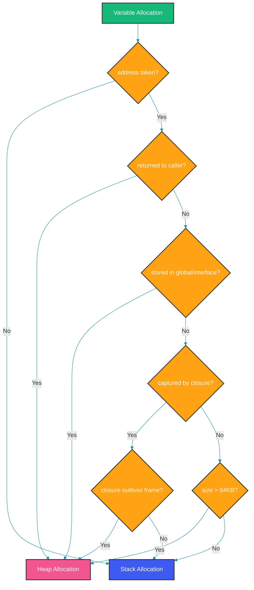
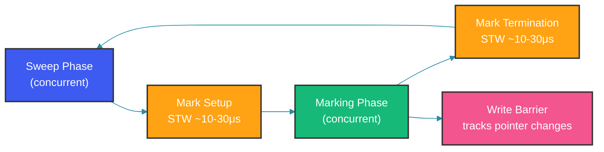

# Go Memory Management: Stack, Heap, Escape Analysis

## Overview

Your Go service runs fine under low load. At 10K RPS, memory grows, GC pauses spike, and pods get OOM-killed. You look at the heap profile and see thousands of allocations per request — many of them unnecessary. This is where understanding Go's memory model separates production engineers from tutorial readers.

---

## Problem Statement

Memory management involves two fundamental questions:
1. **Where** does a value live — stack or heap?
2. **When** is it freed — automatically via stack pop or via GC?

Stack allocation is nearly free (push/pop). Heap allocation costs allocation + GC. The goal: keep values on the stack when possible. But the compiler must prove it's safe.

---

## Mental Model

Think of Go's memory as a two-tier system:

```
┌────────────────────────────────────────────────────────┐
│                        Stack                            │
│  ┌──────────┬──────────┬──────────┬──────────┐          │
│  │ Frame A  │ Frame B  │ Frame C  │ Frame D  │          │
│  │ (fn_a)   │ (fn_b)   │ (fn_c)   │ (fn_d)   │          │
│  └──────────┴──────────┴──────────┴──────────┘          │
│  Allocation: push frame pointer                          │
│  Deallocation: pop stack pointer                         │
│  Cost: ~1 instruction                                    │
├────────────────────────────────────────────────────────┤
│                        Heap                              │
│  ┌──────┐┌──────┐┌──────┐┌──────┐┌──────┐┌──────┐     │
│  │ Obj1 ││ Obj2 ││ Obj3 ││ Obj4 ││ Obj5 ││ Obj6 │     │
│  └──────┘└──────┘└──────┘└──────┘└──────┘└──────┘     │
│  Allocation: malloc / mcache -> mcentral -> mheap        │
│  Deallocation: GC mark-sweep (non-deterministic)         │
│  Cost: ~100ns + GC overhead                              │
└────────────────────────────────────────────────────────┘
```

The stack grows down (push) and shrinks up (pop). Each goroutine has its own stack. No locking needed — each goroutine owns its stack.

The heap is shared across goroutines, managed by the allocator and garbage collector.

---

## Escape Analysis

Escape analysis is the compiler pass that decides where a value lives. The rule: if the compiler can prove a value does not escape the function, it goes on the stack. Otherwise, it goes on the heap.

### What causes heap allocation

```go
// 1. Returning a pointer
func newUser() *User {
    u := User{Name: "Alice"} // escapes: returned as pointer
    return &u
}

// 2. Storing in an interface (interface boxing)
func printVal(v any) {
    fmt.Println(v)
}
// printVal(42) // 42 escapes (int -> any)

// 3. Closure capturing a variable by reference
func counter() func() int {
    var i int           // i escapes (closure reference)
    return func() int {
        i++
        return i
    }
}

// 4. Large stack allocations (>64KB)
func large() {
    buf := make([]byte, 128*1024) // >64KB, heap
}

// 5. Variable whose address is taken and stored in heap-allocated memory
func store() {
    p := &Item{ID: 1}
    global.items[0] = p // p escapes because global is heap
}

// 6. Sending a pointer to a channel
func send(ch chan *Item) {
    item := &Item{ID: 1}
    ch <- item // item escapes
}
```

### What stays on the stack

```go
func process() int {
    data := make([]byte, 1024) // small, no escape
    hash := sha256.Sum256(data)
    return int(hash[0])
}

type Point struct{ X, Y float64 }

func distance(p1, p2 Point) float64 {
    dx := p1.X - p2.X // dx, dy on stack
    dy := p1.Y - p2.Y
    return math.Sqrt(dx*dx + dy*dy)
}
```

### Checking escape analysis

```bash
go build -gcflags="-m" .
go build -gcflags="-m -m" .  # verbose
```

Output example:
```
./main.go:10:6: moved to heap: u
./main.go:15:14: 42 escapes to heap
```

---

## Escape Analysis Decision Flow



---

## Garbage Collector

Go's GC is a **non-generational concurrent tri-color mark-sweep** collector.

### GC Cycle



### 1. Mark Setup (STW)
- Stop all goroutines
- Enable write barrier (tracks pointer value changes during marking)
- Start GC root scanning (globals, goroutine stacks)

### 2. Marking (Concurrent)
- Traverse the object graph from roots
- Tri-color algorithm:
  - **White**: Not visited (may be garbage)
  - **Gray**: Visited, children not processed
  - **Black**: Visited, all children processed
- Write barrier marks newly reachable objects as gray

### 3. Mark Termination (STW)
- Re-scan any objects modified during marking
- Disable write barrier
- Calculate next GC trigger

### 4. Sweeping (Concurrent)
- Free white objects
- Return memory to the allocator

### GC Pacing

The GC starts when `live_heap * GOGC / 100` new heap has been allocated.

```go
// Live heap: 100MB, GOGC: 100
// GC triggers at 100MB + 100*100/100 = 200MB

// Live heap: 100MB, GOGC: 200
// GC triggers at 100MB + 100*200/100 = 300MB
```

**GOGC=off**: Disables GC (not recommended for production).
**GOGC=100**: Default. Triggers when heap doubles.
**GOGC=200**: Less frequent GC, more memory usage.

```go
// Go 1.19+ soft memory limit
// GOMEMLIMIT=500MiB
// GC runs more aggressively if approaching limit
```

---

## Memory Allocator

Go's allocator is based on TCMalloc (Thread-Caching Malloc). Three tiers:

### mcache (per-P cache)

Each P has a small object cache (mcache). Most allocations are served from mcache without locking. The mcache contains free lists for common size classes (8 bytes, 16 bytes, 32 bytes, ... up to 32KB).

### mcentral (per-size-class central free list)

When mcache runs out, it requests a span from mcentral. mcentral manages free lists for each size class across the entire heap. Requires locking.

### mheap (heap arena)

When mcentral is exhausted, mheap allocates memory directly from the OS using `mmap`. Mheap manages spans and arenas.

```
┌─────────────────────────────────────────────┐
│                 mheap                        │
│  ┌───────────────────────────────────────┐  │
│  │              arenas                   │  │
│  │  ┌──────┐ ┌──────┐ ┌──────┐ ┌──────┐ │  │
│  │  │span1 │ │span2 │ │span3 │ │span4 │ │  │
│  │  └──────┘ └──────┘ └──────┘ └──────┘ │  │
│  └───────────────────────────────────────┘  │
│                    ▲                         │
│                    │                         │
│  ┌─────────────────┴────────────────────┐   │
│  │            mcentral                   │   │
│  │  per-size-class free lists           │   │
│  └─────────────────┬────────────────────┘   │
│                    ▲                         │
│                    │                         │
│  ┌─────────────────┴────────────────────┐   │
│  │  mcache (per-P)     mcache (per-P)   │   │
│  │  ┌────────────────┐ ┌──────────────┐ │   │
│  │  │ size class     │ │ size class   │ │   │
│  │  │ free lists     │ │ free lists   │ │   │
│  │  └────────────────┘ └──────────────┘ │   │
│  └───────────────────────────────────────┘   │
└─────────────────────────────────────────────┘
```

---

## Memory Profiling

### pprof

```go
import _ "net/http/pprof"

// http://localhost:6060/debug/pprof/
// http://localhost:6060/debug/pprof/heap
// http://localhost:6060/debug/pprof/profile
```

```bash
# Memory profile
go tool pprof -http=:8080 http://localhost:6060/debug/pprof/heap

# Allocation profile (shows where allocations happen)
go tool pprof -http=:8080 http://localhost:6060/debug/pprof/allocs
```

### Reading heap profiles

```
Type: inuse_space
Time: ...
Showing nodes accounting for 50MB, 100% of 50MB total
      flat  flat%   sum%        cum   cum%
      20MB 40.00% 40.00%     20MB 40.00%  main.createUser
      15MB 30.00% 70.00%     15MB 30.00%  main.processRequest
       5MB 10.00% 80.00%     15MB 30.00%  encoding/json.Unmarshal
```

### Allocation optimization checklist

```go
// BEFORE: heap allocation per operation
func process(items []string) []Result {
    results := make([]Result, 0, len(items))
    for _, item := range items {
        var r Result
        json.Unmarshal([]byte(item), &r) // allocates
        results = append(results, r)
    }
    return results
}

// AFTER: reuse buffers
var bufferPool = sync.Pool{
    New: func() any { return new(bytes.Buffer) },
}

func processOptimized(items []string) []Result {
    results := make([]Result, len(items))
    for i, item := range items {
        buf := bufferPool.Get().(*bytes.Buffer)
        buf.Reset()
        buf.WriteString(item)
        decoder := json.NewDecoder(buf)
        decoder.Decode(&results[i])
        bufferPool.Put(buf)
    }
    return results
}
```

---

## Common Memory Issues

### 1. Heap allocations in hot paths

```go
// BAD: allocates a new error each call
func validate(v int) error {
    if v < 0 {
        return fmt.Errorf("negative: %d", v) // heap allocation
    }
    return nil
}

// BETTER: use sentinel error
var ErrNegative = errors.New("negative value")

func validate(v int) error {
    if v < 0 {
        return ErrNegative
    }
    return nil
}
```

### 2. Goroutine stack growth

When a goroutine starts, its stack is ~4KB. If the goroutine needs more, the stack grows via copying. Each copy is O(stack size). Deeply recursive or stack-heavy goroutines cause repeated stack copying.

```go
// This causes ~log2(n) stack copies
func recurse(n int) int {
    if n <= 1 { return 1 }
    return n * recurse(n-1)
}
```

### 3. Interface boxing

```go
// BAD: boxing int into interface{} allocates
var v any = 42

// BAD in hot path: fmt.Sprintf boxes arguments
msg := fmt.Sprintf("count: %d", count)

// BETTER: use strconv
msg := "count: " + strconv.Itoa(count)
```

### 4. Slice backing arrays

```go
// BAD: append might reallocate and copy
func collect(items []int) []int {
    var result []int
    for _, v := range items {
        result = append(result, v*v)
    }
    return result
}

// BETTER: preallocate capacity
func collect(items []int) []int {
    result := make([]int, 0, len(items))
    for _, v := range items {
        result = append(result, v*v)
    }
    return result
}
```

---

## Optimization Techniques

### Object Pooling

```go
type Request struct {
    Headers map[string]string
    Body    []byte
}

var requestPool = sync.Pool{
    New: func() any {
        return &Request{
            Headers: make(map[string]string),
            Body:    make([]byte, 0, 4096),
        }
    },
}

func handleRequest(w http.ResponseWriter, r *http.Request) {
    req := requestPool.Get().(*Request)
    defer requestPool.Put(req)
    // reset fields
    for k := range req.Headers {
        delete(req.Headers, k)
    }
    req.Body = req.Body[:0]
    // populate and process
}
```

### String Builder

```go
// BAD: += creates new string each time
var s string
for _, part := range parts {
    s += part // allocates new string
}

// GOOD: strings.Builder
var b strings.Builder
b.Grow(totalLen)
for _, part := range parts {
    b.WriteString(part)
}
result := b.String()
```

### Buffer Reuse

```go
// Instead of creating new bytes.Buffer per operation
var bufPool = sync.Pool{
    New: func() any { return new(bytes.Buffer) },
}

func marshalJSON(v any) ([]byte, error) {
    buf := bufPool.Get().(*bytes.Buffer)
    defer bufPool.Put(buf)
    buf.Reset()
    if err := json.NewEncoder(buf).Encode(v); err != nil {
        return nil, err
    }
    return buf.Bytes(), nil
}
```

---

## Best Practices

1. **Profile before optimizing**. The bottleneck is rarely what you think.
2. **Preallocate slices** when you know the capacity.
3. **Use `strings.Builder`** for string concatenation in loops.
4. **Avoid pointer-heavy structs** in hot paths — they cause more GC work.
5. **Use `sync.Pool`** for frequently allocated temporary objects.
6. **Favor value receivers** for small types that don't need mutation.
7. **Check escape analysis output** when optimizing a hot function.
8. **Set GOMEMLIMIT** in containerized deployments (Go 1.19+).

---

## Common Mistakes

1. **Assuming `make([]byte, 0)` doesn't allocate** — it allocates the slice header, but no backing array.
2. **Holding references longer than needed** — prevents GC from reclaiming memory.
3. **Storing pointers in slices of large structs** — GC must scan every pointer.
4. **Believing `sync.Pool` is a free list** — items can be GC'd between cycles.
5. **Ignoring the GC CPU cost** — more heap allocations means more GC work. A service allocating 100MB/s might spend 5-10% CPU on GC.

---

## Interview Perspective

1. **How does escape analysis determine stack vs heap?** The compiler traces pointer lifetimes. If a pointer can be referenced after the function returns, it escapes.
2. **What happens when a goroutine stack needs to grow?** `runtime.morestack()` allocates a larger stack (typically 2x), copies all frames, and adjusts pointers.
3. **Why does Go use a non-generational GC?** Generational GC assumes most objects die young. Go found the write barrier and STW costs didn't justify the benefit for its allocation patterns.
4. **How do you reduce GC pressure?** Reduce heap allocations: reuse objects, preallocate slices, use value types.
5. **What's the worst-case GC pause time?** ~500μs for most workloads, but can be higher with large heaps (>100GB) or many pointer-heavy objects.

---

## Summary

Go's memory management is a three-layer system: stack for short-lived values the compiler can prove don't escape, heap for everything else, and a concurrent GC to clean up unreachable heap objects. Escape analysis is the key optimization pass — understanding what causes heap allocations lets you write allocation-free hot paths. Profile before optimizing, and always consider the GC cost of your allocation patterns.

Happy Coding
