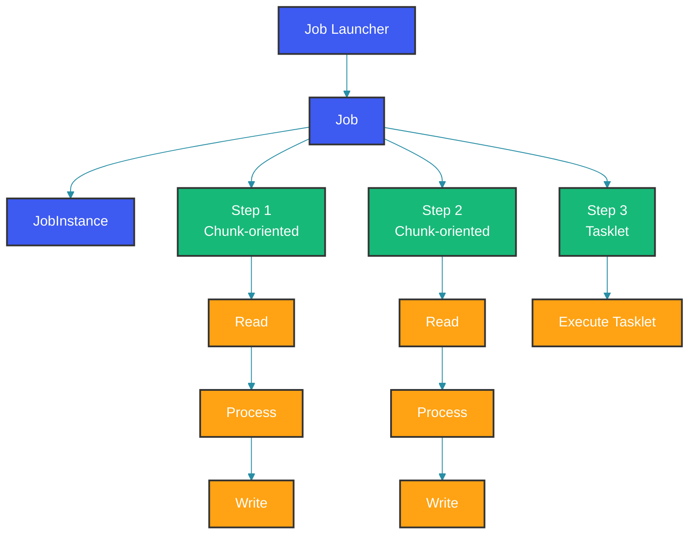

## Overview

Spring Batch is a lightweight, comprehensive batch framework for processing large volumes of data. It provides reusable functions for logging/tracing, transaction management, job processing statistics, job restart, skip, and resource management.

Spring Batch is not a scheduling framework — it focuses on the batch processing pipeline itself. You can trigger jobs via a scheduler (Quartz, cron), REST endpoints, or file system events. The framework handles the heavy lifting: managing state, ensuring restartability, and providing statistics.

## Core Concepts

### Architecture

The domain model has three key abstractions: `Job` (a complete batch process), `Step` (a phase within a job), and `JobInstance`/`JobExecution` (runtime representations). A `JobLauncher` starts a `Job`, which creates a `JobExecution`. The job's `JobInstance` is identified by `JobParameters` — running the same job with different parameters creates different instances.

Steps can be either chunk-oriented (read-process-write in groups) or tasklet-oriented (a single atomic task). Chunk steps are for data processing; tasklets are for setup, cleanup, or single operations like file deletion or sending a notification.



## Dependencies

```xml
<dependency>
    <groupId>org.springframework.boot</groupId>
    <artifactId>spring-boot-starter-batch</artifactId>
</dependency>
<dependency>
    <groupId>org.springframework.boot</groupId>
    <artifactId>spring-boot-starter-data-jpa</artifactId>
</dependency>
<!-- For job repository -->
<dependency>
    <groupId>org.springframework.boot</groupId>
    <artifactId>spring-boot-starter-jdbc</artifactId>
</dependency>
```

## Basic Job Configuration

### Job and Step Definition

A job is defined using `JobBuilder` and a step using `StepBuilder`. The `JobRepository` persists job state and is required by both builders. The `RunIdIncrementer` ensures each job execution has a unique identifier, allowing the job to be re-run with different parameters.

The step below reads CSV records of type `User`, validates/transforms them to `User` (same type), and writes them to a database. The `faultTolerant()` block enables skip and retry for resilience: up to 5 records with `InvalidDataException` can be skipped, and `TransientDataAccessException` triggers up to 3 retries.

```java
@Configuration
@EnableBatchProcessing
public class BatchConfig {

    @Bean
    public Job importUserJob(JobRepository jobRepository,
                             Step importUserStep,
                             JobCompletionNotificationListener listener) {
        return new JobBuilder("importUserJob", jobRepository)
            .incrementer(new RunIdIncrementer())
            .listener(listener)
            .start(importUserStep)
            .build();
    }

    @Bean
    public Step importUserStep(JobRepository jobRepository,
                               PlatformTransactionManager transactionManager,
                               ItemReader<User> reader,
                               ItemProcessor<User, User> processor,
                               ItemWriter<User> writer) {
        return new StepBuilder("importUserStep", jobRepository)
            .<User, User>chunk(10, transactionManager)
            .reader(reader)
            .processor(processor)
            .writer(writer)
            .faultTolerant()
            .skipLimit(5)
            .skip(InvalidDataException.class)
            .retryLimit(3)
            .retry(TransientDataAccessException.class)
            .build();
    }
}
```

### Job Completion Listener

The listener hooks into the job lifecycle. `beforeJob` fires when the job starts (useful for logging start time, expected record count). `afterJob` fires when the job completes, regardless of success or failure. The example below prints status and any failure exceptions.

For production, use the listener to notify ops teams via email or Slack on job failure, increment metrics counters, or trigger downstream processes on successful completion.

```java
@Component
public class JobCompletionNotificationListener extends JobExecutionListenerSupport {

    @Override
    public void beforeJob(JobExecution jobExecution) {
        System.out.println("Job started: " + jobExecution.getJobInstance().getJobName());
    }

    @Override
    public void afterJob(JobExecution jobExecution) {
        if (jobExecution.getStatus() == BatchStatus.COMPLETED) {
            System.out.println("Job completed successfully");
        } else {
            System.out.println("Job failed with status: " + jobExecution.getStatus());
            for (Throwable t : jobExecution.getAllFailureExceptions()) {
                System.err.println("  - " + t.getMessage());
            }
        }
    }
}
```

## Item Reader

### Flat File Reader

The `FlatFileItemReader` is the most common reader for CSV and delimited files. It reads one line at a time, parsing according to the delimiter configuration. `linesToSkip` handles header rows. The `DefaultRecordSeparatorPolicy` handles quoted fields that span multiple lines.

The `targetType` tells Spring Batch which class to map fields to, using property name matching. Field names in the file header or `.names()` parameter must match the property names of the target class.

```java
@Bean
public FlatFileItemReader<User> userItemReader() {
    return new FlatFileItemReaderBuilder<User>()
        .name("userItemReader")
        .resource(new ClassPathResource("data/users.csv"))
        .delimited()
        .names("firstName", "lastName", "email", "age")
        .targetType(User.class)
        .linesToSkip(1)
        .recordSeparatorPolicy(new DefaultRecordSeparatorPolicy())
        .build();
}
```

### Database Reader

Spring Batch provides both cursor-based and paging-based database readers. `JdbcCursorItemReader` opens a single database cursor and streams results — this is efficient for large datasets but holds the cursor open for the entire step. `JpaPagingItemReader` fetches results in pages with separate queries — this is better for long-running steps where the database connection may be interrupted.

Choose cursor-based for high-throughput batch processing where the connection is stable. Choose paging for web applications or when the step may be paused or restarted.

```java
@Bean
public JdbcCursorItemReader<User> databaseReader(DataSource dataSource) {
    return new JdbcCursorItemReaderBuilder<User>()
        .name("databaseReader")
        .dataSource(dataSource)
        .sql("SELECT id, first_name, last_name, email, age FROM users WHERE active = true")
        .rowMapper(new BeanPropertyRowMapper<>(User.class))
        .fetchSize(100)
        .build();
}

@Bean
public JpaPagingItemReader<User> jpaReader(EntityManagerFactory entityManagerFactory) {
    return new JpaPagingItemReaderBuilder<User>()
        .name("jpaReader")
        .entityManagerFactory(entityManagerFactory)
        .queryString("SELECT u FROM User u WHERE u.active = true")
        .pageSize(50)
        .build();
}
```

## Item Processor

The processor transforms each item. Returning null filters the item out — it won't be written. Throwing an exception can trigger skip or retry depending on configuration. The example below validates email, filters underage users, and produces a `ValidatedUser` with enriched fields.

Processors should be stateless: they transform one item at a time without side effects. If you need state across items (e.g., a running total), use the step execution context.

```java
@Component
public class UserValidationProcessor implements ItemProcessor<User, ValidatedUser> {

    @Override
    public ValidatedUser process(User user) throws Exception {
        if (user.getEmail() == null || user.getEmail().isBlank()) {
            throw new InvalidDataException("Email is required for user: " + user.getFirstName());
        }

        if (user.getAge() < 18) {
            return null; // Skip underage users
        }

        ValidatedUser validated = new ValidatedUser();
        validated.setFullName(user.getFirstName() + " " + user.getLastName());
        validated.setEmail(user.getEmail().toLowerCase());
        validated.setAge(user.getAge());
        validated.setProcessedAt(LocalDateTime.now());
        validated.setStatus(UserStatus.ACTIVE);

        return validated;
    }
}
```

## Item Writer

The writer receives a list of items and persists them. `JdbcBatchItemWriter` uses JDBC batch updates (via `PreparedStatement.executeBatch()`), which is much faster than individual INSERT statements. `FlatFileItemWriter` writes delimited output with optional headers and footers.

Use `shouldDeleteIfExists(true)` to overwrite existing output files — without this, the job fails on the second run if the output file already exists.

```java
@Bean
public JdbcBatchItemWriter<ValidatedUser> databaseWriter(DataSource dataSource) {
    return new JdbcBatchItemWriterBuilder<ValidatedUser>()
        .dataSource(dataSource)
        .sql("INSERT INTO validated_users (full_name, email, age, processed_at, status) " +
             "VALUES (:fullName, :email, :age, :processedAt, :status)")
        .beanMapped()
        .build();
}

@Bean
public FlatFileItemWriter<ValidatedUser> flatFileWriter() {
    return new FlatFileItemWriterBuilder<ValidatedUser>()
        .name("userItemWriter")
        .resource(new FileSystemResource("output/validated_users.csv"))
        .delimited()
        .delimiter(",")
        .names("fullName", "email", "age", "processedAt", "status")
        .headerCallback(writer -> writer.write("Full Name,Email,Age,Processed At,Status"))
        .footerCallback(writer -> writer.write("End of file"))
        .shouldDeleteIfExists(true)
        .build();
}
```

## Running Jobs

### Starting a Job

The `JobLauncher` starts a job with `JobParameters`. Parameters are crucial for job identification: running the same job with different parameters creates different `JobInstance` objects. Spring Batch uses parameters to determine whether a job instance already exists and whether to run again.

The `CommandLineRunner` below launches the import job on application startup. In production, you'd typically trigger jobs via a scheduler (Quartz, cron) or a REST endpoint, not at startup.

```java
@SpringBootApplication
public class BatchApplication implements CommandLineRunner {
    @Autowired
    private JobLauncher jobLauncher;

    @Autowired
    private Job importUserJob;

    public static void main(String[] args) {
        SpringApplication.run(BatchApplication.class, args);
    }

    @Override
    public void run(String... args) throws Exception {
        JobParameters params = new JobParametersBuilder()
            .addString("JobID", String.valueOf(System.currentTimeMillis()))
            .addString("source", "csv")
            .addDate("date", new Date())
            .toJobParameters();

        JobExecution execution = jobLauncher.run(importUserJob, params);
        System.out.println("Exit Status: " + execution.getStatus());
    }
}
```

### Scheduled Jobs

Use `@Scheduled` to trigger jobs on a cron schedule. Each execution should have unique `JobParameters` (typically a timestamp) to allow multiple runs. Without changing parameters, Spring Batch refuses to run the same `JobInstance` more than once.

```java
@Component
public class ScheduledJobLauncher {
    private final JobLauncher jobLauncher;
    private final Job reportGenerationJob;

    public ScheduledJobLauncher(JobLauncher jobLauncher,
                               @Qualifier("reportGenerationJob") Job job) {
        this.jobLauncher = jobLauncher;
        this.reportGenerationJob = job;
    }

    @Scheduled(cron = "0 0 2 * * ?") // Run at 2 AM daily
    public void runDailyReport() {
        JobParameters params = new JobParametersBuilder()
            .addString("trigger", "scheduled")
            .addString("date", LocalDate.now().toString())
            .toJobParameters();

        try {
            jobLauncher.run(reportGenerationJob, params);
        } catch (Exception e) {
            System.err.println("Scheduled job failed: " + e.getMessage());
        }
    }
}
```

## Job Parameters and Execution Context

`JobParameters` are inputs to the job and are used for identification. The `ExecutionContext` is mutable state that exists at both job and step levels. It's persisted in the database and available across job restarts. Use the execution context to pass data between steps.

The `ParameterValidationTasklet` below validates that required parameters exist and stores derived state in the execution context for subsequent steps to consume. This pattern is common for validation-first multi-step jobs.

```java
@Component
public class ParameterValidationTasklet implements Tasklet {
    @Override
    public RepeatStatus execute(StepContribution contribution,
                                ChunkContext chunkContext) throws Exception {
        JobParameters params = chunkContext.getStepContext()
            .getJobParameters();

        String source = params.getString("source");
        String target = params.getString("target");

        if (source == null || target == null) {
            throw new IllegalArgumentException("Source and target parameters required");
        }

        // Store in execution context for later steps
        chunkContext.getStepContext()
            .getStepExecution()
            .getJobExecution()
            .getExecutionContext()
            .put("sourceFile", source);

        return RepeatStatus.FINISHED;
    }
}
```

## Multi-Step Jobs

Jobs with multiple steps execute them sequentially. Each step can use the data written by the previous step (through the database) or pass metadata through the execution context. The pattern below chains validation, processing, aggregation, and notification steps.

The notification step is a tasklet (not chunk-oriented) because it's a single operation — send an email. Tasklets are ideal for administrative tasks that don't process bulk data.

```java
@Configuration
public class MultiStepJobConfig {

    @Bean
    public Job multiStepJob(JobRepository jobRepository,
                            Step validateStep,
                            Step processStep,
                            Step aggregateStep,
                            Step notifyStep) {
        return new JobBuilder("multiStepJob", jobRepository)
            .start(validateStep)
            .next(processStep)
            .next(aggregateStep)
            .next(notifyStep)
            .build();
    }

    @Bean
    public Step notifyStep(JobRepository jobRepository,
                           PlatformTransactionManager transactionManager) {
        return new StepBuilder("notifyStep", jobRepository)
            .tasklet(notificationTasklet(), transactionManager)
            .build();
    }

    @Bean
    public Tasklet notificationTasklet() {
        return (contribution, chunkContext) -> {
            String source = chunkContext.getStepContext()
                .getJobExecutionContext()
                .getString("sourceFile");

            System.out.println("Sending notification for processed file: " + source);
            // Send email notification
            return RepeatStatus.FINISHED;
        };
    }
}
```

## Testing Batch Jobs

Spring Batch provides `JobLauncherTestUtils` for testing jobs in isolation. The test below verifies that a job completes successfully and checks individual step statistics (read count equals write count, indicating no items were filtered or failed).

Use `@SpringBootTest` to load the full application context, or a more focused configuration with embedded databases for faster test execution.

```java
@SpringBootTest
class UserImportJobTest {
    @Autowired
    private JobLauncherTestUtils jobLauncherTestUtils;

    @Test
    void testImportUserJob() throws Exception {
        JobExecution jobExecution = jobLauncherTestUtils.launchJob(
            new JobParametersBuilder()
                .addString("testId", UUID.randomUUID().toString())
                .toJobParameters()
        );

        assertThat(jobExecution.getStatus()).isEqualTo(BatchStatus.COMPLETED);
    }

    @Test
    void testImportUserStep() {
        JobExecution jobExecution = jobLauncherTestUtils.launchStep("importUserStep");

        assertThat(jobExecution.getStatus()).isEqualTo(BatchStatus.COMPLETED);
        StepExecution stepExecution = jobExecution.getStepExecutions().iterator().next();
        assertThat(stepExecution.getReadCount()).isGreaterThan(0);
        assertThat(stepExecution.getWriteCount()).isEqualTo(stepExecution.getReadCount());
    }
}
```

## Best Practices

1. **Use chunk-oriented processing** for large datasets instead of tasklets
2. **Configure skip and retry** for fault tolerance
3. **Use JobParameters** for job identification and restartability
4. **Monitor job execution** with Spring Batch Admin or custom listeners
5. **Set appropriate chunk sizes** based on data volume and memory
6. **Use partitioning** for parallel processing of large datasets
7. **Always test jobs** with JobLauncherTestUtils

## Common Mistakes

### Mistake 1: Not Configuring Fault Tolerance

```java
// Wrong: No skip or retry configuration
@Bean
public Step fragileStep(JobRepository jobRepository,
                         PlatformTransactionManager transactionManager) {
    return new StepBuilder("fragileStep", jobRepository)
        .<User, User>chunk(10, transactionManager)
        .reader(reader())
        .processor(processor())
        .writer(writer())
        .build(); // Any error fails the entire step
}
```

Without fault tolerance, a single bad record causes the entire step to fail. For a 100,000 record file, one malformed entry means no records are processed. Fault tolerance lets valid records succeed while skipping or retrying problematic ones, with configurable limits per exception type.

```java
// Correct: Configure skip and retry
@Bean
public Step resilientStep(JobRepository jobRepository,
                           PlatformTransactionManager transactionManager) {
    return new StepBuilder("resilientStep", jobRepository)
        .<User, User>chunk(10, transactionManager)
        .reader(reader())
        .processor(processor())
        .writer(writer())
        .faultTolerant()
        .skipLimit(10)
        .skip(InvalidDataException.class)
        .noSkip(FileNotFoundException.class)
        .retryLimit(3)
        .retry(DeadlockLoserDataAccessException.class)
        .build();
}
```

### Mistake 2: Stateful Processor with Chunks

```java
// Wrong: Processor maintains state across chunks
@Component
public class StatefulProcessor implements ItemProcessor<User, User> {
    private int count = 0; // State shared across chunks

    @Override
    public User process(User user) {
        count++;
        return user;
    }
}
```

Processors should be stateless. If the step is restarted after a failure, the processor state is reset but the read position may have already moved past the reset point, causing the count to be wrong. Use `ItemStream` and the execution context for any state that must survive restarts.

```java
// Correct: Use execution context for state
@Component
public class StatelessProcessor implements ItemProcessor<User, User> {
    @Override
    public User process(User user) {
        return user;
    }
}
```

## Summary

Spring Batch provides a robust framework for batch processing with support for chunk-oriented processing, fault tolerance, job restart, and multiple I/O formats. Use the Spring Batch domain objects (Job, Step, ItemReader, ItemProcessor, ItemWriter) to build reliable, scalable batch applications.

## References

- [Spring Batch Documentation](https://docs.spring.io/spring-batch/reference/index.html)
- [Spring Batch Domain Model](https://docs.spring.io/spring-batch/reference/domain.html)
- [ItemReaders and ItemWriters](https://docs.spring.io/spring-batch/reference/readers-writers.html)
- [Configuring Steps](https://docs.spring.io/spring-batch/reference/step.html)

Happy Coding
