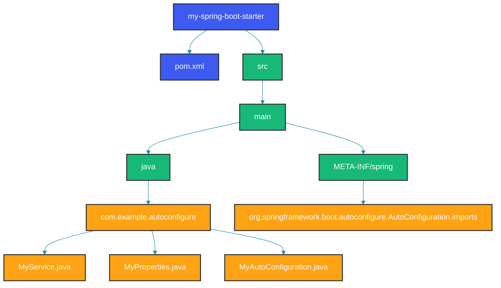

## Overview

Auto-configuration is Spring Boot's killer feature. It automatically configures beans based on classpath dependencies, property settings, and existing beans. This deep dive explores how auto-configuration works internally, how to create custom auto-configuration, and how to debug and customize the auto-configuration process.

Auto-configuration operates on a simple principle: look at the classpath, look at the existing bean definitions, look at the environment properties, and register sensible defaults. Every auto-configuration class is annotated with `@Conditional*` annotations that gate its activation. Understanding these conditions is the key to mastering auto-configuration.

## How Auto-Configuration Works

### The @SpringBootApplication Meta-Annotation

`@SpringBootApplication` is a convenience annotation that combines three essential annotations: `@Configuration` (marks the class as a configuration source), `@EnableAutoConfiguration` (triggers the auto-configuration mechanism), and `@ComponentScan` (enables component scanning).

The `excludeFilters` in `@ComponentScan` prevent auto-configuration classes from being picked up by component scanning. Auto-configuration classes should only be loaded through the `AutoConfiguration.imports` file, not through component scanning. Loading them directly causes double initialization and class loading order issues.

```java
@Target(ElementType.TYPE)
@Retention(RetentionPolicy.RUNTIME)
@Configuration
@EnableAutoConfiguration
@ComponentScan(excludeFilters = {
    @Filter(type = FilterType.CUSTOM, classes = TypeExcludeFilter.class),
    @Filter(type = FilterType.CUSTOM, classes = AutoConfigurationExcludeFilter.class)
})
public @interface SpringBootApplication {
}
```

### @EnableAutoConfiguration Imports

`@EnableAutoConfiguration` imports `AutoConfigurationImportSelector`, which is a `DeferredImportSelector`. The "deferred" aspect is important: auto-configuration classes are processed after all user-defined `@Configuration` classes have been processed. This ensures user beans take precedence over auto-configured ones.

The `AutoConfigurationImportSelector` reads candidate configurations from the `AutoConfiguration.imports` file, filters them based on conditions, removes exclusions, and returns the matching configuration class names.

```java
@Target(ElementType.TYPE)
@Retention(RetentionPolicy.RUNTIME)
@Import(AutoConfigurationImportSelector.class)
public @interface EnableAutoConfiguration {
    boolean exclude() default {};
    String[] excludeName() default {};
}
```

## Auto-Configuration Mechanics

### The AutoConfigurationImportSelector

The import selector is the heart of auto-configuration. It reads all registered auto-configuration classes, applies exclusion filters, removes duplicates, and filters by the conditions defined on each candidate class. The `getConfigurationClassFilter()` method creates a filter from all `@ConditionalOn*` annotations found on the candidate classes and evaluates them against the current environment.

This process runs at application startup and the result is cached. If you add a new jar to the classpath, you must restart the application for its auto-configuration to be considered.

```java
public class AutoConfigurationImportSelector implements DeferredImportSelector, BeanClassLoaderAware,
        ResourceLoaderAware, BeanFactoryAware, EnvironmentAware, Ordered {

    @Override
    public String[] selectImports(AnnotationMetadata annotationMetadata) {
        if (!isEnabled(annotationMetadata)) {
            return NO_IMPORTS;
        }
        AutoConfigurationEntry autoConfigurationEntry = getAutoConfigurationEntry(annotationMetadata);
        return StringUtils.toStringArray(autoConfigurationEntry.getConfigurations());
    }

    protected AutoConfigurationEntry getAutoConfigurationEntry(AnnotationMetadata annotationMetadata) {
        if (!isEnabled(annotationMetadata)) {
            return EMPTY_ENTRY;
        }
        AnnotationAttributes attributes = getAttributes(annotationMetadata);
        List<String> configurations = getCandidateConfigurations(annotationMetadata, attributes);
        configurations = removeDuplicates(configurations);
        Set<String> exclusions = getExclusions(annotationMetadata, attributes);
        checkExcludedClasses(configurations, exclusions);
        configurations.removeAll(exclusions);
        configurations = getConfigurationClassFilter().filter(configurations);
        fireAutoConfigurationImportEvents(configurations, exclusions);
        return new AutoConfigurationEntry(configurations, exclusions);
    }
}
```

### Loading Auto-Configuration Classes

Since Spring Boot 3.0, auto-configuration classes are registered in `META-INF/spring/org.springframework.boot.autoconfigure.AutoConfiguration.imports`. This file replaces the old `META-INF/spring.factories` approach and is faster to process. Each line in the file is a fully-qualified auto-configuration class name.

Spring Boot's built-in auto-configurations cover data sources, JPA, MVC, security, caching, and dozens more. Each one is conditionally activated. When working with a starter, you rarely need to know which auto-configurations are activated — just add the dependency and Spring Boot handles the rest.

```java
// META-INF/spring/org.springframework.boot.autoconfigure.AutoConfiguration.imports
// This file replaces META-INF/spring.factories (deprecated)
com.example.autoconfigure.GracefulShutdownAutoConfiguration
com.example.autoconfigure.RateLimitingAutoConfiguration
com.example.autoconfigure.CircuitBreakerAutoConfiguration
```

## Building a Custom Auto-Configuration

### Step 1: Create the Service

The service class contains the actual business logic. It should have no Spring annotations — it's a plain Java class that will be instantiated by the auto-configuration. The `GracefulShutdownService` below manages shutdown hooks and executes them with a configurable timeout.

```java
// The service that will be auto-configured
public class GracefulShutdownService {
    private final Duration timeout;
    private final List<Runnable> shutdownTasks = new CopyOnWriteArrayList<>();
    private volatile boolean shuttingDown = false;

    public GracefulShutdownService(Duration timeout) {
        this.timeout = timeout;
    }

    public void registerShutdownTask(Runnable task) {
        this.shutdownTasks.add(task);
    }

    public boolean isShuttingDown() {
        return shuttingDown;
    }

    public void shutdown() {
        this.shuttingDown = true;
        ExecutorService executor = Executors.newFixedThreadPool(4);
        CountDownLatch latch = new CountDownLatch(shutdownTasks.size());

        for (Runnable task : shutdownTasks) {
            executor.submit(() -> {
                try {
                    task.run();
                } finally {
                    latch.countDown();
                }
            });
        }

        try {
            if (!latch.await(timeout.toMillis(), TimeUnit.MILLISECONDS)) {
                System.err.println("Shutdown timed out after " + timeout);
            }
        } catch (InterruptedException e) {
            Thread.currentThread().interrupt();
        } finally {
            executor.shutdownNow();
        }
    }
}
```

### Step 2: Create Properties

Configuration properties define what users can customize. The `@ConfigurationProperties` annotation binds properties from the environment with the given prefix. Sensible defaults ensure the auto-configuration works out-of-the-box, while advanced users can customize every aspect.

The `enabled` flag is a standard convention that lets users completely disable the auto-configuration. Without it, removing the starter from the classpath is the only way to disable it.

```java
@ConfigurationProperties(prefix = "app.graceful-shutdown")
public class GracefulShutdownProperties {
    private Duration timeout = Duration.ofSeconds(30);
    private boolean enabled = true;
    private List<String> excludePatterns = new ArrayList<>();

    public Duration getTimeout() { return timeout; }
    public void setTimeout(Duration timeout) { this.timeout = timeout; }
    public boolean isEnabled() { return enabled; }
    public void setEnabled(boolean enabled) { this.enabled = enabled; }
    public List<String> getExcludePatterns() { return excludePatterns; }
    public void setExcludePatterns(List<String> excludePatterns) { this.excludePatterns = excludePatterns; }
}
```

### Step 3: Create the Auto-Configuration

The auto-configuration class wires everything together. It uses `@ConditionalOnProperty` to check the enabled flag, `@ConditionalOnMissingBean` to let users replace the service with their own implementation, and `@ConditionalOnClass` to conditionally register web-specific beans only when the web framework is on the classpath.

The `@AutoConfigureAfter` annotation controls ordering relative to other auto-configurations. The `GracefulShutdownAutoConfiguration` must run after `WebServerFactoryCustomizer` because it needs the embedded web server to be configured first.

```java
@AutoConfiguration
@ConditionalOnProperty(prefix = "app.graceful-shutdown", name = "enabled", havingValue = "true", matchIfMissing = true)
@EnableConfigurationProperties(GracefulShutdownProperties.class)
@AutoConfigureAfter(WebServerFactoryCustomizer.class)
public class GracefulShutdownAutoConfiguration {

    @Bean
    @ConditionalOnMissingBean
    public GracefulShutdownService gracefulShutdownService(GracefulShutdownProperties properties) {
        return new GracefulShutdownService(properties.getTimeout());
    }

    @Bean
    public GracefulShutdownListener gracefulShutdownListener(GracefulShutdownService service) {
        return new GracefulShutdownListener(service);
    }

    @Bean
    @ConditionalOnClass(name = "org.springframework.web.servlet.DispatcherServlet")
    public WebMvcGracefulShutdownFilter webMvcGracefulShutdownFilter(GracefulShutdownService service) {
        return new WebMvcGracefulShutdownFilter(service);
    }

    @Bean
    @ConditionalOnClass(name = "org.springframework.web.reactive.DispatcherHandler")
    public WebFluxGracefulShutdownHandler webFluxGracefulShutdownHandler(GracefulShutdownService service) {
        return new WebFluxGracefulShutdownHandler(service);
    }

    @Bean
    public static BeanPostProcessor shutdownTaskRegistrar(GracefulShutdownService service) {
        return new BeanPostProcessor() {
            @Override
            public Object postProcessAfterInitialization(Object bean, String beanName) {
                if (bean instanceof GracefulShutdownTask task) {
                    service.registerShutdownTask(task::onShutdown);
                }
                return bean;
            }
        };
    }
}
```

### Step 4: Register the Auto-Configuration

The `AutoConfiguration.imports` file must be placed in the correct location. It's loaded by Spring Boot's `AutoConfigurationImportSelector` using `SpringFactoriesLoader`. Ensure the file path is exact: `META-INF/spring/org.springframework.boot.autoconfigure.AutoConfiguration.imports`.

```java
// META-INF/spring/org.springframework.boot.autoconfigure.AutoConfiguration.imports
com.example.autoconfigure.GracefulShutdownAutoConfiguration
```

### Step 5: Create Spring Boot Metadata

Configuration metadata provides IDE support — auto-completion, documentation, and default values. Without it, users must guess property names and types. The metadata file can be generated automatically by `spring-boot-configuration-processor` from `@ConfigurationProperties` annotations, or written manually for additional documentation.

```java
// META-INF/spring-configuration-metadata.json (optional but recommended)
{
  "groups": [
    {
      "name": "app.graceful-shutdown",
      "type": "com.example.autoconfigure.GracefulShutdownProperties",
      "description": "Graceful shutdown configuration."
    }
  ],
  "properties": [
    {
      "name": "app.graceful-shutdown.timeout",
      "type": "java.time.Duration",
      "description": "Maximum time to wait for shutdown tasks to complete.",
      "defaultValue": "30s"
    },
    {
      "name": "app.graceful-shutdown.enabled",
      "type": "java.lang.Boolean",
      "description": "Enable graceful shutdown.",
      "defaultValue": true
    },
    {
      "name": "app.graceful-shutdown.exclude-patterns",
      "type": "java.util.List<java.lang.String>",
      "description": "Bean name patterns to exclude from shutdown registration."
    }
  ]
}
```

## Conditional Annotations Order

```java
@AutoConfiguration
@AutoConfigureOrder(Ordered.HIGHEST_PRECEDENCE + 10)
@AutoConfigureBefore(DataSourceAutoConfiguration.class)
@AutoConfigureAfter(JdbcTemplateAutoConfiguration.class)
public class MyAutoConfiguration {
    // Controls ordering relative to other auto-configurations
}
```

## Filtering Auto-Configuration

### Excluding Auto-Configuration

When you don't need a particular auto-configuration, exclude it using `@SpringBootApplication(exclude = ...)` or the `spring.autoconfigure.exclude` property. Common exclusions include `DataSourceAutoConfiguration` when you define a custom DataSource manually, or `SecurityFilterAutoConfiguration` when using a custom security setup.

```java
@SpringBootApplication(exclude = {
    DataSourceAutoConfiguration.class,
    JpaRepositoriesAutoConfiguration.class
})
public class Application {
    public static void main(String[] args) {
        SpringApplication.run(Application.class, args);
    }
}
```

```yaml
# application.yml
spring:
  autoconfigure:
    exclude:
      - org.springframework.boot.autoconfigure.jdbc.DataSourceAutoConfiguration
      - org.springframework.boot.autoconfigure.orm.jpa.HibernateJpaAutoConfiguration
```

## Debugging Auto-Configuration

### Enable Debug Logging

Set `debug: true` in application.yml to see the auto-configuration report at startup. This shows which auto-configurations matched (positive matches), which did not (negative matches), and why. Unmatched conditions are just as important as matched ones — they explain why expected beans are missing.

For even more detail, set `logging.level.org.springframework.boot.autoconfigure: TRACE` to see each condition evaluation.

```yaml
# application.yml
debug: true
```

```yaml
# Or for more detailed output
logging:
  level:
    org.springframework.boot.autoconfigure: TRACE
```

### Output Example

The auto-configuration report is printed in two sections. `Positive matches` shows configured beans and why they matched. `Negative matches` shows why certain beans were NOT configured — this is the most useful section for debugging missing beans.

```text
============================
CONDITIONS EVALUATION REPORT
============================

Positive matches:
-----------------
   DataSourceAutoConfiguration matched:
      - @ConditionalOnClass found required class 'javax.sql.DataSource' (OnClassCondition)
      - @ConditionalOnProperty (spring.datasource.url) matched (OnPropertyCondition)
   
   HibernateJpaAutoConfiguration matched:
      - @ConditionalOnClass found required classes 'javax.persistence.EntityManager', 'org.hibernate.ejb.HibernateEntityManager' (OnClassCondition)
      - @ConditionalOnProperty (spring.jpa.hibernate.ddl-auto) matched (OnPropertyCondition)

Negative matches:
-----------------
   ActiveMQAutoConfiguration:
      Did not match:
         - @ConditionalOnClass did not find required class 'javax.jms.ConnectionFactory' (OnClassCondition)
   
   RedisAutoConfiguration:
      Did not match:
         - @ConditionalOnClass did not find required class 'redis.clients.jedis.Jedis' (OnClassCondition)
```

### Actuator Endpoint

The `/actuator/conditions` endpoint exposes the same information as the startup report but can be queried at runtime. This is useful for diagnosing configuration issues in production without restarting the application.

```java
// Access conditions via actuator
GET /actuator/conditions

// Response:
{
  "contexts": {
    "application": {
      "positiveMatches": {
        "DataSourceAutoConfiguration": {
          "condition": "OnClassCondition",
          "message": "@ConditionalOnClass found required class 'javax.sql.DataSource'"
        }
      },
      "negativeMatches": {
        "ActiveMQAutoConfiguration": {
          "condition": "OnClassCondition",
          "message": "@ConditionalOnClass did not find required class 'javax.jms.ConnectionFactory'"
        }
      }
    }
  }
}
```

## Auto-Configuration Best Practices

### Starter Module Structure



### Auto-Configuration Ordering Conventions

```java
@AutoConfiguration
@AutoConfigureOrder(0)
@AutoConfigureAfter({DataSourceAutoConfiguration.class, HibernateJpaAutoConfiguration.class})
@AutoConfigureBefore({WebMvcAutoConfiguration.class})
public class DatabaseAuditAutoConfiguration {
    // Dependent on DataSource and JPA being configured first
    // Must run before WebMvc to register audit filters
}
```

### Conditional on Multiple Dependencies

```java
@AutoConfiguration
@ConditionalOnClass({DataSource.class, JdbcTemplate.class})
@ConditionalOnBean(DataSource.class)
@ConditionalOnProperty(prefix = "app.audit", name = "enabled", havingValue = "true")
@EnableConfigurationProperties(AuditProperties.class)
public class DatabaseAuditAutoConfiguration {

    @Bean
    @ConditionalOnMissingBean
    public AuditTrailService auditTrailService(DataSource dataSource) {
        JdbcTemplate jdbcTemplate = new JdbcTemplate(dataSource);
        return new AuditTrailService(jdbcTemplate);
    }

    @Bean
    public AuditAspect auditAspect(AuditTrailService auditService) {
        return new AuditAspect(auditService);
    }
}
```

## Best Practices

1. **Use @AutoConfiguration instead of @Configuration** in auto-configuration classes (since Spring Boot 3.0)
2. **Always provide @ConditionalOnMissingBean** for beans that users might override
3. **Use specific conditions** - prefer @ConditionalOnClass over class name checks
4. **Provide configuration metadata** for IDE support
5. **Place auto-configuration in a separate module** from application code
6. **Test auto-configuration** with ApplicationContextRunner
7. **Document conditional requirements** in the auto-configuration class Javadoc

## Common Mistakes

### Mistake 1: Missing Condition on Auto-Configuration

```java
// Wrong: Auto-configuration without conditions will always load
@Configuration
public class AlwaysLoadConfig {
    @Bean
    public MyService myService() {
        return new MyService();
    }
}
```

```java
// Correct: Always provide conditions
@AutoConfiguration
@ConditionalOnClass(MyServiceDependency.class)
@ConditionalOnProperty(prefix = "my.service", name = "enabled", matchIfMissing = true)
public class MyServiceAutoConfiguration {

    @Bean
    @ConditionalOnMissingBean
    public MyService myService(MyProperties properties) {
        return new MyService(properties);
    }
}
```

### Mistake 2: Incorrect Auto-Configuration Location

```java
// Wrong: Putting auto-configuration in the same package scanned by @ComponentScan
// Application.java
@SpringBootApplication
public class Application { }

// com/example/service/MyAutoConfig.java
@Component  // Will be picked up by component scan, not auto-configuration mechanism
public class MyAutoConfig { }
```

```java
// Correct: Auto-configuration should be in a separate module
// META-INF/spring/org.springframework.boot.autoconfigure.AutoConfiguration.imports
com.example.autoconfigure.MyAutoConfiguration

// The auto-configuration class should NOT be in a package scanned by @SpringBootApplication
```

### Mistake 3: Forgetting to Test Auto-Configuration

```java
// Correct: Always test auto-configuration with ApplicationContextRunner
class MyServiceAutoConfigurationTest {
    private final ApplicationContextRunner contextRunner = new ApplicationContextRunner()
        .withConfiguration(AutoConfigurations.of(MyServiceAutoConfiguration.class));

    @Test
    void whenPropertyEnabledServiceIsCreated() {
        contextRunner
            .withPropertyValues("my.service.enabled=true")
            .run(context -> {
                assertThat(context).hasSingleBean(MyService.class);
                assertThat(context.getBean(MyService.class)).isNotNull();
            });
    }

    @Test
    void whenPropertyDisabledServiceIsNotCreated() {
        contextRunner
            .withPropertyValues("my.service.enabled=false")
            .run(context -> {
                assertThat(context).doesNotHaveBean(MyService.class);
            });
    }

    @Test
    void whenDependencyMissingServiceIsNotCreated() {
        contextRunner
            .withClassLoader(new FilteredClassLoader(MyServiceDependency.class))
            .run(context -> {
                assertThat(context).doesNotHaveBean(MyService.class);
            });
    }
}
```

## Summary

Auto-configuration is the core of Spring Boot's convention-over-configuration approach. By using conditional annotations, the @AutoConfiguration annotation, and spring.factories, you can create intelligent, dependency-aware configurations. Understanding auto-configuration internals helps debug configuration issues and build reusable starters.

## References

- [Spring Boot Auto-Configuration](https://docs.spring.io/spring-boot/reference/auto-configuration.html)
- [Creating Custom Starters](https://docs.spring.io/spring-boot/reference/features/developing-auto-configuration.html)
- [Auto-Configuration Conditions](https://docs.spring.io/spring-boot/reference/auto-configuration/custom.html)
- [Spring Boot Metadata](https://docs.spring.io/spring-boot/reference/configuration-metadata.html)

Happy Coding
