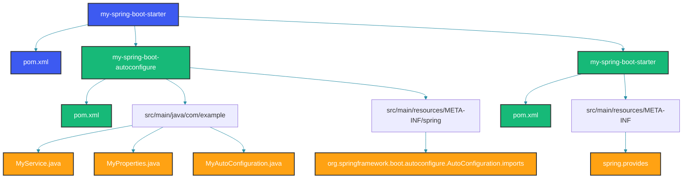

## Overview

Spring Boot starters are a powerful way to package reusable functionality. A starter bundles auto-configuration, dependencies, and configuration properties into a single dependency. This guide covers creating production-ready custom starters with proper auto-configuration, configuration metadata, and testing.

A starter is not just a jar with auto-configuration. It's a convention-driven packaging that follows Spring Boot's philosophy: sensible defaults, easy customization, and zero-configuration setup. Starters lower the barrier to adopting new technologies by eliminating boilerplate configuration.

## Starter Architecture

### Module Structure

The recommended structure uses two modules: an `autoconfigure` module containing the configuration classes and service code, and a `starter` module that is an empty POM dependending on `autoconfigure` and `spring-boot-starter`. This separation lets users depend on just the autoconfigure module if they want to customize the starter's behavior without pulling in its transitive dependencies.



### Starter POM

```xml
<?xml version="1.0" encoding="UTF-8"?>
<project xmlns="http://maven.apache.org/POM/4.0.0"
         xmlns:xsi="http://www.w3.org/2001/XMLSchema-instance"
         xsi:schemaLocation="http://maven.apache.org/POM/4.0.0
         http://maven.apache.org/xsd/maven-4.0.0.xsd">
    <modelVersion>4.0.0</modelVersion>

    <groupId>com.example</groupId>
    <artifactId>my-spring-boot-starter</artifactId>
    <version>1.0.0</version>
    <packaging>pom</packaging>

    <modules>
        <module>my-spring-boot-autoconfigure</module>
        <module>my-spring-boot-starter</module>
    </modules>

    <properties>
        <java.version>17</java.version>
        <spring-boot.version>3.2.0</spring-boot.version>
    </properties>

    <dependencyManagement>
        <dependencies>
            <dependency>
                <groupId>org.springframework.boot</groupId>
                <artifactId>spring-boot-dependencies</artifactId>
                <version>${spring-boot.version}</version>
                <type>pom</type>
                <scope>import</scope>
            </dependency>
        </dependencies>
    </dependencyManagement>
</project>
```

### Starter Module POM

The starter module's POM is minimal: it depends on the autoconfigure module and `spring-boot-starter` (which provides auto-configuration support, logging, and basic Spring Boot infrastructure). It should NOT contain any Java code.

```xml
<?xml version="1.0" encoding="UTF-8"?>
<project xmlns="http://maven.apache.org/POM/4.0.0"
         xmlns:xsi="http://www.w3.org/2001/XMLSchema-instance"
         xsi:schemaLocation="http://maven.apache.org/POM/4.0.0
         http://maven.apache.org/xsd/maven-4.0.0.xsd">
    <modelVersion>4.0.0</modelVersion>

    <parent>
        <groupId>com.example</groupId>
        <artifactId>my-spring-boot-starter-parent</artifactId>
        <version>1.0.0</version>
    </parent>

    <artifactId>my-spring-boot-starter</artifactId>
    <packaging>jar</packaging>

    <dependencies>
        <dependency>
            <groupId>com.example</groupId>
            <artifactId>my-spring-boot-autoconfigure</artifactId>
            <version>${project.version}</version>
        </dependency>
        <dependency>
            <groupId>org.springframework.boot</groupId>
            <artifactId>spring-boot-starter</artifactId>
        </dependency>
    </dependencies>
</project>
```

## Building the Auto-Configuration Module

### Auto-Configuration Module POM

The autoconfigure module depends on `spring-boot-autoconfigure` and `spring-boot-configuration-processor`. Both are marked `optional=true` because they are compile-time dependencies — users of your starter don't need them on their runtime classpath.

```xml
<?xml version="1.0" encoding="UTF-8"?>
<project xmlns="http://maven.apache.org/POM/4.0.0"
         xmlns:xsi="http://www.w3.org/2001/XMLSchema-instance"
         xsi:schemaLocation="http://maven.apache.org/POM/4.0.0
         http://maven.apache.org/xsd/maven-4.0.0.xsd">
    <modelVersion>4.0.0</modelVersion>

    <parent>
        <groupId>com.example</groupId>
        <artifactId>my-spring-boot-starter-parent</artifactId>
        <version>1.0.0</version>
    </parent>

    <artifactId>my-spring-boot-autoconfigure</artifactId>
    <packaging>jar</packaging>

    <dependencies>
        <dependency>
            <groupId>org.springframework.boot</groupId>
            <artifactId>spring-boot-autoconfigure</artifactId>
            <optional>true</optional>
        </dependency>
        <dependency>
            <groupId>org.springframework.boot</groupId>
            <artifactId>spring-boot-configuration-processor</artifactId>
            <optional>true</optional>
        </dependency>
        <dependency>
            <groupId>org.springframework.boot</groupId>
            <artifactId>spring-boot-starter-test</artifactId>
            <scope>test</scope>
        </dependency>
    </dependencies>
</project>
```

### Service Class

The core service class implements the starter's functionality. It should be a plain Java class without Spring annotations — the auto-configuration will create it as a bean. The `RateLimiter` below implements a sliding window algorithm using `ConcurrentHashMap`. Each unique key (e.g., user ID or IP address) has its own request log.

The constructor takes configuration parameters (max requests, window size) that come from `RateLimiterProperties`. Methods are thread-safe because `ConcurrentHashMap.compute` is atomic.

```java
public class RateLimiter {
    private final int maxRequests;
    private final Duration windowSize;
    private final Map<String, List<Instant>> requestLogs = new ConcurrentHashMap<>();

    public RateLimiter(int maxRequests, Duration windowSize) {
        this.maxRequests = maxRequests;
        this.windowSize = windowSize;
    }

    public boolean tryAcquire(String key) {
        Instant now = Instant.now();
        requestLogs.compute(key, (k, timestamps) -> {
            if (timestamps == null) {
                List<Instant> newList = new ArrayList<>();
                newList.add(now);
                return newList;
            }
            timestamps.removeIf(t -> t.isBefore(now.minus(windowSize)));
            if (timestamps.size() >= maxRequests) {
                return timestamps;
            }
            timestamps.add(now);
            return timestamps;
        });

        List<Instant> timestamps = requestLogs.get(key);
        return timestamps != null && timestamps.size() <= maxRequests;
    }

    public int getRemainingRequests(String key) {
        List<Instant> timestamps = requestLogs.get(key);
        if (timestamps == null) {
            return maxRequests;
        }
        Instant now = Instant.now();
        timestamps.removeIf(t -> t.isBefore(now.minus(windowSize)));
        return Math.max(0, maxRequests - timestamps.size());
    }

    public void reset(String key) {
        requestLogs.remove(key);
    }
}
```

### Configuration Properties

Configuration properties classes follow JavaBean conventions with getters and setters. The `@ConfigurationProperties` annotation binds properties with the `app.rate-limiter` prefix. Nested static classes handle grouped configuration like Redis settings.

The `StorageType` enum lets users switch between in-memory and Redis-backed rate limiting. The property class also defines sensible defaults: 100 requests per minute window, with memory storage.

```java
@ConfigurationProperties(prefix = "app.rate-limiter")
public class RateLimiterProperties {
    private boolean enabled = true;
    private int maxRequests = 100;
    private Duration windowSize = Duration.ofMinutes(1);
    private List<String> excludedPaths = new ArrayList<>();
    private StorageType storageType = StorageType.MEMORY;
    private RedisConfig redis = new RedisConfig();

    public boolean isEnabled() { return enabled; }
    public void setEnabled(boolean enabled) { this.enabled = enabled; }
    public int getMaxRequests() { return maxRequests; }
    public void setMaxRequests(int maxRequests) { this.maxRequests = maxRequests; }
    public Duration getWindowSize() { return windowSize; }
    public void setWindowSize(Duration windowSize) { this.windowSize = windowSize; }
    public List<String> getExcludedPaths() { return excludedPaths; }
    public void setExcludedPaths(List<String> excludedPaths) { this.excludedPaths = excludedPaths; }
    public StorageType getStorageType() { return storageType; }
    public void setStorageType(StorageType storageType) { this.storageType = storageType; }
    public RedisConfig getRedis() { return redis; }
    public void setRedis(RedisConfig redis) { this.redis = redis; }

    public enum StorageType {
        MEMORY, REDIS
    }

    public static class RedisConfig {
        private String host = "localhost";
        private int port = 6379;
        private String password;

        public String getHost() { return host; }
        public void setHost(String host) { this.host = host; }
        public int getPort() { return port; }
        public void setPort(int port) { this.port = port; }
        public String getPassword() { return password; }
        public void setPassword(String password) { this.password = password; }
    }
}
```

### Auto-Configuration Class

The auto-configuration class is the heart of the starter. It uses multiple conditional annotations to handle different scenarios. The memory-based rate limiter is the default. When `storage-type=redis` AND `RedisTemplate` is on the classpath AND a `RedisConnectionFactory` bean exists, the Redis-backed implementation is used instead.

The `@ConditionalOnWebApplication` annotation on the filter bean ensures the servlet filter is only registered in web applications. For non-web applications (like batch processors), the filter is not needed and won't be created.

```java
@AutoConfiguration
@ConditionalOnClass(RateLimiter.class)
@ConditionalOnProperty(prefix = "app.rate-limiter", name = "enabled", havingValue = "true", matchIfMissing = true)
@EnableConfigurationProperties(RateLimiterProperties.class)
@AutoConfigureAfter(RedisAutoConfiguration.class)
public class RateLimiterAutoConfiguration {

    @Bean
    @ConditionalOnMissingBean
    @ConditionalOnProperty(prefix = "app.rate-limiter", name = "storage-type", havingValue = "memory", matchIfMissing = true)
    public RateLimiter memoryRateLimiter(RateLimiterProperties properties) {
        return new RateLimiter(properties.getMaxRequests(), properties.getWindowSize());
    }

    @Configuration
    @ConditionalOnClass(RedisTemplate.class)
    @ConditionalOnProperty(prefix = "app.rate-limiter", name = "storage-type", havingValue = "redis")
    @ConditionalOnBean(RedisConnectionFactory.class)
    static class RedisRateLimiterConfig {

        @Bean
        @ConditionalOnMissingBean
        public RedisRateLimiter redisRateLimiter(RateLimiterProperties properties,
                                                 RedisConnectionFactory connectionFactory) {
            return new RedisRateLimiter(properties.getMaxRequests(),
                properties.getWindowSize(), connectionFactory);
        }
    }

    @Bean
    @ConditionalOnWebApplication
    @ConditionalOnMissingBean
    public RateLimiterFilter rateLimiterFilter(RateLimiter rateLimiter,
                                               RateLimiterProperties properties) {
        return new RateLimiterFilter(rateLimiter, properties.getExcludedPaths());
    }
}
```

### Filter (Optional Web Integration)

The servlet filter intercepts all requests, checks if the path is excluded, and acquires a rate limiter token for the client. If the limit is exceeded, it returns HTTP 429 with a JSON error body. Non-excluded paths that exceed the limit get a `X-RateLimit-Remaining` header so clients can track their consumption.

```java
@ConditionalOnWebApplication
public class RateLimiterFilter implements Filter {
    private final RateLimiter rateLimiter;
    private final List<String> excludedPaths;

    public RateLimiterFilter(RateLimiter rateLimiter, List<String> excludedPaths) {
        this.rateLimiter = rateLimiter;
        this.excludedPaths = excludedPaths;
    }

    @Override
    public void doFilter(ServletRequest request, ServletResponse response,
                         FilterChain chain) throws IOException, ServletException {
        HttpServletRequest httpRequest = (HttpServletRequest) request;
        HttpServletResponse httpResponse = (HttpServletResponse) response;

        String path = httpRequest.getRequestURI();
        if (isExcluded(path)) {
            chain.doFilter(request, response);
            return;
        }

        String clientKey = httpRequest.getRemoteAddr();
        if (!rateLimiter.tryAcquire(clientKey)) {
            httpResponse.setStatus(429);
            httpResponse.setContentType("application/json");
            httpResponse.getWriter().write("{\"error\":\"Too many requests\"}");
            return;
        }

        httpResponse.setHeader("X-RateLimit-Remaining",
            String.valueOf(rateLimiter.getRemainingRequests(clientKey)));
        chain.doFilter(request, response);
    }

    private boolean isExcluded(String path) {
        return excludedPaths.stream().anyMatch(path::startsWith);
    }
}
```

### Auto-Configuration Registration

```java
// META-INF/spring/org.springframework.boot.autoconfigure.AutoConfiguration.imports
com.example.ratelimiter.RateLimiterAutoConfiguration
```

## Testing the Starter

### ApplicationContextRunner Test

Test auto-configuration conditions in isolation using `ApplicationContextRunner`. This lightweight test utility creates a minimal application context with only the specified auto-configuration, avoiding the overhead of a full Spring Boot context.

Each test method verifies a specific condition: default configuration creates the bean, disabled property prevents creation, Redis configuration routes to the correct implementation, and missing classpath conditions prevent any beans from being created.

```java
class RateLimiterAutoConfigurationTest {
    private final ApplicationContextRunner contextRunner = new ApplicationContextRunner()
        .withConfiguration(AutoConfigurations.of(RateLimiterAutoConfiguration.class));

    @Test
    void whenDefaultConfigCreatesRateLimiter() {
        contextRunner.run(context -> {
            assertThat(context).hasSingleBean(RateLimiter.class);
            assertThat(context.getBean(RateLimiter.class)).isNotNull();
        });
    }

    @Test
    void whenDisabledDoesNotCreateRateLimiter() {
        contextRunner
            .withPropertyValues("app.rate-limiter.enabled=false")
            .run(context -> {
                assertThat(context).doesNotHaveBean(RateLimiter.class);
            });
    }

    @Test
    void whenRedisConfiguredCreatesRedisRateLimiter() {
        contextRunner
            .withPropertyValues("app.rate-limiter.storage-type=redis")
            .withUserConfiguration(RedisMockConfig.class)
            .run(context -> {
                assertThat(context).hasSingleBean(RedisRateLimiter.class);
            });
    }

    @Configuration
    static class RedisMockConfig {
        @Bean
        public RedisConnectionFactory redisConnectionFactory() {
            return mock(RedisConnectionFactory.class);
        }
    }

    @Test
    void whenClasspathConditionNotMetDoesNotConfigure() {
        contextRunner
            .withClassLoader(new FilteredClassLoader(RateLimiter.class))
            .run(context -> {
                assertThat(context).doesNotHaveBean(RateLimiter.class);
            });
    }
}
```

### Integration Test

Integration tests use `@SpringBootTest` with specific property overrides. These tests verify that the starter works with the full application context, including any Spring Boot auto-configuration it depends on.

```java
@SpringBootTest(properties = {
    "app.rate-limiter.max-requests=5",
    "app.rate-limiter.window-size=10s"
})
class RateLimiterIntegrationTest {
    @Autowired
    private RateLimiter rateLimiter;

    @Test
    void shouldAllowRequestsWithinLimit() {
        for (int i = 0; i < 5; i++) {
            assertTrue(rateLimiter.tryAcquire("test-user"));
        }
    }

    @Test
    void shouldBlockRequestsExceedingLimit() {
        for (int i = 0; i < 5; i++) {
            rateLimiter.tryAcquire("test-user");
        }
        assertFalse(rateLimiter.tryAcquire("test-user"));
    }
}
```

## Configuration Metadata

### Additional Metadata

Configuration metadata provides IDE auto-completion for your starter's properties. The `additional-spring-configuration-metadata.json` file overrides or extends the auto-generated metadata from `spring-boot-configuration-processor`. Use it to add descriptions, default values, minimum/maximum constraints, and deprecation warnings.

```java
// META-INF/additional-spring-configuration-metadata.json
{
  "properties": [
    {
      "name": "app.rate-limiter.max-requests",
      "type": "java.lang.Integer",
      "description": "Maximum number of requests allowed within the window.",
      "defaultValue": 100,
      "minimum": 1,
      "maximum": 10000
    },
    {
      "name": "app.rate-limiter.window-size",
      "type": "java.time.Duration",
      "description": "Time window for rate limiting.",
      "defaultValue": "1m",
      "minimum": "1s",
      "maximum": "1h"
    },
    {
      "name": "app.rate-limiter.storage-type",
      "type": "com.example.ratelimiter.RateLimiterProperties$StorageType",
      "description": "Storage backend for rate limiter state.",
      "defaultValue": "memory"
    },
    {
      "name": "app.rate-limiter.excluded-paths",
      "type": "java.util.List<java.lang.String>",
      "description": "Paths excluded from rate limiting."
    }
  ]
}
```

## Publishing the Starter

### Maven Central Requirements

To publish on Maven Central, your starter must include source and Javadoc jars, have a valid POM with all required metadata, and be signed with a GPG key. The `maven-source-plugin` and `maven-javadoc-plugin` below handle the jar generation.

```xml
<distributionManagement>
    <repository>
        <id>central</id>
        <name>Maven Central Repository</name>
        <url>https://oss.sonatype.org/service/local/staging/deploy/maven2/</url>
    </repository>
</distributionManagement>

<build>
    <plugins>
        <plugin>
            <groupId>org.apache.maven.plugins</groupId>
            <artifactId>maven-source-plugin</artifactId>
            <executions>
                <execution>
                    <id>attach-sources</id>
                    <goals><goal>jar-no-fork</goal></goals>
                </execution>
            </executions>
        </plugin>
        <plugin>
            <groupId>org.apache.maven.plugins</groupId>
            <artifactId>maven-javadoc-plugin</artifactId>
            <executions>
                <execution>
                    <id>attach-javadocs</id>
                    <goals><goal>jar</goal></goals>
                </execution>
            </executions>
        </plugin>
    </plugins>
</build>
```

## Best Practices

1. **Separate auto-configuration from starter** into two modules
2. **Use @ConditionalOnMissingBean** for all beans that users might override
3. **Provide complete configuration metadata** for IDE auto-completion
4. **Test thoroughly** with ApplicationContextRunner for condition scenarios
5. **Use spring-boot-configuration-processor** for metadata generation
6. **Document all conditions** in the auto-configuration class Javadoc
7. **Follow naming convention**: {name}-spring-boot-starter / {name}-spring-boot-autoconfigure

## Common Mistakes

### Mistake 1: Starter Without Conditions

```java
// Wrong: Always loads regardless of environment
@Configuration
public class MyStarterConfig {
    @Bean
    public MyService myService() {
        return new MyService();
    }
}
```

```java
// Correct: Always use conditions
@AutoConfiguration
@ConditionalOnProperty(prefix = "my.service", name = "enabled", matchIfMissing = true)
public class MyStarterConfig {
    @Bean
    @ConditionalOnMissingBean
    public MyService myService(MyProperties properties) {
        return new MyService(properties);
    }
}
```

### Mistake 2: Missing spring.factories / AutoConfiguration.imports

```java
// Wrong: No registration file
// Missing META-INF/spring/org.springframework.boot.autoconfigure.AutoConfiguration.imports
```

```java
// Correct: Always register auto-configuration
// META-INF/spring/org.springframework.boot.autoconfigure.AutoConfiguration.imports
com.example.mystarter.MyAutoConfiguration
```

### Mistake 3: Hard-Coding Dependencies

```java
// Wrong: Required dependency that might not be on classpath
@AutoConfiguration
public class MyStarterConfig {
    @Bean
    public MyService myService() {
        // Requires Redis on classpath even when not used
        return new MyService(new RedisTemplate());
    }
}
```

```java
// Correct: Conditional on optional dependencies
@AutoConfiguration
public class MyStarterConfig {
    @Bean
    @ConditionalOnMissingBean
    @ConditionalOnProperty(name = "my.service.storage", havingValue = "memory", matchIfMissing = true)
    public MyService memoryService() {
        return new MyService(new InMemoryStore());
    }

    @Bean
    @ConditionalOnClass(RedisTemplate.class)
    @ConditionalOnProperty(name = "my.service.storage", havingValue = "redis")
    public MyService redisService() {
        return new MyService(new RedisStore());
    }
}
```

## Summary

Creating custom Spring Boot starters involves packaging auto-configuration, properties, and optional dependencies into a reusable module. Follow the two-module pattern (autoconfigure + starter), use proper conditional annotations, include configuration metadata, and thoroughly test with ApplicationContextRunner. Good starters follow conventions and provide flexible, condition-based configuration.

## References

- [Creating Custom Starters](https://docs.spring.io/spring-boot/reference/features/developing-auto-configuration.html)
- [Auto-Configuration Documentation](https://docs.spring.io/spring-boot/reference/auto-configuration/custom.html)
- [Configuration Metadata](https://docs.spring.io/spring-boot/reference/configuration-metadata.html)
- [Spring Boot Testing Auto-Configuration](https://docs.spring.io/spring-boot/reference/testing/auto-configuration.html)

Happy Coding
