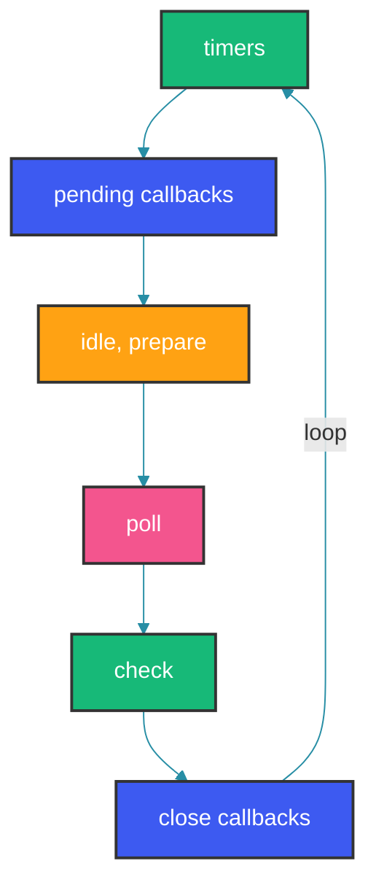

## Overview

The event loop is what allows Node.js to perform non-blocking I/O operations despite JavaScript being single-threaded. Understanding the event loop phases, microtasks vs macrotasks, and libuv's role is crucial for writing performant, predictable asynchronous code.

## Event Loop Phases



## Phase Details

The event loop is a single-threaded loop that processes callbacks in six phases. Each phase has a FIFO callback queue. The loop iterates through phases, executing all callbacks in the current phase's queue before moving to the next phase. Between phases, the loop processes the microtask queue (process.nextTick and Promise callbacks). Understanding this ordering is critical for predicting async execution order.

### Timers Phase

```javascript
// setTimeout and setInterval callbacks are executed here
const start = Date.now();

setTimeout(() => {
  console.log('Timer 1:', Date.now() - start, 'ms');
}, 0);

setTimeout(() => {
  console.log('Timer 2:', Date.now() - start, 'ms');
}, 0);

// Output (approximate):
// Timer 1: ~1 ms
// Timer 2: ~1 ms

// Important: setTimeout with 0ms delay is NOT immediate
// It's subject to a minimum delay of 1ms (after clamping)
```

The timers phase executes callbacks scheduled by `setTimeout` and `setInterval`. A key detail: `setTimeout(fn, 0)` does not execute immediately — Node.js enforces a minimum delay of 1ms (after clamping), and the callback must wait for the timers phase to run. This means `setTimeout(fn, 0)` is not guaranteed to execute in any specific order relative to other phases, especially in the main module where phase timing depends on system load.

### Pending Callbacks Phase

```javascript
const fs = require('fs');

// I/O errors and some system callbacks
fs.readFile(__filename, () => {
  console.log('File read complete');

  // Simulate an error callback
  setTimeout(() => {
    console.log('Timer in I/O callback');
  }, 0);

  setImmediate(() => {
    console.log('Immediate in I/O callback');
  });
});

// Output:
// File read complete
// Immediate in I/O callback
// Timer in I/O callback
```

The pending callbacks phase handles I/O callbacks deferred from the previous cycle, specifically some types of system operations like TCP errors. The critical observation in this section is that when I/O callbacks are running, `setImmediate` callbacks are prioritized over `setTimeout(fn, 0)` — this is because the check phase (setImmediate) runs right after the poll phase, while timers have to wait for the next loop iteration.

### Poll Phase

```javascript
const fs = require('fs');

// The poll phase retrieves new I/O events
fs.readFile(__filename, () => {
  console.log('Poll phase: I/O callback');
});

// Poll phase also calculates blocking duration
const start = Date.now();

setTimeout(() => {
  console.log('Timer:', Date.now() - start, 'ms');
}, 100);

// CPU-intensive operation that blocks poll
while (Date.now() - start < 50) {
  // Blocks poll phase for 50ms
  Math.sqrt(Math.random() * 100000);
}
```

The poll phase is where most I/O callbacks execute. It also determines the blocking duration of the event loop — if the poll queue is empty, Node.js estimates how long to wait for new I/O events based on pending timers. If CPU-intensive work blocks the poll phase (as shown with the `while` loop), timer accuracy degrades because the event loop cannot process callbacks until the poll phase yields.

### Check Phase

```javascript
// setImmediate callbacks are executed in the check phase
setImmediate(() => {
  console.log('Check phase: Immediate 1');
});

setImmediate(() => {
  console.log('Check phase: Immediate 2');
});

// Output:
// Check phase: Immediate 1
// Check phase: Immediate 2

// Order of execution comparison
setTimeout(() => {
  console.log('Timer callback');
}, 0);

setImmediate(() => {
  console.log('Immediate callback');
});

// In main module, order is non-deterministic
// Depends on phase timing when script started
```

The check phase runs `setImmediate` callbacks. `setImmediate` is named to convey "run as soon as possible after I/O" — it fires callbacks in the check phase, which immediately follows the poll phase. This makes `setImmediate` more predictable than `setTimeout(fn, 0)` when scheduling callbacks from I/O handlers. In the main module, the order between `setTimeout(fn, 0)` and `setImmediate` is non-deterministic because it depends on the phase timing of the first event loop iteration.

### Close Callbacks Phase

```javascript
const net = require('net');

const server = net.createServer((socket) => {
  socket.on('close', () => {
    console.log('Close callback: Socket closed');
  });

  socket.destroy();
});

server.listen(8080, () => {
  const client = net.connect(8080, () => {
    client.end();
  });
});

// Output:
// Close callback: Socket closed
```

The close callbacks phase handles cleanup events like `socket.on('close')`. These are distinct from other I/O callbacks because they represent the completion of the close lifecycle. The phase executes callbacks for `close` or `destroy` events emitted by sockets or other objects.

## Microtasks and nextTick

Microtasks are processed between each event loop phase, not within a specific phase. This makes them higher priority than any phase callback. `process.nextTick` callbacks run before Promise microtasks, creating a priority hierarchy: nextTick > Promise > phase callbacks. Misusing nextTick (especially recursively) can starve the event loop entirely because it prevents phase callbacks from ever executing.

### process.nextTick

```javascript
// process.nextTick runs BEFORE the next event loop phase
console.log('Start');

process.nextTick(() => {
  console.log('Next Tick 1');
});

process.nextTick(() => {
  console.log('Next Tick 2');
  process.nextTick(() => {
    console.log('Next Tick 3 - nested');
  });
});

console.log('End');

// Output:
// Start
// End
// Next Tick 1
// Next Tick 2
// Next Tick 3 - nested

// nextTick queue is processed between each phase
// Not part of event loop, it's an inter-phase queue
```

The output demonstrates nextTick's inter-phase nature: even though `Start` and `End` log synchronously, the nextTick callbacks run between the synchronous code and the next phase. Nested nextTick calls (3 levels deep here) all flush before the next phase because the nextTick queue is fully drained after each phase. This is why recursive nextTick is dangerous — it never yields to I/O.

### Promise Microtasks

```javascript
console.log('Start');

Promise.resolve().then(() => {
  console.log('Promise 1');
});

Promise.resolve().then(() => {
  console.log('Promise 2');
  Promise.resolve().then(() => {
    console.log('Promise 3 - nested');
  });
});

console.log('End');

// Output:
// Start
// End
// Promise 1
// Promise 2
// Promise 3 - nested

// Promise callbacks are microtasks
// Processed after each callback in the event loop
```

Promise microtasks follow the same inter-phase rule as nextTick but with lower priority. They are processed after nextTick callbacks but before the next phase callback. This execution model means that a long microtask queue (from deeply nested Promise chains or recursive `then` calls) can also delay I/O processing, though Promise microtasks do yield to nextTick.

## Complete Execution Order

```javascript
console.log('1: Main module');

setTimeout(() => {
  console.log('2: setTimeout');
}, 0);

setImmediate(() => {
  console.log('3: setImmediate');
});

process.nextTick(() => {
  console.log('4: nextTick');
});

Promise.resolve().then(() => {
  console.log('5: Promise');
});

const fs = require('fs');
fs.readFile(__filename, () => {
  console.log('6: I/O callback');

  setTimeout(() => {
    console.log('7: setTimeout in I/O');
  }, 0);

  setImmediate(() => {
    console.log('8: setImmediate in I/O');
  });

  process.nextTick(() => {
    console.log('9: nextTick in I/O');
  });

  Promise.resolve().then(() => {
    console.log('10: Promise in I/O');
  });
});

console.log('11: End main module');

// Output:
// 1: Main module
// 11: End main module
// 4: nextTick
// 5: Promise
// 2: setTimeout (or 3, non-deterministic here)
// 3: setImmediate (or 2)
// 6: I/O callback
// 9: nextTick in I/O
// 10: Promise in I/O
// 8: setImmediate in I/O
// 7: setTimeout in I/O
```

The complete execution order example demonstrates the full priority chain. Synchronous code runs first (main module), then inter-phase microtasks (nextTick, then Promise), then the first phase callback. Inside an I/O callback, the priority chain repeats: nextTick and Promise microtasks flush before the check phase (`setImmediate`), which runs before the next timers phase (`setTimeout`).

## libuv's Role

```javascript
// libuv handles:
// - File system operations
// - DNS lookups
// - Network I/O
// - Thread pool (default 4 threads)
// - Signal handling

// libuv thread pool
const crypto = require('crypto');
const start = Date.now();

// These use libuv's thread pool
crypto.pbkdf2('password', 'salt', 100000, 64, 'sha512', () => {
  console.log('PBKDF2 1:', Date.now() - start, 'ms');
});

crypto.pbkdf2('password', 'salt', 100000, 64, 'sha512', () => {
  console.log('PBKDF2 2:', Date.now() - start, 'ms');
});

crypto.pbkdf2('password', 'salt', 100000, 64, 'sha512', () => {
  console.log('PBKDF2 3:', Date.now() - start, 'ms');
});

crypto.pbkdf2('password', 'salt', 100000, 64, 'sha512', () => {
  console.log('PBKDF2 4:', Date.now() - start, 'ms');
});

crypto.pbkdf2('password', 'salt', 100000, 64, 'sha512', () => {
  console.log('PBKDF2 5:', Date.now() - start, 'ms'); // Waits for a thread
});

// First 4 complete at roughly the same time
// 5th completes about 2x later
```

libuv provides the thread pool that Node.js uses for operations that the OS kernel doesn't support asynchronously — primarily filesystem operations, DNS lookups, and cryptographic functions. The default thread pool size is 4, controlled by `UV_THREADPOOL_SIZE`. The `crypto.pbkdf2` example demonstrates this: the first 4 calls complete nearly simultaneously because they each get a thread, while the 5th waits for a thread to become available.

## Common Patterns

### Blocking the Event Loop

```javascript
// WRONG: CPU-intensive work blocks the event loop
function processLargeArray(items) {
  for (const item of items) {
    heavyComputation(item); // Blocks event loop
  }
}

// BETTER: Break work into chunks
function processLargeArrayAsync(items) {
  const chunkSize = 100;
  let index = 0;

  function processChunk() {
    const end = Math.min(index + chunkSize, items.length);
    for (; index < end; index++) {
      heavyComputation(items[index]);
    }

    if (index < items.length) {
      setImmediate(processChunk); // Yield to event loop
    }
  }

  processChunk();
}

// BEST: Use worker threads
const { Worker } = require('worker_threads');

function processInWorker(items) {
  return new Promise((resolve, reject) => {
    const worker = new Worker('./processor.js', {
      workerData: items
    });
    worker.on('message', resolve);
    worker.on('error', reject);
  });
}
```

The three approaches to CPU-bound work illustrate the evolution of Node.js concurrency. The first approach (synchronous loop) blocks the event loop entirely — no other requests can be processed. The second approach (chunked with `setImmediate`) yields to the event loop between chunks, allowing I/O to interleave. The third approach (Worker threads) offloads the work entirely to a separate OS-level thread, achieving true parallelism without blocking either the event loop or each other.

### Avoiding nextTick Recursion

```javascript
// WRONG: Recursive nextTick starves the event loop
function recursiveNextTick() {
  process.nextTick(recursiveNextTick);
}

// CORRECT: setTimeout allows pending I/O to be processed
function safeRecursive() {
  setTimeout(safeRecursive, 0);
}

// CORRECT: setImmediate gives I/O callbacks a chance
function safeRecursive() {
  setImmediate(safeRecursive);
}
```

The `nextTick` recursion problem has a simple fix: use `setImmediate` instead. While nextTick inserts at the front of the microtask queue (starving I/O), `setImmediate` inserts at the check phase queue (after I/O callbacks in poll). The `setTimeout(fn, 0)` approach also works but has a minimum 1ms delay and lower priority than `setImmediate` when scheduled from I/O callbacks.

## Testing Event Loop Behavior

```javascript
const { performance } = require('perf_hooks');

function measureEventLoopDelay() {
  const start = performance.now();

  setTimeout(() => {
    const delay = performance.now() - start - 100;
    console.log(`Event loop delay: ${delay.toFixed(2)}ms`);
  }, 100);
}

// Measure event loop health
function monitorEventLoopHealth() {
  const checkInterval = 1000;
  const maxDelay = 50;

  function check() {
    const start = performance.now();

    setImmediate(() => {
      const delay = performance.now() - start;
      if (delay > maxDelay) {
        console.warn(`Event loop blocked for ${delay.toFixed(2)}ms`);
      }
      setTimeout(check, checkInterval);
    });
  }

  check();
}
```

## Best Practices

1. **Never block the event loop** with synchronous CPU-intensive work
2. **Use worker threads** for CPU-heavy operations
3. **Prefer setImmediate over setTimeout(fn, 0)** for yielding
4. **Avoid recursive process.nextTick** - it starves I/O
5. **Understand microtask ordering** - nextTick before Promise callbacks
6. **Monitor event loop lag** with tools like toobusy-js
7. **Keep promise chains shallow** to avoid microtask queue buildup

## Common Mistakes

### Mistake 1: Blocking the Event Loop

```javascript
// WRONG: Synchronous loop blocks all requests
app.get('/api/process', (req, res) => {
  const data = readLargeFileSync(); // Blocks event loop
  const result = heavyComputation(data); // Blocks further
  res.json(result);
});
```

```javascript
// CORRECT: Async operations
app.get('/api/process', async (req, res) => {
  const data = await readLargeFile(); // Non-blocking
  const result = await heavyComputationAsync(data); // Non-blocking
  res.json(result);
});
```

### Mistake 2: Starving I/O with nextTick

```javascript
// WRONG: Recursive nextTick prevents I/O callbacks
function processQueue() {
  const item = queue.dequeue();
  if (item) {
    processItem(item);
    process.nextTick(processQueue); // I/O never gets processed
  }
}
```

```javascript
// CORRECT: Use setImmediate to yield to I/O
function processQueue() {
  const item = queue.dequeue();
  if (item) {
    processItem(item);
    setImmediate(processQueue); // Allows I/O to be processed
  }
}
```

## Summary

The Node.js event loop orchestrates asynchronous execution through distinct phases: timers, pending callbacks, poll, check, and close. Microtasks (process.nextTick, Promise callbacks) are processed between phases. Understanding this execution order is essential for writing predictable, non-blocking code.

## References

- [Node.js Event Loop Guide](https://nodejs.org/en/learn/asynchronous-work/event-loop-timers-and-nexttick)
- [libuv Design Overview](https://docs.libuv.org/en/v1.x/design.html)
- [Node.js Event Loop Explained](https://nodejs.org/en/learn/asynchronous-work/event-loop-timers-and-nexttick)
- [UV Thread Pool](https://docs.libuv.org/en/v1.x/threadpool.html)

Happy Coding
