## Overview

Clean Architecture, introduced by Robert C. Martin, organizes software into concentric layers with the domain at the center. Dependencies point inward: outer layers depend on inner layers, never the reverse. This creates systems that are independent of frameworks, databases, UI, and external agencies.

In practice, Clean Architecture means your business rules are pure Java objects with no Spring annotations, your use cases orchestrate domain logic, and your adapters translate between the domain and external systems.

## Project Structure

A typical Clean Architecture Spring Boot project follows this structure:

```mermaid
graph TD
    Root["com.example.orders"]
    Root --> Domain["domain"]
    Domain --> DomainModel["model"]
    DomainModel --> OrderJava["Order.java"]
    DomainModel --> OrderId["OrderId.java"]
    DomainModel --> OrderLine["OrderLine.java"]
    DomainModel --> OrderStatus["OrderStatus.java"]
    DomainModel --> Money["Money.java"]
    Domain --> DomainService["service"]
    DomainService --> OrderDomainService["OrderDomainService.java"]
    DomainService --> DiscountPolicy["DiscountPolicy.java"]
    Root --> Application["application"]
    Application --> Port["port"]
    Port --> Inbound["inbound"]
    Inbound --> CreateOrderUseCase["CreateOrderUseCase.java"]
    Inbound --> GetOrderQuery["GetOrderQuery.java"]
    Port --> Outbound["outbound"]
    Outbound --> OrderRepositoryPort["OrderRepositoryPort.java"]
    Outbound --> PaymentGatewayPort["PaymentGatewayPort.java"]
    Application --> AppService["service"]
    AppService --> CreateOrderService["CreateOrderService.java"]
    AppService --> GetOrderService["GetOrderService.java"]
    Root --> Adapter["adapter"]
    Adapter --> AdapterInbound["inbound"]
    AdapterInbound --> Web["web"]
    Web --> OrderController["OrderController.java"]
    Web --> OrderRequest["OrderRequest.java"]
    AdapterInbound --> Messaging["messaging"]
    Messaging --> OrderEventConsumer["OrderEventConsumer.java"]
    Adapter --> AdapterOutbound["outbound"]
    AdapterOutbound --> Persistence["persistence"]
    Persistence --> OrderRepositoryAdapter["OrderRepositoryAdapter.java"]
    Persistence --> JpaOrderRepository["JpaOrderRepository.java"]
    AdapterOutbound --> Payment["payment"]
    Payment --> PaymentGatewayAdapter["PaymentGatewayAdapter.java"]
    Root --> Shared["shared"]
    Shared --> Annotation["annotation"]
    Annotation --> UseCase["UseCase.java"]

    classDef green fill:#17b978,stroke:#333,stroke-width:2px,color:#fff
    classDef blue fill:#3d5af1,stroke:#333,stroke-width:2px,color:#fff
    classDef pink fill:#f3558e,stroke:#333,stroke-width:2px,color:#fff
    classDef yellow fill:#FFA213,stroke:#333,stroke-width:2px,color:#fff
    linkStyle default stroke:#278ea5

    class Root,Shared,Annotation green
    class Domain,DomainModel,DomainService blue
    class Application,Port,Inbound,Outbound,AppService pink
    class Adapter,AdapterInbound,AdapterOutbound,Web,Messaging,Persistence,Payment yellow
```



The directory structure mirrors the concentric layers of Clean Architecture. The `domain` package has zero framework dependencies — it contains only plain Java objects and domain services. The `application` package defines ports (interfaces) that declare boundaries, and use case services that orchestrate domain logic. The `adapter` package contains all the framework-specific code: controllers annotated with `@RestController`, repository implementations using JPA, and message consumers. This separation means you can upgrade Spring Boot, swap databases, or add a new delivery mechanism (like GraphQL or gRPC) by only touching adapter code.

## Domain Layer

The domain layer contains enterprise business rules and entities. It has no framework dependencies.

```java
package com.example.orders.domain.model;

import java.util.ArrayList;
import java.util.Collections;
import java.util.List;
import java.util.Objects;

public class Order {
    private final OrderId id;
    private final String customerId;
    private final List<OrderLine> items;
    private OrderStatus status;
    private Money totalAmount;

    public Order(OrderId id, String customerId) {
        this.id = id;
        this.customerId = customerId;
        this.items = new ArrayList<>();
        this.status = OrderStatus.PENDING;
        this.totalAmount = Money.zero();
    }

    public void addItem(OrderLine item) {
        if (status != OrderStatus.PENDING) {
            throw new IllegalStateException("Cannot add items to a non-pending order");
        }
        this.items.add(item);
        this.totalAmount = this.totalAmount.add(item.getSubtotal());
    }

    public void confirm() {
        if (items.isEmpty()) {
            throw new IllegalStateException("Cannot confirm an empty order");
        }
        if (status != OrderStatus.PENDING) {
            throw new IllegalStateException("Order is not in pending state");
        }
        this.status = OrderStatus.CONFIRMED;
    }

    public void cancel() {
        if (status == OrderStatus.SHIPPED || status == OrderStatus.DELIVERED) {
            throw new IllegalStateException("Cannot cancel shipped or delivered order");
        }
        this.status = OrderStatus.CANCELLED;
    }

    public OrderId getId() { return id; }
    public String getCustomerId() { return customerId; }
    public List<OrderLine> getItems() { return Collections.unmodifiableList(items); }
    public OrderStatus getStatus() { return status; }
    public Money getTotalAmount() { return totalAmount; }

    @Override
    public boolean equals(Object o) {
        if (this == o) return true;
        if (o == null || getClass() != o.getClass()) return false;
        Order order = (Order) o;
        return Objects.equals(id, order.id);
    }

    @Override
    public int hashCode() {
        return Objects.hash(id);
    }
}
```

The `Order` entity encapsulates all business rules related to an order's lifecycle. Notice the guard clauses in `addItem`, `confirm`, and `cancel` — these enforce invariants that must always hold true, regardless of the delivery mechanism or database. The `OrderId` value object (used instead of a raw `Long` or `String`) prevents primitive obsession and makes the domain's intent explicit. There are no Spring annotations, no JPA annotations — this class is pure Java, testable in milliseconds, and completely independent of frameworks.

Value objects provide type safety and encapsulate validation:

```java
package com.example.orders.domain.model;

import java.math.BigDecimal;
import java.math.RoundingMode;
import java.util.Currency;
import java.util.Objects;

public class Money {
    private final BigDecimal amount;
    private final Currency currency;

    private Money(BigDecimal amount, Currency currency) {
        this.amount = amount.setScale(2, RoundingMode.HALF_EVEN);
        this.currency = currency;
    }

    public static Money of(BigDecimal amount, String currencyCode) {
        return new Money(amount, Currency.getInstance(currencyCode));
    }

    public static Money zero() {
        return new Money(BigDecimal.ZERO, Currency.getInstance("USD"));
    }

    public Money add(Money other) {
        if (!this.currency.equals(other.currency)) {
            throw new IllegalArgumentException("Currency mismatch");
        }
        return new Money(this.amount.add(other.amount), this.currency);
    }

    public Money multiply(int multiplier) {
        return new Money(this.amount.multiply(BigDecimal.valueOf(multiplier)), this.currency);
    }

    public BigDecimal getAmount() { return amount; }
    public Currency getCurrency() { return currency; }

    @Override
    public boolean equals(Object o) {
        if (this == o) return true;
        if (o == null || getClass() != o.getClass()) return false;
        Money money = (Money) o;
        return Objects.equals(amount, money.amount) && Objects.equals(currency, money.currency);
    }

    @Override
    public int hashCode() {
        return Objects.hash(amount, currency);
    }
}
```

`Money` is a value object that wraps a `BigDecimal` amount and its `Currency`. It enforces currency consistency — you cannot add dollars to euros without an explicit conversion. The private constructor forces creation through the static factory method `Money.of`, which performs validation (e.g., ensuring the currency code is valid). The `HALF_EVEN` rounding mode (banker's rounding) avoids the bias inherent in `HALF_UP` and is the recommended default for financial calculations.

## Application Layer

The application layer defines use cases and ports. Use cases orchestrate the domain layer.

```java
package com.example.orders.application.port.inbound;

import com.example.orders.domain.model.Order;
import com.example.orders.domain.model.OrderId;

public interface CreateOrderUseCase {
    Order createOrder(CreateOrderCommand command);
    OrderId getOrderId();
}

public record CreateOrderCommand(String customerId, List<OrderItemCommand> items) {}

public record OrderItemCommand(String productId, String productName, int quantity, BigDecimal unitPrice) {}
```

Inbound ports define how external actors (like HTTP controllers or message consumers) interact with the application. `CreateOrderUseCase` is an inbound port that accepts a `CreateOrderCommand` — a simple record with the data needed to create an order. Using records for commands keeps them immutable and focused. The interface is defined in the application layer, not the domain layer, because the use case orchestrates domain objects but is not itself a domain concept.

```java
package com.example.orders.application.port.outbound;

import com.example.orders.domain.model.Order;
import com.example.orders.domain.model.OrderId;
import java.util.Optional;

public interface OrderRepositoryPort {
    Order save(Order order);
    Optional<Order> findById(OrderId id);
    void deleteById(OrderId id);
}
```

Outbound ports define how the application accesses external resources. `OrderRepositoryPort` is an outbound port — an abstraction over persistence. The use case depends on this interface, not on any concrete JPA or JDBC implementation. This is the Dependency Inversion Principle in action: the high-level application layer defines the contract, and the low-level adapter implements it.

```java
package com.example.orders.application.service;

import com.example.orders.domain.model.*;
import com.example.orders.application.port.inbound.CreateOrderUseCase;
import com.example.orders.application.port.outbound.OrderRepositoryPort;
import org.springframework.stereotype.Service;
import org.springframework.transaction.annotation.Transactional;

@Service
public class CreateOrderService implements CreateOrderUseCase {

    private final OrderRepositoryPort orderRepository;

    public CreateOrderService(OrderRepositoryPort orderRepository) {
        this.orderRepository = orderRepository;
    }

    @Override
    @Transactional
    public Order createOrder(CreateOrderCommand command) {
        OrderId orderId = OrderId.generate();
        Order order = new Order(orderId, command.customerId());

        for (OrderItemCommand item : command.items()) {
            Money unitPrice = Money.of(item.unitPrice(), "USD");
            OrderLine orderLine = new OrderLine(
                item.productId(),
                item.productName(),
                unitPrice,
                item.quantity()
            );
            order.addItem(orderLine);
        }

        order.confirm();
        return orderRepository.save(order);
    }

    @Override
    public OrderId getOrderId() {
        return null;
    }
}
```

`CreateOrderService` is the use case implementation. It depends only on `OrderRepositoryPort` (an interface), not on any specific database technology. It creates domain objects using their constructors and factory methods, calls domain methods like `order.confirm()`, and delegates persistence to the port. The `@Transactional` annotation is acceptable here because transaction management is an application-level concern — it governs when the unit of work begins and ends. The use case is deliberately thin: all business rules live in the `Order` entity. If the pricing rules change, you modify `Order.addItem` or `OrderLine`, not this service.

## Adapter Layer

Adapters implement ports using specific technologies. Outbound adapters connect to databases and external services.

```java
package com.example.orders.adapter.outbound.persistence;

import com.example.orders.domain.model.Order;
import com.example.orders.domain.model.OrderId;
import com.example.orders.application.port.outbound.OrderRepositoryPort;
import org.springframework.stereotype.Repository;

@Repository
public class OrderRepositoryAdapter implements OrderRepositoryPort {

    private final JpaOrderRepository jpaRepository;
    private final OrderMapper mapper;

    public OrderRepositoryAdapter(JpaOrderRepository jpaRepository, OrderMapper mapper) {
        this.jpaRepository = jpaRepository;
        this.mapper = mapper;
    }

    @Override
    public Order save(Order order) {
        OrderEntity entity = mapper.toEntity(order);
        OrderEntity saved = jpaRepository.save(entity);
        return mapper.toDomain(saved);
    }

    @Override
    public Optional<Order> findById(OrderId id) {
        return jpaRepository.findById(id.getValue())
            .map(mapper::toDomain);
    }

    @Override
    public void deleteById(OrderId id) {
        jpaRepository.deleteById(id.getValue());
    }
}
```

The `OrderRepositoryAdapter` implements the outbound port. It translates between the domain model (`Order`) and the persistence model (`OrderEntity`) using an `OrderMapper`. This translation layer is essential: the domain `Order` might have value objects like `Money` and `OrderId`, while the `OrderEntity` might use primitive `Long` IDs and `BigDecimal` amounts. The adapter is the only place where JPA-specific code exists — if you switch to MongoDB, you only need to rewrite this adapter and the mapper.

Inbound adapters handle HTTP requests and messaging:

```java
package com.example.orders.adapter.inbound.web;

import com.example.orders.application.port.inbound.CreateOrderUseCase;
import org.springframework.http.HttpStatus;
import org.springframework.http.ResponseEntity;
import org.springframework.web.bind.annotation.*;

@RestController
@RequestMapping("/api/orders")
public class OrderController {

    private final CreateOrderUseCase createOrderUseCase;
    private final GetOrderQuery getOrderQuery;

    public OrderController(CreateOrderUseCase createOrderUseCase, GetOrderQuery getOrderQuery) {
        this.createOrderUseCase = createOrderUseCase;
        this.getOrderQuery = getOrderQuery;
    }

    @PostMapping
    public ResponseEntity<OrderResponse> createOrder(@RequestBody OrderRequest request) {
        CreateOrderCommand command = request.toCommand();
        Order order = createOrderUseCase.createOrder(command);
        return ResponseEntity.status(HttpStatus.CREATED).body(OrderResponse.from(order));
    }

    @GetMapping("/{id}")
    public ResponseEntity<OrderResponse> getOrder(@PathVariable String id) {
        return getOrderQuery.getOrder(new OrderId(id))
            .map(order -> ResponseEntity.ok(OrderResponse.from(order)))
            .orElse(ResponseEntity.notFound().build());
    }
}
```

The `OrderController` is an inbound adapter that converts HTTP requests into commands and delegates to the use case. It depends on `CreateOrderUseCase` (the inbound port interface), not on `CreateOrderService` directly. This allows you to swap the implementation without changing the controller. The controller also handles the response DTO mapping, keeping HTTP concerns (status codes, headers) out of the use case.

## Dependency Injection Configuration

Clean Architecture uses DI to wire the layers together at the composition root:

```java
package com.example.orders.config;

import com.example.orders.adapter.outbound.persistence.OrderMapper;
import com.example.orders.adapter.outbound.persistence.OrderRepositoryAdapter;
import com.example.orders.application.port.outbound.OrderRepositoryPort;
import com.example.orders.application.service.CreateOrderService;
import org.springframework.context.annotation.Bean;
import org.springframework.context.annotation.Configuration;

@Configuration
public class OrderConfiguration {

    @Bean
    public CreateOrderService createOrderService(OrderRepositoryPort orderRepositoryPort) {
        return new CreateOrderService(orderRepositoryPort);
    }

    @Bean
    public OrderRepositoryPort orderRepositoryPort(
            JpaOrderRepository jpaRepository, OrderMapper mapper) {
        return new OrderRepositoryAdapter(jpaRepository, mapper);
    }

    @Bean
    public OrderMapper orderMapper() {
        return new OrderMapper();
    }
}
```

The configuration class wires the dependency graph. Spring's DI container injects `JpaOrderRepository` and `OrderMapper` into the `OrderRepositoryAdapter`, which is registered as the implementation of `OrderRepositoryPort`. The `CreateOrderService` receives the port through constructor injection. This explicit wiring makes the dependency graph visible and testable — you can create a test configuration that wires an in-memory adapter instead.

## Testing Clean Architecture

Domain logic is pure and easily testable without Spring:

```java
class OrderTest {

    @Test
    void shouldConfirmOrderWhenItemsAdded() {
        Order order = new Order(OrderId.generate(), "customer-1");
        order.addItem(new OrderLine("prod-1", "Product 1", Money.of(BigDecimal.TEN, "USD"), 2));
        order.confirm();

        assertThat(order.getStatus()).isEqualTo(OrderStatus.CONFIRMED);
        assertThat(order.getTotalAmount()).isEqualTo(Money.of(new BigDecimal("20.00"), "USD"));
    }

    @Test
    void shouldThrowWhenConfirmingEmptyOrder() {
        Order order = new Order(OrderId.generate(), "customer-1");

        assertThatThrownBy(order::confirm)
            .isInstanceOf(IllegalStateException.class)
            .hasMessageContaining("empty");
    }
}
```

Domain tests need no Spring context, no database, and no mocking framework. They create domain objects directly, call methods, and assert on the results. These tests run in milliseconds and give immediate feedback when business rules break. In a typical Clean Architecture project, 70% of your tests should be at this level — fast, reliable, and independent of infrastructure.

## Common Mistakes

### Annotating Domain Objects

```java
// Wrong: Domain objects should not have framework annotations
@Entity
@Table(name = "orders")
public class Order {
    @Id
    @GeneratedValue
    private Long id;

    public Money calculateDiscount() {
        // Domain logic mixed with JPA
    }
}
```

```java
// Correct: Separate domain model from persistence
public class Order {
    private final OrderId id;
    // pure domain logic, no annotations
}

@Entity
@Table(name = "orders")
public class OrderEntity {
    @Id
    private String id;
    // JPA-specific mapping
}
```

Mixing JPA annotations into domain objects is the most common Clean Architecture violation. The `@Entity` annotation couples your domain logic to JPA's requirements: a no-arg constructor, mutable fields through setters, and specific annotation processing at runtime. Instead, maintain two separate models: a rich, immutable domain model and a mutable, JPA-annotated entity model. The mapper bridges them.

### Leaking Infrastructure into Use Cases

```java
// Wrong: Use case depends on infrastructure
@Service
public class CreateOrderService {
    @Autowired
    private JpaOrderRepository repository; // direct dependency on JPA

    @Transactional
    public Order createOrder(CreateOrderCommand command) {
        // ...
    }
}
```

```java
// Correct: Use case depends on abstraction
@Service
public class CreateOrderService {
    private final OrderRepositoryPort repository; // depends on port, not implementation

    @Transactional
    public Order createOrder(CreateOrderCommand command) {
        // ...
    }
}
```

Field injection (`@Autowired`) hides the dependency — you can't tell from the constructor what this service needs. Constructor injection makes dependencies explicit and mandatory. More importantly, depending on `JpaOrderRepository` directly ties the use case to JPA, defeating the purpose of Clean Architecture.

## Best Practices

1. Keep the domain layer completely free of framework annotations and imports.
2. Define ports (interfaces) in the application layer, not the domain layer.
3. Use mapper objects to convert between domain models and persistence entities.
4. Keep use cases focused on a single business operation.
5. Test domain logic with plain unit tests; test adapters with integration tests.

## Summary

Clean Architecture in Spring Boot requires discipline to maintain the dependency rule. The domain layer stays pure, the application layer defines ports and use cases, and adapters handle infrastructure concerns. This separation produces systems that are testable, maintainable, and adaptable to changing requirements.

## References

- Martin, R. C. "Clean Architecture: A Craftsman's Guide to Software Structure and Design"
- Evans, E. "Domain-Driven Design: Tackling Complexity in the Heart of Software"
- Vernon, V. "Implementing Domain-Driven Design"

Happy Coding
