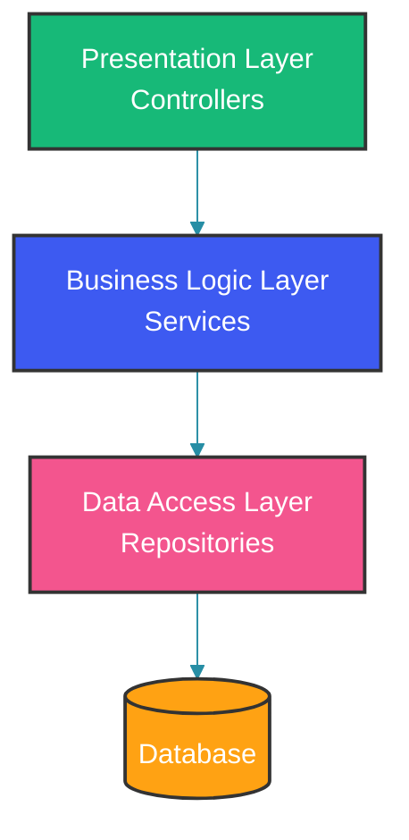
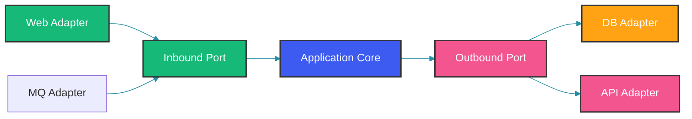
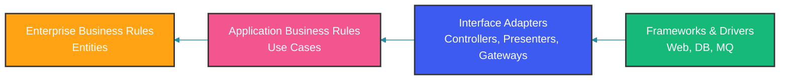

## Overview

Three dominant architectural patterns shape backend applications today: Layered Architecture, Hexagonal Architecture (Ports and Adapters), and Clean Architecture. Each represents a different approach to separating concerns and managing dependencies. Understanding their differences, strengths, and weaknesses helps architects make informed decisions.

This comparison examines each architecture through code examples, dependency management, testability, and practical trade-offs.

## Layered Architecture

The traditional layered architecture organizes code into horizontal tiers. Each layer has a specific responsibility and depends only on the layer directly below it.



Each layer has a clear responsibility, and dependencies flow downward. The presentation layer handles HTTP and serialization. The business logic layer orchestrates operations and enforces rules. The data access layer communicates with the database.

```java
@RestController
@RequestMapping("/api/users")
public class UserController {
    private final UserService userService;

    public UserController(UserService userService) {
        this.userService = userService;
    }

    @PostMapping
    public ResponseEntity<UserResponse> createUser(@RequestBody CreateUserRequest request) {
        UserResponse response = userService.createUser(request);
        return ResponseEntity.status(HttpStatus.CREATED).body(response);
    }
}

@Service
public class UserService {
    private final UserRepository userRepository;
    private final EmailService emailService;

    public UserService(UserRepository userRepository, EmailService emailService) {
        this.userRepository = userRepository;
        this.emailService = emailService;
    }

    @Transactional
    public UserResponse createUser(CreateUserRequest request) {
        if (userRepository.existsByEmail(request.email())) {
            throw new DuplicateEmailException(request.email());
        }
        User user = new User(request.name(), request.email(), request.role());
        User saved = userRepository.save(user);
        emailService.sendWelcomeEmail(saved.getEmail(), saved.getName());
        return UserResponse.from(saved);
    }
}

@Repository
public interface UserRepository extends JpaRepository<User, Long> {
    boolean existsByEmail(String email);
    Optional<User> findByEmail(String email);
}
```

In layered architecture, `UserService` depends directly on `UserRepository` (a JPA interface) and `EmailService`. The dependencies are concrete — you can see at a glance how the data flows. However, `UserService` is coupled to Spring Data JPA (through `UserRepository`) and to a specific email implementation. Testing requires either a real database or complex mocking of concrete types.

### Strengths

- Simple and intuitive for small to medium applications.
- Follows the natural structure of most frameworks.
- Easy to onboard new developers.

### Weaknesses

- The business layer often becomes a "god layer" with mixed concerns.
- Database-driven design: the service layer often mirrors repository methods.
- Framework coupling: business logic depends on framework annotations and infrastructure.
- Difficult to test business logic without setting up the entire Spring context.

## Hexagonal Architecture

Hexagonal architecture, or Ports and Adapters, inverts the dependency direction. The core business logic defines ports (interfaces), and external systems implement adapters.



The core is surrounded by ports. Inbound adapters (web, message queue) connect to inbound ports. Outbound adapters (database, external API) implement outbound ports. The core has no knowledge of which adapters are connected — it only knows the port interfaces.

```java
// Core: Inbound port
public interface CreateUserUseCase {
    User createUser(CreateUserCommand command);
}

// Core: Outbound port
public interface UserRepositoryPort {
    User save(User user);
    boolean existsByEmail(Email email);
    Optional<User> findByEmail(Email email);
}

public interface NotificationPort {
    void sendWelcomeEmail(Email recipient, String name);
}

// Core: Application service
public class CreateUserService implements CreateUserUseCase {
    private final UserRepositoryPort userRepository;
    private final NotificationPort notificationPort;

    public CreateUserService(UserRepositoryPort userRepository, NotificationPort notificationPort) {
        this.userRepository = userRepository;
        this.notificationPort = notificationPort;
    }

    @Override
    public User createUser(CreateUserCommand command) {
        Email email = new Email(command.email());
        if (userRepository.existsByEmail(email)) {
            throw new DuplicateEmailException(email);
        }
        User user = new User(command.name(), email, Role.valueOf(command.role()));
        User saved = userRepository.save(user);
        notificationPort.sendWelcomeEmail(saved.getEmail(), saved.getName());
        return saved;
    }
}

// Adapter: Web inbound adapter
@RestController
@RequestMapping("/api/users")
public class UserWebAdapter {
    private final CreateUserUseCase createUserUseCase;

    public UserWebAdapter(CreateUserUseCase createUserUseCase) {
        this.createUserUseCase = createUserUseCase;
    }

    @PostMapping
    public ResponseEntity<UserResponse> createUser(@RequestBody CreateUserRequest request) {
        CreateUserCommand command = new CreateUserCommand(
            request.name(), request.email(), request.role());
        User user = createUserUseCase.createUser(command);
        return ResponseEntity.status(HttpStatus.CREATED).body(UserResponse.from(user));
    }
}

// Adapter: Persistence outbound adapter
@Repository
public class UserJpaAdapter implements UserRepositoryPort {
    private final SpringDataUserRepository jpaRepository;
    private final UserMapper mapper;

    public UserJpaAdapter(SpringDataUserRepository jpaRepository, UserMapper mapper) {
        this.jpaRepository = jpaRepository;
        this.mapper = mapper;
    }

    @Override
    public User save(User user) {
        return mapper.toDomain(jpaRepository.save(mapper.toEntity(user)));
    }

    @Override
    public boolean existsByEmail(Email email) {
        return jpaRepository.existsByEmail(email.value());
    }

    @Override
    public Optional<User> findByEmail(Email email) {
        return jpaRepository.findByEmail(email.value()).map(mapper::toDomain);
    }
}
```

In hexagonal architecture, `CreateUserService` depends on `UserRepositoryPort` and `NotificationPort` — both interfaces defined by the core. The web controller (`UserWebAdapter`) is an inbound adapter that depends on the `CreateUserUseCase` port. The JPA adapter is an outbound adapter that implements `UserRepositoryPort`. The core contains no imports from Spring, JPA, or any web framework.

## Clean Architecture

Clean Architecture extends hexagonal concepts with explicit layers: Entities, Use Cases, Interface Adapters, and Frameworks & Drivers.



Clean Architecture adds a fourth layer: enterprise business rules (entities) at the center, surrounded by application business rules (use cases), then interface adapters, and finally frameworks and drivers. Dependencies flow strictly inward.

```java
// Layer 0: Enterprise Business Rules (Entities)
public class User {
    private UserId id;
    private String name;
    private Email email;
    private Role role;
    private boolean active;

    public User(UserId id, String name, Email email, Role role) {
        this.id = id;
        this.name = name;
        this.email = email;
        this.role = role;
        this.active = true;
    }

    public void deactivate() {
        if (role == Role.ADMIN) {
            throw new IllegalStateException("Cannot deactivate admin users");
        }
        this.active = false;
    }

    public boolean isActive() { return active; }
    public UserId getId() { return id; }
    public Email getEmail() { return email; }
}

// Layer 1: Application Business Rules (Use Cases)
public class CreateUserUseCase {
    private final UserRepository userRepository;
    private final NotificationService notificationService;

    public CreateUserUseCase(UserRepository userRepository, NotificationService notificationService) {
        this.userRepository = userRepository;
        this.notificationService = notificationService;
    }

    public User execute(CreateUserRequest request) {
        Email email = new Email(request.email());
        if (userRepository.findByEmail(email).isPresent()) {
            throw new UserAlreadyExistsException(email);
        }
        User user = new User(UserId.generate(), request.name(), email, Role.fromString(request.role()));
        User saved = userRepository.save(user);
        notificationService.sendWelcome(new WelcomeNotification(saved.getEmail(), saved.getName()));
        return saved;
    }
}

// Layer 2: Interface Adapters
@RestController
@RequestMapping("/api/users")
public class UserController {
    private final CreateUserUseCase createUserUseCase;
    private final UserPresenter presenter;

    public UserController(CreateUserUseCase createUserUseCase, UserPresenter presenter) {
        this.createUserUseCase = createUserUseCase;
        this.presenter = presenter;
    }

    @PostMapping
    public ResponseEntity<UserResponseModel> createUser(@RequestBody CreateUserRequest request) {
        try {
            User user = createUserUseCase.execute(request);
            return ResponseEntity.status(HttpStatus.CREATED)
                .body(presenter.present(user));
        } catch (UserAlreadyExistsException e) {
            return ResponseEntity.status(HttpStatus.CONFLICT)
                .body(new UserResponseModel(null, "User already exists"));
        }
    }
}

// Layer 3: Frameworks & Drivers
@Repository
public interface JpaUserRepository extends JpaRepository<UserEntity, String> {}

@Component
public class UserRepositoryImpl implements UserRepository {
    private final JpaUserRepository jpaRepository;
    private final UserEntityMapper mapper;

    public UserRepositoryImpl(JpaUserRepository jpaRepository, UserEntityMapper mapper) {
        this.jpaRepository = jpaRepository;
        this.mapper = mapper;
    }

    @Override
    public User save(User user) {
        return mapper.toDomain(jpaRepository.save(mapper.toEntity(user)));
    }

    @Override
    public Optional<User> findByEmail(Email email) {
        return jpaRepository.findByEmail(email.value()).map(mapper::toDomain);
    }
}
```

Clean Architecture distinguishes between entities (enterprise-wide business rules) and use cases (application-specific business rules). A `User` entity might be shared across multiple applications in an organization, while `CreateUserUseCase` is specific to one application. The `UserPresenter` is another Clean Architecture concept — it formats the response, keeping HTTP concerns out of the use case.

## Comparison Table

| Aspect | Layered | Hexagonal | Clean |
|--------|---------|-----------|-------|
| Dependency direction | Top-down | Inward | Inward |
| Business logic isolation | Low | High | Very high |
| Framework coupling | High | Low | Very low |
| Testability | Medium | High | Very high |
| Complexity | Low | Medium | High |
| Learning curve | Low | Medium | High |
| Refactoring cost | Low | Medium | Medium |
| Team scaling | Low | Medium | High |
| Use case clarity | Low | High | Very high |

## Migration Strategies

### From Layered to Hexagonal

1. Identify core business logic and extract it into a domain module.
2. Define interfaces (ports) for each external dependency.
3. Create adapters that implement ports using existing implementations.
4. Remove direct dependencies between business logic and infrastructure.

```java
// Step 1: Extract interfaces
public interface UserRepository {
    User save(User user);
    boolean existsByEmail(String email);
}

// Step 2: Create adapter wrapping existing implementation
@Component
public class UserRepositoryAdapter implements UserRepository {
    private final UserRepository existingRepo;

    public UserRepositoryAdapter(UserRepository existingRepo) {
        this.existingRepo = existingRepo;
    }

    @Override
    public User save(User user) {
        return existingRepo.save(user);
    }

    @Override
    public boolean existsByEmail(String email) {
        return existingRepo.existsByEmail(email);
    }
}
```

Migration can be incremental. Start by extracting interfaces for the repository layer, then move the business logic into pure services that depend on those interfaces. Each step can be deployed independently.

### From Hexagonal to Clean

1. Separate entities from use cases into distinct packages.
2. Add explicit use case classes for each business operation.
3. Introduce presenter interfaces for response formatting.
4. Organize into the four concentric layers.

## When to Choose Which

| Architecture | Best For |
|-------------|----------|
| Layered | Simple CRUD apps, prototypes, small teams |
| Hexagonal | Complex business domains, need for testability, multiple delivery mechanisms |
| Clean | Very complex domains, long-lived enterprise systems, DDD implementations |

## Common Mistakes

### Over-Engineering

```java
// Wrong: Clean Architecture overhead for a simple CRUD
public class CreateProductUseCase {
    // 5 interfaces, 7 classes for a simple product creation
}

// Correct: Layered architecture is fine for simple operations
@Service
public class ProductService {
    public Product createProduct(CreateProductRequest request) {
        return productRepository.save(request.toEntity());
    }
}
```

Not every application needs Clean Architecture. If your application is primarily CRUD with simple business rules, the overhead of ports, use cases, adapters, and mappers outweighs the benefits.

### Mixing Patterns

```java
// Wrong: Layered structure with hexagonal naming but no actual isolation
@Service
public class OrderService implements OrderUseCase {
    @Autowired
    private OrderRepositoryPort orderRepository; // "port" but service still has framework deps
}
```

Using hexagonal naming conventions without enforcing dependency inversion gives the illusion of isolation without the actual benefit.

## Best Practices

1. Start with layered architecture and refactor toward hexagonal as complexity grows.
2. Keep the domain model free of framework dependencies regardless of architecture.
3. Use dependency injection to invert control at module boundaries.
4. Measure architectural fitness functions (testability, build time, deployment time).
5. Ensure the team understands the architectural rationale before adopting complex patterns.

## Summary

Layered architecture is simple and sufficient for many applications. Hexagonal architecture adds ports and adapters for better isolation and testability. Clean Architecture extends this with clearly defined layer responsibilities. Choose the simplest architecture that meets your current needs, and evolve as complexity demands.

## References

- Martin, R. C. "Clean Architecture"
- Cockburn, A. "Hexagonal Architecture"
- Fowler, M. "Patterns of Enterprise Application Architecture"
- Evans, E. "Domain-Driven Design"

Happy Coding
