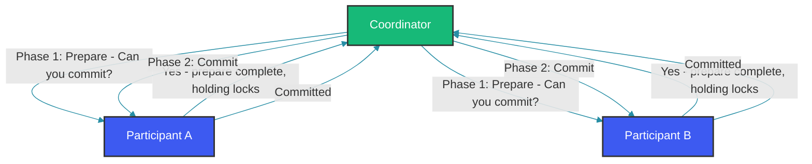

## Overview

Distributed transactions across multiple services or databases require coordination to maintain consistency. Two-Phase Commit (2PC) and Saga are the two primary patterns for achieving this, but they make fundamentally different trade-offs between consistency, availability, and latency.

Understanding these trade-offs is essential for designing reliable distributed systems. This comparison examines both patterns with concrete implementations and discusses when to use each.

## Two-Phase Commit (2PC)

2PC uses a coordinator to ensure all participants either commit or abort a transaction. It provides ACID guarantees across multiple resources.

### How 2PC Works



In phase 1 (prepare), the coordinator asks each participant if they can commit. Participants acquire all necessary locks, perform the work, and write prepare records to their transaction logs — but do not yet commit. They respond "yes" if ready, or "no" if they cannot proceed. In phase 2, if all participants said "yes", the coordinator sends a commit command. If any said "no", it sends an abort command.

### 2PC with JTA

```java
@Component
public class TwoPhaseCommitService {

    @Autowired
    private UserRepository userRepository;
    @Autowired
    private AccountRepository accountRepository;
    @Autowired
    private NotificationRepository notificationRepository;

    @Transactional
    public void createUserWithAccounts(CreateUserRequest request) {
        User user = new User(request.name(), request.email());
        user = userRepository.save(user);

        Account checking = new Account(user.getId(), "CHECKING", request.initialDeposit());
        accountRepository.save(checking);

        Account savings = new Account(user.getId(), "SAVINGS", BigDecimal.ZERO);
        accountRepository.save(savings);

        Notification notification = new Notification(user.getEmail(),
            "Welcome! Your accounts have been created.");
        notificationRepository.save(notification);
    }
}
```

With JTA and XA transactions across multiple databases:

```java
@Configuration
public class XAConfiguration {

    @Bean
    public DataSource dataSource() {
        XADataSource xaDataSource = new MysqlXADataSource();
        xaDataSource.setUrl("jdbc:mysql://localhost:3306/users");
        xaDataSource.setUser("app");
        xaDataSource.setPassword("secret");

        AtomikosDataSourceBean bean = new AtomikosDataSourceBean();
        bean.setXaDataSource(xaDataSource);
        bean.setUniqueResourceName("users_ds");
        bean.setMaxPoolSize(10);
        return bean;
    }

    @Bean
    public DataSource accountDataSource() {
        XADataSource xaDataSource = new PostgresXADataSource();
        xaDataSource.setUrl("jdbc:postgresql://localhost:5432/accounts");
        xaDataSource.setUser("app");
        xaDataSource.setPassword("secret");

        AtomikosDataSourceBean bean = new AtomikosDataSourceBean();
        bean.setXaDataSource(xaDataSource);
        bean.setUniqueResourceName("accounts_ds");
        bean.setMaxPoolSize(10);
        return bean;
    }

    @Bean
    @Primary
    public PlatformTransactionManager transactionManager() {
        JtaTransactionManager tm = new JtaTransactionManager();
        tm.setTransactionManager(userTransactionManager());
        return tm;
    }
}
```

The `@Transactional` annotation on `createUserWithAccounts` spans three databases (users, accounts, notifications). Spring delegates to the JTA transaction manager (Atomikos), which coordinates the two-phase commit across the MySQL and PostgreSQL XA resources. If any database fails to commit, all databases roll back. The `@Autowired` fields simplify the code but would be better as constructor injection in production.

### Limitations of 2PC

- **Blocking protocol**: Participants hold locks during the prepare phase, reducing concurrency.
- **Single point of failure**: If the coordinator crashes after prepare, participants remain blocked.
- **Scalability**: Coordination overhead increases with participants.
- **Availability**: The system becomes unavailable if any participant is unreachable.

## Saga Pattern

Sagas break distributed transactions into a sequence of local transactions with compensating actions for rollback.

### Orchestration Saga

```java
@Component
public class UserRegistrationSaga {

    private final IdentityServiceClient identityClient;
    private final BillingServiceClient billingClient;
    private final NotificationServiceClient notificationClient;

    public UserRegistrationSaga(
            IdentityServiceClient identityClient,
            BillingServiceClient billingClient,
            NotificationServiceClient notificationClient) {
        this.identityClient = identityClient;
        this.billingClient = billingClient;
        this.notificationClient = notificationClient;
    }

    public void registerUser(RegisterUserCommand command) {
        try {
            String userId = identityClient.createIdentity(
                command.email(), command.password());
            String accountId = billingClient.createAccount(
                userId, command.initialDeposit());
            notificationClient.sendWelcome(command.email(), userId);
        } catch (IdentityCreationException e) {
            throw new SagaFailureException("Registration failed at identity step", e);
        } catch (BillingCreationException e) {
            identityClient.deleteIdentity(command.email());
            throw new SagaFailureException("Registration failed at billing step", e);
        } catch (NotificationException e) {
            billingClient.closeAccount(command.email());
            identityClient.deleteIdentity(command.email());
            throw new SagaFailureException("Registration failed at notification step", e);
        }
    }
}
```

In the saga pattern, each step commits independently. If a later step fails, the saga runs compensating actions for all previously completed steps. Here, if billing creation fails, it deletes the created identity. If notification fails, it closes the billing account and deletes the identity. No distributed locks are held — each step's local transaction commits before the next step begins.

### Choreography Saga

```java
@Service
public class IdentityService {

    @Autowired
    private EventPublisher eventPublisher;

    @Transactional
    public String createIdentity(CreateIdentityCommand command) {
        Identity identity = new Identity(command.email(), command.password());
        identityRepository.save(identity);
        eventPublisher.publish(new IdentityCreatedEvent(identity.getId(), identity.getEmail()));
        return identity.getId();
    }

    @Transactional
    public void deleteIdentity(DeleteIdentityCommand command) {
        identityRepository.deleteByEmail(command.email());
    }
}

@Service
public class BillingService {

    @Autowired
    private EventPublisher eventPublisher;

    @EventListener
    @Transactional
    public void onIdentityCreated(IdentityCreatedEvent event) {
        try {
            Account account = new Account(event.userId(), BigDecimal.ZERO);
            accountRepository.save(account);
            eventPublisher.publish(new AccountCreatedEvent(event.userId(), account.getId()));
        } catch (Exception e) {
            eventPublisher.publish(new BillingCreationFailedEvent(event.userId(), event.email()));
        }
    }

    @EventListener
    public void onBillingCreationFailed(BillingCreationFailedEvent event) {
        eventPublisher.publish(new CompensateIdentityEvent(event.email()));
    }
}

@Service
public class CompensationHandler {

    @EventListener
    public void onCompensateIdentity(CompensateIdentityEvent event) {
        identityService.deleteIdentity(new DeleteIdentityCommand(event.email()));
    }
}
```

In choreography, there is no central coordinator. Each service listens for events and performs its own step. If `BillingService` fails to create an account, it publishes a `BillingCreationFailedEvent`, which triggers the `CompensationHandler` to delete the identity. This is more decentralized than orchestration but harder to trace and debug — the flow is implicit in the event wiring.

## Comparison Table

| Aspect | 2PC | Saga |
|--------|-----|------|
| Consistency model | Strong (ACID) | Eventual (BASE) |
| Isolation | Serializable | Relaxed (requires compensation) |
| Locking | Holds locks during prepare | No distributed locks |
| Latency | Higher (coordinator overhead) | Lower (local transactions) |
| Availability | Lower (any participant blocks all) | Higher (participants independent) |
| Complexity | Medium | Medium-High |
| Rollback | Automatic (abort) | Manual (compensation logic) |
| Data visibility | After commit | Immediately visible (risks) |
| Best for | Short, critical operations | Long-running processes |

## When to Use Each

### Use 2PC When

```java
// Financial transaction requiring atomicity
@Transactional
public TransferResult transferMoney(String fromAccount, String toAccount, BigDecimal amount) {
    Account source = accountRepository.findById(fromAccount)
        .orElseThrow(() -> new AccountNotFoundException(fromAccount));
    Account target = accountRepository.findById(toAccount)
        .orElseThrow(() -> new AccountNotFoundException(toAccount));

    source.withdraw(amount);
    target.deposit(amount);

    return TransferResult.success(fromAccount, toAccount, amount);
}
```

A money transfer between two accounts in different databases is a classic 2PC use case. If the withdrawal succeeds but the deposit fails, the system must roll back the withdrawal. The transaction is short (milliseconds) and the cost of inconsistency is high (lost money). 2PC guarantees that either both operations complete or neither does.

### Use Saga When

```java
// Multi-step order requiring eventual consistency
@Component
public class OrderProcessingSaga {

    public void processOrder(Order order) {
        try {
            paymentService.charge(order.getCustomerId(), order.getTotalAmount());
            inventoryService.reserve(order.getProductId(), order.getQuantity());
            shippingService.schedule(order.getId(), order.getAddress());
            notificationService.send(order.getCustomerEmail(), "Order confirmed");
        } catch (PaymentException e) {
            throw new SagaException("Payment failed, no compensation needed");
        } catch (InventoryException e) {
            paymentService.refund(order.getCustomerId(), order.getTotalAmount());
            throw new SagaException("Inventory failed, payment refunded");
        } catch (ShippingException e) {
            paymentService.refund(order.getCustomerId(), order.getTotalAmount());
            inventoryService.release(order.getProductId(), order.getQuantity());
            throw new SagaException("Shipping failed, fully compensated");
        }
    }
}
```

Order processing involves multiple services, some of which may take seconds (payment gateway, shipping carrier). Holding distributed locks for this duration would kill concurrency. A saga compensates on failure: refund the payment if inventory can't be reserved, cancel the shipment if notification fails. The customer sees eventual consistency — their order might show as "processing" for a few seconds while the saga completes.

## Compensating Transaction Design

Effective compensating transactions require careful design:

```java
@Component
public class CompensatingTransactionService {

    public static class BookHotelTxn implements CompensableTransaction<BookingResult> {
        @Override
        public BookingResult execute(BookingRequest request) {
            return hotelBookingService.reserve(request.hotelId(), request.checkIn(), request.checkOut());
        }

        @Override
        public void compensate(BookingResult result) {
            hotelBookingService.cancelReservation(result.reservationId());
        }
    }

    public static class BookFlightTxn implements CompensableTransaction<BookingResult> {
        @Override
        public BookingResult execute(BookingRequest request) {
            return flightBookingService.book(request.flightId(), request.passengerName());
        }

        @Override
        public void compensate(BookingResult result) {
            flightBookingService.cancelBooking(result.reservationId());
        }
    }

    public static class ChargeCardTxn implements CompensableTransaction<PaymentResult> {
        @Override
        public PaymentResult execute(BookingRequest request) {
            return paymentService.charge(request.customerId(), request.totalAmount());
        }

        @Override
        public void compensate(PaymentResult result) {
            paymentService.refund(result.transactionId());
        }
    }
}
```

Each compensable transaction bundles the forward action and its compensating action. The `execute` method returns a result that can be passed to `compensate`. This composable design makes it possible to build a generic saga orchestrator that executes transactions and tracks compensations.

## Common Mistakes

### Mixing 2PC and Saga

```java
// Wrong: Using 2PC for a long-running business process
@Transactional
public void onboardCustomer(OnboardRequest request) {
    identityService.createIdentity(request); // blocks database
    billingService.setupBilling(request); // blocks database
    shippingService.configureShipping(request); // slow HTTP call under transaction
    // Locks held for too long, deadlock risk high
}
```

```java
// Correct: Saga for multi-step process
public void onboardCustomer(OnboardRequest request) {
    sagaOrchestrator.startOnboardingSaga(request);
}
```

### Ignoring Compensation Failures

```java
// Wrong: Compensation can also fail
catch (PaymentException e) {
    inventoryService.release(productId, quantity); // What if this also fails?
}
```

```java
// Correct: Retry or escalate compensation failures
catch (PaymentException e) {
    try {
        inventoryService.release(productId, quantity);
    } catch (Exception releaseError) {
        log.error("Compensation failed, manual intervention required for order: {}", orderId);
        alertService.notifyAdmin("Compensation failure", orderId);
        // Store failed saga state for manual processing
        failedSagaRepository.save(new FailedSaga(orderId, "Inventory release failed"));
    }
}
```

## Best Practices

1. Use 2PC for short-duration operations where strong consistency is legally or financially required.
2. Use Sagas for long-running business processes where availability and scalability matter more than immediate consistency.
3. Design compensating transactions to be idempotent.
4. Implement retry logic with exponential backoff for compensation failures.
5. Monitor saga execution time and alert on stalled sagas.
6. Consider using a saga log for audit and recovery purposes.
7. Avoid mixing both patterns in the same transaction boundary.

## Summary

2PC provides strong consistency at the cost of availability and scalability. Sagas provide high availability and scalability with eventual consistency. The choice depends on your consistency requirements: use 2PC for short, critical operations where atomicity is non-negotiable, and Sagas for long-running business processes where the system must remain available.

## References

- "Distributed Systems" by Andrew S. Tanenbaum
- "Designing Data-Intensive Applications" by Martin Kleppmann
- "Microservices Patterns" by Chris Richardson

Happy Coding
