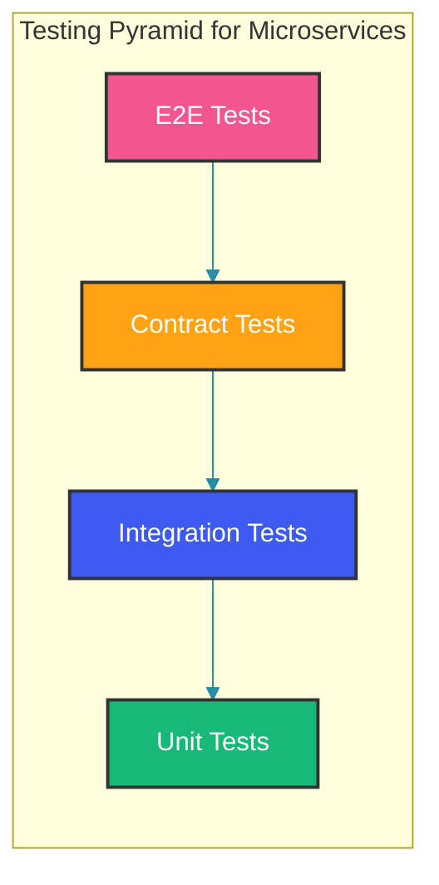

## Overview

Testing microservices requires a multi-layered strategy combining unit, integration, contract, and end-to-end tests. The testing pyramid for microservices emphasizes integration and contract tests more than traditional monolithic applications.

## Testing Pyramid for Microservices



## Unit Tests

### Service Layer Tests

Unit tests for the service layer mock all external dependencies (repositories and clients) to isolate the business logic under test. This test covers the happy path (inventory available → order created), the failure path (inventory unavailable → exception), and pure computation (total calculation).

```java
@ExtendWith(MockitoExtension.class)
class OrderServiceTest {

    @Mock
    private OrderRepository orderRepository;

    @Mock
    private InventoryServiceClient inventoryClient;

    @InjectMocks
    private OrderService orderService;

    @Test
    void shouldCreateOrderWhenInventoryAvailable() {
        OrderRequest request = new OrderRequest("customer-1", List.of(
            new OrderItem("product-1", 2)
        ));

        when(inventoryClient.checkAvailability(any()))
            .thenReturn(new AvailabilityResponse(true));

        when(orderRepository.save(any()))
            .thenReturn(new Order("order-1", "customer-1", BigDecimal.valueOf(100)));

        OrderResponse response = orderService.createOrder(request);

        assertThat(response.getOrderId()).isEqualTo("order-1");
        assertThat(response.getStatus()).isEqualTo("PENDING");
        verify(orderRepository).save(any());
    }

    @Test
    void shouldThrowExceptionWhenInventoryUnavailable() {
        OrderRequest request = new OrderRequest("customer-1", List.of(
            new OrderItem("product-1", 2)
        ));

        when(inventoryClient.checkAvailability(any()))
            .thenReturn(new AvailabilityResponse(false));

        assertThrows(InsufficientInventoryException.class,
            () -> orderService.createOrder(request));

        verify(orderRepository, never()).save(any());
    }

    @Test
    void shouldCalculateTotalCorrectly() {
        Order order = new Order("customer-1", List.of(
            new OrderItem("product-1", 2, BigDecimal.valueOf(50)),
            new OrderItem("product-2", 1, BigDecimal.valueOf(100))
        ));

        BigDecimal total = orderService.calculateTotal(order);

        assertThat(total).isEqualByComparingTo(BigDecimal.valueOf(200));
    }
}
```

### Repository Unit Tests

Repository tests verify that custom queries, constraints, and data access logic work correctly. `@DataJpaTest` starts an embedded database and configures only the JPA infrastructure — faster than a full Spring Boot test but still exercises real SQL against a real database schema.

```java
@DataJpaTest
@AutoConfigureTestDatabase(replace = AutoConfigureTestDatabase.Replace.NONE)
class OrderRepositoryTest {

    @Autowired
    private TestEntityManager entityManager;

    @Autowired
    private OrderRepository orderRepository;

    @Test
    void shouldFindOrdersByCustomerId() {
        Order order1 = new Order("customer-1", BigDecimal.valueOf(100));
        Order order2 = new Order("customer-1", BigDecimal.valueOf(200));
        Order order3 = new Order("customer-2", BigDecimal.valueOf(300));

        entityManager.persist(order1);
        entityManager.persist(order2);
        entityManager.persist(order3);

        List<Order> orders = orderRepository.findByCustomerId("customer-1");

        assertThat(orders).hasSize(2);
    }

    @Test
    void shouldFindOrderByStatus() {
        Order pending = new Order("customer-1", BigDecimal.valueOf(100));
        pending.setStatus(OrderStatus.PENDING);
        Order confirmed = new Order("customer-2", BigDecimal.valueOf(200));
        confirmed.setStatus(OrderStatus.CONFIRMED);

        entityManager.persist(pending);
        entityManager.persist(confirmed);

        List<Order> pendingOrders = orderRepository.findByStatus(OrderStatus.PENDING);

        assertThat(pendingOrders).hasSize(1);
        assertThat(pendingOrders.get(0).getStatus()).isEqualTo(OrderStatus.PENDING);
    }

    @Test
    void shouldReturnEmptyWhenNoOrdersExist() {
        List<Order> orders = orderRepository.findByCustomerId("nonexistent");
        assertThat(orders).isEmpty();
    }
}
```

## Integration Tests with Testcontainers

Integration tests with Testcontainers spin up real infrastructure (PostgreSQL + Kafka) in Docker containers. The test validates the full service flow — database persistence and event publishing — against real dependencies. The `@DynamicPropertySource` override ensures Spring connects to the test containers rather than production databases.

```java
@SpringBootTest
@Testcontainers
class OrderServiceIntegrationTest {

    @Container
    static PostgreSQLContainer<?> postgres = new PostgreSQLContainer<>("postgres:15")
        .withDatabaseName("testdb")
        .withUsername("test")
        .withPassword("test");

    @Container
    static KafkaContainer kafka = new KafkaContainer(
        DockerImageName.parse("confluentinc/cp-kafka:7.5.0")
    );

    @DynamicPropertySource
    static void configureProperties(DynamicPropertyRegistry registry) {
        registry.add("spring.datasource.url", postgres::getJdbcUrl);
        registry.add("spring.datasource.username", postgres::getUsername);
        registry.add("spring.datasource.password", postgres::getPassword);
        registry.add("spring.kafka.bootstrap-servers", kafka::getBootstrapServers);
    }

    @Autowired
    private OrderService orderService;

    @Autowired
    private OrderRepository orderRepository;

    @Test
    void shouldCreateOrderAndPublishEvent() {
        OrderRequest request = new OrderRequest("customer-1", List.of(
            new OrderItem("product-1", 2, BigDecimal.valueOf(50))
        ));

        OrderResponse response = orderService.createOrder(request);

        assertThat(response.getOrderId()).isNotNull();
        assertThat(response.getStatus()).isEqualTo("PENDING");

        Order savedOrder = orderRepository.findById(response.getOrderId());
        assertThat(savedOrder).isPresent();
        assertThat(savedOrder.get().getCustomerId()).isEqualTo("customer-1");
    }

    @Test
    void shouldRollbackOnFailure() {
        // Simulate a failure scenario
        assertThrows(Exception.class, () -> {
            orderService.createOrderWithInvalidData(null);
        });

        // Verify no partial data was saved
        List<Order> allOrders = orderRepository.findAll();
        assertThat(allOrders).isEmpty();
    }
}
```

## WireMock for External Dependencies

WireMock simulates HTTP services that the system-under-test depends on. This test stubs the inventory and payment services, then verifies the order service handles both success and failure scenarios correctly. The `Scenario` API models multi-step retry behavior — first call fails, second call succeeds — without needing a real payment gateway.

```java
@SpringBootTest
@WireMockTest(httpPort = 8089)
class OrderServiceWireMockTest {

    @Autowired
    private OrderService orderService;

    @BeforeEach
    void setup() {
        stubFor(get(urlEqualTo("/api/inventory/product-1/availability"))
            .willReturn(aResponse()
                .withHeader("Content-Type", "application/json")
                .withBody("""
                    {"available": true, "quantity": 100}
                """)
                .withStatus(200)));

        stubFor(post(urlEqualTo("/api/payments/process"))
            .willReturn(aResponse()
                .withHeader("Content-Type", "application/json")
                .withBody("""
                    {"success": true, "paymentId": "pay-123"}
                """)
                .withStatus(200)));
    }

    @Test
    void shouldProcessOrderWithExternalDependencies() {
        OrderRequest request = new OrderRequest("customer-1", List.of(
            new OrderItem("product-1", 2, BigDecimal.valueOf(50))
        ));

        OrderResponse response = orderService.createOrder(request);

        assertThat(response.getStatus()).isEqualTo("CONFIRMED");
    }

    @Test
    void shouldHandleExternalServiceFailure() {
        stubFor(post(urlEqualTo("/api/payments/process"))
            .willReturn(aResponse()
                .withStatus(503)));

        assertThrows(PaymentServiceException.class, () -> {
            orderService.createOrder(new OrderRequest("customer-1", List.of(
                new OrderItem("product-1", 1, BigDecimal.valueOf(50))
            )));
        });
    }

    @Test
    void shouldRetryOnTransientFailure() {
        stubFor(post(urlEqualTo("/api/payments/process"))
            .inScenario("Retry Scenario")
            .whenScenarioStateIs(Scenario.STARTED)
            .willReturn(aResponse().withStatus(503))
            .willSetStateTo("Second Attempt"));

        stubFor(post(urlEqualTo("/api/payments/process"))
            .inScenario("Retry Scenario")
            .whenScenarioStateIs("Second Attempt")
            .willReturn(aResponse()
                .withHeader("Content-Type", "application/json")
                .withBody("""
                    {"success": true, "paymentId": "pay-456"}
                """)
                .withStatus(200)));

        OrderResponse response = orderService.createOrder(
            new OrderRequest("customer-1", List.of(
                new OrderItem("product-1", 1, BigDecimal.valueOf(50))
            ))
        );

        assertThat(response.getStatus()).isEqualTo("CONFIRMED");
    }
}
```

## End-to-End Tests

End-to-end tests validate the full request-response flow through the HTTP layer. `TestRestTemplate` sends real HTTP requests to the embedded server, exercising controllers, validation, serialization, and error handling. Keep E2E tests focused on critical user journeys — too many E2E tests become a maintenance burden.

```java
@SpringBootTest(webEnvironment = SpringBootTest.WebEnvironment.RANDOM_PORT)
@TestMethodOrder(MethodOrderer.OrderAnnotation.class)
class OrderFlowE2ETest {

    @LocalServerPort
    private int port;

    private TestRestTemplate restTemplate = new TestRestTemplate();

    @Test
    @org.junit.jupiter.api.Order(1)
    void shouldCreateOrder() {
        OrderRequest request = new OrderRequest("customer-1", List.of(
            new OrderItem("product-1", 2, BigDecimal.valueOf(50))
        ));

        ResponseEntity<OrderResponse> response = restTemplate.postForEntity(
            "http://localhost:" + port + "/api/orders",
            request,
            OrderResponse.class
        );

        assertThat(response.getStatusCode()).isEqualTo(HttpStatus.CREATED);
        assertThat(response.getBody().getOrderId()).isNotNull();
    }

    @Test
    @org.junit.jupiter.api.Order(2)
    void shouldGetOrder() {
        ResponseEntity<OrderResponse> response = restTemplate.getForEntity(
            "http://localhost:" + port + "/api/orders/{id}",
            OrderResponse.class,
            "order-1"
        );

        assertThat(response.getStatusCode()).isEqualTo(HttpStatus.OK);
        assertThat(response.getBody().getCustomerId()).isEqualTo("customer-1");
    }

    @Test
    @org.junit.jupiter.api.Order(3)
    void shouldReturn404ForNonexistentOrder() {
        ResponseEntity<ErrorResponse> response = restTemplate.getForEntity(
            "http://localhost:" + port + "/api/orders/nonexistent",
            ErrorResponse.class
        );

        assertThat(response.getStatusCode()).isEqualTo(HttpStatus.NOT_FOUND);
    }

    @Test
    @org.junit.jupiter.api.Order(4)
    void shouldValidateRequest() {
        OrderRequest invalidRequest = new OrderRequest(null, null);

        ResponseEntity<ErrorResponse> response = restTemplate.postForEntity(
            "http://localhost:" + port + "/api/orders",
            invalidRequest,
            ErrorResponse.class
        );

        assertThat(response.getStatusCode()).isEqualTo(HttpStatus.BAD_REQUEST);
    }
}
```

## Best Practices

- Follow the testing pyramid: many unit tests, fewer integration tests, minimal E2E tests.
- Use Testcontainers for database and message broker integration tests.
- Use WireMock for simulating external service responses.
- Run integration tests in CI pipeline but not on every commit.
- Use @SpringBootTest with sliced contexts for focused integration tests.
- Implement consumer-driven contract tests for service boundaries.

## Common Mistakes

### Mistake: Too many end-to-end tests

```java
// Wrong - E2E tests are slow and brittle
@Test
void fullSystemTest() {
    // Tests entire system for every scenario
}
```

```java
// Correct - use proper test pyramid
// Unit: 70% of tests
// Integration: 20% of tests
// E2E: 10% of tests - only critical paths
```

### Mistake: Not testing failure scenarios

```java
// Wrong - only happy path
@Test
void shouldCreateOrder() {
    // Only tests successful case
}
```

```java
// Correct - test failures too
@Test
void shouldHandleTimeout() { ... }

@Test
void shouldHandleServiceUnavailable() { ... }

@Test
void shouldHandleInvalidInput() { ... }
```

## Summary

A well-balanced testing strategy for microservices combines unit, integration, contract, and end-to-end tests. Use Testcontainers for realistic dependency testing and WireMock for external service simulation. Focus on testing behavior, not implementation details.

## References

- [Microservices Testing - Martin Fowler](https://martinfowler.com/articles/microservice-testing/)
- [Spring Boot Testing](https://docs.spring.io/spring-boot/reference/testing/index.html)
- [Testcontainers Documentation](https://testcontainers.com/)

Happy Coding
