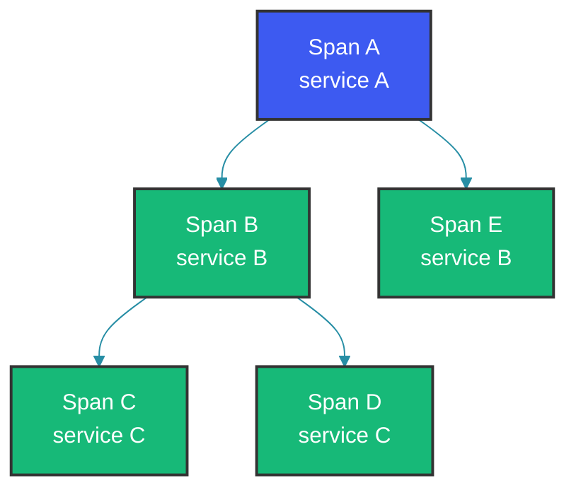

# Distributed Tracing in Microservices

## Overview

In a microservices architecture, a single user request can span multiple services. When something goes wrong, finding the root cause is like finding a needle in a haystack. Distributed tracing provides visibility into the entire request flow, making it possible to identify slow services, track errors, and understand system behavior.

---

## How Distributed Tracing Works

### Core Concepts

```
Trace: A complete end-to-end request flow
Span: An individual operation within the trace
```



Each span contains:
- Trace ID (unique to request)
- Span ID (unique to operation)
- Parent ID (for hierarchy)
- Service name
- Operation name
- Start/end timestamps
- Tags (metadata)

Spring Cloud Sleuth (now part of Micrometer Tracing) automatically instruments common communication patterns — every incoming request creates a trace, and propagated headers (trace ID, span ID) flow through RestTemplate, WebClient, Messaging, and gRPC calls without any manual code.

### Spring Cloud Sleuth Integration

```java
// Add Sleuth to dependencies
// pom.xml
<dependency>
    <groupId>org.springframework.cloud</groupId>
    <artifactId>spring-cloud-starter-sleuth</artifactId>
</dependency>

// application.yml
spring:
  application:
    name: user-service
  sleuth:
    tracer:
      mode: brave
    sampling:
      probability: 0.1  # Sample 10% of requests

// When enabled, Sleuth automatically:
// - Adds trace ID to MDC (Mapped Diagnostic Context)
// - Propagates trace headers across services
// - Creates spans for each operation
```

---

## Real-World Use Cases

### Case 1: Tracing a Cross-Service Request

When Service A calls Service B, Sleuth automatically propagates the trace context via HTTP headers (`X-B3-TraceId`, `X-B3-SpanId`, etc.). The same trace ID appears in both services' logs, allowing operators to correlate events across the entire request lifecycle. The log output shows how the trace ID remains consistent while span IDs change per operation.

```java
// Service A calls Service B
@RestController
public class OrderController {
    
    private static final Logger log = LoggerFactory.getLogger(OrderController.class);
    
    @Autowired
    private RestTemplate restTemplate;
    
    @GetMapping("/orders/{id}")
    public Order getOrder(@PathVariable Long id) {
        // Trace ID automatically in MDC
        log.info("Fetching order: {}", id);
        
        // Call to user service - trace context propagates
        User user = restTemplate.getForObject(
            "http://user-service/api/users/{id}",
            User.class,
            getUserId(id)
        );
        
        log.info("Got user for order: {}", user.getName());
        return new Order(id, user);
    }
}

// In logs, you see:
// 2024-01-15 10:30:00.001 [order-service] INFO  [traceId=abc123,spanId=xyz789] Fetching order: 123
// 2024-01-15 10:30:00.050 [order-service] INFO  [traceId=abc123,spanId=def456] Calling user-service
// 2024-01-15 10:30:00.100 [user-service] INFO  [traceId=abc123,spanId=ghi789] Getting user details
// 2024-01-15 10:30:00.150 [user-service] INFO  [traceId=abc123,spanId=ghi789] User found: John
```

### Case 2: Custom Span Tags

Custom tags add business context to spans — enabling searches like "find all traces where cache.hit=false" or "show me spans for product id X". The `@NewSpan` and `@SpanTag` annotations offer a declarative alternative to programmatic span creation, useful for quick instrumentation without boilerplate.

```java
@Service
public class ProductService {
    
    @Autowired
    private Tracer tracer;
    
    public Product getProduct(Long productId) {
        // Create custom span
        Span span = tracer.startSpan("get-product-from-cache");
        
        try (Tracer.SpanInScope spanInScope = tracer.withSpanInScope(span)) {
            
            // Add custom tags
            span.tag("product.id", productId.toString());
            span.tag("cache.enabled", "true");
            
            Product product = cache.get(productId);
            
            if (product == null) {
                span.tag("cache.hit", "false");
                product = fetchFromDatabase(productId);
                cache.put(productId, product);
            } else {
                span.tag("cache.hit", "true");
            }
            
            return product;
            
        } finally {
            span.end();
        }
    }
}

// Using annotation-based spans
@Service
public class AnnotatedOrderService {
    
    @NewSpan("create-order")
    @SpanTag("order.service")  // Custom tag
    public Order createOrder(CreateOrderRequest request) {
        log.info("Creating order for user: {}", request.getUserId());
        return orderRepository.save(Order.from(request));
    }
    
    @ContinueSpan  // Continues parent span
    public void validateOrder(Order order) {
        // This creates a child span within existing trace
    }
}
```

### Case 3: Zipkin Integration

Zipkin collects and visualizes traces sent by Sleuth. In production, direct HTTP submission can be a bottleneck — switching to Kafka as the transport decouples span reporting from request processing, ensuring tracing overhead doesn't affect application latency even under high throughput.

```java
// Add Zipkin dependencies
// pom.xml
<dependency>
    <groupId>org.springframework.cloud</groupId>
    <artifactId>spring-cloud-starter-zipkin</artifactId>
</dependency>

// application.yml
spring:
  zipkin:
    base-url: http://localhost:9411
    sender:
      type: web  # Send spans via HTTP
  sleuth:
    sampling:
      probability: 1.0  # 100% for debugging

// Using Spring Cloud Stream with Kafka
spring:
  cloud:
    stream:
      bindings:
        sleuth:
          destination: sleuth
  zipkin:
    sender:
      type: kafka
    kafka:
      topic: sleuth-spans
```

### Case 4: Async Tracing

Asynchronous operations break the natural thread-local propagation of trace context. Using `LazyTraceExecutor` wraps the thread pool so that every submitted task inherits the caller's trace context. Without this wrapper, async operations create orphan spans that cannot be correlated to their parent trace.

```java
// Properly propagate trace to async operations
@Service
public class AsyncService {
    
    @Autowired
    private Tracer tracer;
    
    @Async
    public void processAsync(String data) {
        // Automatically continues trace in new thread
        log.info("Processing async with trace: {}", tracer.currentSpan().traceId());
    }
    
    // For manual executor
    @PostConstruct
    public void init() {
        this.executor = Executors.newFixedThreadPool(10);
        // Wrap executor to preserve trace context
        this.tracedExecutor = new LazyTraceExecutor(tracer, executor);
    }
    
    public void processWithTrace(String data) {
        tracedExecutor.submit(() -> {
            log.info("In traced thread: {}", tracer.currentSpan().traceId());
        });
    }
}
```

---

## Production Considerations

### 1. Sampling Strategies

Sampling 100% of traces is expensive — storage and processing costs grow with traffic. A common strategy is to always sample traces that contain errors (they are most valuable for debugging) and sample a low percentage (1-10%) of successful requests for performance trending.

```java
// Custom sampler
@Configuration
public class CustomSamplerConfig {
    
    @Bean
    public Sampler customSampler() {
        // Always sample error traces
        return new Sampler() {
            @Override
            public boolean isSampled(Span span) {
                // Always sample if there's an error tag
                if ("error".equals(span.getTag("error"))) {
                    return true;
                }
                // Sample 5% of normal requests
                return Math.random() < 0.05;
            }
        };
    }
}

// Rate-based sampling in production
@Configuration
public class RateSamplerConfig {
    
    @Bean
    public Sampler alwaysSampler() {
        return Sampler.ALWAYS_SAMPLE;
    }
}
```

### 2. Storing Traces in Elasticsearch

The storage backend determines query performance and retention capabilities. Elasticsearch is the most common choice for Zipkin due to its full-text search and aggregation capabilities. Cassandra is an alternative when write throughput is the primary concern.

```java
// Zipkin with Elasticsearch backend
spring:
  zipkin:
    base-url: http://elasticsearch:9200
    storage:
      type: elasticsearch
      elasticsearch:
        cluster: elasticsearch
        index: zipkin
        hosts: elasticsearch:9200

// Alternative: Use Zipkin Server with Cassandra
zipkin:
  storage:
    type: cassandra
    cassandra:
      keyspace: zipkin
      contact-points: cassandra:9042
```

### 3. Querying Traces

The Zipkin API allows programmatic trace retrieval — useful for automated incident response tools that need to pull related traces when an alert fires. Filtering by service name, time range, and tags enables precise forensic analysis without manual UI navigation.

```java
// Use Zipkin API to query traces
@Service
public class TraceQueryService {
    
    @Autowired
    private ZipkinClient zipkinClient;
    
    public List<Span> findTraces(String serviceName, Long startTs, Long endTs) {
        QueryRequest request = QueryRequest.builder()
            .serviceName(serviceName)
            .startTimestamp(startTs)
            .endTimestamp(endTs)
            .limit(100)
            .build();
        
        return zipkinClient.getTraces(request).getTraces();
    }
    
    public Trace getTrace(String traceId) {
        return zipkinClient.getTrace(traceId);
    }
}
```

---

## Common Mistakes

### Mistake 1: Not Including Trace ID in Logs

```java
// WRONG: Logs without trace context
@Service
public class BadService {
    
    private static final Logger log = LoggerFactory.getLogger(BadService.class);
    
    public void process(String data) {
        log.info("Processing: {}", data);  // No trace ID!
    }
}

// CORRECT: Sleuth adds trace ID to MDC automatically
// Add to log pattern:
logging:
  pattern:
    console: "%d{yyyy-MM-dd HH:mm:ss.SSS} [%thread] %-5level %logger{36} [%X{traceId}/%X{spanId}] - %msg%n"

// Or explicitly include in logs
@Service
public class GoodService {
    
    private static final Logger log = LoggerFactory.getLogger(GoodService.class);
    
    public void process(String data) {
        Span span = tracer.currentSpan();
        log.info("Processing: {} [traceId={}]", data, span != null ? span.traceId() : "none");
    }
}
```

### Mistake 2: Missing Span in Async Methods

```java
// WRONG: Thread pool loses trace context
@Service
public class BadAsyncService {
    
    private ExecutorService executor = Executors.newFixedThreadPool(10);
    
    public void processAsync(String data) {
        executor.submit(() -> {
            // No trace context - different trace!
            log.info("Processing async");
        });
    }
}

// CORRECT: Use trace-aware executor
@Configuration
public class TraceExecutorConfig {
    
    @Bean
    public LazyTraceExecutor traceExecutor(Tracer tracer) {
        return new LazyTraceExecutor(tracer, Executors.newFixedThreadPool(10));
    }
}

@Service
public class GoodAsyncService {
    
    @Autowired
    private Executor traceExecutor;
    
    public void processAsync(String data) {
        traceExecutor.submit(() -> {
            // Trace context preserved
            log.info("Processing async");
        });
    }
}
```

### Mistake 3: Not Tagging Errors

```java
// WRONG: Error not tagged properly
@Service
public class BadErrorHandling {
    
    public void process(String data) {
        try {
            doProcess(data);
        } catch (Exception e) {
            log.error("Error processing", e);
            // Span not marked as error!
            throw e;
        }
    }
}

// CORRECT: Tag errors in span
@Service
public class GoodErrorHandling {
    
    @Autowired
    private Tracer tracer;
    
    public void process(String data) {
        try {
            doProcess(data);
        } catch (Exception e) {
            Span span = tracer.currentSpan();
            if (span != null) {
                span.error(e);  // Tags error in span
            }
            throw e;
        }
    }
}
```

---

## Summary

Distributed tracing is essential for debugging and monitoring microservices:

1. **Trace IDs**: Connect all related operations across services

2. **Span hierarchy**: Shows the call chain and timing

3. **Custom tags**: Add business context to traces

4. **Sampling**: Balance data volume vs. storage costs

5. **Async handling**: Ensure trace context propagates to background tasks

Integrate Zipkin or Jaeger early—retrofitting tracing is much harder than building it in from the start.

---

## References

- [Spring Cloud Sleuth](https://spring.io/projects/spring-cloud-sleuth)
- [Zipkin Documentation](https://zipkin.io/pages/)
- [OpenTelemetry](https://opentelemetry.io/)
- [Baeldung - Spring Cloud Sleuth Guide](https://www.baeldung.com/spring-cloud-sleuth)

---

Happy Coding
