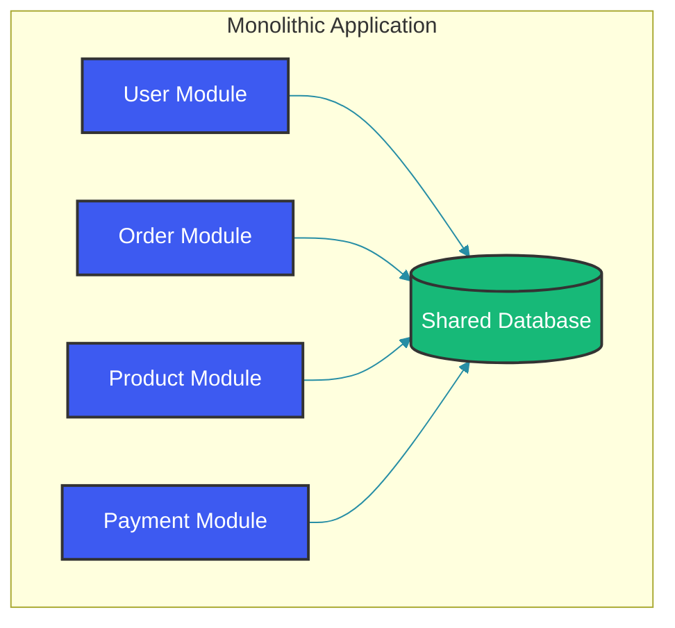
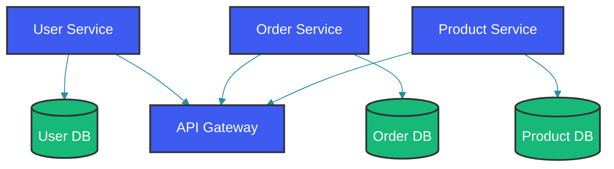
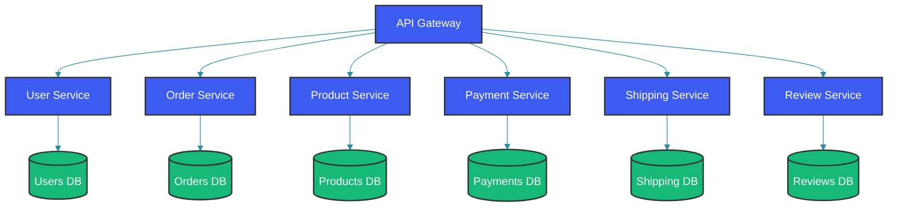

# Microservices Architecture: A Practical Introduction

## Overview

Microservices architecture has become the standard for building large-scale, cloud-native applications. Instead of building a monolithic application as a single unit, you decompose your system into small, independent services that communicate over well-defined APIs.

But microservices aren't a silver bullet. They introduce significant complexity in exchange for benefits that only matter for certain types of applications. Understanding when to use them—and when not to—is just as important as understanding how to implement them.

This guide covers the fundamental concepts, practical implementation patterns, and real-world trade-offs you need to make informed architectural decisions.

---

## How Microservices Architecture Works

### Monolith vs Microservices

A monolith is a single deployable unit containing all application functionality:



Microservices split these into independently deployable services:



### Core Characteristics of Microservices

1. **Independent Deployability**: Each service can be deployed independently without affecting others.

2. **Own Database**: Each service owns its data and exposes it only through APIs—no shared databases.

3. **Business Capability Boundaries**: Services are organized around business domains, not technical layers.

4. **Technology Heterogeneity**: Each service can use different technologies suitable for its specific needs.

---

## Real-World Backend Use Cases

### Case 1: E-commerce Platform Migration

A typical e-commerce monolith can be decomposed into independently deployable services, each owning its own database. The API Gateway becomes the single entry point, routing requests to the appropriate service. Each team owns a service end-to-end — from database to API.

A typical e-commerce monolith broken into microservices:



The code below shows how separate services collaborate — the Order Service calls User Service and Product Service via Feign clients, validating data across service boundaries before persisting an order. Each service operates within its own database transaction.

```java
// User Service - handles user management
@Service
public class UserService {
    
    public User createUser(CreateUserRequest request) {
        // Validate and create user
        User user = User.builder()
            .email(request.getEmail())
            .name(request.getName())
            .build();
        
        return userRepository.save(user);
    }
    
    public boolean isEmailAvailable(String email) {
        return !userRepository.existsByEmail(email);
    }
}

// Order Service - handles orders, references user and product services
@Service
public class OrderService {
    
    @Autowired
    private UserServiceClient userServiceClient;
    
    @Autowired
    private ProductServiceClient productServiceClient;
    
    public Order createOrder(CreateOrderRequest request) {
        // Validate user exists
        User user = userServiceClient.getUser(request.getUserId());
        if (user == null) {
            throw new InvalidOrderException("User not found");
        }
        
        // Validate products
        List<Product> products = productServiceClient.getProducts(request.getProductIds());
        if (products.size() != request.getProductIds().size()) {
            throw new InvalidOrderException("Some products not found");
        }
        
        // Create order
        Order order = Order.builder()
            .userId(request.getUserId())
            .items(mapToOrderItems(products, request.getQuantities()))
            .status(OrderStatus.PENDING)
            .build();
        
        return orderRepository.save(order);
    }
}
```

### Case 2: Team Autonomy in Large Organizations

Microservices enable parallel development by different teams — each team can independently choose its technology stack, deployment cadence, and scaling strategy. The API contract becomes the only coordination point between teams.

```java
// Service A owned by Team A - uses Java/Spring
@Service
public class TeamAService {
    // Team A's business logic
}

// Service B owned by Team B - uses Kotlin/Quarkus
@Service
public class TeamBService {
    // Team B's business logic
}

// Service C owned by Team C - uses Go
type ServiceC struct {
    // Team C's business logic
}

// Each team can:
// - Choose their own technology stack
// - Deploy independently
// - Scale independently
// - Make their own architectural decisions
```

### Case 3: Independent Scaling

Different services have different resource profiles — user service might be CPU-bound while order service is I/O-bound. Kubernetes HorizontalPodAutoscaler allows each service to scale independently based on custom metrics like requests per second, memory usage, or queue depth.

```yaml
# Kubernetes deployment configurations
# Scale user service based on CPU
apiVersion: apps/v1
kind: Deployment
metadata:
  name: user-service
spec:
  replicas: 5  # Can scale independently
---
# Scale product service based on custom metrics
apiVersion: autoscaling/v2
kind: HorizontalPodAutoscaler
metadata:
  name: product-service
spec:
  scaleTargetRef:
    apiVersion: apps/v1
    kind: Deployment
    name: product-service
  minReplicas: 3
  maxReplicas: 20
  metrics:
  - type: Pods
    pods:
      metric:
        name: requests_per_second
      target:
        type: AverageValue
        averageValue: "100"
```

---

## Trade-offs: When to Use Microservices

### Advantages

1. **Team Autonomy**: Different teams can work on different services without interfering.

2. **Technology Flexibility**: Each service can use the best technology for its specific needs.

3. **Independent Scaling**: Scale only the services under heavy load.

4. **Fault Isolation**: Failures in one service don't bring down the entire system.

5. **Faster Deployment**: Deploy individual services without redeploying everything.

### Disadvantages

1. **Operational Complexity**: Managing many services requires sophisticated infrastructure.

2. **Distributed System Challenges**: Network latency, partial failures, data consistency.

3. **Testing Complexity**: Testing distributed systems is more complex than monoliths.

4. **Data Consistency**: Managing transactions across services is challenging.

5. **Initial Development Overhead**: More boilerplate and setup for less complex applications.

### When Microservices Make Sense

| Scenario | Recommendation |
|----------|----------------|
| Large team (50+ developers) | Microservices |
| Small team (5-10 developers) | Monolith |
| Need independent scaling | Microservices |
| Rapid prototyping | Monolith |
| Complex domain with clear boundaries | Microservices |
| Simple CRUD application | Monolith |
| Multiple technology requirements | Microservices |
| Single technology stack sufficient | Monolith |

---

## Production Considerations

### 1. Service Boundaries

Defining service boundaries is the most critical design decision in a microservices architecture. Boundaries should align with business capabilities (Domain-Driven Design bounded contexts), not technical layers. Splitting by technology (e.g., having separate services for repository, mapper, and validator) creates a distributed monolith with none of the benefits.

```java
// BAD: Technology-based boundary (creates unnecessary complexity)
service UserRepository { }    // Too fine-grained
service UserMapper { }        // Should be part of user-service
service UserValidator { }

// GOOD: Business capability boundary
service UserService {
    createUser(User)
    getUser(id)
    updateUser(id, User)
    deleteUser(id)
    authenticate(credentials)
}

service OrderService {
    createOrder(Order)
    getOrder(id)
    listOrders(userId)
    cancelOrder(id)
}
```

### 2. Data Management

Each service owns its data exclusively — no direct database access from other services. The Order Service stores `userId` as a foreign key reference but never queries the User Service's database directly. Any data needed from another service must be fetched through its API, preserving encapsulation and independent evolvability.

```java
// User Service owns user data
@Entity
public class User {
    @Id
    private Long id;
    private String email;
    private String passwordHash;
    private String name;
    // Getters and setters
}

@Repository
public interface UserRepository extends JpaRepository<User, Long> {
    Optional<User> findByEmail(String email);
    boolean existsByEmail(String email);
}

// Order Service references userId but doesn't access user data directly
@Entity
public class Order {
    @Id
    private Long id;
    private Long userId;  // Foreign key reference, not a relationship
    private BigDecimal total;
    private OrderStatus status;
}

@Repository
public interface OrderRepository extends JpaRepository<Order, Long> {
    List<Order> findByUserId(Long userId);
}
```

### 3. Communication Patterns

Choose appropriate communication patterns based on consistency requirements and latency tolerance. Synchronous calls (REST/gRPC) provide immediate responses but couple caller and callee temporally. Asynchronous messaging (events/queues) decouples services at the cost of eventual consistency.

```java
// Synchronous communication (REST/gRPC)
@Service
public class OrderService {
    
    @Autowired
    private RestTemplate restTemplate;
    
    public User getUserDetails(Long userId) {
        // Synchronous - caller waits for response
        return restTemplate.getForObject(
            "http://user-service/api/users/{id}",
            User.class,
            userId
        );
    }
}

// Asynchronous communication (Message Queue)
@Service
public class OrderService {
    
    @Autowired
    private ApplicationEventPublisher eventPublisher;
    
    public void createOrder(Order order) {
        Order saved = orderRepository.save(order);
        
        // Asynchronous - publish event, don't wait
        eventPublisher.publishEvent(new OrderCreatedEvent(saved.getId()));
    }
}

// Event handler in another service
@Component
public class OrderEventHandler {
    
    @EventListener
    public void handleOrderCreated(OrderCreatedEvent event) {
        // Process order created event asynchronously
        notificationService.sendOrderConfirmation(event.getOrderId());
    }
}
```

### 4. Observability

Distributed systems require comprehensive observability across three pillars: logging (with trace IDs), metrics (counters and histograms for service calls), and tracing (end-to-end request flows). Without this investment, debugging production issues in a microservices environment becomes nearly impossible.

```java
// Distributed tracing with Spring Cloud Sleuth
@Configuration
public class TracingConfig {
    
    @Bean
    public Sampler defaultSampler() {
        return Sampler.ALWAYS_SAMPLE;
    }
}

// Add trace ID to all logs
// In application.yml:
spring:
  sleuth:
    log:
      merge:
        strategy: always
    trace:
      id:
        enabled: true

// Log with trace ID automatically included
@Service
public class OrderService {
    
    private static final Logger log = LoggerFactory.getLogger(OrderService.class);
    
    public void processOrder(Long orderId) {
        log.info("Processing order: {}", orderId);
        // Trace ID automatically included in logs
    }
}

// Metrics with Micrometer
@Configuration
public class MetricsConfig {
    
    @Bean
    public MeterRegistry meterRegistry() {
        return new PrometheusMeterRegistry(PrometheusConfig.DEFAULT);
    }
}

@Service
public class MetricsReportingService {
    
    @Autowired
    private MeterRegistry registry;
    
    @PostConstruct
    public void init() {
        // Counters for service calls
        Counter userServiceCalls = Counter.builder("service_calls")
            .tag("service", "user-service")
            .register(registry);
        
        userServiceCalls.increment();
    }
}
```

---

## Common Mistakes

### Mistake 1: Creating Nano-Services

```java
// WRONG: Too many tiny services
@RestController
public class EmailValidationController { }
@Service
public class EmailValidationService { }
@Repository
public class EmailValidationRepository { }

// Each microservice adds overhead - managing, deploying, monitoring
// This creates a distributed monolith, not microservices

// CORRECT: Combine into cohesive service
@Service
public class UserService {  // Contains validation, business logic, persistence
    public boolean isValidEmail(String email) { ... }
    public User createUser(CreateUserRequest request) { ... }
}
```

### Mistake 2: Shared Databases

```java
// WRONG: Multiple services share the same database
@Entity
@Table(name = "users")  // Also used by other services!
public class User { }

@Entity
@Table(name = "orders")  // Multiple services access this table!
public class Order { }

// Creates tight coupling and makes services dependent on each other's data model

// CORRECT: Each service has its own database
// user-service -> users database
// order-service -> orders database
// Communication only through APIs
```

### Mistake 3: Not Handling Distributed Failures

```java
// WRONG: No error handling for service failures
@Service
public class BrokenOrderService {
    
    public Order getOrderWithUser(Long orderId) {
        Order order = orderRepository.findById(orderId).orElseThrow();
        
        // If user-service is down, this throws exception and fails
        User user = userServiceClient.getUser(order.getUserId());
        
        order.setUser(user);
        return order;
    }
}

// CORRECT: Handle failures gracefully
@Service
public class CorrectOrderService {
    
    public Order getOrderWithUser(Long orderId) {
        Order order = orderRepository.findById(orderId).orElseThrow();
        
        try {
            User user = userServiceClient.getUser(order.getUserId());
            order.setUser(user);
        } catch (ServiceUnavailableException e) {
            // Log but don't fail - provide partial data
            log.warn("Could not fetch user details: {}", e.getMessage());
            order.setUserName("Unknown");
        }
        
        return order;
    }
}
```

### Mistake 4: Not Planning for End-to-End Testing

```java
// WRONG: Only testing individual services
@SpringBootTest
class UserServiceTest {
    @Test
    void testCreateUser() { ... }  // Only tests user-service
}

// Only testing individual services doesn't catch distributed system issues

// CORRECT: Include integration tests
@SpringBootTest
class OrderServiceIntegrationTest {
    
    @Test
    void testCreateOrderWithExternalServices() {
        // Start mock servers for user-service, product-service
        // Test full flow
    }
}

// Use TestContainers for realistic integration testing
@Testcontainers
class IntegrationTest {
    
    @Container
    static PostgreSQLContainer<?> postgres = new PostgreSQLContainer<>("postgres:14");
    
    @Container
    static GenericContainer<?> userServiceMock = new GenericContainer<>("mock-user-service")
        .withExposedPorts(8080);
}
```

### Mistake 5: Not Documenting Service Contracts

```java
// WRONG: No documentation of API contracts
@RestController
public class UserController {
    @PostMapping("/user")  // No documentation
    public User create(@RequestBody Map<String, Object> request) { ... }  // Unclear contract
}

// CORRECT: Document APIs with OpenAPI
@RestController
@RequestMapping("/api/users")
@Api(tags = "Users", description = "User management APIs")
public class UserController {
    
    @PostMapping
    @ApiOperation(value = "Create a new user", response = User.class)
    @ApiResponses({
        @ApiResponse(code = 201, message = "User created successfully"),
        @ApiResponse(code = 400, message = "Invalid request"),
        @ApiResponse(code = 409, message = "User already exists")
    })
    public ResponseEntity<User> create(@Valid @RequestBody CreateUserRequest request) {
        // Implementation
    }
}
```

---

## Summary

Microservices architecture is a powerful pattern for large, complex applications, but it introduces significant complexity. Key takeaways:

1. **Start with a monolith**: Most applications don't need microservices initially.

2. **Define clear boundaries**: Services should be organized around business capabilities.

3. **Each service owns its data**: No shared databases; communicate through APIs.

4. **Plan for failures**: Distributed systems fail in distributed ways—handle it.

5. **Invest in observability**: Logging, metrics, and tracing are essential.

6. **Don't over-engineer**: If your team is small or your domain is simple, a monolith is fine.

The decision to adopt microservices should be driven by your team's size, the complexity of your domain, and your operational capabilities—not by trends or hype.

---

## References

- [Building Microservices by Sam Newman](https://www.oreilly.com/library/view/building-microservices-2nd/9781492034018/)
- [Martin Fowler - Microservices](https://martinfowler.com/articles/microservices.html)
- [Spring Cloud Documentation](https://spring.io/projects/spring-cloud)
- [Domain-Driven Design](https://www.domainlanguage.com/ddd/)

---

Happy Coding
