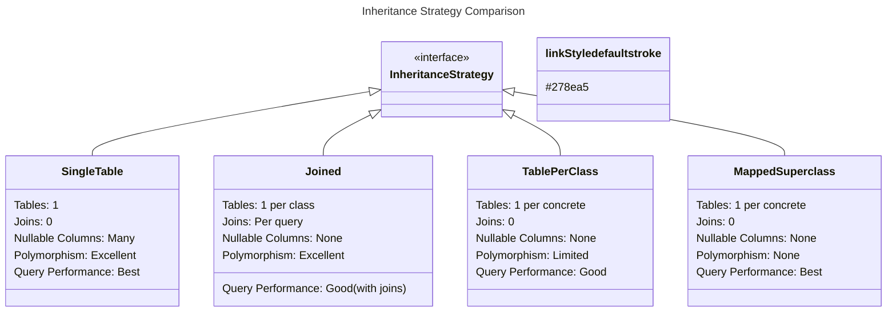

# Inheritance Mapping Strategies in JPA

## Overview

JPA provides four strategies for mapping Java class inheritance hierarchies to database tables. Each strategy has different trade-offs in terms of query performance, schema normalization, and polymorphism support. Choosing the right strategy depends on your data access patterns and schema constraints.

---

## Inheritance Strategies

### Strategy Comparison



Each inheritance strategy makes different trade-offs. **SINGLE_TABLE** maps the entire hierarchy to one table with a discriminator column—fastest for queries but wastes space on nullable columns. **JOINED** normalizes data into separate tables with foreign keys—ideal for data integrity but requires joins for polymorphic queries. **TABLE_PER_CLASS** creates independent tables for each concrete class—no joins but cannot support polymorphic queries efficiently. **MappedSuperclass** is the simplest—each entity has its own independent table with no relationship between them, but there is no polymorphism at all.

---

## 1. Single Table Strategy

### Mapping

In the SINGLE_TABLE strategy, all payment types share the `payments` table. The `payment_type` discriminator column stores `CREDIT_CARD`, `BANK_TRANSFER`, or `DIGITAL_WALLET`. Subclass-specific columns (like `card_number`, `bank_name`) are nullable. Queries that mix payment types (e.g., "all payments over $100") need no joins and are extremely fast. The downside: columns that are NOT NULL in subclasses become nullable in the shared table, and the table can become wide with many subclasses.

```java
@Entity
@Inheritance(strategy = InheritanceType.SINGLE_TABLE)
@DiscriminatorColumn(name = "payment_type", discriminatorType = DiscriminatorType.STRING, length = 20)
@DiscriminatorValue("PAYMENT")
@Table(name = "payments")
public abstract class Payment {

    @Id
    @GeneratedValue(strategy = GenerationType.IDENTITY)
    private Long id;

    @Column(nullable = false)
    private BigDecimal amount;

    @Column(nullable = false)
    private String currency;

    @Column(nullable = false)
    private LocalDateTime paymentDate;

    @Enumerated(EnumType.STRING)
    private PaymentStatus status;
}

@Entity
@DiscriminatorValue("CREDIT_CARD")
public class CreditCardPayment extends Payment {

    @Column(name = "card_number", length = 4)  // Last 4 digits
    private String cardLastFour;

    @Column(length = 50)
    private String cardHolderName;

    @Column(length = 10)
    private String expiryDate;

    @Column(length = 100)
    private String billingAddress;
}

@Entity
@DiscriminatorValue("BANK_TRANSFER")
public class BankTransferPayment extends Payment {

    @Column(length = 50)
    private String bankName;

    @Column(length = 30)
    private String accountNumber;

    @Column(length = 30)
    private String routingNumber;

    @Column(length = 100)
    private String reference;
}

@Entity
@DiscriminatorValue("DIGITAL_WALLET")
public class DigitalWalletPayment extends Payment {

    @Column(length = 30)
    private String walletProvider;

    @Column(length = 100)
    private String walletEmail;
}

// Generated table (single table for all subclasses):
// payments
// - id BIGINT (PK)
// - payment_type VARCHAR(20)  (discriminator)
// - amount DECIMAL
// - currency VARCHAR
// - payment_date TIMESTAMP
// - status VARCHAR
// - card_last_four VARCHAR(4)      (CreditCardPayment)
// - card_holder_name VARCHAR(50)   (CreditCardPayment)
// - expiry_date VARCHAR(10)        (CreditCardPayment)
// - billing_address VARCHAR(100)   (CreditCardPayment)
// - bank_name VARCHAR(50)          (BankTransferPayment)
// - account_number VARCHAR(30)     (BankTransferPayment)
// - routing_number VARCHAR(30)     (BankTransferPayment)
// - reference VARCHAR(100)         (BankTransferPayment)
// - wallet_provider VARCHAR(30)    (DigitalWalletPayment)
// - wallet_email VARCHAR(100)      (DigitalWalletPayment)
```

### Repository and Queries

SINGLE_TABLE excels at polymorphic queries. Calling `paymentRepository.findAll()` generates a simple `SELECT * FROM payments` with no joins. However, type-specific queries like "find credit card payments with last four digits XXXX" require a separate JPQL query scoped to the subclass. Spring Data JPA handles this correctly when the return type is `CreditCardPayment`.

```java
@Repository
public interface PaymentRepository extends JpaRepository<Payment, Long> {

    List<Payment> findByStatus(PaymentStatus status);

    // Polymorphic queries - Spring Data JPA handles this automatically
    List<Payment> findByAmountGreaterThan(BigDecimal amount);

    // Type-specific queries
    @Query("SELECT c FROM CreditCardPayment c WHERE c.cardLastFour = :lastFour")
    List<CreditCardPayment> findByCardLastFour(@Param("lastFour") String lastFour);
}

@Service
public class PaymentService {

    private final PaymentRepository paymentRepository;

    @Transactional(readOnly = true)
    public void processPaymentReport() {
        // Single query retrieves all payment types
        List<Payment> allPayments = paymentRepository.findAll();

        // Instance type checking
        for (Payment payment : allPayments) {
            if (payment instanceof CreditCardPayment ccp) {
                processCreditCard(ccp);
            } else if (payment instanceof BankTransferPayment btp) {
                processBankTransfer(btp);
            } else if (payment instanceof DigitalWalletPayment dwp) {
                processDigitalWallet(dwp);
            }
        }
    }

    @Transactional
    public Payment createPayment(PaymentRequest request) {
        Payment payment = switch (request.getMethod()) {
            case CREDIT_CARD -> {
                CreditCardPayment cc = new CreditCardPayment();
                cc.setCardLastFour(request.getCardLastFour());
                cc.setCardHolderName(request.getCardHolderName());
                cc.setExpiryDate(request.getExpiryDate());
                yield cc;
            }
            case BANK_TRANSFER -> {
                BankTransferPayment bt = new BankTransferPayment();
                bt.setBankName(request.getBankName());
                bt.setAccountNumber(request.getAccountNumber());
                yield bt;
            }
            case DIGITAL_WALLET -> {
                DigitalWalletPayment dw = new DigitalWalletPayment();
                dw.setWalletProvider(request.getWalletProvider());
                dw.setWalletEmail(request.getWalletEmail());
                yield dw;
            }
        };

        payment.setAmount(request.getAmount());
        payment.setCurrency(request.getCurrency());
        payment.setPaymentDate(LocalDateTime.now());
        payment.setStatus(PaymentStatus.PENDING);

        return paymentRepository.save(payment);
    }
}
```

---

## 2. Joined Strategy

### Mapping

JOINED maps each class to its own table. The base `accounts` table stores shared columns, and subclass tables (`savings_accounts`, `checking_accounts`, `investment_accounts`) store subclass-specific columns. A `@PrimaryKeyJoinColumn` links each subclass row to its base row via a shared primary key. This is the most normalized strategy—no nullable columns—but polymorphic queries require `LEFT JOIN` across all subclass tables, which can be expensive with many subclasses.

```java
@Entity
@Inheritance(strategy = InheritanceType.JOINED)
@DiscriminatorColumn(name = "account_type")
@Table(name = "accounts")
public abstract class Account {

    @Id
    @GeneratedValue(strategy = GenerationType.IDENTITY)
    private Long id;

    @Column(nullable = false, unique = true)
    private String accountNumber;

    @Column(nullable = false)
    private String ownerName;

    @Column(nullable = false)
    private BigDecimal balance;

    @Column(nullable = false)
    private LocalDateTime openedDate;
}

@Entity
@PrimaryKeyJoinColumn(name = "account_id")
@Table(name = "savings_accounts")
public class SavingsAccount extends Account {

    @Column(nullable = false)
    private BigDecimal interestRate;

    @Column(nullable = false)
    private LocalDateTime interestPaymentDate;

    @Column(nullable = false)
    private Boolean autoRenew;
}

@Entity
@PrimaryKeyJoinColumn(name = "account_id")
@Table(name = "checking_accounts")
public class CheckingAccount extends Account {

    @Column(nullable = false)
    private BigDecimal overdraftLimit;

    @Column(nullable = false)
    private BigDecimal monthlyFee;

    private Integer freeTransactions;
}

@Entity
@PrimaryKeyJoinColumn(name = "account_id")
@Table(name = "investment_accounts")
public class InvestmentAccount extends Account {

    @Column(nullable = false)
    private String portfolioType;

    @Column(nullable = false)
    private BigDecimal riskLevel;

    @ElementCollection
    @CollectionTable(name = "investment_holdings", joinColumns = @JoinColumn(name = "account_id"))
    private List<Holding> holdings;
}

// Generated tables:
// accounts (base)
// - id BIGINT (PK)
// - account_number VARCHAR (unique)
// - owner_name VARCHAR
// - balance DECIMAL
// - opened_date TIMESTAMP
// - account_type VARCHAR (discriminator)
//
// savings_accounts
// - account_id BIGINT (PK, FK -> accounts.id)
// - interest_rate DECIMAL
// - interest_payment_date TIMESTAMP
// - auto_renew BOOLEAN
//
// checking_accounts
// - account_id BIGINT (PK, FK -> accounts.id)
// - overdraft_limit DECIMAL
// - monthly_fee DECIMAL
// - free_transactions INT
//
// investment_accounts
// - account_id BIGINT (PK, FK -> accounts.id)
// - portfolio_type VARCHAR
// - risk_level DECIMAL
```

### Performance Considerations

The JOINED strategy trades storage normalization for query complexity. A polymorphic query on `Account` generates a `LEFT JOIN` for every subclass table, even though most rows only match one subclass. Type-specific queries (e.g., `findHighInterestAccounts`) are more efficient because they only join the base table with the relevant subclass table. For hierarchies with more than 3-4 subclasses, the join overhead can become significant.

```java
@Service
public class AccountService {

    private final AccountRepository accountRepository;

    @Transactional(readOnly = true)
    public BigDecimal getTotalBalance() {
        // With JOINED strategy, polymorphic queries require joins
        // SELECT * FROM accounts
        // LEFT JOIN savings_accounts ON ...
        // LEFT JOIN checking_accounts ON ...
        // LEFT JOIN investment_accounts ON ...

        List<Account> accounts = accountRepository.findAll();
        return accounts.stream()
            .map(Account::getBalance)
            .reduce(BigDecimal.ZERO, BigDecimal::add);
    }

    @Transactional(readOnly = true)
    public <T extends Account> List<T> getByType(Class<T> type) {
        // Type-specific queries only join the specific subclass table
        // SELECT a.*, s.* FROM accounts a
        // JOIN savings_accounts s ON a.id = s.account_id
        // WHERE a.account_type = 'SAVINGS'
        return accountRepository.findByType(type);
    }
}

@Repository
public interface AccountRepository extends JpaRepository<Account, Long> {

    @Query("SELECT s FROM SavingsAccount s WHERE s.interestRate > :rate")
    List<SavingsAccount> findHighInterestAccounts(@Param("rate") BigDecimal rate);

    <T extends Account> List<T> findByType(Class<T> type);
}
```

---

## 3. Table Per Class Strategy

### Mapping

TABLE_PER_CLASS creates a separate, independent table for each concrete subclass. Each table contains columns for both the base class and the subclass. This eliminates the need for joins (excellent performance for type-specific queries) but breaks polymorphic relationships—you cannot have a `@OneToMany` to the base class because there is no shared table for a foreign key to reference. Polymorphic queries require Hibernate to generate `UNION ALL` queries across all subclass tables, which becomes expensive as the number of subclasses grows.

```java
@Entity
@Inheritance(strategy = InheritanceType.TABLE_PER_CLASS)
public abstract class Vehicle {

    @Id
    @GeneratedValue(strategy = GenerationType.TABLE, generator = "vehicle_gen")
    @TableGenerator(name = "vehicle_gen", initialValue = 1000, allocationSize = 50)
    private Long id;

    @Column(nullable = false)
    private String manufacturer;

    @Column(nullable = false)
    private String model;

    @Column(nullable = false)
    private Integer year;

    @Column(nullable = false)
    private BigDecimal price;
}

@Entity
@Table(name = "cars")
public class Car extends Vehicle {

    @Column(nullable = false)
    private Integer doors;

    @Column(nullable = false)
    private String bodyType;

    private Boolean sunroof;
}

@Entity
@Table(name = "motorcycles")
public class Motorcycle extends Vehicle {

    @Column(nullable = false)
    private String type;

    @Column(nullable = false)
    private Integer engineCC;

    private Boolean hasABS;
}

@Entity
@Table(name = "trucks")
public class Truck extends Vehicle {

    @Column(nullable = false)
    private Double loadCapacityTons;

    @Column(nullable = false)
    private Integer axles;

    private Boolean hasTrailerHitch;
}

// Generated tables (no shared base table, each concrete class has its own):
// cars
// - id BIGINT (PK)
// - manufacturer VARCHAR
// - model VARCHAR
// - year INT
// - price DECIMAL
// - doors INT
// - body_type VARCHAR
// - sunroof BOOLEAN
//
// motorcycles
// - id BIGINT (PK)
// - manufacturer VARCHAR
// - model VARCHAR
// - year INT
// - price DECIMAL
// - type VARCHAR
// - engine_cc INT
// - has_abs BOOLEAN
//
// trucks
// - id BIGINT (PK)
// - manufacturer VARCHAR
// - model VARCHAR
// - year INT
// - price DECIMAL
// - load_capacity_tons DOUBLE
// - axles INT
// - has_trailer_hitch BOOLEAN
```

---

## 4. MappedSuperclass Strategy

### Mapping

`@MappedSuperclass` is not technically an inheritance strategy—it simply maps the superclass's fields into each subclass's table without any database-level relationship between them. `Invoice` and `Contract` both get their own independent tables containing the fields from `BaseDocument` plus their own fields. There is no discriminator, no join, and no polymorphic query support. This is the right choice when you only want to share common field definitions (like `createdAt`, `updatedAt`, `version`) without modeling an "is-a" relationship.

```java
@MappedSuperclass
public abstract class BaseDocument {

    @Id
    @GeneratedValue(strategy = GenerationType.SEQUENCE)
    private Long id;

    @Column(nullable = false, updatable = false)
    @CreationTimestamp
    private Instant createdAt;

    @UpdateTimestamp
    private Instant updatedAt;

    @Version
    private Long version;

    @Column(updatable = false)
    private String createdBy;

    private String updatedBy;
}

@Entity
@Table(name = "invoices")
public class Invoice extends BaseDocument {

    @Column(nullable = false, unique = true)
    private String invoiceNumber;

    @Column(nullable = false)
    private BigDecimal totalAmount;

    @Enumerated(EnumType.STRING)
    private InvoiceStatus status;

    @ManyToOne(fetch = FetchType.LAZY)
    @JoinColumn(name = "customer_id")
    private Customer customer;
}

@Entity
@Table(name = "contracts")
public class Contract extends BaseDocument {

    @Column(nullable = false, unique = true)
    private String contractNumber;

    @Column(nullable = false)
    private LocalDate startDate;

    @Column(nullable = false)
    private LocalDate endDate;

    @Column(length = 5000)
    private String terms;

    @Enumerated(EnumType.STRING)
    private ContractStatus status;
}

// Each entity has its own completely independent table
// No relationship between Invoice and Contract tables
// Both inherit common fields but there's no polymorphic query
//
// invoices
// - id BIGINT (PK)
// - invoice_number VARCHAR (unique)
// - total_amount DECIMAL
// - status VARCHAR
// - customer_id BIGINT (FK)
// - created_at TIMESTAMP
// - updated_at TIMESTAMP
// - version BIGINT
// - created_by VARCHAR
// - updated_by VARCHAR
//
// contracts
// - id BIGINT (PK)
// - contract_number VARCHAR (unique)
// - start_date DATE
// - end_date DATE
// - terms VARCHAR(5000)
// - status VARCHAR
// - created_at TIMESTAMP
// - updated_at TIMESTAMP
// - version BIGINT
// - created_by VARCHAR
// - updated_by VARCHAR
```

---

## Best Practices

1. **SINGLE_TABLE for simple hierarchies**: Best performance, nullable columns
2. **JOINED for normalized data**: No nulls, but requires joins
3. **TABLE_PER_CLASS for independent tables**: No polymorphic queries needed
4. **MappedSuperclass for common fields**: No polymorphism needed
5. **Use discriminator columns**: Always include for debugging
6. **Index discriminator column**: Improve query performance
7. **Consider depth of hierarchy**: Deep hierarchies perform poorly with JOINED
8. **Avoid TABLE_PER_CLASS with polymorphic queries**: UNION queries are expensive
9. **Use @DiscriminatorOptions**: Control discriminator inclusion in queries
10. **Test performance with realistic data volume**

```java
// Control discriminator visibility
@Entity
@DiscriminatorOptions(force = true)  // Always include discriminator in queries
public abstract class Payment { ... }
```

---

## Common Mistakes

### Mistake 1: Deep Hierarchy with JOINED Strategy

Each additional level in a JOINED hierarchy adds another `LEFT JOIN` to polymorphic queries. With 4+ levels, the query can involve dozens of joins, severely degrading performance. For deep hierarchies, prefer SINGLE_TABLE.

```java
// WRONG: 4+ level JOINED hierarchy
// Each polymorphic query joins all subclass tables
// Performance degrades with each level

// CORRECT: Limit hierarchy to 2-3 levels with JOINED
// Use SINGLE_TABLE for deeper hierarchies
```

### Mistake 2: TABLE_PER_CLASS with Polymorphic Queries

Querying the base class with TABLE_PER_CLASS forces Hibernate to generate a `UNION ALL` across all subclass tables. With many subclasses and large tables, this is one of the most expensive query patterns in Hibernate.

```java
// WRONG: Polymorphic query with TABLE_PER_CLASS
// Hibernate generates UNION across all subclass tables
// Very expensive with many subclasses

// CORRECT: Query specific subclass directly
repo.findByType(SavingsAccount.class);
```

### Mistake 3: Not Accounting for Null Columns

In SINGLE_TABLE, columns from subclasses become nullable in the shared table. If you need `NOT NULL` constraints on subclass-specific columns, use JOINED instead.

```java
// WRONG: No nullable=false on shared columns
// SINGLE_TABLE creates many nullable columns

// CORRECT: Add NOT NULL constraints where appropriate
// Use JOINED when nullability is a concern
```

---

## Summary

1. SINGLE_TABLE: One table per hierarchy, best performance, nullable columns
2. JOINED: One table per class, normalized, polymorphic queries with joins
3. TABLE_PER_CLASS: One table per concrete class, no polymorphic queries
4. MappedSuperclass: Each entity has independent table, no polymorphism
5. SINGLE_TABLE is best for simple, query-heavy hierarchies
6. JOINED is best for data integrity and normalized schemas
7. Avoid TABLE_PER_CLASS with polymorphic queries
8. Test hierarchy performance with production-like data volumes

---

## References

- [JPA Inheritance Mapping](https://jakarta.ee/specifications/persistence/3.1/jakarta-persistence-spec-3.1#a9988)
- [Hibernate Inheritance](https://docs.jboss.org/hibernate/orm/6.2/userguide/html_single/Hibernate_User_Guide.html#entity-inheritance)
- [Inheritance Strategy Performance](https://www.baeldung.com/jpa-inheritance)
- [Discriminator Columns](https://docs.jboss.org/hibernate/orm/6.2/userguide/html_single/Hibernate_User_Guide.html#entity-discriminator)

Happy Coding
