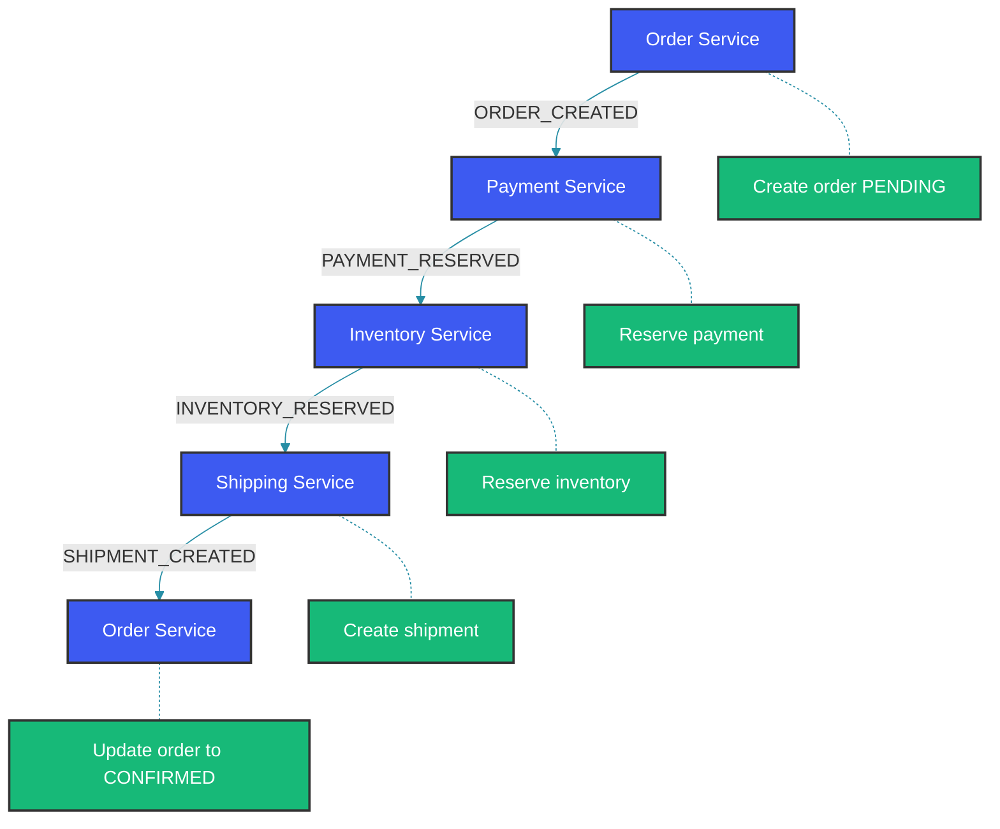

## Overview

The saga pattern manages distributed transactions across microservices through a sequence of local transactions. In the choreography-based approach, services communicate via events without a central coordinator. Each service executes its local transaction and emits events that trigger the next service.

## Saga Flow Example: Order Processing

An order saga involves Order Service, Payment Service, Inventory Service, and Shipping Service working together. The flow below shows how events cascade through the services: Order Service creates a pending order and emits `ORDER_CREATED`, which triggers Payment Service to reserve payment and emit `PAYMENT_RESERVED`, and so on. If any step fails, compensation events roll back the preceding steps.



## Event Definitions

Each event type represents a successful step in the saga. Events carry the `orderId` for correlation across services — every event related to the same order instance shares this ID. The `timestamp` field allows ordering and deduplication. Events are immutable: once emitted, they represent a fact that cannot be undone (the compensation mechanism handles rollback separately).

```java
public class OrderCreatedEvent {
    private String orderId;
    private String customerId;
    private BigDecimal amount;
    private List<OrderItem> items;
    private String timestamp;
}

public class PaymentReservedEvent {
    private String orderId;
    private String paymentId;
    private BigDecimal amount;
    private String timestamp;
}

public class InventoryReservedEvent {
    private String orderId;
    private List<ItemReservation> reservations;
    private String timestamp;
}

public class ShipmentCreatedEvent {
    private String orderId;
    private String trackingId;
    private String timestamp;
}
```

## Order Service

The `OrderSagaService` initiates the saga by creating a pending order and publishing `OrderCreatedEvent`. It then listens for subsequent events to advance the order through its lifecycle. When it receives `PaymentReservedEvent`, it updates the order's payment ID and status. On `ShipmentCreatedEvent`, the order is marked CONFIRMED. If a `CompensationEvent` arrives (from any downstream service failure), the order is cancelled with the provided reason. The order service acts as both the saga initiator and the final status tracker.

```java
@Component
public class OrderSagaService {

    @Autowired
    private OrderRepository orderRepository;

    @Autowired
    private KafkaTemplate<String, Object> kafkaTemplate;

    @Transactional
    public Order createOrder(OrderRequest request) {
        Order order = new Order(request.getCustomerId(), request.getItems());
        order.setStatus(OrderStatus.PENDING);
        order = orderRepository.save(order);

        OrderCreatedEvent event = new OrderCreatedEvent();
        event.setOrderId(order.getId());
        event.setCustomerId(order.getCustomerId());
        event.setAmount(order.getTotalAmount());
        event.setItems(order.getItems());
        event.setTimestamp(Instant.now().toString());

        kafkaTemplate.send("order-events", order.getId(), event);
        return order;
    }

    @KafkaListener(topics = "payment-events", groupId = "order-service")
    public void onPaymentReserved(PaymentReservedEvent event) {
        Order order = orderRepository.findById(event.getOrderId()).orElseThrow();
        order.setPaymentId(event.getPaymentId());
        order.setStatus(OrderStatus.PAYMENT_RESERVED);
        orderRepository.save(order);
    }

    @KafkaListener(topics = "inventory-events", groupId = "order-service")
    public void onInventoryReserved(InventoryReservedEvent event) {
        Order order = orderRepository.findById(event.getOrderId()).orElseThrow();
        order.setStatus(OrderStatus.INVENTORY_RESERVED);
        orderRepository.save(order);
    }

    @KafkaListener(topics = "shipping-events", groupId = "order-service")
    public void onShipmentCreated(ShipmentCreatedEvent event) {
        Order order = orderRepository.findById(event.getOrderId()).orElseThrow();
        order.setTrackingId(event.getTrackingId());
        order.setStatus(OrderStatus.CONFIRMED);
        orderRepository.save(order);
    }

    @KafkaListener(topics = "saga-compensation-events", groupId = "order-service")
    public void onCompensation(CompensationEvent event) {
        Order order = orderRepository.findById(event.getOrderId()).orElseThrow();
        order.setStatus(OrderStatus.CANCELLED);
        order.setCancellationReason(event.getReason());
        orderRepository.save(order);
    }
}
```

## Payment Service

The `PaymentSagaService` listens for `ORDER_CREATED` events on the `order-events` topic. On receiving one, it reserves the payment amount and publishes `PAYMENT_RESERVED` to continue the saga. If payment fails (e.g., insufficient funds), it publishes a `CompensationEvent` with `step="payment"`, which triggers rollback of any preceding steps (in this case, just cancelling the order). It also listens for compensation events — if a later step fails, the payment service releases the reserved payment.

```java
@Component
public class PaymentSagaService {

    @Autowired
    private PaymentRepository paymentRepository;

    @Autowired
    private KafkaTemplate<String, Object> kafkaTemplate;

    @KafkaListener(topics = "order-events", groupId = "payment-service")
    public void onOrderCreated(OrderCreatedEvent event) {
        try {
            Payment payment = new Payment();
            payment.setOrderId(event.getOrderId());
            payment.setAmount(event.getAmount());
            payment.setStatus(PaymentStatus.RESERVED);
            payment = paymentRepository.save(payment);

            PaymentReservedEvent reservedEvent = new PaymentReservedEvent();
            reservedEvent.setOrderId(event.getOrderId());
            reservedEvent.setPaymentId(payment.getId());
            reservedEvent.setAmount(event.getAmount());
            reservedEvent.setTimestamp(Instant.now().toString());

            kafkaTemplate.send("payment-events", event.getOrderId(), reservedEvent);
        } catch (Exception e) {
            // Compensate: emit payment failed event
            CompensationEvent compensation = new CompensationEvent();
            compensation.setOrderId(event.getOrderId());
            compensation.setReason("PAYMENT_FAILED: " + e.getMessage());
            compensation.setStep("payment");
            kafkaTemplate.send("saga-compensation-events", event.getOrderId(), compensation);
        }
    }

    @KafkaListener(topics = "saga-compensation-events", groupId = "payment-service")
    public void onCompensation(CompensationEvent event) {
        if ("payment".equals(event.getStep()) || event.isGlobalRollback()) {
            Payment payment = paymentRepository.findByOrderId(event.getOrderId());
            if (payment != null && payment.getStatus() == PaymentStatus.RESERVED) {
                payment.setStatus(PaymentStatus.RELEASED);
                paymentRepository.save(payment);
            }
        }
    }
}
```

## Inventory Service

The `InventorySagaService` listens for `PAYMENT_RESERVED` events — it runs after payment succeeds but before shipping. It checks each item's available quantity against the order's requested quantity. If sufficient stock exists, it reserves the items (incrementing `reservedQuantity`) and publishes `INVENTORY_RESERVED`. On stock shortage, it emits a compensation event. The compensation listener releases reserved inventory if the saga fails at the shipping step or if a global rollback is triggered.

```java
@Component
public class InventorySagaService {

    @Autowired
    private InventoryRepository inventoryRepository;

    @Autowired
    private KafkaTemplate<String, Object> kafkaTemplate;

    @KafkaListener(topics = "payment-events", groupId = "inventory-service")
    public void onPaymentReserved(PaymentReservedEvent event) {
        try {
            List<ItemReservation> reservations = new ArrayList<>();
            for (OrderItem item : event.getItems()) {
                InventoryItem inventoryItem = inventoryRepository
                    .findByProductId(item.getProductId()).orElseThrow();
                if (inventoryItem.getAvailableQuantity() < item.getQuantity()) {
                    throw new InsufficientInventoryException(
                        "Not enough stock for product: " + item.getProductId());
                }
                inventoryItem.setReservedQuantity(
                    inventoryItem.getReservedQuantity() + item.getQuantity());
                inventoryRepository.save(inventoryItem);
                reservations.add(new ItemReservation(item.getProductId(), item.getQuantity()));
            }

            InventoryReservedEvent reservedEvent = new InventoryReservedEvent();
            reservedEvent.setOrderId(event.getOrderId());
            reservedEvent.setReservations(reservations);
            kafkaTemplate.send("inventory-events", event.getOrderId(), reservedEvent);
        } catch (Exception e) {
            CompensationEvent compensation = new CompensationEvent();
            compensation.setOrderId(event.getOrderId());
            compensation.setReason("INVENTORY_FAILED: " + e.getMessage());
            compensation.setStep("inventory");
            kafkaTemplate.send("saga-compensation-events", event.getOrderId(), compensation);
        }
    }

    @KafkaListener(topics = "saga-compensation-events", groupId = "inventory-service")
    public void onCompensation(CompensationEvent event) {
        if ("inventory".equals(event.getStep()) || event.isGlobalRollback()) {
            // Release reserved inventory
            List<ItemReservation> reservations = inventoryRepository
                .findReservationsByOrderId(event.getOrderId());
            for (ItemReservation reservation : reservations) {
                InventoryItem item = inventoryRepository
                    .findByProductId(reservation.getProductId()).orElseThrow();
                item.setReservedQuantity(
                    item.getReservedQuantity() - reservation.getQuantity());
                inventoryRepository.save(item);
            }
        }
    }
}
```

## Shipping Service

The `ShippingSagaService` listens for `INVENTORY_RESERVED` events — it's the final step in the forward saga flow. It creates a shipment record with a generated tracking ID and publishes `SHIPMENT_CREATED`, which causes Order Service to mark the order as CONFIRMED. If shipping creation fails (e.g., invalid address), it emits a compensation that cascades back through payment and inventory to roll back all preceding steps.

```java
@Component
public class ShippingSagaService {

    @Autowired
    private ShippingRepository shippingRepository;

    @Autowired
    private KafkaTemplate<String, Object> kafkaTemplate;

    @KafkaListener(topics = "inventory-events", groupId = "shipping-service")
    public void onInventoryReserved(InventoryReservedEvent event) {
        try {
            Shipment shipment = new Shipment();
            shipment.setOrderId(event.getOrderId());
            shipment.setTrackingId(generateTrackingId());
            shipment.setStatus(ShipmentStatus.PENDING);
            shipment = shippingRepository.save(shipment);

            ShipmentCreatedEvent createdEvent = new ShipmentCreatedEvent();
            createdEvent.setOrderId(event.getOrderId());
            createdEvent.setTrackingId(shipment.getTrackingId());
            kafkaTemplate.send("shipping-events", event.getOrderId(), createdEvent);
        } catch (Exception e) {
            CompensationEvent compensation = new CompensationEvent();
            compensation.setOrderId(event.getOrderId());
            compensation.setReason("SHIPPING_FAILED: " + e.getMessage());
            compensation.setStep("shipping");
            kafkaTemplate.send("saga-compensation-events", event.getOrderId(), compensation);
        }
    }

    @Transactional
    public void cancelShipment(String orderId) {
        Shipment shipment = shippingRepository.findByOrderId(orderId);
        if (shipment != null) {
            shipment.setStatus(ShipmentStatus.CANCELLED);
            shippingRepository.save(shipment);
        }
    }
}
```

## Compensation Event

The `CompensationEvent` carries information needed for rollback. The `step` field identifies which step failed, allowing downstream services to decide whether they need to compensate. The `globalRollback` flag signals that all preceding services should roll back regardless of which step failed. The static factory method `globalRollback()` makes it easy to create a compensation that cascades through all services.

```java
public class CompensationEvent {
    private String orderId;
    private String reason;
    private String step;
    private boolean globalRollback;
    private String timestamp;

    public CompensationEvent() {
        this.timestamp = Instant.now().toString();
    }

    public static CompensationEvent globalRollback(String orderId, String reason) {
        CompensationEvent event = new CompensationEvent();
        event.setOrderId(orderId);
        event.setReason(reason);
        event.setGlobalRollback(true);
        return event;
    }
}
```

## Best Practices

- Design each service to be idempotent for handling duplicate events.
- Implement compensating transactions for every transactional operation.
- Use outbox pattern to ensure atomic event publishing with database changes.
- Monitor saga execution with tracing and logging.
- Set up dead letter queues for failed events in each saga step.
- Use correlation IDs to track saga instances across services.

## Common Mistakes

### Mistake: Not handling duplicate events

In at-least-once delivery, the same event may arrive multiple times. If your saga service isn't idempotent, a duplicate `PAYMENT_RESERVED` event could process payment twice. Always check if the operation was already performed before executing, using a unique transaction ID or business key.

```java
// Wrong - duplicate events cause double processing
@KafkaListener(topics = "payment-events")
public void onPaymentReserved(PaymentReservedEvent event) {
    reservePayment(event.getOrderId(), event.getAmount());
}
```

```java
// Correct - idempotent processing with deduplication
@KafkaListener(topics = "payment-events")
public void onPaymentReserved(PaymentReservedEvent event) {
    if (!paymentRepository.existsByOrderId(event.getOrderId())) {
        reservePayment(event.getOrderId(), event.getAmount());
    }
}
```

### Mistake: Missing compensation for all saga steps

If only the failed step is compensated but preceding successful steps aren't rolled back, the system ends up in an inconsistent state (e.g., payment was deducted but inventory was not reserved). The compensation event should cascade: each service listens for compensation events and rolls back its own work if its step was before the failure.

```java
// Wrong - only compensates the failed step, not previous successful steps
```

```java
// Correct - cascading compensation rolls back all completed steps
@KafkaListener(topics = "saga-compensation-events")
public void onCompensation(CompensationEvent event) {
    if (event.getStep().equals("payment") || event.isGlobalRollback()) {
        releasePayment(event.getOrderId());
    }
    if (event.getStep().equals("inventory") || event.isGlobalRollback()) {
        releaseInventory(event.getOrderId());
    }
    // Each service handles its own compensation
}
```

## Summary

Choreography-based saga pattern enables distributed transactions without a central coordinator. Services react to events and emit new events, with compensating actions for rollback. This pattern is well-suited for event-driven microservices but requires careful design for error handling, idempotency, and monitoring.

## References

- [Saga Pattern - Microsoft Architecture](https://learn.microsoft.com/en-us/azure/architecture/reference-architectures/saga/saga)
- [Chris Richardson - Saga Pattern](https://microservices.io/patterns/data/saga.html)
- [Caitie McCaffrey - Distributed Sagas](https://www.youtube.com/watch?v=0UTOLRTwOX0)

Happy Coding
