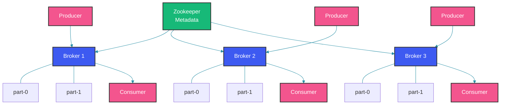

# Apache Kafka: Event Streaming Platform

## Overview

Apache Kafka is a distributed event streaming platform that handles trillions of events daily at companies like LinkedIn, Netflix, and Uber. It's the backbone of modern data architectures, enabling real-time pipelines, event sourcing, and microservices communication.

---

## Kafka Architecture

Kafka's architecture revolves around a cluster of brokers managed by ZooKeeper (or KRaft in newer versions). Producers publish messages to topics, which are split into partitions for parallelism. Each partition is replicated across multiple brokers for fault tolerance. Consumers read from partitions within a consumer group, and each message in a partition has a unique offset. This design enables both ordering guarantees (within a partition) and horizontal scalability (across partitions).



### Core Concepts

A producer publishes messages to a topic with an optional key — all messages with the same key land in the same partition, preserving order for that key. The `KafkaTemplate` in Spring abstracts the producer API. On the consumer side, `@KafkaListener` subscribes to a topic within a consumer group. Each consumer in the group handles a subset of partitions. The offset metadata tells the consumer its position in each partition, enabling reliable replay and resume.

```java
// Producer: Sends messages to Kafka
@Service
public class OrderProducer {
    
    @Autowired
    private KafkaTemplate<String, OrderEvent> kafkaTemplate;
    
    public void sendOrderCreated(Order order) {
        OrderEvent event = OrderEvent.builder()
            .orderId(order.getId())
            .userId(order.getUserId())
            .total(order.getTotal())
            .timestamp(Instant.now())
            .build();
        
        // Send to "orders" topic
        kafkaTemplate.send("orders", order.getId().toString(), event);
    }
}

// Topic with partitions
// Orders can be partitioned by userId (key)
// Messages with same key go to same partition
// This ensures ordering within user scope

// Consumer: Reads messages from Kafka
@Service
public class OrderConsumer {
    
    @KafkaListener(topics = "orders", groupId = "order-processing")
    public void handleOrderCreated(
            @Payload OrderEvent event,
            @Header(KafkaHeaders.OFFSET) long offset) {
        
        log.info("Processing order: {} at offset {}", event.getOrderId(), offset);
        
        // Process the order event
    }
}
```

---

## Real-World Use Cases

### 1. Event Sourcing

Kafka's append-only log is a natural fit for event sourcing. Every state change (deposit, withdrawal) is published as an immutable event to Kafka. Downstream services or the same service can consume these events to rebuild state, project read models, or trigger side effects. Because Kafka retains events for a configurable period, you can replay from any point in time — enabling temporal queries and debugging.

```java
// Store state changes as events
@Service
public class AccountService {
    
    @Autowired
    private KafkaTemplate<String, AccountEvent> kafkaTemplate;
    
    public void deposit(Long accountId, BigDecimal amount) {
        AccountEvent event = AccountEvent.builder()
            .accountId(accountId)
            .type("DEPOSIT")
            .amount(amount)
            .timestamp(Instant.now())
            .build();
        
        kafkaTemplate.send("account-events", accountId.toString(), event);
    }
}

@Component
public class AccountEventHandler {
    
    @KafkaListener(topics = "account-events", groupId = "account-service")
    public void handleEvent(@Payload AccountEvent event) {
        // Rebuild state from events
        log.info("Event: {} for account {}", event.getType(), event.getAccountId());
    }
}
```

### 2. Real-time Analytics

Kafka's ability to retain messages and serve multiple consumer groups makes it ideal for analytics pipelines. The `AnalyticsService` processes `user-actions` in real time, incrementing metrics and updating dashboards. Multiple analytics consumers can independently track the same event stream without interfering with each other.

```java
@Service
public class AnalyticsService {
    
    @KafkaListener(topics = "user-actions", groupId = "analytics")
    public void processAction(UserAction action) {
        // Real-time aggregation
        metrics.increment("actions." + action.getType());
        
        // Update real-time dashboard
        dashboardService.update(action);
    }
}
```

---

## Production Considerations

### 1. Configuration

The `application.yml` shown here is a production baseline. Key settings: `acks: all` ensures the leader waits for all in-sync replicas, `retries: 3` handles transient broker failures, and `auto-offset-reset: earliest` makes new consumers start from the beginning of the topic. Setting `ack-mode: manual` gives you control over offset commits, preventing message loss if processing fails between auto-commits.

```yaml
# application.yml
spring:
  kafka:
    bootstrap-servers: kafka1:9092,kafka2:9092,kafka3:9092
    producer:
      key-serializer: org.apache.kafka.common.serialization.StringSerializer
      value-serializer: org.springframework.kafka.support.serializer.JsonSerializer
      acks: all
      retries: 3
      properties:
        max.block.ms: 60000
    consumer:
      group-id: my-consumer-group
      auto-offset-reset: earliest
      key-deserializer: org.apache.kafka.common.serialization.StringDeserializer
      value-deserializer: org.springframework.kafka.support.serializer.JsonDeserializer
      properties:
        spring.json.trusted.packages: "*"
    listener:
      ack-mode: manual
```

### 2. Error Handling

When a consumer fails to process a message, the safest strategy is to not acknowledge it — the message will be redelivered on the next poll. For persistent failures, send the message to a dead-letter topic (DLT) before acknowledging, so the main processing pipeline isn't blocked. The `kafkaTemplate` can be used to forward failed messages to a separate topic for later analysis and manual reprocessing.

```java
@Service
public class ResilientConsumer {
    
    @KafkaListener(topics = "orders", groupId = "order-processing")
    public void handleOrder(
            @Payload OrderEvent event,
            @Header(KafkaHeaders.OFFSET) long offset,
            Acknowledgment ack) {
        
        try {
            processOrder(event);
            ack.acknowledge();  // Commit offset
        } catch (Exception e) {
            log.error("Failed to process order: {}", event.getOrderId(), e);
            // Don't acknowledge - will be redelivered
            // Or send to dead letter topic
            ack.acknowledge();  // After sending to DLQ
        }
    }
}
```

---

## Common Mistakes

### Mistake 1: Not Using Keys for Partitioning

Sending a message without a key causes Kafka to distribute it across partitions in a round-robin or sticky fashion. This is fine for fire-and-forget but breaks ordering guarantees. If you need all messages for a given entity (e.g., a specific order) to arrive in order, always provide a consistent key like the order ID — Kafka guarantees order within a partition by key.

```java
// WRONG: Random partitioning
kafkaTemplate.send("orders", event);  // No key - random partition

// CORRECT: Use consistent key
kafkaTemplate.send("orders", order.getId().toString(), event);
// Same order ID always goes to same partition
// Ensures ordering per partition
```

### Mistake 2: Not Handling Duplicates

Kafka's at-least-once delivery guarantees mean that messages can be delivered more than once. If your consumer isn't idempotent, duplicates cause incorrect state — double processing, duplicate database entries, or double charges. Track processed offsets or use unique event IDs with a deduplication store (database unique constraint or Redis) to make your consumer idempotent.

```java
// WRONG: No idempotence - duplicates cause issues
@KafkaListener(topics = "orders")
public void handleOrder(OrderEvent event) {
    orderService.process(event.getOrderId());  // May process twice!
}

// CORRECT: Idempotent processing
@KafkaListener(topics = "orders")
public void handleOrder(
        @Payload OrderEvent event,
        @Header(KafkaHeaders.OFFSET) long offset) {
    
    // Check if already processed using offset or unique ID
    if (!processedEvents.contains(offset)) {
        orderService.process(event.getOrderId());
        processedEvents.add(offset);
    }
}
```

---

## Summary

1. **Topics**: Named stream of events, partitioned for parallelism
2. **Producers**: Publish events with keys for partitioning
3. **Consumers**: Read from partitions within consumer groups
4. **Ordering**: Guaranteed within partition
5. **Retention**: Configurable log retention (default 7 days)

---

## References

- [Apache Kafka Documentation](https://kafka.apache.org/documentation/)
- [Spring Kafka Reference](https://docs.spring.io/spring-kafka/reference/)
- [Kafka: The Definitive Guide](https://www.confluent.io/resources/kafka-the-definitive-guide/)

---

Happy Coding
