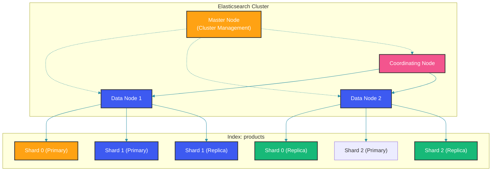

## Overview

Elasticsearch and Apache Solr are both built on Apache Lucene and provide distributed full-text search capabilities. Despite their shared foundation, they differ significantly in architecture, API design, operational model, and ecosystem.

Choosing between them depends on your specific requirements: ease of use, real-time search, operational simplicity, advanced analytics, or ecosystem integration.

## Architecture Comparison

### Elasticsearch Architecture

Elasticsearch uses a RESTful API and JSON-based query DSL. It is designed for near real-time search and analytics. The cluster topology consists of nodes with specialized roles — master nodes manage cluster state, data nodes store shards, and coordinating nodes route requests. An index is split into primary shards (for write and read) and replica shards (for failover and read scaling):



Elasticsearch queries use a JSON DSL that is both human-readable and programmatically constructed. The `NativeSearchQueryBuilder` in Spring Data Elasticsearch provides a fluent Java API that translates to the underlying REST calls:

```java
// Elasticsearch: RESTful API with JSON query DSL
@Service
public class ElasticsearchSearchService {

    private final ElasticsearchRestTemplate elasticsearchTemplate;

    public SearchHits<ProductDocument> search(String query) {
        NativeSearchQuery searchQuery = new NativeSearchQueryBuilder()
            .withQuery(QueryBuilders.multiMatchQuery(query, "name", "description"))
            .build();

        return elasticsearchTemplate.search(searchQuery, ProductDocument.class,
            IndexCoordinates.of("products"));
    }
}
```

### Solr Architecture

Solr uses a collection concept and supports both RESTful and native APIs. Configuration is XML-based, with schemas defined upfront in `schema.xml`. Solr's query API uses URL parameters and a JSON facet API:

```xml
<!-- Solr: Schema configuration -->
<schema name="products" version="1.6">
  <field name="id" type="string" indexed="true" stored="true" required="true"/>
  <field name="name" type="text_general" indexed="true" stored="true"/>
  <field name="description" type="text_en" indexed="true" stored="true"/>
  <field name="price" type="pdouble" indexed="true" stored="true"/>
  <field name="category" type="string" indexed="true" stored="true"/>
  <field name="_text_" type="text_general" indexed="true" stored="false" multiValued="true"/>

  <copyField source="name" dest="_text_"/>
  <copyField source="description" dest="_text_"/>
</schema>
```

The SolrJ client provides a Java API. Note the `df` (default field) parameter pointing to `_text_`, a catch-all field built by `copyField` directives — this is Solr's approach to multi-field search without explicit field listing:

```java
// Solr: Java client
@Service
public class SolrSearchService {

    private final SolrClient solrClient;

    public SolrSearchService(SolrClient solrClient) {
        this.solrClient = solrClient;
    }

    public QueryResponse search(String query) throws SolrServerException, IOException {
        SolrQuery solrQuery = new SolrQuery();
        solrQuery.setQuery(query);
        solrQuery.set("df", "_text_");
        solrQuery.setRows(20);
        solrQuery.setHighlight(true);
        solrQuery.addHighlightField("name");
        solrQuery.addHighlightField("description");

        return solrClient.query("products", solrQuery);
    }
}
```

## Indexing Performance

### Elasticsearch Indexing

Elasticsearch's `bulk` API batches multiple index operations into a single HTTP request. The `BulkResponse` reports per-operation results — checking `hasFailures()` is essential to catch partial failures that might otherwise go unnoticed:

```java
@Component
public class ElasticsearchBulkIndexer {

    public void bulkIndex(List<Product> products) {
        List<IndexQuery> queries = products.stream()
            .map(product -> new IndexQueryBuilder()
                .withId(product.getId())
                .withObject(convertToDocument(product))
                .build())
            .toList();

        BulkResponse response = elasticsearchTemplate
            .bulkIndex(queries, IndexCoordinates.of("products"));

        if (response.hasFailures()) {
            log.error("Bulk indexing had failures: {}",
                response.buildFailureMessage());
        }
    }
}
```

### Solr Indexing

Solr requires explicit `commit()` calls to make indexed documents visible. The autoCommit settings in `solrconfig.xml` can mitigate this, but programmatic commits give you precise control over the trade-off between indexing throughput and search freshness:

```java
@Component
public class SolrBulkIndexer {

    private final SolrClient solrClient;

    public void bulkIndex(List<ProductDocument> documents)
            throws SolrServerException, IOException {
        SolrInputDocument[] solrDocuments = documents.stream()
            .map(this::toSolrDocument)
            .toArray(SolrInputDocument[]::new);

        UpdateResponse response = solrClient.add("products", solrDocuments);
        solrClient.commit("products");

        if (response.getStatus() != 0) {
            log.error("Solr indexing failed with status: {}", response.getStatus());
        }
    }

    private SolrInputDocument toSolrDocument(ProductDocument doc) {
        SolrInputDocument solrDoc = new SolrInputDocument();
        solrDoc.addField("id", doc.getId());
        solrDoc.addField("name", doc.getName());
        solrDoc.addField("description", doc.getDescription());
        solrDoc.addField("price", doc.getPrice());
        solrDoc.addField("category", doc.getCategory());
        return solrDoc;
    }
}
```

## Query Capabilities

### Elasticsearch: Full-text and Analytics

Elasticsearch's aggregation framework is the most powerful analytics engine in the search space. The following query computes a `terms` aggregation on `category`, with sub-aggregations for average price, price statistics, and brand distribution — all in a single round-trip. The `date_histogram` aggregation enables time-series analysis:

```java
// Elasticsearch: Aggregation for analytics
@Service
public class ElasticsearchAnalyticsService {

    public Map<String, Object> getCategoryAnalytics() {
        NativeSearchQuery searchQuery = new NativeSearchQueryBuilder()
            .addAggregation(AggregationBuilders.terms("by_category")
                .field("category")
                .subAggregation(AggregationBuilders.avg("avg_price")
                    .field("price"))
                .subAggregation(AggregationBuilders.stats("price_stats")
                    .field("price")))
            .addAggregation(AggregationBuilders.dateHistogram("sales_over_time")
                .field("createdAt")
                .calendarInterval(DateHistogramInterval.MONTH))
            .withQuery(QueryBuilders.matchAllQuery())
            .withPageable(PageRequest.of(0, 0))
            .build();

        SearchHits<ProductDocument> hits = elasticsearchTemplate
            .search(searchQuery, ProductDocument.class);

        return parseAggregations(hits.getAggregations());
    }
}
```

### Solr: Faceting and Analytics

Solr's faceting module is mature and highly optimized for enumerated fields. It supports field faceting, range faceting, and pivot faceting. The query below replicates the Elasticsearch aggregation — category facets, price range facets, and a facet query for expensive items:

```java
// Solr: Faceting
@Service
public class SolrFacetService {

    public QueryResponse getCategoryFacets()
            throws SolrServerException, IOException {
        SolrQuery query = new SolrQuery();
        query.setQuery("*:*");
        query.setFacet(true);
        query.addFacetField("category");
        query.addFacetField("brand");
        query.addNumericRangeFacet("price", 0, 10, 10);
        query.addNumericRangeFacet("price", 10, 50, 40);
        query.addNumericRangeFacet("price", 50, 100, 50);
        query.addFacetQuery("price:[100 TO *]");

        return solrClient.query("products", query);
    }
}
```

## Comparison Table

| Feature | Elasticsearch | Solr |
|---------|--------------|------|
| Query DSL | JSON DSL | URL params + JSON |
| Schema | Mapping (flexible) | Schema (defined upfront) |
| Real-time search | Near real-time (refresh_interval) | Near real-time (autoCommit) |
| Aggregations | Built-in (powerful) | Faceting (mature) |
| Monitoring | Built-in (Stack Monitoring) | Prometheus export, Admin UI |
| Scaling | Auto-sharding | Manual sharding |
| Cloud offering | Elastic Cloud | SolrCloud |
| Machine Learning | Built-in | Community plugins |
| Logging/Analytics | ELK Stack (dominant) | Rarely used |
| E-commerce search | Very common | Less common |
| Documentation | Excellent | Good |
| Community | Large and active | Smaller but mature |

## When to Choose Elasticsearch

Elasticsearch excels at time-series analytics (the ELK Stack is the de facto standard for log analytics), complex full-text search with relevance tuning, and applications needing auto-scaling. Its JSON-based query DSL and aggregation framework make it ideal for real-time analytics dashboards:

```java
// Elasticsearch excels at:
// 1. Time-series data and logging (ELK Stack)
// 2. Full-text search with relevance tuning
// 3. Real-time analytics and aggregations
// 4. Applications needing auto-scaling and simple operations

@Service
public class SearchDecisionService {

    public String recommendSearchEngine(SearchRequirements req) {
        if (req.isLoggingAnalytics() || req.isTimeSeries()) {
            return "Elasticsearch (ELK Stack integration)";
        }
        if (req.isComplexFullTextSearch()) {
            return "Elasticsearch (better relevance tuning)";
        }
        if (req.isEnterpriseSearch() || req.isLargeStaticDataset()) {
            return "Solr (mature, predictable performance)";
        }
        return "Either (evaluate specific requirements)";
    }
}
```

## When to Choose Solr

Solr excels at enterprise search with complex faceting, handling large relatively static datasets, and environments where schema must be strictly controlled. Its rich document parsing (PDF, Word, HTML) and more predictable performance for known query patterns make it a strong choice for content management and document-centric applications:

```java
// Solr excels at:
// 1. Enterprise search with complex faceting
// 2. Large, relatively static datasets
// 3. When schema must be strictly controlled
// 4. Existing Solr infrastructure and expertise

// Solr strengths:
// - More mature faceting capabilities
// - Better support for rich document parsing (PDF, Word)
// - Schemaless mode for flexibility
// - More predictable performance for known query patterns
```

## Migration Considerations

Migrating between search engines is a multi-step process that requires significant planning. The plan below covers schema mapping, query translation, dual-write (writing to both engines simultaneously to verify correctness), and finally cutover. Always run comparison queries before decommissioning the old engine:

```java
// Planning a migration between search engines
@Component
public class SearchMigrationPlanner {

    public MigrationPlan createMigrationPlan(SearchEngine from, SearchEngine to) {
        List<String> steps = new ArrayList<>();

        // 1. Schema mapping
        steps.add("Map " + from + " schema to " + to + " schema");

        // 2. Query translation
        if (from == SearchEngine.ELASTICSEARCH && to == SearchEngine.SOLR) {
            steps.add("Translate JSON query DSL to Solr query params");
        } else {
            steps.add("Translate Solr query params to JSON query DSL");
        }

        // 3. Data export/import
        steps.add("Export data from " + from + " using scroll/search after");
        steps.add("Bulk import data to " + to);

        // 4. Dual-write during migration
        steps.add("Implement dual-write to both search engines");
        steps.add("Run comparison queries to verify results");

        // 5. Cutover
        steps.add("Switch application queries to new search engine");
        steps.add("Monitor query performance and result quality");
        steps.add("Decommission old search engine");

        return new MigrationPlan(steps, estimateDuration(from, to));
    }
}
```

## Common Mistakes

### Assuming Feature Parity

Despite sharing the Lucene foundation, Elasticsearch and Solr behave differently in subtle ways. Analyzers, query syntax, and scoring algorithms all have nuances. Test thoroughly when migrating:

```java
// Wrong: Assuming Elasticsearch and Solr behaviors are identical
// Both handle "analyzers" differently, query syntax differs,
// and relevance scoring algorithms have subtle differences.

// Correct: Test thoroughly when migrating between engines
```

### Not Considering Operations

The best search engine is the one your team can operate effectively. Evaluate monitoring infrastructure, available expertise, and operational cost:

```java
// Wrong: Choosing based only on search features
// Consider:
// - Which engine does your team know?
// - What monitoring infrastructure exists?
// - What is the operational cost?

// Correct: Evaluate total cost of ownership
```

## Best Practices

1. Choose Elasticsearch for real-time analytics, logging, and applications needing auto-scaling.
2. Choose Solr for enterprise search with complex faceting and established Solr expertise.
3. Consider the ecosystem: ELK Stack is dominant for logging, Solr integrates with Hadoop/Spark.
4. Evaluate operational maturity before choosing.
5. Test both with your specific data and query patterns.
6. Consider the learning curve for your team.

## Summary

Elasticsearch and Solr are both capable search engines built on Lucene. Elasticsearch offers simpler operations, better real-time capabilities, and a richer ecosystem for log analytics and full-text search. Solr offers mature faceting, better support for rich documents, and predictable performance for known query patterns. Choose based on your specific use case, team expertise, and operational requirements.

## References

- "Elasticsearch: The Definitive Guide" by Clinton Gormley and Zachary Tong
- Apache Solr Reference Guide
- "Solr in Action" by Trey Grainger and Timothy Potter

Happy Coding
