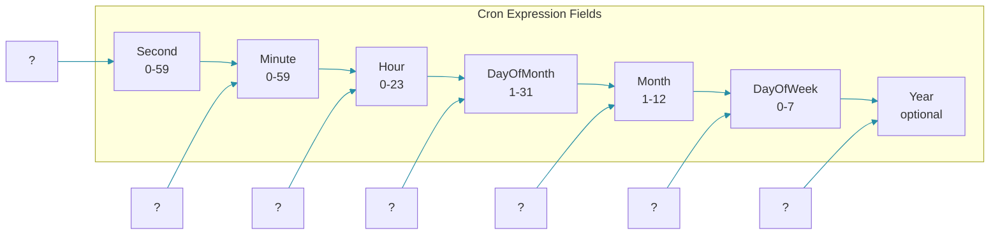

## Overview

Cron expressions provide a powerful, compact syntax for specifying time-based schedules. They are used by Quartz scheduler, Spring's `@Scheduled` annotation, Unix cron daemon, and many other scheduling systems.

Understanding cron syntax thoroughly is essential for any backend engineer dealing with scheduled tasks. This post covers standard Quartz cron expressions, common patterns, timezone considerations, and best practices.

## Cron Expression Syntax

A Quartz cron expression consists of seven fields separated by spaces:



| Field | Required | Allowed Values | Allowed Special Characters |
|-------|----------|---------------|---------------------------|
| Second | Yes | 0-59 | , - * / |
| Minute | Yes | 0-59 | , - * / |
| Hour | Yes | 0-23 | , - * / |
| Day of Month | Yes | 1-31 | , - * ? / L W |
| Month | Yes | 1-12 or JAN-DEC | , - * / |
| Day of Week | Yes | 1-7 or SUN-SAT | , - * ? / L # |
| Year (optional) | No | 1970-2099 | , - * / |

### Special Characters

| Character | Meaning | Example |
|-----------|---------|---------|
| * | All values | `*` in Hour = every hour |
| ? | No specific value | Used when DayOfMonth or DayOfWeek is not specified |
| - | Range | `10-15` in Minute = minutes 10 through 15 |
| , | Multiple values | `MON,WED,FRI` in DayOfWeek |
| / | Increment | `0/15` in Minute = every 15 minutes starting at 0 |
| L | Last | `L` in DayOfWeek = last day of week in month |
| W | Nearest weekday | `15W` = nearest weekday to 15th |
| # | Nth weekday | `3#2` = second Wednesday of month |

## Common Cron Patterns

### Every Day Patterns

The most common cron patterns are those that repeat throughout the day. The key distinction between these and Spring's `fixedRate`/`fixedDelay` is that cron schedules are tied to the wall clock — "every 5 minutes" here means at :00, :05, :10, etc., always aligned to the clock, not relative to when the application started or when the last execution finished.

```java
// Every minute
@Scheduled(cron = "0 * * * * *")
public void runEveryMinute() {}

// Every 5 minutes
@Scheduled(cron = "0 */5 * * * *")
public void runEveryFiveMinutes() {}

// Every 15 minutes
@Scheduled(cron = "0 */15 * * * *")
public void runEveryFifteenMinutes() {}

// Every hour at the top of the hour
@Scheduled(cron = "0 0 * * * *")
public void runEveryHour() {}

// Every 6 hours at midnight, 6am, noon, 6pm
@Scheduled(cron = "0 0 */6 * * *")
public void runEverySixHours() {}
```

Using `*/N` in the minute or hour field means "every N units starting from 0". The increment operator scans from the minimum allowed value forward. This is different from listing every value explicitly — `*/15` in minutes is equivalent to `0,15,30,45` but is far more readable.

### Daily Patterns

Daily patterns pin execution to specific wall-clock times. Use the comma operator to specify multiple hours. The day-of-month field uses `*` (every day), and because day-of-week is also `*`, there is no conflict — Quartz accepts all values for both, which effectively means every day.

```java
// Every day at midnight
@Scheduled(cron = "0 0 0 * * *")
public void runAtMidnight() {}

// Every day at 2:00 AM
@Scheduled(cron = "0 0 2 * * *")
public void runAt2AM() {}

// Every day at 8:30 AM and 5:30 PM
@Scheduled(cron = "0 30 8,17 * * *")
public void runAt830And530() {}

// Every day at 9 AM, 12 PM, 3 PM, 6 PM
@Scheduled(cron = "0 0 9,12,15,18 * * *")
public void runAtBusinessHours() {}
```

### Weekly Patterns

Weekly patterns use the day-of-week field to constrain execution to specific days. Note the use of `?` in the day-of-month field for the bi-weekly pattern — since we are specifying a day-of-week rule (MON#1 meaning "first Monday"), we must set day-of-month to `?` to avoid a conflict. The `#` character is a Quartz extension and is not available in Unix cron or simpler libraries.

```java
// Every Monday at 2:00 AM
@Scheduled(cron = "0 0 2 * * MON")
public void runEveryMonday() {}

// Every weekday (Monday to Friday) at 6:00 AM
@Scheduled(cron = "0 0 6 * * MON-FRI")
public void runWeekdays() {}

// Every Sunday and Wednesday at 3:00 AM
@Scheduled(cron = "0 0 3 * * SUN,WED")
public void runOnSundayAndWednesday() {}

// Bi-weekly on Monday (every other Monday) requires Quartz
@Scheduled(cron = "0 0 2 ? * MON#1,MON#3")
public void runFirstAndThirdMonday() {}
```

### Monthly Patterns

Monthly patterns use the day-of-month field to pick a specific date. The `L` character in `L * *` means "last day of the month" — Quartz automatically resolves this to 28, 29, 30, or 31 depending on the month. The `*/3` in the month field produces quarterly execution on January 1, April 1, July 1, and October 1.

```java
// First day of every month at 1:00 AM
@Scheduled(cron = "0 0 1 1 * *")
public void runFirstOfMonth() {}

// Last day of every month at 11:59 PM
@Scheduled(cron = "59 59 23 L * *")
public void runLastOfMonth() {}

// 15th of every month at noon
@Scheduled(cron = "0 0 12 15 * *")
public void runOn15th() {}

// Every 3 months on the 1st at 4:00 AM
@Scheduled(cron = "0 0 4 1 */3 *")
public void runQuarterly() {}
```

### Specific Time Intervals

```java
// Every 2 hours between 6 AM and 6 PM (inclusive)
@Scheduled(cron = "0 0 6-18/2 * * *")
public void runEveryTwoHoursDuringWorkday() {}

// Every 30 minutes during business hours (9 AM - 5 PM)
@Scheduled(cron = "0 0/30 9-17 * * MON-FRI")
public void runEvery30DuringBusinessHours() {}

// Every 10 minutes, but only on weekdays
@Scheduled(cron = "0 0/10 * * * MON-FRI")
public void runEvery10Weekdays() {}
```

## Advanced Cron Techniques

### Using Cron with Quartz

```java
@Component
public class CronScheduleService {

    @Scheduled(cron = "${scheduling.report.cron:0 0 2 * * ?}")
    public void generateNightlyReport() {
        log.info("Generating nightly report at configured time");
        reportService.generateReport("NIGHTLY");
    }

    @Scheduled(cron = "0 0/15 * * * ?", zone = "America/New_York")
    public void runInSpecificTimezone() {
        log.info("Running with Eastern Time schedule");
        processTimeSensitiveData();
    }
}
```

### Programmatic Cron Expression Parsing

```java
@Component
public class CronExpressionValidator {

    public boolean isValidCronExpression(String expression) {
        try {
            CronExpression cron = new CronExpression(expression);
            cron.getNextValidTimeAfter(new Date());
            return true;
        } catch (ParseException e) {
            log.warn("Invalid cron expression: {}", expression);
            return false;
        }
    }

    public List<Date> getNextExecutionTimes(String expression, int count) {
        try {
            CronExpression cron = new CronExpression(expression);
            List<Date> nextTimes = new ArrayList<>();
            Date after = new Date();

            for (int i = 0; i < count; i++) {
                Date next = cron.getNextValidTimeAfter(after);
                if (next == null) break;
                nextTimes.add(next);
                after = new Date(next.getTime() + 1000);
            }
            return nextTimes;
        } catch (ParseException e) {
            throw new IllegalArgumentException("Invalid cron expression: " + expression, e);
        }
    }

    public String describeSchedule(String expression) {
        try {
            CronExpression cron = new CronExpression(expression);
            Date nextRun = cron.getNextValidTimeAfter(new Date());
            if (nextRun != null) {
                return "Next execution: " + Instant.ofEpochMilli(nextRun.getTime())
                    .atZone(ZoneId.systemDefault())
                    .toLocalDateTime();
            }
            return "No future executions";
        } catch (ParseException e) {
            return "Invalid expression";
        }
    }
}
```

### Dynamic Cron from Database

```java
@Component
public class DatabaseCronScheduler {

    private final TaskScheduler taskScheduler;
    private final CronConfigRepository configRepository;
    private ScheduledFuture<?> scheduledTask;

    public DatabaseCronScheduler(
            TaskScheduler taskScheduler,
            CronConfigRepository configRepository) {
        this.taskScheduler = taskScheduler;
        this.configRepository = configRepository;
    }

    @PostConstruct
    public void initialize() {
        scheduleFromDatabase();
    }

    public void scheduleFromDatabase() {
        if (scheduledTask != null) {
            scheduledTask.cancel(false);
        }

        CronConfig config = configRepository.findByName("dataSyncTask")
            .orElseThrow(() -> new ConfigNotFoundException("dataSyncTask"));

        if (!config.isEnabled()) {
            log.info("Task {} is disabled in configuration", config.getName());
            return;
        }

        scheduledTask = taskScheduler.schedule(
            this::executeDataSyncTask,
            triggerContext -> {
                CronTrigger trigger = new CronTrigger(config.getCronExpression(),
                    TimeZone.getTimeZone(config.getTimezone()));
                return trigger.nextExecutionTime(triggerContext);
            }
        );

        log.info("Scheduled {} with cron: {} in timezone: {}",
            config.getName(), config.getCronExpression(), config.getTimezone());
    }

    private void executeDataSyncTask() {
        try {
            log.info("Executing data sync task");
            dataSyncService.sync();
        } catch (Exception e) {
            log.error("Data sync failed", e);
        }
    }
}
```

## Timezone Handling

```java
@Component
public class TimezoneAwareScheduler {

    @Scheduled(cron = "0 0 0 * * *", zone = "UTC")
    public void runAtUtcMidnight() {
        log.info("Running at UTC midnight");
    }

    @Scheduled(cron = "0 0 0 * * *", zone = "Asia/Kolkata")
    public void runAtIstMidnight() {
        log.info("Running at IST midnight (UTC 18:30)");
    }

    // Runtime timezone conversion
    public boolean shouldRunNow(String cronExpression, String targetZone) {
        try {
            CronExpression cron = new CronExpression(cronExpression);
            ZonedDateTime nowInTargetZone = ZonedDateTime.now(ZoneId.of(targetZone));
            Date now = Date.from(nowInTargetZone.toInstant());

            Date nextRun = cron.getNextValidTimeAfter(
                new Date(now.getTime() - 60000));
            Date nextNextRun = cron.getNextValidTimeAfter(now);

            return nextRun != null && nextNextRun != null
                && nextRun.before(now) && nextNextRun.after(now);
        } catch (ParseException e) {
            log.error("Invalid cron expression", e);
            return false;
        }
    }
}
```

## Common Patterns Reference

| Schedule | Cron Expression |
|----------|----------------|
| Every minute | `0 * * * * *` |
| Every 5 minutes | `0 */5 * * * *` |
| Every 15 minutes | `0 */15 * * * *` |
| Every hour | `0 0 * * * *` |
| Twice daily (8am, 5pm) | `0 0 8,17 * * *` |
| Every weekday at 9am | `0 0 9 * * MON-FRI` |
| Every Monday at 2am | `0 0 2 * * MON` |
| First of month at midnight | `0 0 0 1 * *` |
| Last of month at 11pm | `0 0 23 L * *` |
| Quarterly (Jan 1, Apr 1, etc) | `0 0 0 1 */3 *` |
| Every weekend at 6am | `0 0 6 * * SAT,SUN` |
| Every 2 hours | `0 0 */2 * * *` |
| Every 30 seconds | `0/30 * * * * *` |

## Common Mistakes

### Confusing * and ? in Day Fields

```java
// Wrong: Using * in both day fields
// This means "every day of month" AND "every day of week"
@Scheduled(cron = "0 0 2 * * *")

// Correct: Use ? for the field you don't want to specify
@Scheduled(cron = "0 0 2 * * ?")
```

### Misunderstanding Day-of-Week Range

```java
// Wrong: 1=SUN in some systems, 1=MON in others
// Quartz uses 1=SUN, 2=MON, ..., 7=SAT

// Correct: Use names for clarity
@Scheduled(cron = "0 0 2 * * MON-FRI")
```

### Forgetting Year Field

```java
// Wrong: 6 fields but treating it as Unix cron
@Scheduled(cron = "0 0 2 * * *") // This is valid Quartz, second field is included

// Unix cron format would be (5 fields):
// 0 2 * * *
```

## Best Practices

1. Always use the 7-field Quartz format in Spring `@Scheduled` (second included).
2. Use explicit day names (MON, TUE) instead of numeric values for readability.
3. Use the `zone` attribute in `@Scheduled` when timezone matters.
4. Validate cron expressions at application startup.
5. Avoid complex cron expressions that are hard to understand.
6. Document what each scheduled job does and why that schedule was chosen.
7. Use externalized configuration for cron expressions that may change.

## Summary

Cron expressions are a compact and powerful way to define time-based schedules. Understanding the syntax, special characters, and common patterns is essential for backend development. Use 7-field Quartz format in Spring, handle timezones explicitly, and always validate expressions. When in doubt, use named days and months for clarity.

## References

- Quartz Scheduler CronTrigger Documentation
- Spring Framework @Scheduled Annotation Documentation
- crontab.guru (Cron expression editor)

Happy Coding
