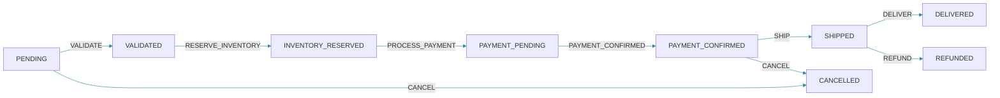

## Overview

State machines and workflow engines both model business processes, but they approach the problem from different angles. State machines focus on states and transitions, while workflow engines focus on the flow of activities over time. Choosing between them depends on your process complexity, need for persistence, team skills, and integration requirements.

This post compares both approaches with concrete implementations and provides decision criteria for choosing the right tool.

## State Machine Pattern

State machines model a system as a finite set of states with transitions between them. Each transition is triggered by an event and may have guards (conditions) and actions (side effects).



### Spring State Machine

```java
@Configuration
@EnableStateMachine
public class OrderStateMachineConfiguration
        extends StateMachineConfigurerAdapter<OrderStates, OrderEvents> {

    @Override
    public void configure(StateMachineStateConfigurer<OrderStates, OrderEvents> states)
            throws Exception {
        states
            .withStates()
            .initial(OrderStates.PENDING)
            .state(OrderStates.PENDING)
            .state(OrderStates.VALIDATED)
            .state(OrderStates.INVENTORY_RESERVED)
            .state(OrderStates.PAYMENT_PENDING)
            .state(OrderStates.PAYMENT_CONFIRMED)
            .state(OrderStates.SHIPPED)
            .state(OrderStates.DELIVERED)
            .state(OrderStates.CANCELLED)
            .state(OrderStates.REFUNDED)
            .end(OrderStates.DELIVERED)
            .end(OrderStates.CANCELLED)
            .end(OrderStates.REFUNDED);
    }

    @Override
    public void configure(
            StateMachineTransitionConfigurer<OrderStates, OrderEvents> transitions)
            throws Exception {
        transitions
            .withExternal()
                .source(OrderStates.PENDING)
                .target(OrderStates.VALIDATED)
                .event(OrderEvents.VALIDATE)
                .guard(validationGuard())
                .action(validateOrderAction())
            .and()
            .withExternal()
                .source(OrderStates.VALIDATED)
                .target(OrderStates.INVENTORY_RESERVED)
                .event(OrderEvents.RESERVE_INVENTORY)
                .action(reserveInventoryAction())
            .and()
            .withExternal()
                .source(OrderStates.INVENTORY_RESERVED)
                .target(OrderStates.PAYMENT_PENDING)
                .event(OrderEvents.PROCESS_PAYMENT)
                .action(processPaymentAction())
            .and()
            .withExternal()
                .source(OrderStates.PAYMENT_PENDING)
                .target(OrderStates.PAYMENT_CONFIRMED)
                .event(OrderEvents.PAYMENT_CONFIRMED)
            .and()
            .withExternal()
                .source(OrderStates.PAYMENT_CONFIRMED)
                .target(OrderStates.SHIPPED)
                .event(OrderEvents.SHIP)
                .action(shipOrderAction())
            .and()
            .withExternal()
                .source(OrderStates.SHIPPED)
                .target(OrderStates.DELIVERED)
                .event(OrderEvents.DELIVER)
            .and()
            .withExternal()
                .source(OrderStates.PAYMENT_CONFIRMED)
                .target(OrderStates.CANCELLED)
                .event(OrderEvents.CANCEL)
                .action(cancelOrderAction())
            .and()
            .withExternal()
                .source(OrderStates.SHIPPED)
                .target(OrderStates.REFUNDED)
                .event(OrderEvents.REFUND)
                .action(refundAction());
    }

    @Bean
    public Guard<OrderStates, OrderEvents> validationGuard() {
        return context -> {
            String orderId = (String) context.getExtendedState()
                .getVariables().get("orderId");
            return orderId != null && !orderId.isEmpty();
        };
    }

    @Bean
    public Action<OrderStates, OrderEvents> validateOrderAction() {
        return context -> {
            String orderId = (String) context.getMessage().getHeaders().get("orderId");
            log.info("Validating order: {}", orderId);
            orderValidationService.validate(orderId);
        };
    }

    @Bean
    public Action<OrderStates, OrderEvents> reserveInventoryAction() {
        return context -> {
            String orderId = (String) context.getMessage().getHeaders().get("orderId");
            log.info("Reserving inventory for order: {}", orderId);
            inventoryService.reserve(orderId);
        };
    }

    @Bean
    public Action<OrderStates, OrderEvents> processPaymentAction() {
        return context -> {
            String orderId = (String) context.getMessage().getHeaders().get("orderId");
            log.info("Processing payment for order: {}", orderId);
            paymentService.process(orderId);
        };
    }
}

public enum OrderStates {
    PENDING, VALIDATED, INVENTORY_RESERVED, PAYMENT_PENDING,
    PAYMENT_CONFIRMED, SHIPPED, DELIVERED, CANCELLED, REFUNDED
}

public enum OrderEvents {
    VALIDATE, RESERVE_INVENTORY, PROCESS_PAYMENT, PAYMENT_CONFIRMED,
    SHIP, DELIVER, CANCEL, REFUND
}
```

### Using the State Machine

```java
@Service
public class OrderStateMachineService {

    private final StateMachineFactory<OrderStates, OrderEvents> factory;
    private final StateMachinePersistenceService persistenceService;

    public OrderStateMachineService(
            StateMachineFactory<OrderStates, OrderEvents> factory,
            StateMachinePersistenceService persistenceService) {
        this.factory = factory;
        this.persistenceService = persistenceService;
    }

    public void sendEvent(String orderId, OrderEvents event, Map<String, Object> headers) {
        StateMachine<OrderStates, OrderEvents> machine = factory.getStateMachine(orderId);
        machine.getExtendedState().getVariables().put("orderId", orderId);

        machine.start();

        Message<OrderEvents> message = MessageBuilder
            .withPayload(event)
            .copyHeaders(headers)
            .build();

        boolean accepted = machine.sendEvent(message);
        if (!accepted) {
            throw new InvalidStateTransitionException(
                "Cannot transition from " + machine.getState().getId()
                + " with event " + event);
        }

        persistenceService.persist(machine, orderId);
    }

    public OrderStates getCurrentState(String orderId) {
        StateMachine<OrderStates, OrderEvents> machine =
            persistenceService.restore(orderId);
        return machine.getState().getId();
    }
}
```

## Workflow Engine Pattern

### Simple Workflow Engine Implementation

```java
public class SimpleWorkflowEngine {

    private final WorkflowDefinitionRepository definitionRepository;
    private final WorkflowInstanceRepository instanceRepository;

    public SimpleWorkflowEngine(
            WorkflowDefinitionRepository definitionRepository,
            WorkflowInstanceRepository instanceRepository) {
        this.definitionRepository = definitionRepository;
        this.instanceRepository = instanceRepository;
    }

    public WorkflowInstance startWorkflow(String workflowName, Map<String, Object> input) {
        WorkflowDefinition definition = definitionRepository.findByName(workflowName)
            .orElseThrow(() -> new WorkflowNotFoundException(workflowName));

        WorkflowInstance instance = new WorkflowInstance(
            UUID.randomUUID().toString(),
            workflowName,
            WorkflowStatus.RUNNING,
            input,
            new ArrayList<>(),
            0,
            Instant.now()
        );
        instanceRepository.save(instance);
        executeNextStep(instance);
        return instance;
    }

    private void executeNextStep(WorkflowInstance instance) {
        WorkflowDefinition definition = definitionRepository
            .findByName(instance.getWorkflowName()).orElseThrow();

        int currentStep = instance.getCurrentStepIndex();
        if (currentStep >= definition.getSteps().size()) {
            instance.setStatus(WorkflowStatus.COMPLETED);
            instance.setCompletedAt(Instant.now());
            instanceRepository.save(instance);
            log.info("Workflow {} completed", instance.getId());
            return;
        }

        WorkflowStep step = definition.getSteps().get(currentStep);
        try {
            WorkflowContext context = new WorkflowContext(
                instance.getId(), instance.getVariables());

            switch (step.getType()) {
                case SERVICE_TASK -> executeServiceTask(step, context);
                case DECISION -> executeDecision(step, context);
                case HUMAN_TASK -> executeHumanTask(step, context);
                case SUB_PROCESS -> executeSubProcess(step, context);
                case WAIT -> executeWait(step, context);
            }

            instance.getVariables().putAll(context.getVariables());
            instance.setCurrentStepIndex(currentStep + 1);
            instanceRepository.save(instance);

            executeNextStep(instance);
        } catch (RetryableException e) {
            log.warn("Step {} failed, retrying: {}", step.getName(), e.getMessage());
            instance.setRetryCount(instance.getRetryCount() + 1);
            instanceRepository.save(instance);
            scheduleRetry(instance);
        } catch (FatalException e) {
            log.error("Step {} failed fatally: {}", step.getName(), e.getMessage());
            instance.setStatus(WorkflowStatus.FAILED);
            instance.setError(e.getMessage());
            instance.setFailedAt(Instant.now());
            instanceRepository.save(instance);
        }
    }
}
```

## Comparison Table

| Aspect | State Machine | Workflow Engine |
|--------|---------------|-----------------|
| Focus | States and transitions | Process flow and activities |
| Complexity | Low to medium | Medium to high |
| Visual modeling | Limited | Full BPMN 2.0 |
| Persistence | Optional | Built-in |
| Human tasks | Manual implementation | Built-in |
| Parallel execution | Complex | Built-in |
| Timers/delays | Manual implementation | Built-in |
| Error handling | Per-transition | Global + per-activity |
| Monitoring | Custom | Built-in dashboards |
| Learning curve | Low | Medium |
| Team suitability | Developers | Business + Developers |

## Decision Framework

### Use State Machines When

```java
// Simple order status transitions
@Component
public class SimpleOrderStateMachine {

    private OrderStatus currentStatus = OrderStatus.PENDING;

    public void transition(OrderEvent event) {
        currentStatus = switch (currentStatus) {
            case PENDING -> switch (event) {
                case VALIDATE -> OrderStatus.VALIDATED;
                case CANCEL -> OrderStatus.CANCELLED;
                default -> throw new InvalidTransitionException(currentStatus, event);
            };
            case VALIDATED -> switch (event) {
                case RESERVE_INVENTORY -> OrderStatus.INVENTORY_RESERVED;
                case CANCEL -> OrderStatus.CANCELLED;
                default -> throw new InvalidTransitionException(currentStatus, event);
            };
            case CONFIRMED -> switch (event) {
                case SHIP -> OrderStatus.SHIPPED;
                case CANCEL -> OrderStatus.CANCELLED;
                default -> throw new InvalidTransitionException(currentStatus, event);
            };
            default -> throw new InvalidTransitionException(currentStatus, event);
        };
    }
}
```

### Use Workflow Engines When

```java
// Multi-step process with human tasks, timers, and decisions
// Use Camunda BPMN, Temporal, or similar
public void startOrderFulfillmentProcess(Order order) {
    // Process involves:
    // 1. Validation (automated)
    // 2. Manager approval (human task, 24h timeout)
    // 3. Inventory check (automated, retry 3x)
    // 4. Payment processing (automated)
    // 5. Warehouse picking (human task)
    // 6. Shipping (automated)
    // 7. Customer survey (delayed 7 days)
    workflowEngine.startProcess("order-fulfillment", order.toVariables());
}
```

## Hybrid Approach

```java
@Component
public class HybridOrderProcessor {

    private final StateMachine<OrderStates, OrderEvents> stateMachine;
    private final WorkflowEngine workflowEngine;

    public void processOrder(Order order) {
        // State machine tracks high-level status
        stateMachine.start();
        stateMachine.sendEvent(OrderEvents.VALIDATE);

        // Workflow engine handles complex sub-process
        if (order.isInternational()) {
            workflowEngine.startProcess("international-shipping", Map.of(
                "orderId", order.getId(),
                "origin", "US",
                "destination", order.getCountry()
            ));
        }

        stateMachine.sendEvent(OrderEvents.RESERVE_INVENTORY);
        stateMachine.sendEvent(OrderEvents.PROCESS_PAYMENT);
    }
}
```

## Common Mistakes

### Using State Machine for Complex Processes

```java
// Wrong: State machine with too many states and transitions
// 50+ states, 200+ transitions -- becomes unmaintainable

// Correct: Use workflow engine for complex orchestration
// BPMN diagrams are more manageable for complex flows
```

### Not Handling Compensation

```java
// Wrong: State machine without error handling
context.getStateMachine().sendEvent(OrderEvents.PROCESS_PAYMENT);
// If payment fails, no compensation for inventory reservation
```

```java
// Correct: Error handling with compensation
try {
    reserveInventory();
    processPayment();
} catch (PaymentException e) {
    releaseInventory();
    stateMachine.sendEvent(OrderEvents.PAYMENT_FAILED);
}
```

## Best Practices

1. Use state machines for simple status tracking with limited states (5-15).
2. Use workflow engines for complex processes with human tasks, timers, and sub-processes.
3. Consider team skills: state machines are developer-friendly, workflow engines bridge business and IT.
4. Combine both: state machine for lifecycle management, workflow engine for complex activities.
5. Implement compensation for every state machine transition.
6. Monitor both approaches with metrics and logging.
7. Test state machine exhaustively for all transition combinations.
8. Version workflow definitions to handle in-flight process instances.

## Summary

State machines are ideal for modeling entity lifecycles with clear states and transitions. Workflow engines excel at complex processes involving human tasks, timers, parallel execution, and business rule integration. Choose state machines for simplicity and workflow engines for processes that need visibility, human interaction, and complex orchestration.

## References

- "State Machine Design Patterns" by David L. Parnas
- "Workflow Patterns" by van der Aalst et al.
- Camunda BPMN Documentation
- Spring State Machine Documentation

Happy Coding
