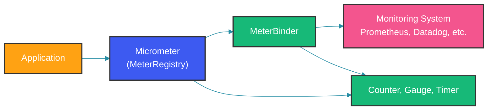

# Spring Boot Actuator Metrics

## Overview

Spring Boot Actuator provides production-ready features for monitoring and managing applications. Combined with Micrometer, the metrics facade for Java, Actuator exposes JVM metrics, application metrics, and custom business metrics to monitoring systems like Prometheus, Datadog, and New Relic.

### How Micrometer Works



---

## Dependencies and Configuration

### Maven Dependencies

```xml
<dependency>
    <groupId>org.springframework.boot</groupId>
    <artifactId>spring-boot-starter-actuator</artifactId>
</dependency>

<dependency>
    <groupId>io.micrometer</groupId>
    <artifactId>micrometer-registry-prometheus</artifactId>
</dependency>

<!-- Optional: Additional registries -->
<dependency>
    <groupId>io.micrometer</groupId>
    <artifactId>micrometer-registry-datadog</artifactId>
</dependency>

<dependency>
    <groupId>io.micrometer</groupId>
    <artifactId>micrometer-registry-graphite</artifactId>
</dependency>
```

The `micrometer-registry-prometheus` dependency enables the `/actuator/prometheus` endpoint. Additional registry dependencies can be added without changing application code—Micrometer's `CompositeMeterRegistry` routes all metrics to every registered backend. This means you can send metrics to Prometheus for dashboards AND Datadog for long-term retention simultaneously.

### Application Properties

```yaml
# application.yml
management:
  endpoints:
    web:
      exposure:
        include: health,info,prometheus,metrics,env,loggers
      base-path: /actuator
  endpoint:
    health:
      show-details: when-authorized
      show-components: when-authorized
    metrics:
      enabled: true
    prometheus:
      enabled: true
  metrics:
    export:
      prometheus:
        enabled: true
        step: 30s
      datadog:
        api-key: ${DATADOG_API_KEY}
        application-key: ${DATADOG_APP_KEY}
        step: 30s
    tags:
      application: ${spring.application.name}
      environment: ${spring.profiles.active:development}
      region: ${CLOUD_REGION:local}
    distribution:
      percentiles-histogram:
        http.server.requests: true
      sla:
        http.server.requests: 10ms, 50ms, 100ms, 200ms, 500ms, 1s, 2s
      percentiles:
        http.server.requests: 0.5, 0.75, 0.9, 0.95, 0.99
```

The `distribution` block configures how Micrometer publishes HTTP request latency. `percentiles-histogram: true` enables Prometheus-compatible histogram buckets, allowing accurate server-side percentile calculation across aggregated instances. The `sla` list defines custom bucket boundaries at common latency thresholds. The `percentiles` setting publishes client-side percentile approximations (p50, p75, p90, p95, p99) as separate gauges for backends that do not support histogram quantile calculation.

### Custom MeterRegistry

```java
@Configuration
public class MetricsConfig {

    @Bean
    public MeterRegistry meterRegistry() {
        CompositeMeterRegistry composite = new CompositeMeterRegistry();

        // Prometheus registry
        PrometheusMeterRegistry prometheus = new PrometheusMeterRegistry(
            PrometheusConfig.DEFAULT);
        composite.add(prometheus);

        // JVM metrics
        new JvmGcMetrics().bindTo(composite);
        new JvmHeapMemoryMetrics().bindTo(composite);
        new JvmThreadMetrics().bindTo(composite);

        return composite;
    }

    @Bean
    public MeterRegistryCustomizer<MeterRegistry> commonTags() {
        return registry -> registry.config()
            .commonTags("application", "order-service")
            .commonTags("environment", "production");
    }
}
```

The `CompositeMeterRegistry` allows multiple monitoring backends to receive the same metrics. When `JvmGcMetrics.bindTo()` is called, Micrometer starts publishing GC pause timings, memory pool usage after GC, and allocation rates. These are automatically exported to all registered registries.

---

## JVM Metrics

### Default JVM Metrics

Spring Boot Actuator automatically exposes these JVM metrics:

```java
// Available metrics from Micrometer's JVM binders
// jvm.buffer.memory.used
// jvm.buffer.total.capacity
// jvm.buffer.count
// jvm.classes.loaded
// jvm.classes.unloaded
// jvm.gc.live.data.size
// jvm.gc.max.data.size
// jvm.gc.memory.allocated
// jvm.gc.memory.promoted
// jvm.gc.pause
// jvm.memory.committed
// jvm.memory.max
// jvm.memory.used
// jvm.threads.daemon
// jvm.threads.live
// jvm.threads.peak
// jvm.threads.states
// process.cpu.usage
// process.start.time
// process.uptime
```

These metrics are auto-configured when `micrometer-registry-prometheus` is on the classpath. No additional code is needed. The GC metrics (pause time, promoted memory, live data size) are the most important for diagnosing latency issues—a sudden increase in GC pause time often explains a corresponding spike in p99 response latency.

### Custom JVM Monitoring

```java
@Component
public class JvmCustomMetrics {

    private final MeterRegistry registry;

    public JvmCustomMetrics(MeterRegistry registry) {
        this.registry = registry;

        // Gauge for direct buffer memory
        Gauge.builder("jvm.memory.direct.used", this,
                JvmCustomMetrics::getDirectBufferMemory)
            .description("Used direct buffer memory")
            .register(registry);

        // Gauge for mapped memory
        Gauge.builder("jvm.memory.mapped.used", this,
                JvmCustomMetrics::getMappedBufferMemory)
            .description("Used mapped buffer memory")
            .register(registry);
    }

    private long getDirectBufferMemory() {
        return ManagementFactoryHelper.getBufferPoolMXBeans()
            .stream()
            .filter(b -> b.getName().equals("direct"))
            .mapToLong(BufferPoolMXBean::getMemoryUsed)
            .sum();
    }

    private long getMappedBufferMemory() {
        return ManagementFactoryHelper.getBufferPoolMXBeans()
            .stream()
            .filter(b -> b.getName().equals("mapped"))
            .mapToLong(BufferPoolMXBean::getMemoryUsed)
            .sum();
    }
}
```

---

## HTTP Request Metrics

### Automatic Metrics

Spring Boot Actuator automatically records HTTP metrics:

```java
// Metrics recorded for each HTTP request
// http.server.requests
//   Tags: method, uri, status, outcome, exception

// Example: GET /api/orders returned 200 in 150ms
// http_server_requests_seconds_count{method="GET",uri="/api/orders",status="200"} 1.0
// http_server_requests_seconds_sum{method="GET",uri="/api/orders",status="200"} 0.15
```

### Custom HTTP Metrics Configuration

```java
@Configuration
public class HttpMetricsConfig {

    @Bean
    public WebMvcTagsProvider webMvcTagsProvider() {
        return new DefaultWebMvcTagsProvider() {
            @Override
            public Iterable<Tag> getTags(HttpServletRequest request,
                    HttpServletResponse response, Object handler, Throwable exception) {
                return Tags.of(
                    Tag.of("method", request.getMethod()),
                    Tag.of("uri", getUri(request)),
                    Tag.of("status", String.valueOf(response.getStatus())),
                    Tag.of("outcome", getOutcome(response)),
                    Tag.of("tenant", request.getHeader("X-Tenant-Id"))
                );
            }

            private String getUri(HttpServletRequest request) {
                String uri = request.getRequestURI();
                // Replace path variables with placeholders
                return uri.replaceAll("/\\d+", "/{id}");
            }

            private String getOutcome(HttpServletResponse response) {
                int status = response.getStatus();
                if (status >= 200 && status < 300) return "SUCCESS";
                if (status >= 400 && status < 500) return "CLIENT_ERROR";
                if (status >= 500) return "SERVER_ERROR";
                return "UNKNOWN";
            }
        };
    }
}
```

The custom `WebMvcTagsProvider` adds a `tenant` tag from the HTTP header and normalizes URI paths by replacing numeric path segments with `{id}`. Without path normalization, `/api/orders/123` and `/api/orders/456` would create separate time series, causing unbounded cardinality growth. Path normalization collapses all order lookups into a single `/api/orders/{id}` series.

---

## Database Connection Metrics

### HikariCP Metrics

```yaml
# HikariCP metrics are automatically registered
spring:
  datasource:
    hikari:
      pool-name: OrderPool
      metrics-tracker-factory: io.micrometer.core.instrument.binder.db.MetricsDSConnectionPoolMetricsTracker
```

```java
// Available HikariCP metrics
// hikaricp.connections.active
// hikaricp.connections.idle
// hikaricp.connections.pending
// hikaricp.connections.max
// hikaricp.connections.min
// hikaricp.connections.total
// hikaricp.connections.timeout
// hikaricp.connections.acquire
// hikaricp.connections.creation
```

### Manual Connection Pool Monitoring

```java
@Component
public class ConnectionPoolMonitor {

    private final HikariDataSource dataSource;

    public ConnectionPoolMonitor(DataSource dataSource) {
        this.dataSource = (HikariDataSource) dataSource;
    }

    @Scheduled(fixedRate = 30_000)
    public void logPoolMetrics() {
        HikariPoolMXBean poolMXBean = dataSource.getHikariPoolMXBean();

        log.info("Connection pool stats: " +
            "active={}, idle={}, pending={}, total={}, max={}",
            poolMXBean.getActiveConnections(),
            poolMXBean.getIdleConnections(),
            poolMXBean.getPendingThreads(),
            poolMXBean.getTotalConnections(),
            dataSource.getMaximumPoolSize());
    }
}
```

---

## Cache Metrics

### Automatic Cache Metrics

```yaml
management:
  metrics:
    cache:
      enabled: true
```

```java
// Available cache metrics
// cache.gets
// cache.puts
// cache.evictions
// cache.removals
// cache.hit.ratio
// cache.miss.ratio
```

### Custom Cache Monitoring

```java
@Component
public class CacheMonitoringService {

    private final CacheManager cacheManager;

    public CacheMonitoringService(CacheManager cacheManager) {
        this.cacheManager = cacheManager;
    }

    public Map<String, Double> getCacheStats() {
        Map<String, Double> stats = new HashMap<>();

        Cache products = cacheManager.getCache("products");
        if (products != null) {
            Object nativeCache = products.getNativeCache();
            if (nativeCache instanceof com.github.benmanes.caffeine.cache.Cache) {
                com.github.benmanes.caffeine.cache.Cache<?, ?> caffeine =
                    (com.github.benmanes.caffeine.cache.Cache<?, ?>) nativeCache;
                stats.put("products.hitRate", caffeine.stats().hitRate());
                stats.put("products.missRate", caffeine.stats().missRate());
                stats.put("products.evictionCount", (double) caffeine.stats().evictionCount());
            }
        }
        return stats;
    }
}
```

---

## Best Practices

### 1. Use Common Tags for Filtering

```java
@Bean
public MeterRegistryCustomizer<MeterRegistry> commonTags() {
    return registry -> registry.config().commonTags(
        "service", "order-service",
        "environment", "production",
        "region", "us-east-1",
        "cluster", "prod-us-east-1"
    );
}
```

### 2. Configure Percentile Histograms

```yaml
management:
  metrics:
    distribution:
      percentiles-histogram:
        http.server.requests: true
      sla:
        http.server.requests: 10ms, 50ms, 100ms, 200ms, 500ms
```

### 3. Exclude Sensitive Endpoints

```yaml
management:
  endpoints:
    web:
      exposure:
        exclude: env,configprops,beans
```

---

## Common Mistakes

### Mistake 1: Exposing All Endpoints

```yaml
# WRONG: Exposes everything including sensitive configs
management:
  endpoints:
    web:
      exposure:
        include: "*"

# CORRECT: Expose only what is needed
management:
  endpoints:
    web:
      exposure:
        include: health,info,prometheus,metrics
```

### Mistake 2: Not Securing the Actuator

```java
// WRONG: No security on actuator endpoints
// Anyone can access /actuator/prometheus

// CORRECT: Secure with Spring Security
@Bean
public SecurityFilterChain filterChain(HttpSecurity http) throws Exception {
    http.securityMatcher("/actuator/**")
        .authorizeHttpRequests(auth -> auth
            .requestMatchers("/actuator/health").permitAll()
            .requestMatchers("/actuator/prometheus").hasIpAddress("10.0.0.0/8")
            .anyRequest().authenticated()
        );
    return http.build();
}
```

### Mistake 3: No Metric Retention Strategy

```yaml
# WRONG: Prometheus with default 15-day retention
# CORRECT: Set retention based on compliance needs
--storage.tsdb.retention.time=90d
--storage.tsdb.retention.size=200GB
```

---

## Summary

Spring Boot Actuator with Micrometer provides comprehensive application metrics:

1. Auto-configures JVM, HTTP, cache, and database metrics
2. Micrometer abstraction supports multiple monitoring backends
3. Common tags enable multi-dimensional filtering
4. Distribution percentiles provide latency insights
5. Custom metrics capture business-specific data
6. Secure actuator endpoints in production
7. Configure retention and aggregation properly

---

## References

- [Spring Boot Actuator Documentation](https://docs.spring.io/spring-boot/docs/current/reference/html/actuator.html)
- [Micrometer Documentation](https://micrometer.io/docs)
- [Spring Boot Metrics Guide](https://docs.spring.io/spring-boot/docs/current/reference/html/actuator.html#actuator.metrics)

Happy Coding
