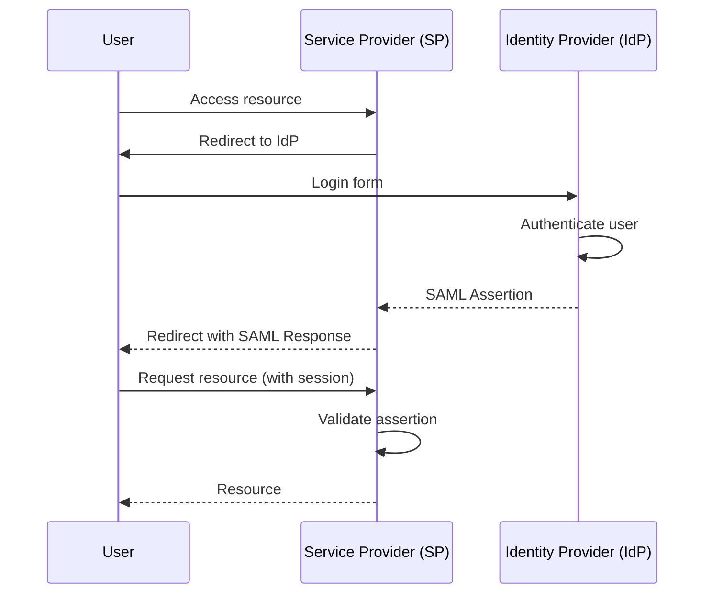

# SSO and SAML: Identity Federation Fundamentals

## Overview

Single Sign-On (SSO) allows users to authenticate once and access multiple applications without re-entering credentials. Security Assertion Markup Language (SAML) is the most widely adopted protocol for enterprise SSO. This guide explains the SSO architecture, SAML protocol flow, assertion structure, and practical implementation patterns.

---

## SSO Architecture

SSO introduces a central identity provider (IdP) that mediates authentication across multiple service providers (SPs):



### Key Components

- **Identity Provider (IdP)**: The authoritative source for user identities and authentication (Okta, Azure AD, Keycloak)
- **Service Provider (SP)**: The application the user wants to access
- **SAML Assertion**: An XML document containing authentication and attribute information
- **Federation Metadata**: XML describing the capabilities and endpoints of IdP and SP

---

## SAML Protocol Deep Dive

### SAML Assertion Structure

A SAML assertion is an XML document with three main parts — the issuer identifies the IdP, the subject identifies the authenticated user, and conditions constrain the assertion's validity window and intended audience. Optional attribute and authentication statements carry user profile data and authentication context:

```xml
<saml:Assertion 
    xmlns:saml="urn:oasis:names:tc:SAML:2.0:assertion"
    ID="_abc123def456"
    IssueInstant="2026-05-11T12:00:00Z"
    Version="2.0">
    
    <!-- 1. Issuer: Identifies the IdP -->
    <saml:Issuer>https://idp.example.com</saml:Issuer>
    
    <!-- 2. Subject: Identifies the authenticated user -->
    <saml:Subject>
        <saml:NameID Format="urn:oasis:names:tc:SAML:1.1:nameid-format:emailAddress">
            abhishek@example.com
        </saml:NameID>
        <saml:SubjectConfirmation Method="urn:oasis:names:tc:SAML:2.0:cm:bearer">
            <saml:SubjectConfirmationData 
                NotOnOrAfter="2026-05-11T12:10:00Z"
                Recipient="https://sp.example.com/saml/acs"/>
        </saml:SubjectConfirmation>
    </saml:Subject>
    
    <!-- 3. Conditions: Constraints on assertion validity -->
    <saml:Conditions 
        NotBefore="2026-05-11T11:55:00Z"
        NotOnOrAfter="2026-05-11T12:10:00Z">
        <saml:AudienceRestriction>
            <saml:Audience>https://sp.example.com</saml:Audience>
        </saml:AudienceRestriction>
    </saml:Conditions>
    
    <!-- 4. Attribute Statement: User attributes -->
    <saml:AttributeStatement>
        <saml:Attribute Name="email" 
            NameFormat="urn:oasis:names:tc:SAML:2.0:attrname-format:basic">
            <saml:AttributeValue>abhishek@example.com</saml:AttributeValue>
        </saml:Attribute>
        <saml:Attribute Name="role"
            NameFormat="urn:oasis:names:tc:SAML:2.0:attrname-format:basic">
            <saml:AttributeValue>admin</saml:AttributeValue>
        </saml:Attribute>
        <saml:Attribute Name="department"
            NameFormat="urn:oasis:names:tc:SAML:2.0:attrname-format:basic">
            <saml:AttributeValue>engineering</saml:AttributeValue>
        </saml:Attribute>
    </saml:AttributeStatement>
    
    <!-- 5. AuthnStatement: Authentication event details -->
    <saml:AuthnStatement 
        AuthnInstant="2026-05-11T12:00:00Z"
        SessionIndex="_session123">
        <saml:AuthnContext>
            <saml:AuthnContextClassRef>
                urn:oasis:names:tc:SAML:2.0:ac:classes:PasswordProtectedTransport
            </saml:AuthnContextClassRef>
        </saml:AuthnContext>
    </saml:AuthnStatement>
</saml:Assertion>
```

### XML Digital Signature

SAML assertions are cryptographically signed to prevent tampering. The signature covers the entire Assertion element using XML Signature syntax. The `CanonicalizationMethod` ensures the signature survives formatting differences, and the `KeyInfo` element embeds the IdP's X509 certificate for verification:

```xml
<!-- The signature covers the entire Assertion element -->
<ds:Signature xmlns:ds="http://www.w3.org/2000/09/xmldsig#">
    <ds:SignedInfo>
        <ds:CanonicalizationMethod 
            Algorithm="http://www.w3.org/2001/10/xml-exc-c14n#"/>
        <ds:SignatureMethod 
            Algorithm="http://www.w3.org/2001/04/xmldsig-more#rsa-sha256"/>
        <ds:Reference URI="#_abc123def456">
            <ds:Transforms>
                <ds:Transform Algorithm="http://www.w3.org/2000/09/xmldsig#enveloped-signature"/>
                <ds:Transform Algorithm="http://www.w3.org/2001/10/xml-exc-c14n#"/>
            </ds:Transforms>
            <ds:DigestMethod Algorithm="http://www.w3.org/2001/04/xmlenc#sha256"/>
            <ds:DigestValue>BASE64_DIGEST_VALUE</ds:DigestValue>
        </ds:Reference>
    </ds:SignedInfo>
    <ds:SignatureValue>BASE64_SIGNATURE_VALUE</ds:SignatureValue>
    <ds:KeyInfo>
        <ds:X509Data>
            <ds:X509Certificate>BASE64_CERTIFICATE</ds:X509Certificate>
        </ds:X509Data>
    </ds:KeyInfo>
</ds:Signature>
```

---

## SAML Flow: SP-Initiated vs IdP-Initiated

### SP-Initiated SSO (most common)

In SP-initiated flow, the user first tries to access a protected resource on the SP. The SP generates an `AuthnRequest`, redirects the user to the IdP, and after successful authentication, the IdP POSTs a SAML response back to the SP's Assertion Consumer Service (ACS) URL:

```java
@Controller
public class SamlSpController {

    @Autowired
    private Saml2AuthenticationRequestContextResolver authRequestResolver;

    // Step 1: User accesses protected resource
    @GetMapping("/dashboard")
    public String dashboard(HttpServletRequest request) {
        Authentication auth = SecurityContextHolder.getContext().getAuthentication();
        
        if (auth == null || !auth.isAuthenticated()) {
            // Step 2: Generate and redirect to IdP
            Saml2AuthenticationRequestContext context = authRequestResolver.resolve(request);
            String redirectUrl = saml2AuthnRequestSigner.sign(context);
            return "redirect:" + redirectUrl;
        }
        
        return "dashboard";
    }

    // Step 5: Handle SAML response from IdP
    @PostMapping("/saml/acs")
    public String handleSamlResponse(HttpServletRequest request) {
        // The SAML filter processes this automatically in Spring Security
        return "redirect:/dashboard";
    }
}
```

### SAML Authentication Request (AuthnRequest)

The `AuthnRequest` tells the IdP which SP is requesting authentication, where to send the response (`AssertionConsumerServiceURL`), and what kind of authentication is needed:

```xml
<samlp:AuthnRequest 
    xmlns:samlp="urn:oasis:names:tc:SAML:2.0:protocol"
    ID="_request123"
    Version="2.0"
    IssueInstant="2026-05-11T11:59:00Z"
    Destination="https://idp.example.com/sso"
    AssertionConsumerServiceURL="https://sp.example.com/saml/acs"
    ProtocolBinding="urn:oasis:names:tc:SAML:2.0:bindings:HTTP-POST"
    ForceAuthn="false"
    IsPassive="false">
    
    <saml:Issuer xmlns:saml="urn:oasis:names:tc:SAML:2.0:assertion">
        https://sp.example.com
    </saml:Issuer>
    
    <samlp:NameIDPolicy 
        Format="urn:oasis:names:tc:SAML:1.1:nameid-format:emailAddress"
        AllowCreate="true"/>
</samlp:AuthnRequest>
```

### IdP-Initiated SSO

In IdP-initiated flow, the user starts at the IdP portal and selects an application to launch. The IdP builds a SAML response without a corresponding `AuthnRequest`:

```java
@RestController
public class SamlIdpController {

    // IdP builds and POSTs assertion to SP's AssertionConsumerService
    @PostMapping("/idp/sso")
    public String handleIdpInitiatedSso(
            @RequestParam("sp") String spEntityId,
            Authentication authentication) {
        
        // Build SAML response with assertion
        Saml2Response response = Saml2Response.builder()
            .inResponseTo(null)  // No AuthnRequest, this is IdP-initiated
            .issuer("https://idp.example.com")
            .subject(authentication.getName())
            .audience(spEntityId)
            .build();
        
        return response.toBase64EncodedXml();
    }
}
```

---

## Implementing SAML with Spring Security

### Spring Boot SAML Configuration

Spring Security's SAML 2.0 support handles the heavy lifting: metadata generation, assertion validation, signature verification, and user session management:

```xml
<dependency>
    <groupId>org.springframework.security</groupId>
    <artifactId>spring-security-saml2-service-provider</artifactId>
</dependency>
```

```java
@Configuration
@EnableWebSecurity
public class SamlSecurityConfig {

    @Bean
    public SecurityFilterChain securityFilterChain(HttpSecurity http) throws Exception {
        http
            .authorizeHttpRequests(auth -> auth
                .requestMatchers("/saml/**").permitAll()
                .anyRequest().authenticated()
            )
            .saml2Login(saml2 -> saml2
                .loginProcessingUrl("/saml/acs")
                .defaultSuccessUrl("/dashboard")
            )
            .saml2Logout(saml2 -> saml2
                .logoutUrl("/saml/logout")
                .logoutSuccessUrl("/")
            );
        
        return http.build();
    }

    @Bean
    public RelyingPartyRegistrationRepository relyingPartyRegistrations() {
        RelyingPartyRegistration registration = RelyingPartyRegistration
            .withRegistrationId("okta")
            .entityId("https://sp.example.com/saml2/service-provider-metadata/{registrationId}")
            .assertionConsumerServiceUrlTemplate("{baseUrl}/saml2/acs/{registrationId}")
            .singleLogoutServiceUrlTemplate("{baseUrl}/saml2/logout/{registrationId}")
            .credentials(credential -> credential
                .privateKey(privateKey)
                .certificate(certificate)
                .credentialType(Saml2X509Credential.Saml2X509CredentialType.DECRYPTION)
            )
            .credentials(credential -> credential
                .privateKey(privateKey)
                .certificate(certificate)
                .credentialType(Saml2X509Credential.Saml2X509CredentialType.SIGNING)
            )
            .assertingPartyDetails(party -> party
                .entityId("https://idp.example.com")
                .singleSignOnServiceLocation("https://idp.example.com/sso")
                .singleSignOnServiceBinding(Saml2MessageBinding.POST)
                .wantAuthnRequestsSigned(true)
                .verificationX509Credentials(cert -> cert
                    .add(new Saml2X509Credential(
                        idpCertificate,
                        Saml2X509Credential.Saml2X509CredentialType.VERIFICATION
                    ))
                )
            )
            .build();
        
        return new InMemoryRelyingPartyRegistrationRepository(registration);
    }
}
```

### Custom SAML User Mapping

When a SAML assertion is received, the user's attributes (email, name, department) are extracted and used to find or create a local user account. This mapping logic is the SP's responsibility — the IdP only provides the claims:

```java
@Component
public class SamlUserMapper implements Saml2AuthenticatedPrincipalFactory {

    @Override
    public AuthenticatedPrincipal createPrincipal(Saml2AuthenticationToken token) {
        Saml2Response response = token.getAuthenticationResponse();
        Assertion assertion = response.getAssertion();
        
        // Extract attributes from SAML assertion
        Map<String, Object> attributes = new HashMap<>();
        for (AttributeStatement attrStmt : assertion.getAttributeStatements()) {
            for (Attribute attr : attrStmt.getAttributes()) {
                attributes.put(attr.getName(), attr.getAttributeValues());
            }
        }
        
        // Find or create user in local database
        String email = (String) attributes.get("email");
        User user = userRepository.findByEmail(email)
            .orElseGet(() -> createUserFromSamlAssertion(attributes));
        
        return new Saml2AuthenticatedPrincipal(
            user.getUsername(),
            user.getAuthorities(),
            attributes
        );
    }
    
    private User createUserFromSamlAssertion(Map<String, Object> attributes) {
        User user = new User();
        user.setEmail((String) attributes.get("email"));
        user.setName((String) attributes.get("displayName"));
        user.setDepartment((String) attributes.get("department"));
        user.setProvider("saml");
        return userRepository.save(user);
    }
}
```

---

## Federation Metadata

SAML IdPs and SPs exchange metadata XML to establish trust. The metadata document describes endpoints, supported bindings, and public keys:

```xml
<md:EntityDescriptor 
    xmlns:md="urn:oasis:names:tc:SAML:2.0:metadata"
    entityID="https://sp.example.com">
    
    <md:SPSSODescriptor 
        protocolSupportEnumeration="urn:oasis:names:tc:SAML:2.0:protocol"
        AuthnRequestsSigned="true"
        WantAssertionsSigned="true">
        
        <md:KeyDescriptor use="signing">
            <ds:KeyInfo xmlns:ds="http://www.w3.org/2000/09/xmldsig#">
                <ds:X509Data>
                    <ds:X509Certificate>MIID...</ds:X509Certificate>
                </ds:X509Data>
            </ds:KeyInfo>
        </md:KeyDescriptor>
        
        <md:AssertionConsumerService 
            Binding="urn:oasis:names:tc:SAML:2.0:bindings:HTTP-POST"
            Location="https://sp.example.com/saml/acs"
            index="1"/>
        
        <md:SingleLogoutService 
            Binding="urn:oasis:names:tc:SAML:2.0:bindings:HTTP-Redirect"
            Location="https://sp.example.com/saml/logout"/>
    </md:SPSSODescriptor>
</md:EntityDescriptor>
```

Spring Security automatically generates and serves this metadata. The configuration below uses the IdP's metadata URI to auto-configure the relying party:

```yaml
# application.yml
spring:
  security:
    saml2:
      relyingparty:
        okta:
          entity-id: https://sp.example.com/saml2/service-provider-metadata/okta
          signing.credentials:
            - private-key-location: classpath:credentials/sp-private-key.pem
              certificate-location: classpath:credentials/sp-certificate.pem
          asserting-party:
            metadata-uri: https://idp.example.com/metadata
```

---

## Common Mistakes

### Mistake 1: Not Validating the Signature

SAML assertions must be cryptographically signed. Accepting unsigned assertions allows an attacker to forge fake login responses:

```java
// WRONG: Accepting unsigned assertions
Saml2AuthenticationToken token = decoder.decode(response);
if (token.getPrincipal() == null) {
    throw new AuthenticationException("No principal");
}
// No signature validation - attacker can forge assertions!

// CORRECT: Spring Security validates signatures automatically
// Configure verification credentials:
@Bean
public RelyingPartyRegistrationRepository registrations() {
    // Provide IdP's X509 certificate for signature verification
    party.verificationX509Credentials(certs -> certs.add(verificationCert));
}
```

### Mistake 2: Weak Audience Restriction

Without audience restriction, an assertion issued for one SP can be replayed against another SP:

```xml
<!-- WRONG: No audience restriction -->
<saml:Conditions>
    <saml:AudienceRestriction>
        <!-- Empty - assertion can be used with any SP -->
    </saml:AudienceRestriction>
</saml:Conditions>

<!-- CORRECT: Explicit audience -->
<saml:Conditions>
    <saml:AudienceRestriction>
        <saml:Audience>https://sp.example.com</saml:Audience>
    </saml:AudienceRestriction>
</saml:Conditions>
```

### Mistake 3: Not Validating Assertion Validity Window

The `NotBefore` and `NotOnOrAfter` timestamps prevent replay attacks by limiting the assertion's validity period:

```java
// WRONG: Not checking NotBefore/NotOnOrAfter
Assertion assertion = response.getAssertion();
// No time validation - replay attacks possible!

// CORRECT: Validate time constraints
Instant now = Instant.now();
if (now.isBefore(assertion.getConditions().getNotBefore())) {
    throw new AuthenticationException("Assertion not yet valid");
}
if (now.isAfter(assertion.getConditions().getNotOnOrAfter())) {
    throw new AuthenticationException("Assertion expired");
}
```

### Mistake 4: Accepting Unsolicited Assertions

An attacker could capture a valid SAML response (e.g., via network interception) and replay it later. For SP-initiated flows, verify `InResponseTo` matches a pending `AuthnRequest`:

```java
// WRONG: Accepting IdP-initiated SSO without verifying InResponseTo
// An attacker could replay a captured assertion

// CORRECT: Verify InResponseTo for SP-initiated flows
String inResponseTo = response.getInResponseTo();
if (inResponseTo != null) {
    // Verify this matches a pending AuthnRequest
    if (!authnRequestStore.isPending(inResponseTo)) {
        throw new AuthenticationException("Unexpected response to unknown request");
    }
    authnRequestStore.remove(inResponseTo);
}
```

---

## SAML vs OIDC Comparison

| Feature | SAML 2.0 | OpenID Connect |
|---------|----------|----------------|
| Protocol | XML-based | JSON-based |
| Message format | XML (heavy) | JWT (compact) |
| Transport | HTTP POST / Redirect | HTTP POST / Redirect |
| API-friendly | No (XML heavy) | Yes (REST-friendly) |
| Mobile support | Poor | Good |
| Session management | SLO (Single Logout) | RP-initiated logout |
| Standard body | OASIS | OpenID Foundation |
| Enterprise adoption | Legacy widespread | Growing rapidly |

---

## Summary

SAML 2.0 provides a robust, battle-tested protocol for enterprise SSO and identity federation. The XML-based assertion structure supports rich attribute exchange, audience restriction, and expiration controls. Spring Security's SAML 2.0 support simplifies SP implementation with automatic metadata generation, signature verification, and user mapping. While OIDC is more modern and API-friendly, SAML remains the standard for enterprise environments requiring integration with legacy IdPs.

---

## References

- [OASIS SAML 2.0 Specification](https://docs.oasis-open.org/security/saml/v2.0/)
- [Spring Security SAML 2.0](https://docs.spring.io/spring-security/reference/servlet/saml2/index.html)
- [Okta SAML Guide](https://developer.okta.com/docs/concepts/saml/)
- [Keycloak SAML Documentation](https://www.keycloak.org/docs/latest/securing_apps/#saml-2-0-support)
- [OWASP SAML Security Cheat Sheet](https://cheatsheetseries.owasp.org/cheatsheets/SAML_Security_Cheat_Sheet.html)

Happy Coding
