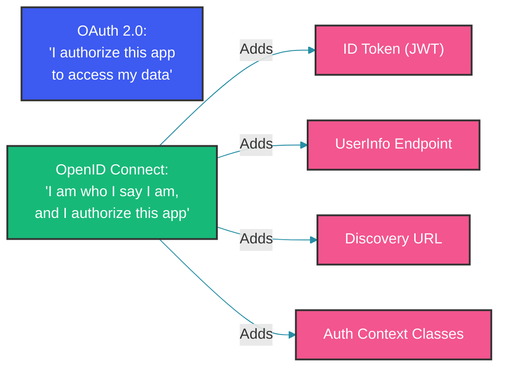

# OpenID Connect: Authentication Layer for OAuth2

## Overview

OpenID Connect (OIDC) is an identity layer built on top of OAuth 2.0. While OAuth2 provides authorization (delegated access), OIDC adds authentication (identity verification). The key addition is the ID Token—a JWT that contains verified claims about the authenticated user. This guide covers ID token structure, OIDC discovery, the authentication flow, and practical implementation.

---

## OIDC vs OAuth2



OAuth2 alone does not authenticate the user. It only delegates access. OIDC adds:

1. **ID Token** (JWT): Proves the user was authenticated
2. **UserInfo Endpoint**: Returns user claims
3. **Discovery**: Standardized provider metadata
4. **Authentication Classes**: Strength of authentication

---

## ID Token Structure

The ID token is a JWT with specific claims defined by OIDC. The `iss` (issuer), `sub` (subject), `aud` (audience), `exp`, and `iat` are required. Standard claims like `name`, `email`, and `picture` carry user profile data. The `nonce` claim prevents replay attacks, and `acr`/`amr` indicate the authentication strength and methods used:

```json
{
  "iss": "https://auth.example.com",
  "sub": "1234567890",
  "aud": ["client-id-123"],
  "exp": 1716000000,
  "iat": 1715996400,
  "auth_time": 1715996400,
  "nonce": "n-0S6_WzA2Mj",
  "acr": "urn:mace:incommon:iap:silver",
  "amr": ["pwd", "otp"],
  "azp": "client-id-123",
  "at_hash": "MTIzNDU2Nzg5MDEyMzQ1Ng",
  "c_hash": "Nzg5MDEyMzQ1Njc4OTAxMg",
  "name": "Abhishek Tiwari",
  "email": "abhishek@example.com",
  "email_verified": true,
  "picture": "https://auth.example.com/photo.jpg"
}
```

### Required Claims

| Claim | Description |
|-------|-------------|
| `iss` | Issuer identifier (must match discovery URL) |
| `sub` | Subject identifier (unique, never reused) |
| `aud` | Audience (client IDs this token is for) |
| `exp` | Expiration time |
| `iat` | Issued at time |

### Standard Claims

| Claim | Type | Description |
|-------|------|-------------|
| `name` | String | End-user's full name |
| `given_name` | String | Given name |
| `family_name` | String | Surname |
| `email` | String | Email address |
| `email_verified` | Boolean | Whether email was verified |
| `phone_number` | String | Phone number |
| `address` | JSON | Formatted address |
| `updated_at` | Number | Time profile was updated |

---

## OIDC Discovery

OIDC providers expose a discovery document at a well-known URL that lists all endpoints, supported scopes, response types, and signing algorithms. Clients use this document to auto-configure themselves:

```http
GET https://auth.example.com/.well-known/openid-configuration
```

```json
{
  "issuer": "https://auth.example.com",
  "authorization_endpoint": "https://auth.example.com/oauth2/authorize",
  "token_endpoint": "https://auth.example.com/oauth2/token",
  "userinfo_endpoint": "https://auth.example.com/userinfo",
  "end_session_endpoint": "https://auth.example.com/logout",
  "jwks_uri": "https://auth.example.com/.well-known/jwks.json",
  "scopes_supported": ["openid", "profile", "email", "address", "phone", "offline_access"],
  "response_types_supported": ["code", "code id_token", "id_token", "token id_token"],
  "grant_types_supported": ["authorization_code", "implicit", "refresh_token", "client_credentials"],
  "acr_values_supported": ["urn:mace:incommon:iap:silver", "urn:mace:incommon:iap:bronze"],
  "subject_types_supported": ["public", "pairwise"],
  "id_token_signing_alg_values_supported": ["RS256", "ES256"],
  "token_endpoint_auth_methods_supported": ["client_secret_basic", "client_secret_post", "private_key_jwt"],
  "claims_supported": ["sub", "iss", "aud", "exp", "iat", "name", "email", "picture"],
  "code_challenge_methods_supported": ["S256", "plain"]
}
```

### Using Discovery in Spring Security

When you specify an `issuerUri`, Spring Security automatically fetches the discovery document and configures all endpoints — no need to manually specify authorization, token, or JWKS URIs:

```java
@Configuration
public class OidcConfig {

    @Bean
    public ClientRegistrationRepository clientRegistrationRepository() {
        // Spring Security can auto-configure from issuer URI using discovery
        return new InMemoryClientRegistrationRepository(
            ClientRegistration
                .withRegistrationId("oidc-provider")
                .issuerUri("https://auth.example.com")
                .clientId("my-client-id")
                .clientSecret("my-client-secret")
                .scope("openid", "profile", "email")
                .build()
        );
    }
}
```

Spring Security automatically fetches the discovery document and configures all endpoints.

---

## Authentication Flow with OIDC

### Requesting an ID Token

To request an ID token, include the `openid` scope in the authorization request. A `nonce` parameter is added — it will be embedded in the ID token and must be validated to prevent replay attacks:

```java
public class OidcAuthorizationRequest {

    public String buildRequest(ClientRegistration reg) {
        String nonce = generateNonce();
        String state = generateState();

        // Store nonce in session for ID token validation
        storeNonce(nonce);
        storeState(state);

        return UriComponentsBuilder
            .fromUriString(reg.getProviderDetails().getAuthorizationUri())
            .queryParam("response_type", "code")
            .queryParam("client_id", reg.getClientId())
            .queryParam("redirect_uri", reg.getRedirectUri())
            .queryParam("scope", "openid profile email")
            .queryParam("state", state)
            .queryParam("nonce", nonce)  // OIDC-specific
            .build()
            .toUriString();
    }

    private String generateNonce() {
        byte[] nonce = new byte[32];
        new SecureRandom().nextBytes(nonce);
        return Base64.getUrlEncoder().withoutPadding().encodeToString(nonce);
    }
}
```

### Validating the ID Token

ID token validation must check signature, issuer, audience, nonce, expiration, and optionally `auth_time`. Each check prevents a specific attack — signature prevents forgery, nonce prevents replay, expiration limits the window of exploit:

```java
@Component
public class IdTokenValidator {

    private final JwtDecoder jwtDecoder;

    public IdTokenValidator(JwtDecoder jwtDecoder) {
        this.jwtDecoder = jwtDecoder;
    }

    public OidcUser validateIdToken(String idToken, 
                                     String expectedNonce,
                                     String expectedIssuer,
                                     String expectedClientId) {
        // Step 1: Decode and verify signature
        Jwt jwt = jwtDecoder.decode(idToken);

        // Step 2: Verify issuer
        if (!expectedIssuer.equals(jwt.getIssuer())) {
            throw new OidcValidationException("Issuer mismatch");
        }

        // Step 3: Verify audience includes our client ID
        List<String> audience = jwt.getAudience();
        if (!audience.contains(expectedClientId)) {
            throw new OidcValidationException("Audience mismatch");
        }

        // Step 4: Verify nonce (prevents replay attacks)
        String nonce = jwt.getClaimAsString("nonce");
        if (!expectedNonce.equals(nonce)) {
            throw new OidcValidationException("Nonce mismatch - possible replay attack");
        }

        // Step 5: Verify expiration
        Instant now = Instant.now();
        if (now.isAfter(jwt.getExpiresAt())) {
            throw new OidcValidationException("ID token expired");
        }

        // Step 6: Verify auth_time if present (within acceptable range)
        Instant authTime = jwt.getClaimAsInstant("auth_time");
        if (authTime != null) {
            Duration maxAge = Duration.ofHours(1);
            if (Duration.between(authTime, now).abs().compareTo(maxAge) > 0) {
                throw new OidcValidationException("Authentication too old");
            }
        }

        return new OidcUser(jwt);
    }
}
```

### UserInfo Endpoint

The UserInfo endpoint returns additional claims about the authenticated user. It requires a valid access token (not the ID token) for authorization. The response includes the `sub` claim which should match the ID token's `sub`:

```java
@Component
public class UserInfoClient {

    private final RestTemplate restTemplate;

    public OidcUserInfo fetchUserInfo(String accessToken, 
                                       ClientRegistration registration) {
        HttpHeaders headers = new HttpHeaders();
        headers.setBearerAuth(accessToken);
        headers.setAccept(List.of(MediaType.APPLICATION_JSON));

        HttpEntity<Void> request = new HttpEntity<>(headers);

        ResponseEntity<OidcUserInfo> response = restTemplate.exchange(
            registration.getProviderDetails().getUserInfoEndpoint(),
            HttpMethod.GET,
            request,
            OidcUserInfo.class
        );

        // Verify the sub claim matches the ID token sub
        OidcUserInfo userInfo = response.getBody();
        return userInfo;
    }
}

@Data
public class OidcUserInfo {
    private String sub;
    private String name;
    private String givenName;
    private String familyName;
    private String preferredUsername;
    private String email;
    private Boolean emailVerified;
    private String phoneNumber;
    private String picture;
}
```

---

## OIDC in Spring Security

### Complete OIDC Login Configuration

Spring Security's OIDC support streamlines the entire flow. The `DefaultOidcUserService` handles ID token validation, UserInfo fetching, and user creation. The custom `oidcUserService` below intercepts the OIDC user to create or look up a local user account:

```java
@Configuration
@EnableWebSecurity
public class OidcLoginConfig {

    @Bean
    public SecurityFilterChain securityFilterChain(HttpSecurity http) throws Exception {
        http
            .authorizeHttpRequests(auth -> auth
                .requestMatchers("/", "/login", "/error").permitAll()
                .anyRequest().authenticated()
            )
            .oauth2Login(oauth2 -> oauth2
                .loginPage("/login")
                .defaultSuccessUrl("/dashboard", true)
                .userInfoEndpoint(userInfo -> userInfo
                    .oidcUserService(oidcUserService())
                )
            )
            .oauth2Client(Customizer.withDefaults());

        return http.build();
    }

    @Bean
    public OAuth2UserService<OidcUserRequest, OidcUser> oidcUserService() {
        DefaultOidcUserService delegate = new DefaultOidcUserService();

        return request -> {
            OidcUser user = delegate.loadUser(request);

            // Custom user creation/mapping
            OidcUserInfo userInfo = user.getUserInfo();
            String email = userInfo.getEmail();

            // Find or create user in local database
            User localUser = userRepository.findByEmail(email)
                .orElseGet(() -> createUserFromOidc(userInfo));

            // Return custom OidcUser with local authorities
            return new DefaultOidcUser(
                localUser.getAuthorities(),
                user.getIdToken(),
                user.getUserInfo()
            );
        };
    }

    private User createUserFromOidc(OidcUserInfo userInfo) {
        User user = new User();
        user.setEmail(userInfo.getEmail());
        user.setName(userInfo.getName());
        user.setProvider("oidc");
        user.setProviderId(userInfo.getSubject());
        return userRepository.save(user);
    }
}
```

### Accessing the OIDC User

Once authenticated, the OIDC user's claims are available through the `OidcUser` object stored in the security context. This provides verified identity data (email, name, subject) for personalization and authorization:

```java
@RestController
@RequestMapping("/api")
public class UserController {

    @GetMapping("/me")
    public Map<String, Object> getCurrentUser() {
        Authentication auth = SecurityContextHolder.getContext().getAuthentication();

        if (auth instanceof OAuth2AuthenticationToken oauthToken) {
            // Access OIDC-specific attributes
            OidcUser oidcUser = (OidcUser) oauthToken.getPrincipal();

            return Map.of(
                "username", oidcUser.getName(),
                "email", oidcUser.getEmail(),
                "claims", oidcUser.getClaims(),
                "issuer", oidcUser.getIssuer(),
                "subject", oidcUser.getSubject()
            );
        }

        return Map.of("error", "Not authenticated with OIDC");
    }

    @GetMapping("/admin/users")
    @PreAuthorize("hasAuthority('SCOPE_admin')")
    public List<User> listUsers() {
        return userRepository.findAll();
    }
}
```

---

## OIDC Logout (RP-Initiated Logout)

Single logout requires coordination between the application and the IdP. After invalidating the local session, the application redirects the user to the IdP's `end_session_endpoint` with the ID token as a hint. The IdP then terminates the SSO session, potentially logging the user out of all applications:

```java
@Controller
public class LogoutController {

    @PostMapping("/logout")
    public String logout(HttpServletRequest request, 
                          HttpServletResponse response,
                          Authentication authentication) {
        // Step 1: Invalidate local session
        SecurityContextHolder.clearContext();
        HttpSession session = request.getSession(false);
        if (session != null) {
            session.invalidate();
        }

        // Step 2: Redirect to IdP's end_session_endpoint
        if (authentication instanceof OAuth2AuthenticationToken oauthToken) {
            ClientRegistration registration = clientRegistrationRepository
                .findByRegistrationId(oauthToken.getAuthorizedClientRegistrationId());

            String endSessionEndpoint = registration
                .getProviderDetails()
                .getConfigurationMetadata()
                .get("end_session_endpoint");

            if (endSessionEndpoint != null) {
                String idTokenHint = ((OidcUser) oauthToken.getPrincipal())
                    .getIdToken().getTokenValue();

                String logoutUrl = UriComponentsBuilder
                    .fromUriString(endSessionEndpoint)
                    .queryParam("id_token_hint", idTokenHint)
                    .queryParam("post_logout_redirect_uri", 
                        "https://app.example.com/logged-out")
                    .queryParam("state", generateState())
                    .build()
                    .toUriString();

                return "redirect:" + logoutUrl;
            }
        }

        return "redirect:/login";
    }
}
```

---

## Common Mistakes

### Mistake 1: Treating OAuth2 as Authentication

OAuth2 access tokens are opaque to the client — they do not contain user identity. Using them for authentication is incorrect:

```java
// WRONG: Using OAuth2 access token alone for authentication
// Access tokens are opaque to the client; they contain no user identity
@GetMapping("/whoami")
public String whoami(OAuth2AuthenticationToken token) {
    // The access token alone doesn't tell you who the user is
    return token.getName();  // May be "user" or undefined
}

// CORRECT: Use ID token for authentication
@GetMapping("/whoami")
public String whoami() {
    OidcUser user = (OidcUser) SecurityContextHolder.getContext()
        .getAuthentication().getPrincipal();
    return user.getEmail();  // Verified identity from ID token
}
```

### Mistake 2: Not Validating the Nonce

Without nonce validation, a captured ID token can be replayed by an attacker:

```java
// WRONG: Skipping nonce validation
// Attacker can replay a captured ID token
OidcUser user = oidcUserService.loadUser(request);
// Missing nonce check

// CORRECT: Validate nonce from the authorization request
OidcUser user = oidcUserService.loadUser(request);
String expectedNonce = (String) session.getAttribute("nonce");
String actualNonce = user.getIdToken().getClaimAsString("nonce");
if (!expectedNonce.equals(actualNonce)) {
    throw new AuthenticationException("Nonce validation failed");
}
```

### Mistake 3: Using Access Token Instead of ID Token for Authorization

Basing authorization decisions on access token scopes is wrong — scopes represent delegated permissions, not user identity:

```java
// WRONG: Basing authz decisions on access token scopes
if (token.getAuthorities().contains("SCOPE_email")) {
    // This only means the client has permission to read email
    // It doesn't authenticate the user
}

// CORRECT: Use ID token for authentication, access token for API calls
// Authentication: validated ID token claims (sub, email, etc.)
// Authorization: validated access token scopes
```

---

## Summary

OpenID Connect adds a critical authentication layer to OAuth2 by introducing the ID token—a signed JWT containing verified user claims. OIDC discovery standardizes provider configuration, making client setup automatic. The nonce claim prevents replay attacks, and the UserInfo endpoint provides additional user data. Always validate the ID token's signature, issuer, audience, and nonce before trusting its claims.

---

## References

- [OpenID Connect Core 1.0](https://openid.net/specs/openid-connect-core-1_0.html)
- [OpenID Connect Discovery 1.0](https://openid.net/specs/openid-connect-discovery-1_0.html)
- [OpenID Connect RP-Initiated Logout](https://openid.net/specs/openid-connect-rpinitiated-1_0.html)
- [Spring Security OIDC](https://docs.spring.io/spring-security/reference/servlet/oauth2/login/oidc.html)
- [JSON Web Token (JWT) - RFC 7519](https://tools.ietf.org/html/rfc7519)

Happy Coding
