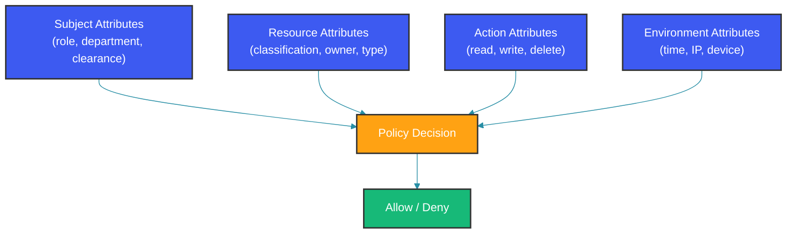

# RBAC vs ABAC: Access Control Models

## Overview

Authorization determines what an authenticated user can do. Two dominant models exist: Role-Based Access Control (RBAC) and Attribute-Based Access Control (ABAC). RBAC assigns permissions through roles; ABAC evaluates policies against arbitrary attributes of the user, resource, and environment. Understanding when to use each—and how to implement them—is critical for building secure, maintainable authorization systems.

---

## RBAC: Role-Based Access Control

### Core Concepts

RBAC defines three fundamental entities:

- **Users**: Identities that perform actions
- **Roles**: Job functions or responsibility levels (e.g., ADMIN, MANAGER, USER)
- **Permissions**: Approvals to perform operations on resources (e.g., READ_ORDER, WRITE_ORDER)


### Implementation in Spring Security

RBAC in Spring Security maps roles to `GrantedAuthority` objects with the `ROLE_` prefix. The `hasRole("ADMIN")` method automatically checks for `ROLE_ADMIN`:

```java
// 1. Define roles as simple enums or strings
public enum Role {
    ADMIN,
    MANAGER,
    USER,
    AUDITOR
}

// 2. Assign roles through GrantedAuthority
@Configuration
@EnableWebSecurity
public class RbacSecurityConfig {

    @Bean
    public SecurityFilterChain securityFilterChain(HttpSecurity http) throws Exception {
        http
            .authorizeHttpRequests(auth -> auth
                // URL-based role checking
                .requestMatchers("/admin/**").hasRole("ADMIN")
                .requestMatchers("/manager/**").hasAnyRole("ADMIN", "MANAGER")
                .requestMatchers("/api/orders/**").authenticated()
                .anyRequest().permitAll()
            );
        return http.build();
    }
}
```

### Hierarchical RBAC

Role hierarchies allow senior roles to inherit permissions from junior roles. The `User` entity below loads roles with their inherited roles and builds the full set of granted authorities:

```java
@Entity
public class User {

    @Id
    private Long id;
    private String username;

    @ManyToMany(fetch = FetchType.EAGER)
    @JoinTable(
        name = "user_roles",
        joinColumns = @JoinColumn(name = "user_id"),
        inverseJoinColumns = @JoinColumn(name = "role_id")
    )
    private Set<Role> roles = new HashSet<>();

    public Collection<? extends GrantedAuthority> getAuthorities() {
        Set<GrantedAuthority> authorities = new HashSet<>();
        for (Role role : roles) {
            authorities.add(new SimpleGrantedAuthority("ROLE_" + role.getName()));
            // Add inherited roles for hierarchy
            for (Role inherited : role.getInheritedRoles()) {
                authorities.add(new SimpleGrantedAuthority("ROLE_" + inherited.getName()));
            }
        }
        return authorities;
    }
}

@Entity
public class Role {

    @Id
    private Long id;
    private String name;

    @ManyToMany
    @JoinTable(
        name = "role_hierarchy",
        joinColumns = @JoinColumn(name = "parent_role_id"),
        inverseJoinColumns = @JoinColumn(name = "child_role_id")
    )
    private Set<Role> inheritedRoles = new HashSet<>();

    @ManyToMany
    private Set<Permission> permissions = new HashSet<>();
}
```

### Role-User Assignment Table

The database schema for RBAC is straightforward — junction tables link users to roles and roles to permissions:

```sql
CREATE TABLE roles (
    id BIGINT PRIMARY KEY,
    name VARCHAR(50) UNIQUE NOT NULL,
    description VARCHAR(255)
);

CREATE TABLE user_roles (
    user_id BIGINT REFERENCES users(id),
    role_id BIGINT REFERENCES roles(id),
    PRIMARY KEY (user_id, role_id)
);

CREATE TABLE role_permissions (
    role_id BIGINT REFERENCES roles(id),
    permission VARCHAR(100),
    PRIMARY KEY (role_id, permission)
);
```

### When RBAC Works Well

RBAC is ideal when:
- Roles are stable and well-defined (fewer than 50)
- Permission sets are relatively small
- The organization has clear job functions
- Audit requirements are role-based
- Performance is critical (simple role check is O(1))

---

## ABAC: Attribute-Based Access Control

### Core Concepts

ABAC evaluates policies that consider multiple attributes:

- **Subject attributes**: User's role, department, clearance level, location
- **Resource attributes**: Document classification, owner, creation date
- **Action attributes**: Read, write, delete, approve
- **Environment attributes**: Time of day, IP address, device type



### Policy Definition with Spring Security Method Security

ABAC policies in Spring Security are typically expressed through custom `PermissionEvaluator` implementations or SpEL expressions. The evaluator below implements multiple policies: owners can do anything, managers can read department documents, confidential documents are blocked outside business hours:

```java
@Configuration
@EnableMethodSecurity
public class AbacSecurityConfig {

    @Bean
    public RoleHierarchy roleHierarchy() {
        return new RoleHierarchyImpl("ROLE_ADMIN > ROLE_MANAGER > ROLE_USER");
    }
}

// Custom permission evaluator
@Component
public class DocumentPermissionEvaluator implements PermissionEvaluator {

    @Override
    public boolean hasPermission(Authentication auth, 
                                  Object targetDomainObject, 
                                  Object permission) {
        if (auth == null || !(targetDomainObject instanceof Document)) {
            return false;
        }

        User user = (User) auth.getPrincipal();
        Document doc = (Document) targetDomainObject;

        // ABAC policy evaluation
        return evaluatePolicy(user, doc, (String) permission);
    }

    @Override
    public boolean hasPermission(Authentication auth,
                                  Serializable targetId,
                                  String targetType,
                                  Object permission) {
        // Load resource by ID and evaluate
        Document doc = documentRepository.findById((Long) targetId)
            .orElse(null);
        if (doc == null) return false;

        return hasPermission(auth, doc, permission);
    }

    private boolean evaluatePolicy(User user, Document doc, String action) {
        // Policy 1: Owner can do anything
        if (doc.getOwnerId().equals(user.getId())) {
            return true;
        }

        // Policy 2: Managers can read department documents
        if (user.hasRole("MANAGER") && 
            user.getDepartment().equals(doc.getDepartment()) &&
            "READ".equals(action)) {
            return true;
        }

        // Policy 3: Documents classified above user's clearance are denied
        if (doc.getClassification().ordinal() > 
            user.getClearanceLevel().ordinal()) {
            return false;
        }

        // Policy 4: Time-based access
        if (doc.getClassification() == Classification.CONFIDENTIAL &&
            !isBusinessHours()) {
            return false;
        }

        return false;
    }

    private boolean isBusinessHours() {
        LocalTime now = LocalTime.now();
        return now.isAfter(LocalTime.of(9, 0)) && 
               now.isBefore(LocalTime.of(18, 0));
    }
}
```

### Using ABAC in Controllers

The `@PreAuthorize("hasPermission(...)")` annotation integrates the custom evaluator with controller methods:

```java
@RestController
@RequestMapping("/documents")
public class DocumentController {

    @Autowired
    private DocumentService documentService;

    @GetMapping("/{id}")
    @PreAuthorize("hasPermission(#id, 'Document', 'READ')")
    public Document getDocument(@PathVariable Long id) {
        return documentService.findById(id);
    }

    @PutMapping("/{id}")
    @PreAuthorize("hasPermission(#document, 'WRITE')")
    public Document updateDocument(@RequestBody Document document) {
        return documentService.save(document);
    }

    @DeleteMapping("/{id}")
    @PreAuthorize("hasPermission(#id, 'Document', 'DELETE')")
    public void deleteDocument(@PathVariable Long id) {
        documentService.delete(id);
    }
}
```

### Policy as Code: Using a Policy Engine

For complex ABAC, use a dedicated policy engine that evaluates rules dynamically. Each rule is a lambda that receives the full access context and returns allow or deny:

```java
// Define policies as rules
@Component
public class PolicyEngine {

    private final Set<Policy> policies = new HashSet<>();

    @PostConstruct
    public void initPolicies() {
        policies.add(new Policy(
            "manager-read-department-docs",
            (ctx) -> ctx.getUser().hasRole("MANAGER") &&
                     ctx.getUser().getDepartment()
                         .equals(ctx.getResource().getAttribute("department")),
            Effect.ALLOW
        ));

        policies.add(new Policy(
            "confidential-business-hours",
            (ctx) -> ctx.getResource().getAttribute("classification")
                        .equals("CONFIDENTIAL") &&
                     !isBusinessHours(),
            Effect.DENY
        ));
    }

    public Decision evaluate(AccessRequest request) {
        EvaluationContext ctx = new EvaluationContext(request);

        for (Policy policy : policies) {
            if (policy.matches(ctx)) {
                if (policy.getEffect() == Effect.DENY) {
                    return Decision.DENY;
                }
                // Continue evaluating ALLOW policies
            }
        }

        return Decision.DENY;  // Default deny
    }
}
```

---

## RBAC vs ABAC Comparison

| Aspect | RBAC | ABAC |
|--------|------|------|
| Model simplicity | Simple, easy to understand | Complex, requires policy design |
| Administration | Role provisioning | Policy management |
| Granularity | Course (role-level) | Fine-grained (attribute-level) |
| Scalability (users) | Excellent | Excellent |
| Scalability (policies) | Poor over 50 roles | Good |
| Dynamic policies | No (role changes needed) | Yes (attribute-driven) |
| Performance | O(1) role check | O(n) policy evaluation |
| Audit trail | Who had which role | Why access was granted |
| Implementation complexity | Low | High |

---

## Hybrid Approach: RBAC with ABAC Constraints

Most production systems use a hybrid: RBAC for broad permissions (fast path), ABAC for fine-grained constraints (slow path). The hybrid manager below first checks the role, then evaluates attribute-based constraints:

```java
@Component
public class HybridAuthorizationManager {

    // Step 1: RBAC check (fast path, denies most unauthorized access early)
    public boolean checkAccess(User user, String action, Object resource) {
        if (!hasRequiredRole(user, action)) {
            return false;
        }

        // Step 2: ABAC constraints (fine-grained checks)
        return evaluateConstraints(user, action, resource);
    }

    private boolean hasRequiredRole(User user, String action) {
        // Map actions to required roles
        Map<String, String> actionRoleMap = Map.of(
            "READ_ORDER", "ROLE_USER",
            "WRITE_ORDER", "ROLE_MANAGER",
            "DELETE_ORDER", "ROLE_ADMIN"
        );

        String requiredRole = actionRoleMap.get(action);
        return requiredRole == null || 
               user.getAuthorities().stream()
                   .anyMatch(a -> a.getAuthority().equals(requiredRole));
    }

    private boolean evaluateConstraints(User user, String action, Object resource) {
        if (resource instanceof Order order) {
            // Users can only read their own orders
            if ("READ_ORDER".equals(action)) {
                return order.getCustomerId().equals(user.getId()) ||
                       user.hasRole("ROLE_ADMIN");
            }

            // Managers can write orders in their region
            if ("WRITE_ORDER".equals(action)) {
                return order.getRegion().equals(user.getRegion());
            }
        }

        return true;
    }
}
```

---

## Common Mistakes

### Mistake 1: Too Many Roles

Creating a role for every permission combination leads to "role explosion" — dozens or hundreds of roles that are impossible to manage:

```java
// WRONG: Proliferating roles for every permission combination
// This leads to "role explosion"
enum Role {
    ORDER_READER,
    ORDER_WRITER,
    ORDER_DELETER,
    ORDER_APPROVER,
    ORDER_READER_AND_WRITER,
    ORDER_ALL,
    // 50+ more combinations...
}

// CORRECT: Use a few roles with ABAC constraints
// or use permission-based roles
enum Role {
    ADMIN,      // All permissions
    MANAGER,    // Write, approve
    USER,       // Read own, limited write
    AUDITOR     // Read all, no write
}
```

### Mistake 2: Hardcoding Permission Logic

Scattering permission checks across services makes the authorization model impossible to audit or modify:

```java
// WRONG: Scattered permission checks
@Service
public class OrderService {
    public void updateOrder(Long orderId, OrderUpdate update) {
        Authentication auth = SecurityContextHolder.getContext().getAuthentication();
        User user = (User) auth.getPrincipal();

        if (!user.hasRole("MANAGER") && !order.getUserId().equals(user.getId())) {
            throw new AccessDeniedException("Access denied");
        }
        // Business logic mixed with authorization
    }
}

// CORRECT: Centralized authorization
@Service
public class OrderService {
    public void updateOrder(Long orderId, OrderUpdate update) {
        // Business logic only
        Order order = orderRepository.findById(orderId)
            .orElseThrow(() -> new NotFoundException("Order not found"));
        order.applyUpdate(update);
        orderRepository.save(order);
    }
}

// Authorization in a separate layer
@Aspect
@Component
public class AuthorizationAspect {
    @Around("@annotation(CheckAccess)")
    public Object checkAccess(ProceedingJoinPoint pjp) throws Throwable {
        // Centralized authorization logic
        return pjp.proceed();
    }
}
```

---

## Summary

RBAC provides simple, fast access control through role assignment, suitable for applications with stable, well-defined roles. ABAC offers flexible, fine-grained control through attribute-based policy evaluation, suited for complex domains with dynamic access requirements. A hybrid approach combining RBAC for broad role checks with ABAC for fine-grained constraints offers the best balance of simplicity and flexibility.

---

## References

- [NIST RBAC Model](https://csrc.nist.gov/projects/role-based-access-control)
- [NIST ABAC Definition](https://csrc.nist.gov/publications/detail/sp/800-162/final)
- [Spring Security Authorization](https://docs.spring.io/spring-security/reference/servlet/authorization/index.html)
- [OWASP Access Control Cheat Sheet](https://cheatsheetseries.owasp.org/cheatsheets/Access_Control_Cheat_Sheet.html)

Happy Coding
