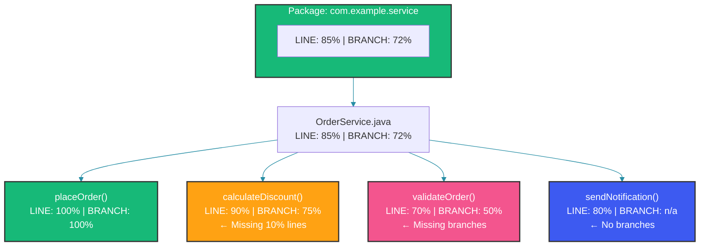

# Code Coverage Metrics

## Overview

Code coverage measures how much of your source code is executed by tests. While 100% coverage doesn't guarantee bug-free code, low coverage almost guarantees bugs. This guide covers JaCoCo setup, line vs branch coverage, mutation testing, coverage thresholds, and practical strategies for meaningful coverage.

---

## Types of Coverage

### Line Coverage

Measures which lines of code were executed:

```java
public double calculateTotal(List<Item> items) {
    double total = 0.0;           // Line 1
    for (Item item : items) {     // Line 2
        total += item.getPrice(); // Line 3 (90% coverage = 9/10 lines)
    }
    return total;                 // Line 4
}
```

### Branch Coverage

Measures which decision paths were taken:

```java
public String getStatus(double total) {
    if (total > 100) {            // Branch 1: true (covered)
        return "HIGH";            // Branch 1a
    } else if (total > 50) {     // Branch 2: false (NOT covered)
        return "MEDIUM";          // Branch 2a
    } else {                     // Branch 3: true (covered)
        return "LOW";            // Branch 3a
    }
}
// Branch coverage: 3/4 = 75% (missing the `total > 50` true path)
```

Branch coverage is more meaningful than line coverage because it reveals untested decision paths. A method could have 100% line coverage but only 50% branch coverage if some conditional branches are never exercised.

### Mutation Coverage

Evaluates test quality by introducing small code changes (mutations) and checking if tests catch them:

```java
// Original code
public boolean isAdult(int age) {
    return age >= 18;
}

// Mutation 1: Change >= to >
// return age > 18;  // <= Good test catches this

// Mutation 2: Change return value
// return false;     // <= Good test catches this

// Mutation 3: Invert condition
// return age < 18;  // <= Good test catches this
```

---

## JaCoCo Setup

### Maven Configuration

```xml
<plugin>
    <groupId>org.jacoco</groupId>
    <artifactId>jacoco-maven-plugin</artifactId>
    <version>0.8.11</version>
    <executions>
        <!-- Prepares agent before tests -->
        <execution>
            <id>prepare-agent</id>
            <goals>
                <goal>prepare-agent</goal>
            </goals>
        </execution>
        
        <!-- Generate report after tests -->
        <execution>
            <id>report</id>
            <phase>verify</phase>
            <goals>
                <goal>report</goal>
            </goals>
        </execution>
        
        <!-- Enforce coverage thresholds -->
        <execution>
            <id>check</id>
            <phase>verify</phase>
            <goals>
                <goal>check</goal>
            </goals>
            <configuration>
                <rules>
                    <rule>
                        <element>BUNDLE</element>
                        <limits>
                            <limit>
                                <counter>LINE</counter>
                                <value>COVEREDRATIO</value>
                                <minimum>0.80</minimum>
                            </limit>
                            <limit>
                                <counter>BRANCH</counter>
                                <value>COVEREDRATIO</value>
                                <minimum>0.70</minimum>
                            </limit>
                            <limit>
                                <counter>INSTRUCTION</counter>
                                <value>COVEREDRATIO</value>
                                <minimum>0.80</minimum>
                            </limit>
                        </limits>
                    </rule>
                    
                    <!-- Per-class rules -->
                    <rule>
                        <element>CLASS</element>
                        <limits>
                            <limit>
                                <counter>LINE</counter>
                                <value>COVEREDRATIO</value>
                                <minimum>0.50</minimum>
                            </limit>
                        </limits>
                        <excludes>
                            <exclude>**/*Configuration.class</exclude>
                            <exclude>**/*Application.class</exclude>
                            <exclude>**/*Dto.class</exclude>
                            <exclude>**/*Request.class</exclude>
                            <exclude>**/*Response.class</exclude>
                        </excludes>
                    </rule>
                </rules>
            </configuration>
        </execution>
    </executions>
</plugin>
```

### Gradle Configuration

```groovy
plugins {
    id 'jacoco'
}

jacoco {
    toolVersion = "0.8.11"
}

test {
    finalizedBy jacocoTestReport
}

jacocoTestReport {
    dependsOn test
    reports {
        xml.required = true
        html.required = true
        csv.required = false
    }
}

jacocoTestCoverageVerification {
    violationRules {
        rule {
            limit {
                counter = 'LINE'
                minimum = 0.80
            }
            limit {
                counter = 'BRANCH'
                minimum = 0.70
            }
        }
    }
}

check.dependsOn jacocoTestCoverageVerification
```

---

## Excluding Code from Coverage

### Exclude Configuration

```xml
<plugin>
    <groupId>org.jacoco</groupId>
    <artifactId>jacoco-maven-plugin</artifactId>
    <configuration>
        <excludes>
            <exclude>**/generated/**</exclude>
            <exclude>**/model/*Request.class</exclude>
            <exclude>**/model/*Response.class</exclude>
            <exclude>**/*Configuration.class</exclude>
            <exclude>**/*Application.class</exclude>
        </excludes>
    </configuration>
</plugin>
```

### Annotation-Based Exclusion

```java
@Generated  // Jacoco excludes @Generated by default
public class GeneratedCode {
    // Auto-generated code
}

// Custom annotation for specific exclusions
@Retention(RetentionPolicy.CLASS)
@Target({ElementType.TYPE, ElementType.METHOD})
public @interface ExcludeFromCoverage {
    String reason() default "";
}

@ExcludeFromCoverage(reason = "Boilerplate Lombok-generated code")
public class UserDto {
    // Code excluded from coverage
}
```

---

## JaCoCo HTML Report

### Understanding the Report



### Analyzing Coverage Gaps

```java
// Look for red/yellow lines in the HTML report
public class OrderService {

    public double calculateDiscount(Order order) {
        double discount = 0.0;            // GREEN - covered
        
        if (order.getTotal() > 100) {     // GREEN - branch covered
            discount = 0.1;               // GREEN - covered
        } else if (order.getTotal() > 50) {  // YELLOW - partial branch
            discount = 0.05;              // YELLOW - needs test
        }
        // Missing: order.getTotal() <= 50 case
        // (red in report - no test for else path)
        
        return discount;                  // GREEN - covered
    }
}
```

---

## JaCoCo with SonarQube

```xml
<!-- Send coverage data to SonarQube -->
<properties>
    <sonar.coverage.jacoco.xmlReportPaths>
        ${project.build.directory}/site/jacoco/jacoco.xml
    </sonar.coverage.jacoco.xmlReportPaths>
    <sonar.coverage.exclusions>
        **/dto/**,**/config/**,**/*Application.java
    </sonar.coverage.exclusions>
    <sonar.cpd.exclusions>
        **/dto/**
    </sonar.cpd.exclusions>
</properties>
```

### Quality Gate Configuration

```yaml
# sonar-project.properties
sonar.qualitygate.wait=true
sonar.coverage.jacoco.xmlReportPaths=**/target/site/jacoco/jacoco.xml
sonar.coverage.exclusions=**/config/**,**/model/**
sonar.exclusions=**/generated/**

# Quality Gate Rules:
# - Line coverage < 50%: Fail
# - Branch coverage < 40%: Fail  
# - New code coverage < 80%: Fail
# - Coverage on changed lines < 80%: Warn
```

---

## Mutation Testing with PIT

### Setup

```xml
<plugin>
    <groupId>org.pitest</groupId>
    <artifactId>pitest-maven</artifactId>
    <version>1.15.0</version>
    <configuration>
        <targetClasses>
            <param>com.example.service.*</param>
        </targetClasses>
        <targetTests>
            <param>com.example.service.*</param>
        </targetTests>
        <mutationThreshold>80</mutationThreshold>
        <coverageThreshold>90</coverageThreshold>
        <timestampedReports>false</timestampedReports>
    </configuration>
</plugin>
```

### Running Mutation Tests

```bash
# Run mutation tests
mvn pitest:mutationCoverage

# Run for specific class
mvn pitest:mutationCoverage -DtargetClasses=com.example.service.OrderService
```

### Understanding Mutation Results

```
>> Generated 15 mutations KILLED 13 (87%)
>> KILLED 13 SURVIVED 2 TIMED_OUT 0 NON_VIABLE 0
>> MEMORY_ERROR 0 NOT_STARTED 0 STARTED 0 RUN_ERROR 0
>> NO_COVERAGE 0

>> SURVIVED:
>> 1. OrderService.java:47 - removed conditional - SURVIVED
>>    Mutation: Changed 'if (total > 100)' to 'if (true)'
>>    Missing test for total > 100 condition
    
>> 2. OrderService.java:52 - changed boundary - SURVIVED
>>    Mutation: Changed 'total > 50' to 'total >= 50'
>>    Missing test for boundary value (total == 50.00)
```

---

## Coverage Goals by Code Type

```java
public class CoverageGoals {

    // Service Layer: 90%+ branch coverage
    // Business logic needs thorough testing
    @Service
    public class OrderService {
        // Target: 95% line, 90% branch
    }

    // Repository Layer: 70%+ line coverage
    // Query testing is valuable; CRUD methods are repetitive
    @Repository
    public interface OrderRepository {
        // Target: 70% line (custom queries), 100% (derived queries)
    }

    // Controller Layer: 90%+ line coverage
    // Request/response mapping and validation
    @RestController
    public class OrderController {
        // Target: 90% line, 80% branch
        // Exception handlers: 95% branch
    }

    // Configuration: 0% coverage (excluded)
    @Configuration
    public class AppConfig {
        // Excluded from coverage requirements
    }
}
```

Different layers of the application warrant different coverage targets. Service-layer business logic demands the highest coverage (90%+ branch), while auto-generated DTOs and configuration classes can be safely excluded. The JaCoCo per-class rules in the Maven plugin configuration above implement exactly this tiered approach.

---

## CI Integration

```yaml
name: Code Coverage

on: [pull_request]

jobs:
  coverage:
    runs-on: ubuntu-latest
    steps:
      - uses: actions/checkout@v4
      
      - uses: actions/setup-java@v4
        with:
          java-version: 17
          distribution: 'temurin'
      
      - name: Run tests with coverage
        run: mvn verify
      
      - name: Upload JaCoCo report
        uses: actions/upload-artifact@v3
        with:
          name: coverage-report
          path: target/site/jacoco/
      
      - name: Post coverage to PR
        uses: madrapps/jacoco-report@v1.6.1
        with:
          paths: ${{ github.workspace }}/target/site/jacoco/jacoco.xml
          token: ${{ secrets.GITHUB_TOKEN }}
          min-coverage-overall: 80
          min-coverage-changed-files: 80
```

---

## Common Mistakes

### Mistake 1: Chasing 100% Coverage

```java
// WRONG: Testing trivial getters/setters
@Test
void testGetters() {
    User user = new User();
    user.setName("test");
    assertEquals("test", user.getName());
    // These are trivial and add no value
}

// CORRECT: Test behavior, not boilerplate
@Test
void testUserRegistration() {
    User user = userService.register("alice", "alice@example.com");
    assertEquals("alice", user.getUsername());
    assertNotNull(user.getId());
}
```

### Mistake 2: Ignoring Branch Coverage

```java
// WRONG: Only testing happy path
@Test
void testDiscount() {
    Order order = new Order(200.00);
    assertEquals(0.1, order.calculateDiscount(), 0.001);
    // Only tests the > 100 branch!
}

// CORRECT: Test all branches
@Test
void testDiscountHighValue() {
    assertEquals(0.1, new Order(200.00).calculateDiscount(), 0.001);
}

@Test
void testDiscountMediumValue() {
    assertEquals(0.05, new Order(75.00).calculateDiscount(), 0.001);
}

@Test
void testDiscountLowValue() {
    assertEquals(0.0, new Order(25.00).calculateDiscount(), 0.001);
}
```

---

## Summary

Code coverage is a useful metric when used correctly. Focus on branch coverage over line coverage, aim for 80%+ line and 70%+ branch, but never chase 100% at the expense of test quality. Use JaCoCo for coverage measurement, PIT for mutation testing to verify test quality, and SonarQube for continuous coverage enforcement. Exclude generated code and configuration from coverage requirements.

---

## References

- [JaCoCo Documentation](https://www.jacoco.org/jacoco/trunk/doc/)
- [PIT Mutation Testing](https://pitest.org/)
- [SonarQube Coverage](https://docs.sonarqube.org/latest/analysis/coverage/)
- [Martin Fowler - Test Coverage](https://martinfowler.com/bliki/TestCoverage.html)
- [OWASP - Code Coverage](https://owasp.org/www-community/controls/Code_coverage)

Happy Coding
