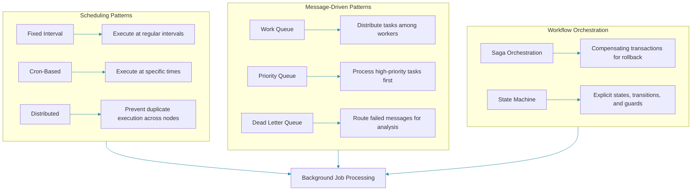

## Overview

Background processing allows applications to execute work asynchronously outside the request-response cycle. This is essential for long-running operations, scheduled maintenance, batch processing, and workflow orchestration. Choosing the right background processing pattern affects reliability, scalability, and operational complexity.

Background jobs fall into three broad categories: scheduled tasks triggered by time, message-driven tasks triggered by events, and workflow orchestration coordinating multi-step processes.



## Scheduling Patterns

### Fixed Interval Scheduling

Executing tasks at regular intervals, useful for periodic maintenance like cache eviction or log rotation.

```java
@Component
public class CacheEvictionJob {

    private final CacheManager cacheManager;

    @Scheduled(fixedRate = 300_000)
    public void evictExpiredEntries() {
        cacheManager.getCacheNames().forEach(
            name -> cacheManager.getCache(name).evictIfExpired()
        );
    }
}
```

### Cron-Based Scheduling

Precise scheduling using cron expressions for tasks that must run at specific times. Unlike `fixedRate`, cron expressions give you second-level precision over exactly when a task fires — every day at 2:00 AM, every Monday at 9:30 AM, etc. This is ideal for business-aligned schedules such as end-of-day reporting or monthly billing cycles. However, cron schedules assume the application is running at the specified time; if the application was down, the execution is simply missed.

```java
@Scheduled(cron = "0 0 2 * * ?")
public void generateDailyReports() {
    reportGenerationService.generateReports();
}
```

### Distributed Scheduling

When running multiple application instances, distributed scheduling prevents duplicate execution using locks. The trade-off here is between simplicity and safety: without distributed locking, every instance would fire the same cron expression, leading to duplicate database writes, duplicate API calls, or race conditions. The snippet below uses `@SchedulerLock` to guarantee that only one instance proceeds.

```java
@Scheduled(cron = "0 0 3 * * ?")
@SchedulerLock(name = "databaseCleanup", lockAtLeastFor = "PT30M")
public void cleanupOldRecords() {
    databaseCleanupService.purgeRecordsOlderThan(Duration.ofDays(90));
}
```

## Message-Driven Patterns

### Work Queue

Work queues distribute tasks among multiple workers for parallel processing and load balancing. The key design decision here is the concurrency model: a pool of identical workers each pull from the same queue. This gives you horizontal scaling for free — add more workers to increase throughput. The trade-off is that ordering guarantees weaken under concurrency, and a poison message (one that always fails) can block a worker slot if not handled with a dead-letter mechanism.

```java
@Component
public class EmailNotificationConsumer {

    @JmsListener(destination = "email.queue")
    public void sendEmail(EmailNotification notification) {
        emailService.send(notification.to(), notification.subject(), notification.body());
    }
}
```

### Priority Queue

High-priority tasks are processed before lower-priority ones, ensuring critical operations are not delayed. Priority queues introduce a subtle trade-off: strict priority-based processing can lead to starvation of low-priority tasks under sustained high-priority load. A common mitigation is to use aging — increasing a task's effective priority the longer it waits — or to cap how many consecutive high-priority tasks may be processed before a low-priority task is pulled.

```java
@Component
public class PaymentProcessor {

    @RabbitListener(queues = "#{priorityQueue.name}")
    public void processPayment(PaymentEvent event) {
        paymentGateway.charge(event.amount(), event.currency());
        notificationService.notifyPaymentCompleted(event.orderId());
    }
}
```

### Dead Letter Queue

Failed messages are routed to a dead letter queue for analysis and retry, preventing message loss. A DLQ acts as the safety net of your messaging infrastructure: once a message exhausts its retry budget, it lands in the DLQ rather than being silently dropped. This enables post-mortem analysis, manual reprocessing via a replay mechanism, and alerting when the DLQ depth grows — an early indicator of systemic failures.

```java
@Component
public class DeadLetterHandler {

    @RabbitListener(queues = "payment.dlq")
    public void handleFailedPayment(PaymentEvent event) {
        log.warn("Payment failed after retries: {}", event.orderId());
        alertService.notifyTeam("Payment processing failure", event);
    }
}
```

## Workflow Orchestration Patterns

### Saga Orchestration

Distributed transactions across multiple services using compensation for rollback. The saga pattern is the go-to alternative to distributed transactions (XA) in microservices. Instead of holding locks across services, each step publishes an event or calls the next service, and if any step fails, previously completed steps are undone via compensating actions. The orchestrated variant shown here centralises the coordination logic in a single class. Choreographed sagas, by contrast, distribute the logic across services via event handlers — less coupling but harder to reason about the overall flow.

```java
@Component
public class OrderSagaOrchestrator {

    @Autowired
    private InventoryServiceClient inventoryClient;
    @Autowired
    private PaymentServiceClient paymentClient;
    @Autowired
    private ShippingServiceClient shippingClient;

    public void executeOrderSaga(CreateOrderCommand cmd) {
        try {
            ReserveInventoryResponse inventory = inventoryClient.reserve(cmd.productId(), cmd.quantity());
            PaymentResponse payment = paymentClient.charge(cmd.customerId(), cmd.totalAmount());
            shippingClient.ship(cmd.orderId(), cmd.address());
        } catch (PaymentFailedException e) {
            inventoryClient.release(cmd.productId(), cmd.quantity());
            throw new OrderSagaFailedException("Order processing failed", e);
        }
    }
}
```

### State Machine Orchestration

Modeling business processes as state machines with explicit transitions and guards. State machines excel when the process is fundamentally about lifecycle management: an order can be PENDING, CONFIRMED, SHIPPED, or CANCELLED, and each transition is a well-defined atomic move. The trade-off against a full workflow engine is that state machines struggle with parallel branches, timed waits, and human-in-the-loop steps without custom scaffolding. Keep state machines focused on entity lifecycle and push complex multi-actor orchestration to a workflow engine.

```java
public enum OrderState {
    PENDING,
    PAYMENT_CONFIRMED,
    SHIPPED,
    DELIVERED,
    CANCELLED
}

@Component
public class OrderStateMachine {

    private final Map<OrderState, List<Transition>> transitions = new HashMap<>();

    public OrderStateMachine() {
        transitions.put(OrderState.PENDING, List.of(
            new Transition(OrderState.PAYMENT_CONFIRMED, this::validatePayment),
            new Transition(OrderState.CANCELLED, this::cancelOrder)
        ));
    }

    public OrderState transition(OrderState current, OrderEvent event) {
        List<Transition> allowed = transitions.get(current);
        return allowed.stream()
            .filter(t -> t.matches(event))
            .findFirst()
            .orElseThrow(() -> new IllegalStateException("Invalid transition"))
            .execute();
    }
}
```

## Choosing the Right Pattern

| Requirement | Recommended Pattern |
|-------------|-------------------|
| Time-based execution | Scheduling (cron/fixed) |
| Event-driven tasks | Message queue |
| Multi-step transaction | Saga orchestration |
| Complex business process | Workflow engine / state machine |
| High-throughput parallel work | Work queue with workers |

## Common Mistakes

### Blocking the Event Loop

```java
// Wrong: Blocking thread pool with long-running tasks
@Scheduled(fixedRate = 1000)
public void processHeavyTask() {
    Thread.sleep(5000);
    heavyComputation();
}
```

```java
// Correct: Async execution with dedicated executor
@Async("taskExecutor")
@Scheduled(fixedRate = 1000)
public CompletableFuture<Void> processHeavyTask() {
    return CompletableFuture.runAsync(() -> heavyComputation());
}
```

### Missing Error Handling

```java
// Wrong: Silent failure
@Scheduled(cron = "0 0 * * * ?")
public void runReport() {
    reportService.generate(); // throws unhandled exception
}
```

```java
// Correct: Structured error handling and alerting
@Scheduled(cron = "0 0 * * * ?")
public void runReport() {
    try {
        reportService.generate();
    } catch (DataFetchException e) {
        alertService.warning("Report generation failed: " + e.getMessage());
        log.warn("Report generation failed, will retry next cycle", e);
    } catch (FatalException e) {
        alertService.critical("Report generation fatally failed", e);
        log.error("Fatal error in report generation", e);
    }
}
```

## Summary

Background processing is fundamental to building resilient, scalable backend systems. Choose scheduling for time-based tasks, message queues for event-driven processing, and workflow engines for complex multi-step coordination. Always handle errors explicitly and design for idempotency and retry.

## References

- "Enterprise Integration Patterns" by Gregor Hohpe and Bobby Woolf
- "Building Event-Driven Microservices" by Adam Bellemare
- Quartz Scheduler Documentation
- Temporal Workflow Documentation

Happy Coding