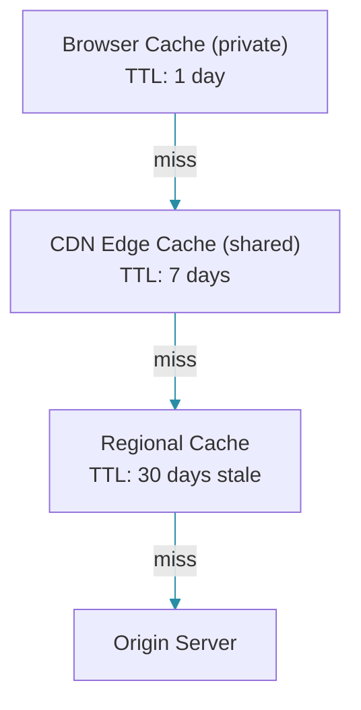

# CDN Strategies for Backend APIs

## Overview

Content Delivery Networks (CDNs) are not just for static assets. Modern CDNs can cache API responses, reduce origin load, and improve global latency. This guide covers strategies for caching backend API responses at the edge.

### What CDNs Cache

- **GET responses**: Idempotent, cacheable API responses
- **Static data**: Reference data, configurations
- **Public content**: Product listings, blog posts
- **GraphQL queries**: With proper cache keys

---

## CDN Cache Configuration

### Cloudflare Workers Integration

Cloudflare Workers run JavaScript at the edge, allowing fine-grained control over caching behavior. The worker below implements a cache-aside pattern at the CDN level with stale-while-revalidate for resilience.

```javascript
// Cloudflare Worker for API caching
addEventListener('fetch', event => {
  event.respondWith(handleRequest(event.request));
});

async function handleRequest(request) {
  const url = new URL(request.url);
  const cacheKey = new Request(url.toString(), request);
  const cache = caches.default;

  // Check edge cache
  let response = await cache.match(cacheKey);
  if (response) {
    return response;
  }

  // Forward to origin
  response = await fetch(request);

  // Only cache successful GET responses
  if (request.method === 'GET' && response.status === 200) {
    const contentType = response.headers.get('Content-Type') || '';

    // Cache based on content type
    if (contentType.includes('json') || contentType.includes('text')) {
      response = new Response(response.body, response);

      // Cache for 5 minutes at edge, 1 hour at browser
      response.headers.set('Cache-Control',
        'public, s-maxage=300, max-age=3600');

      // Background revalidation
      response.headers.set('CDN-Cache-Control',
        'public, stale-while-revalidate=86400');

      event.waitUntil(cache.put(cacheKey, response.clone()));
    }
  }

  return response;
}
```

The Worker uses `caches.default` (the Cloudflare edge cache) and only caches successful JSON/text GET responses. The `stale-while-revalidate=86400` directive allows the CDN to serve stale content for up to 24 hours while fetching a fresh copy in the background.

### Spring Boot Configuration

Spring Boot's server compression reduces response sizes for faster CDN delivery. ETag support enables conditional requests at the CDN level.

```yaml
spring:
  jackson:
    serialization:
      write-dates-as-timestamps: false
      indent-output: false

server:
  compression:
    enabled: true
    mime-types: application/json,application/xml,text/html,text/plain
    min-response-size: 1024

  # Enable ETag support
  etag: true
```

```java
@Configuration
public class CacheHeaderConfig implements WebMvcConfigurer {

    @Override
    public void addInterceptors(InterceptorRegistry registry) {
        registry.addInterceptor(new HandlerInterceptor() {
            @Override
            public boolean preHandle(HttpServletRequest request,
                    HttpServletResponse response, Object handler) {
                if ("GET".equals(request.getMethod())) {
                    response.setHeader("Vary", "Accept-Encoding, Authorization");
                }
                return true;
            }
        });
    }
}
```

---

## API Response Caching

### Cacheable Endpoints

Different API endpoints have different caching requirements. Reference data (categories) can be cached for hours, while product details benefit from shorter TTLs with ETag validation.

```java
@RestController
@RequestMapping("/api")
public class CachedApiController {

    // Cacheable: Reference data, rarely changes
    @GetMapping("/categories")
    @Cacheable(value = "categories", unless = "#result == null")
    public ResponseEntity<List<Category>> getCategories() {
        List<Category> categories = categoryService.findAll();
        return ResponseEntity.ok()
            .cacheControl(CacheControl.maxAge(1, TimeUnit.HOURS)
                .sMaxAge(30, TimeUnit.MINUTES)
                .mustRevalidate())
            .body(categories);
    }

    // Cacheable with user-specific data via Vary header
    @GetMapping("/products/{id}")
    public ResponseEntity<Product> getProduct(@PathVariable Long id) {
        Product product = productService.findById(id);
        return ResponseEntity.ok()
            .cacheControl(CacheControl.maxAge(5, TimeUnit.MINUTES)
                .sMaxAge(2, TimeUnit.MINUTES))
            .eTag(product.getVersion().toString())
            .lastModified(product.getUpdatedAt().toEpochMilli())
            .body(product);
    }

    // Not cacheable: User-specific, dynamic
    @PostMapping("/orders")
    public ResponseEntity<Order> createOrder(@RequestBody OrderRequest request) {
        Order order = orderService.create(request);
        return ResponseEntity.status(HttpStatus.CREATED)
            .cacheControl(CacheControl.noStore())
            .body(order);
    }
}
```

### GraphQL Caching

GraphQL queries can be cached using auto-persisted queries (APQ) — the query is identified by a hash, enabling deterministic cache keys. Mutations are never cached because they change state.

```java
@Controller
public class CachedGraphQLController {

    // GraphQL queries can be cached using automatic persisted queries (APQ)
    @QueryMapping
    @Cacheable(value = "graphql", key = "#query + ':' + #variables?.hashCode()")
    public CompletableFuture<Product> product(@Argument Long id) {
        return productService.findById(id);
    }

    // Mutations are never cached
    @MutationMapping
    public Order createOrder(@Argument OrderInput input) {
        return orderService.create(input);
    }
}
```

---

## Edge Caching Patterns

### Stale-While-Revalidate

Stale-while-revalidate provides instant responses even when the cache is stale. The CDN serves the stale copy immediately while fetching the fresh version in the background.

```java
// Serve stale data from CDN while refreshing in background
// This provides instant responses while keeping data fresh

@GetMapping("/api/public/products")
public ResponseEntity<List<Product>> getPublicProducts() {
    return ResponseEntity.ok()
        // CDN: Serve stale for 1 day while revalidating
        .header("Cache-Control", "public, s-maxage=300, stale-while-revalidate=86400")
        // Browser: Cache for 1 minute
        .header("CDN-Cache-Control", "public, max-age=60")
        .body(productService.findAllPublished());
}
```

### Tiered Caching

Tiered caching sets different TTLs at each cache level. The browser caches for 1 day, the CDN edge for 7 days, and the CDN can serve stale content for up to 30 days while revalidating.



```java
// Configure tiered caching with different TTLs at each level
@GetMapping("/api/reference/countries")
public ResponseEntity<List<Country>> getCountries() {
    List<Country> countries = countryService.findAll();
    return ResponseEntity.ok()
        // Browser: 1 day
        .header("Cache-Control", "private, max-age=86400")
        // CDN: 7 days
        .header("CDN-Cache-Control", "public, max-age=604800")
        // Stale while revalidate: 30 days
        .header("Cloudflare-CDN-Cache-Control",
            "max-age=604800, stale-while-revalidate=2592000")
        .body(countries);
}
```

---

## API Key Considerations

### Cache Key Strategy

The default cache key is the request URL (path + query parameters). For authenticated endpoints, the `Vary: Authorization` header ensures different users get different cached responses. Public endpoints should not vary on Authorization.

```java
// Default cache key includes URL + query params
// For authenticated endpoints, include user context in Vary header

@GetMapping("/api/users/me")
public ResponseEntity<User> getCurrentUser() {
    User user = getAuthenticatedUser();
    return ResponseEntity.ok()
        // Vary on Authorization header for user-specific caching
        .header("Vary", "Authorization")
        // Don't cache at shared level (contains private data)
        .cacheControl(CacheControl.noStore())
        .body(user);
}

// Public endpoints should never use Vary on Authorization
@GetMapping("/api/public/products")
public ResponseEntity<List<Product>> getProducts() {
    return ResponseEntity.ok()
        .header("Surrogate-Key", "products")
        // Public cache
        .cacheControl(CacheControl.maxAge(5, TimeUnit.MINUTES)
            .sMaxAge(2, TimeUnit.MINUTES))
        .body(productService.findAll());
}
```

---

## Surrogate Keys for Cache Purging

### Fastly/Cloudflare Surrogate Keys

Surrogate keys allow targeted cache invalidation. Instead of purging all cache or waiting for TTL, you can purge specific resources by key — for example, purging all product-related cache entries when inventory changes.

```java
@GetMapping("/api/products")
public ResponseEntity<List<Product>> getProducts() {
    List<Product> products = productService.findAll();

    return ResponseEntity.ok()
        .header("Surrogate-Key",
            products.stream()
                .map(p -> "product:" + p.getId())
                .collect(Collectors.joining(" "))
        )
        .header("Surrogate-Control",
            "max-age=300, stale-while-revalidate=86400")
        .body(products);
}
```

### Purge API

The purge service uses the CDN's API to invalidate cache by surrogate key or purge everything. This is typically called from the application's write path.

```java
@Service
public class CdnPurgeService {

    public void purgeProductCache(Long productId) {
        // Purge by surrogate key
        httpClient.send(request -> {
            request.url("https://api.cloudflare.com/client/v4/zones/ZONE_ID/purge_cache");
            request.method("POST");
            request.body(Map.of(
                "files", List.of("products:" + productId)
            ));
        });
    }

    public void purgeAllCache() {
        httpClient.send(request -> {
            request.method("POST");
            request.body(Map.of("purge_everything", true));
        });
    }
}
```

---

## Best Practices

### 1. Use Stale-While-Revalidate

Always serve something to users rather than an error or timeout. Stale data is almost always better than no data.

```java
// Always serve something to users
// Stale data is better than an error or timeout

CacheControl cc = CacheControl.maxAge(60, TimeUnit.SECONDS)
    .sMaxAge(30, TimeUnit.SECONDS)
    .staleWhileRevalidate(86400, TimeUnit.SECONDS);
```

### 2. Set Appropriate Vary Headers

Vary tells CDNs what request characteristics affect the response. Common Vary values include Accept-Encoding (compression), Accept-Language (localization), and Authorization (authentication).

```java
// Vary tells CDN what request characteristics affect the response
// Common Vary values:
// - Accept-Encoding (compression)
// - Accept-Language (localization)
// - Authorization (authentication)

@GetMapping("/api/posts")
public ResponseEntity<List<Post>> getPosts(
        @RequestHeader("Accept-Language") String lang) {
    return ResponseEntity.ok()
        .header("Vary", "Accept-Encoding, Accept-Language")
        .cacheControl(CacheControl.maxAge(5, TimeUnit.MINUTES))
        .body(postService.findAll(lang));
}
```

### 3. Monitor Cache Hit Rates

Monitor cache hit rates to tune TTLs. A low hit rate suggests too-short TTLs or incorrect Vary headers. Use metrics to track per-endpoint performance.

```java
@Component
public class CdnMetricsService {

    private final MeterRegistry registry;

    public void recordCacheHit(String endpoint) {
        registry.counter("cdn.cache.hit",
            "endpoint", endpoint).increment();
    }

    public void recordCacheMiss(String endpoint) {
        registry.counter("cdn.cache.miss",
            "endpoint", endpoint).increment();
    }

    public void logCacheRatio() {
        // Log for each endpoint
    }
}
```

---

## Common Mistakes

### Mistake 1: Caching Authenticated Responses at Edge

Caching user-specific data at a shared CDN is a security risk — one user may see another user's private data.

```java
// WRONG: Caching private user data at CDN
@GetMapping("/api/users/orders")
public ResponseEntity<List<Order>> getOrders() {
    return ResponseEntity.ok()
        .cacheControl(CacheControl.maxAge(5, TimeUnit.MINUTES))
        .body(orderService.findByUserId(getUserId()));
    // Other users might see this user's orders!
}

// CORRECT: No caching for private data
@GetMapping("/api/users/orders")
public ResponseEntity<List<Order>> getOrders() {
    return ResponseEntity.ok()
        .cacheControl(CacheControl.noStore())
        .body(orderService.findByUserId(getUserId()));
}
```

### Mistake 2: No Stale-While-Revalidate

Hard expiration at the edge causes a thundering herd problem — at the moment of expiration, every concurrent request hits the origin simultaneously.

```java
// WRONG: Hard expiration at edge
CacheControl.maxAge(5, TimeUnit.MINUTES);
// At 5:01, every concurrent request hits origin (thundering herd)

// CORRECT: Stale-while-revalidate
CacheControl.maxAge(5, TimeUnit.MINUTES)
    .staleWhileRevalidate(60, TimeUnit.MINUTES);
// At 5:01, first request triggers refresh, others get stale
```

### Mistake 3: Cache Poisoning via Headers

Accepting arbitrary Vary headers allows attackers to poison the cache with many variations.

```java
// WRONG: Accepting arbitrary Vary headers
@GetMapping("/api/data")
public ResponseEntity<Data> getData(
        @RequestHeader(value = "X-Custom", defaultValue = "") String custom) {
    // Dynamic Vary header based on request
    return ResponseEntity.ok()
        .header("Vary", "X-Custom")
        .body(data);
    // Attackers can poison the cache with different X-Custom values
}

// CORRECT: Only vary on known headers
.header("Vary", "Accept-Encoding, Accept-Language")
```

---

## Summary

CDN caching for backend APIs reduces latency and origin load:

1. Cache GET responses for public, idempotent endpoints
2. Use stale-while-revalidate for instant responses
3. Set proper Cache-Control headers at each tier
4. Use Vary headers for multi-variant responses
5. Leverage surrogate keys for targeted purging
6. Never cache private user data at the edge
7. Monitor cache hit rates and adjust TTLs

---

## References

- [Cloudflare Cache Documentation](https://developers.cloudflare.com/cache/)
- [Fastly Cache Documentation](https://docs.fastly.com/en/guides/working-with-cache)
- [HTTP Caching (MDN)](https://developer.mozilla.org/en-US/docs/Web/HTTP/Caching)

Happy Coding
