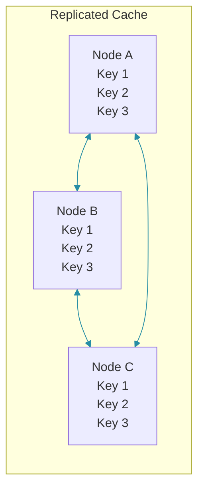
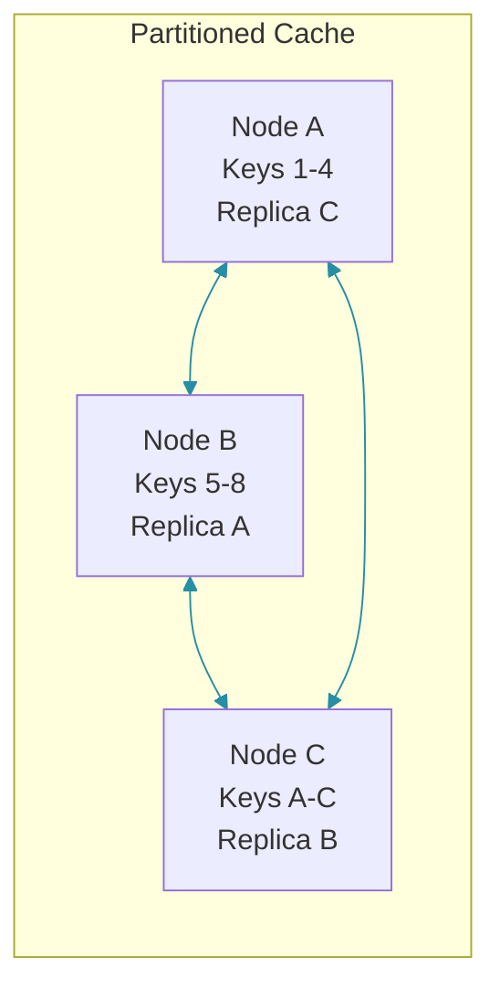
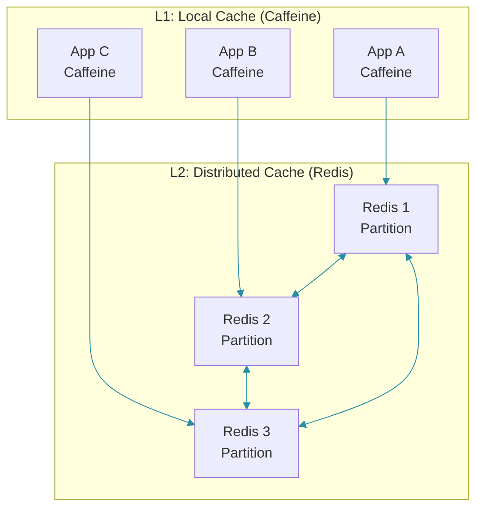

# Distributed Cache Topologies

## Overview

Distributed cache topologies define how data is distributed across nodes in a cache cluster. The topology impacts performance, scalability, availability, and consistency. Choosing the right topology depends on read/write ratios, data size, and consistency requirements.

### Topology Types

| Topology | Data Distribution | Read Scalability | Write Scalability | Use Case |
|----------|-----------------|-----------------|-------------------|----------|
| Replicated | All nodes have all data | High | Low | Small datasets, read-heavy |
| Partitioned | Data split across nodes | High | High | Large datasets |
| Hybrid | Replicated hot data, partitioned cold | High | Medium | Mixed workloads |

---

## Replicated Cache

### How It Works

Every node maintains a complete copy of all cached data. This provides the fastest read performance because any node can serve any request, but write amplification is high — every write must be propagated to all nodes.



### Hazelcast Replicated Map

Hazelcast's `ReplicatedMap` synchronously replicates all data to every node. The `AsyncFillup` option allows the map to be used before replication completes.

```java
@Configuration
public class HazelcastReplicatedConfig {

    @Bean
    public Config hazelcastConfig() {
        Config config = new Config();

        // Replicated map configuration
        ReplicatedMapConfig replicatedConfig = config.getReplicatedMapConfig("products");
        replicatedConfig.setInMemoryFormat(InMemoryFormat.OBJECT);
        replicatedConfig.setStatisticsEnabled(true);
        replicatedConfig.setAsyncFillup(true);

        // Network configuration
        NetworkConfig network = config.getNetworkConfig();
        network.setPort(5701).setPortAutoIncrement(true);
        network.getJoin().getMulticastConfig().setEnabled(false);
        network.getJoin().getTcpIpConfig()
            .setEnabled(true)
            .addMember("cache-node-1:5701")
            .addMember("cache-node-2:5701")
            .addMember("cache-node-3:5701");

        return config;
    }
}

@Service
public class ReplicatedCacheService {

    private final HazelcastInstance hazelcast;

    public ReplicatedCacheService(HazelcastInstance hazelcast) {
        this.hazelcast = hazelcast;
    }

    public void putProduct(String key, Product product) {
        ReplicatedMap<String, Product> map = hazelcast.getReplicatedMap("products");
        map.put(key, product);
        // Synchronously replicated to ALL nodes
    }

    public Product getProduct(String key) {
        ReplicatedMap<String, Product> map = hazelcast.getReplicatedMap("products");
        return map.get(key);
        // Any node can serve the request
    }
}
```

### Pros and Cons

```java
// PROS:
// - Any node can serve reads (maximum read throughput)
// - No single point of failure for reads
// - Simple key routing (any node works)

// CONS:
// - Write amplification (every write goes to all nodes)
// - Memory waste (each node stores full dataset)
// - Network overhead for replication
// - Limited to dataset size that fits in smallest node

// BEST FOR:
// - Small to medium datasets (< 10GB)
// - Read-heavy workloads (100:1 read/write ratio)
// - Low latency requirements
```

---

## Partitioned Cache

### How It Works

Data is split across nodes based on a hash of the key. Each node owns a subset of data (its partition), plus a replica of another node's partition for fault tolerance.



### Redis Cluster (Partitioned)

Redis Cluster distributes keys across 16,384 hash slots. Each node owns a range of slots and routes requests automatically. Hash tags (`{...}`) force related keys into the same slot for multi-key operations.

```java
@Service
public class PartitionedCacheService {

    private final RedisTemplate<String, Object> redisTemplate;

    // In Redis Cluster, keys are distributed across 16384 hash slots
    // Key "product:123" -> hash slot computed -> specific node

    public void put(String key, Object value, Duration ttl) {
        redisTemplate.opsForValue().set(key, value, ttl);
        // Redis Cluster routes to the correct node automatically
    }

    public Object get(String key) {
        return redisTemplate.opsForValue().get(key);
        // Redis Cluster routes to the correct node automatically
    }

    // Hash tags ensure related keys are on the same node
    public void putWithHashTag(String userId, String dataType, Object data) {
        // {userId} ensures all user data is on the same node
        String key = String.format("{user:%s}:%s", userId, dataType);
        redisTemplate.opsForValue().set(key, data, Duration.ofMinutes(30));
    }

    // Multi-key operations only work within same hash slot
    public void batchUpdateUserData(Long userId, Map<String, Object> updates) {
        updates.forEach((field, value) -> {
            String key = String.format("{user:%d}:%s", userId, field);
            redisTemplate.opsForValue().set(key, value, Duration.ofMinutes(30));
        });
    }
}
```

### Consistent Hashing

Consistent hashing minimizes key redistribution when nodes are added or removed. With N nodes, only 1/N of keys are remapped on a topology change.

```java
@Component
public class ConsistentHashRouter {

    private final TreeMap<Integer, CacheNode> ring = new TreeMap<>();
    private final int virtualNodes = 150;

    public ConsistentHashRouter(List<CacheNode> nodes) {
        for (CacheNode node : nodes) {
            for (int i = 0; i < virtualNodes; i++) {
                int hash = hash(node.getId() + ":" + i);
                ring.put(hash, node);
            }
        }
    }

    public CacheNode getNode(String key) {
        if (ring.isEmpty()) return null;
        int hash = hash(key);
        Map.Entry<Integer, CacheNode> entry = ring.ceilingEntry(hash);
        if (entry == null) {
            entry = ring.firstEntry();
        }
        return entry.getValue();
    }

    public void addNode(CacheNode node) {
        // When adding a node, only 1/N keys are remapped
        for (int i = 0; i < virtualNodes; i++) {
            int hash = hash(node.getId() + ":" + i);
            ring.put(hash, node);
        }
    }

    public void removeNode(CacheNode node) {
        for (int i = 0; i < virtualNodes; i++) {
            int hash = hash(node.getId() + ":" + i);
            ring.remove(hash);
        }
    }

    private int hash(String key) {
        return MurmurHash3.hash32x86(key.getBytes());
    }
}

record CacheNode(String id, String host, int port) {}
```

---

## Hybrid Topology

### Two-Tier Caching

Hybrid topology combines the speed of an in-process L1 cache (Caffeine) with the capacity of a distributed L2 cache (Redis). Hot data is served from local memory with microsecond latency; the full dataset lives in Redis.



### Implementation

The hybrid service checks L1 first (fastest), then L2, then the database. On a write, both L1 and L2 are invalidated, and a broadcast message tells other instances to invalidate their L1 caches.

```java
@Configuration
public class HybridCacheConfig {

    @Bean
    public CacheManager localCacheManager() {
        CaffeineCacheManager cacheManager = new CaffeineCacheManager();
        cacheManager.setCaffeine(Caffeine.newBuilder()
            .maximumSize(10_000)
            .expireAfterWrite(Duration.ofMinutes(5))
            .recordStats());
        return cacheManager;
    }

    @Bean
    public CacheManager distributedCacheManager(RedisConnectionFactory cf) {
        return RedisCacheManager.builder(cf)
            .cacheDefaults(RedisCacheConfiguration.defaultCacheConfig()
                .entryTtl(Duration.ofMinutes(30)))
            .build();
    }
}

@Service
public class HybridCacheService {

    private final CacheManager localCacheManager;
    private final CacheManager distributedCacheManager;

    public Product getProduct(Long id) {
        // L1: Check local cache
        Cache localCache = localCacheManager.getCache("products");
        Product product = localCache.get(id, Product.class);
        if (product != null) {
            log.debug("L1 hit: {}", id);
            return product;
        }

        // L2: Check distributed cache
        Cache distributedCache = distributedCacheManager.getCache("products");
        product = distributedCache.get(id, Product.class);
        if (product != null) {
            log.debug("L2 hit, L1 miss: {}", id);
            localCache.put(id, product); // Populate L1
            return product;
        }

        // DB: Load from database
        log.debug("L1+L2 miss: {}", id);
        product = loadFromDatabase(id);

        distributedCache.put(id, product);
        localCache.put(id, product);

        return product;
    }

    public void updateProduct(Product product) {
        // Update database
        saveToDatabase(product);

        // Invalidate both caches
        localCacheManager.getCache("products").evict(product.getId());
        distributedCacheManager.getCache("products").evict(product.getId());

        // Broadcast invalidation to other instances
        broadcastInvalidation("products", product.getId());
    }

    private void broadcastInvalidation(String cacheName, Object key) {
        // Use Redis Pub/Sub to invalidate L1 caches on other instances
        redisTemplate.convertAndSend("cache:invalidate",
            cacheName + ":" + key);
    }
}
```

---

## Topology Selection Guide

### Decision Matrix

| Factor | Replicated | Partitioned | Hybrid |
|--------|-----------|-------------|--------|
| Dataset size | Small (< 10GB) | Large (TB+) | Medium |
| Read throughput | Very high | High | Very high |
| Write throughput | Low | High | Medium |
| Memory efficiency | Poor | Excellent | Good |
| Consistency | Strong | Eventual | Configurable |
| Operational complexity | Low | Medium | High |
| Cost per GB | Higher | Lower | Medium |

### Example Scenarios

```java
// Scenario 1: Application configuration (small, read-heavy)
// Use: Replicated (Hazelcast ReplicatedMap)
// Reason: Small dataset, every node needs all configs

// Scenario 2: User session store (large, distributed)
// Use: Partitioned (Redis Cluster)
// Reason: Large dataset, sessions bound to specific users

// Scenario 3: Product catalog (medium, mixed workload)
// Use: Hybrid (Caffeine L1 + Redis Cluster L2)
// Reason: Hot products cached locally, full catalog in Redis
```

---

## Best Practices

### 1. Right-Size Partitions

Redis Cluster uses 16,384 hash slots. Distribute them evenly across nodes and monitor for imbalance.

```java
// Redis Cluster hash slots: 16384 total
// 3 nodes: ~5461 slots per node
// 6 nodes: ~2730 slots per node

// Keep partitions balanced
// Monitor slot distribution:
redis-cli --cluster check 127.0.0.1:7000
```

### 2. Handle Node Failures

Partitioned caches with replica nodes ensure availability. When a master fails, a replica is promoted automatically.

```java
// Partitioned cache with replica nodes ensures availability
// When master fails, replica is promoted

// Implement circuit breaker for cache failures
@Bean
public RedisTemplate<String, Object> resilientRedisTemplate(
        RedisConnectionFactory factory) {

    RedisTemplate<String, Object> template = new RedisTemplate<>();
    template.setConnectionFactory(factory);
    template.setEnableTransactionSupport(true);

    // Add retry logic
    template.setExposeConnection(false);
    return template;
}
```

### 3. Monitor Topology Health

Regular health checks ensure the cluster topology is intact and alert when too many nodes are down.

```java
@Component
public class TopologyMonitor {

    @Scheduled(fixedRate = 30_000)
    public void checkTopology() {
        // Check cluster nodes
        List<CacheNode> nodes = getClusterNodes();
        int activeNodes = (int) nodes.stream()
            .filter(CacheNode::isAlive).count();

        log.info("Cache cluster: {}/{} nodes active",
            activeNodes, nodes.size());

        // Alert if too many nodes are down
        if (activeNodes < nodes.size() * 0.5) {
            log.error("Cache cluster degraded: {}/{} nodes active",
                activeNodes, nodes.size());
        }
    }
}
```

---

## Common Mistakes

### Mistake 1: Replicated Cache for Large Datasets

Replicating large datasets wastes memory and causes slow synchronization. Partitioned topology is required for data that doesn't fit on a single node.

```java
// WRONG: Replicating 100GB dataset to 10 nodes
// Total memory needed: 1TB
// Network sync time: minutes per update

// CORRECT: Partitioned for large datasets
// Each node: 10GB
// Total memory needed: 100GB + replicas
```

### Mistake 2: Uneven Partition Distribution

Uneven hash slot allocation causes some nodes to handle more load than others. Rebalance regularly.

```bash
# WRONG: Uneven hash slot allocation
# Node 1: 8000 slots (50% of data)
# Node 2: 4000 slots (25%)
# Node 3: 4384 slots (25%)

# CORRECT: Reshard to balance
redis-cli --cluster rebalance 127.0.0.1:7000
```

### Mistake 3: Not Configuring Replicas

Without replicas, a node failure causes permanent data loss in partitioned caches.

```conf
# WRONG: No replicas in partitioned cache
# Node failure = data loss

# CORRECT: One replica per partition
redis-cli --cluster add-node new-node:7000 existing-node:7000 --cluster-slave
```

---

## Summary

| Topology | Read Scale | Write Scale | Data Size | Complexity |
|----------|-----------|-------------|-----------|------------|
| Replicated | Excellent | Poor | Small | Low |
| Partitioned | Excellent | Excellent | Large | Medium |
| Hybrid | Excellent | Good | Medium | High |

Choose replicated for small datasets needing maximum read performance. Choose partitioned for large datasets requiring horizontal scaling. Use hybrid when you need both local speed and distributed capacity.

---

## References

- [Redis Cluster Specification](https://redis.io/docs/reference/cluster-spec/)
- [Hazelcast Topologies](https://docs.hazelcast.com/hazelcast/latest/performance/clusters)
- [Consistent Hashing](https://www.toptal.com/big-data/consistent-hashing)

Happy Coding
