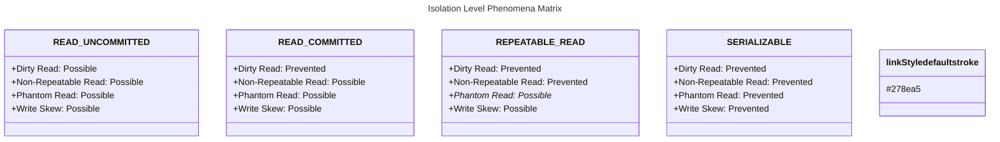

# Transaction Isolation Levels

## Overview

Transaction isolation levels define how concurrent transactions interact with each other. They balance data consistency against performance. Understanding isolation levels and the phenomena they prevent is critical for building correct concurrent data access in production applications.

---

## Read Phenomena

### Dirty Read (Uncommitted Data)

A dirty read occurs when one transaction reads uncommitted changes made by another transaction. If the other transaction later rolls back, the first transaction has read data that never officially existed. `READ_UNCOMMITTED` allows dirty reads but is rarely used in practice—PostgreSQL does not even support it (it silently upgrades to `READ_COMMITTED`).

```java
// Transaction 1: Updates but doesn't commit
@Transactional
public void updatePrice(Long productId, BigDecimal newPrice) {
    Product product = productRepository.findById(productId).get();
    product.setPrice(newPrice);
    productRepository.save(product);

    // At this point, Transaction 2 could read uncommitted change
    // If Transaction 1 rolls back, Transaction 2 saw invalid data

    sendPriceChangeNotification(product);
    // Transaction commits here
}

// Transaction 2: Could read uncommitted data
@Transactional(isolation = Isolation.READ_UNCOMMITTED)
public BigDecimal getPrice(Long productId) {
    // May read uncommitted price changes
    return productRepository.findById(productId)
        .map(Product::getPrice)
        .orElseThrow();
}
```

### Non-Repeatable Read

A non-repeatable read happens when a transaction reads the same row twice and gets different values because another transaction modified and committed the row between the two reads. This is prevented by `REPEATABLE_READ`, which uses snapshot isolation (in PostgreSQL) or shared locks (in MySQL) to guarantee consistent reads within the transaction.

```java
// Transaction 1: Two reads of same row get different values
@Transactional(isolation = Isolation.READ_COMMITTED)
public void calculateDiscount(Long orderId) {
    Order order = orderRepository.findById(orderId).get();
    // Read 1: discount = 10%

    // Transaction 2 updates discount to 20% and commits

    // Simulate business logic delay
    performHeavyComputation();

    Order orderAgain = orderRepository.findById(orderId).get();
    // Read 2: discount = 20%  DIFFERENT from Read 1!
    // This is a non-repeatable read
}
```

### Phantom Read

A phantom read occurs when a transaction executes the same range query twice and gets a different number of rows because another transaction inserted or deleted rows that match the filter. `REPEATABLE_READ` in most databases prevents non-repeatable reads but allows phantom reads. PostgreSQL's snapshot isolation (used for both `REPEATABLE_READ` and `SERIALIZABLE`) prevents phantoms at both levels.

```java
// Transaction 1: Range query returns different results
@Transactional(isolation = Isolation.REPEATABLE_READ)
public List<Product> getProductsInPriceRange(BigDecimal min, BigDecimal max) {
    List<Product> products = productRepository.findByPriceBetween(min, max);
    // Query returns 5 products

    // Transaction 2 inserts a new product in this price range

    // Same query again
    List<Product> productsAgain = productRepository.findByPriceBetween(min, max);
    // Returns 6 products! Phantom read
    // REPEATABLE_READ prevents non-repeatable reads but NOT phantoms
}
```

### Serialization Anomaly

Even `SERIALIZABLE` isolation can exhibit specific anomalies depending on the implementation. Write skew is one such anomaly: two concurrent transactions read overlapping data sets, make decisions based on what they read, and then write conflicting data. In the doctor scheduling example, both transactions see one doctor on call, both add a doctor, and the final count ends up at three instead of at most two.

```java
// Even SERIALIZABLE level has a specific anomaly: read-only transaction anomaly
// and write skew in certain implementations

@Transactional(isolation = Isolation.SERIALIZABLE)
public void assignDoctors() {
    // Two transactions running concurrently:
    // T1: Count on-call doctors, if < 2, add doctor A
    // T2: Count on-call doctors, if < 2, add doctor B
    
    // Both see count = 1, both add doctors
    // Final count = 3 instead of expected <= 2
    // This is write skew - needs predicate locking
}
```

---

## Isolation Level Comparison



* PostgreSQL REPEATABLE READ prevents phantom reads (uses snapshot isolation)
* MySQL REPEATABLE READ prevents phantom reads (uses gap locking)

---

## Spring Configuration

### Setting Isolation Levels

Spring's `@Transactional(isolation = ...)` sets the isolation level at the JDBC connection level. `READ_COMMITTED` is the default for most databases and suitable for most applications. `REPEATABLE_READ` provides consistent snapshots for reporting. `SERIALIZABLE` should be reserved for cases where correctness absolutely requires it, as it significantly reduces concurrency and increases deadlock risk.

```java
@Service
@Transactional
public class IsolationLevelDemoService {

    // READ_UNCOMMITTED: Lowest isolation
    @Transactional(isolation = Isolation.READ_UNCOMMITTED)
    public void readUncommittedDemo() {
        // Use for approximate data, dashboards, monitoring
        // Risk: dirty reads, non-repeatable reads, phantoms
        List<Order> orders = orderRepository.findAll();
        BigDecimal total = orders.stream()
            .map(Order::getTotal)
            .reduce(BigDecimal.ZERO, BigDecimal::add);
        // Approximate total - may include uncommitted data
    }

    // READ_COMMITTED: Default for most databases
    @Transactional(isolation = Isolation.READ_COMMITTED)
    public Order getOrderWithReadCommitted(Long orderId) {
        // Prevents dirty reads
        // Allows non-repeatable reads
        // Default in PostgreSQL, SQL Server, Oracle
        return orderRepository.findById(orderId)
            .orElseThrow(() -> new ResourceNotFoundException("Order not found"));
    }

    // REPEATABLE_READ: Consistent reads within transaction
    @Transactional(isolation = Isolation.REPEATABLE_READ)
    public void generateReport(Long userId) {
        // Multiple reads of same data guaranteed consistent
        List<Account> accounts = accountRepository.findByUserId(userId);

        BigDecimal total1 = accounts.stream()
            .map(Account::getBalance)
            .reduce(BigDecimal.ZERO, BigDecimal::add);

        // Some processing...

        // Guaranteed same data as first read
        List<Account> accountsAgain = accountRepository.findByUserId(userId);
        BigDecimal total2 = accountsAgain.stream()
            .map(Account::getBalance)
            .reduce(BigDecimal.ZERO, BigDecimal::add);

        assert total1.equals(total2); // Always true with REPEATABLE_READ
    }

    // SERIALIZABLE: Highest isolation
    @Transactional(isolation = Isolation.SERIALIZABLE)
    public void allocateInventory(Map<Long, Integer> allocations) {
        // Complete isolation from other transactions
        // Transactions execute as if sequential
        // Risk: lower concurrency, deadlocks, serialization failures
        for (Map.Entry<Long, Integer> entry : allocations.entrySet()) {
            Product product = productRepository.findById(entry.getKey()).get();

            if (product.getStock() >= entry.getValue()) {
                product.setStock(product.getStock() - entry.getValue());
                productRepository.save(product);
            } else {
                throw new InsufficientStockException(product.getId(), product.getStock(), entry.getValue());
            }
        }
    }
}
```

---

## Database-Specific Behavior

### PostgreSQL

PostgreSQL's implementation of isolation levels differs from the SQL standard in important ways. `REPEATABLE_READ` uses snapshot isolation, which prevents phantom reads—something the SQL standard does not guarantee at this level. `SERIALIZABLE` uses Serializable Snapshot Isolation (SSI), which detects serialization conflicts using predicate locks and returns a `could not serialize access` error when conflicts are detected.

```java
@Configuration
public class PostgresIsolationConfig {

    @Bean
    @Profile("postgres")
    public DataSource postgresDataSource() {
        HikariConfig config = new HikariConfig();
        config.setJdbcUrl("jdbc:postgresql://localhost:5432/mydb");

        // PostgreSQL READ_COMMITTED is default
        // PostgreSQL REPEATABLE_READ uses snapshot isolation
        // - Prevents phantom reads!
        // - Uses optimistic concurrency control
        // - Serializable uses Serializable Snapshot Isolation (SSI)

        return new HikariDataSource(config);
    }

    @Transactional(isolation = Isolation.REPEATABLE_READ)
    public void postgresRepeatableRead() {
        // In PostgreSQL, this prevents:
        // - Dirty reads: YES
        // - Non-repeatable reads: YES
        // - Phantom reads: YES (snapshot isolation)
        // - Write skew: Only at SERIALIZABLE level
    }
}
```

### MySQL

MySQL with the InnoDB storage engine defaults to `REPEATABLE_READ`. It prevents phantom reads using gap locking—locking the gaps between index entries to prevent new rows from being inserted. This works well for many workloads but can cause increased lock contention compared to `READ_COMMITTED`.

```java
@Configuration
@Profile("mysql")
public class MysqlIsolationConfig {

    @Bean
    public DataSource mysqlDataSource() {
        HikariConfig config = new HikariConfig();
        config.setJdbcUrl("jdbc:mysql://localhost:3306/mydb");
        // Add isolation level to connection
        config.addDataSourceProperty("transactionIsolation", "REPEATABLE_READ");

        // MySQL default: REPEATABLE_READ
        // Uses gap locking to prevent phantom reads
        // InnoDB engine supports all 4 levels

        return new HikariDataSource(config);
    }

    @Transactional(isolation = Isolation.READ_COMMITTED)
    public void mysqlReadCommitted() {
        // MySQL READ_COMMITTED:
        // - Prevents dirty reads
        // - InnoDB: each read gets fresh snapshot
        // - Better concurrency than REPEATABLE_READ
        // - Use when consistency is less critical
    }
}
```

---

## Handling Isolation Failures

### Retry for Serialization Failures

Transactions at `SERIALIZABLE` isolation can fail with serialization errors when the SSI mechanism detects a conflict. These errors are transient and should be retried. The pattern below retries up to three times with exponential backoff, which is the recommended approach for `SERIALIZABLE` transactions.

```java
@Component
public class RetryableTransactionService {

    private static final int MAX_RETRIES = 3;

    @Transactional(isolation = Isolation.SERIALIZABLE)
    public void updateInventoryWithRetry(Long productId, int quantity) {
        // Serialization failures throw OptimisticLockException
        // or cannot serialize access error
    }

    public void safeUpdateInventory(Long productId, int quantity) {
        for (int attempt = 1; attempt <= MAX_RETRIES; attempt++) {
            try {
                updateInventoryWithRetry(productId, quantity);
                return; // Success
            } catch (OptimisticLockException | CannotSerializeTransactionException e) {
                if (attempt == MAX_RETRIES) {
                    throw new TransactionFailedException("Failed after " + MAX_RETRIES + " retries", e);
                }

                // Exponential backoff
                try {
                    Thread.sleep((long) Math.pow(2, attempt) * 100);
                } catch (InterruptedException ie) {
                    Thread.currentThread().interrupt();
                    throw new TransactionFailedException("Retry interrupted", ie);
                }
            }
        }
    }
}
```

---

## Best Practices

1. **Default to READ_COMMITTED**: Best balance for most applications
2. **Use REPEATABLE_READ for reports**: Consistent snapshots for reporting
3. **Use SERIALIZABLE sparingly**: Only when correctness > performance
4. **Understand database defaults**: PostgreSQL vs MySQL differ
5. **Monitor deadlocks**: Higher isolation increases deadlock risk
6. **Keep transaction scope small**: Minimize lock duration
7. **Use retry logic**: Handle serialization failures gracefully
8. **Test concurrent scenarios**: Integration tests with parallel threads
9. **Avoid READ_UNCOMMITTED**: Rarely worth the risk
10. **Consider optimistic locking**: Alternative to high isolation

Optimistic locking with `@Version` provides an alternative to high isolation levels. Instead of preventing conflicts at the database level with locks, it detects them after they happen by checking a version number. This allows `READ_COMMITTED` isolation to be used for most operations, with conflicts handled by retrying the transaction.

```java
// Optimistic locking as alternative to high isolation
@Entity
public class InventoryItem {

    @Id
    @GeneratedValue
    private Long id;

    private int quantity;

    @Version
    private Long version;  // Optimistic lock

    // Can use READ_COMMITTED with version-based conflict detection
}
```

---

## Common Mistakes

### Mistake 1: Choosing Incorrect Isolation

Using `READ_UNCOMMITTED` for financial transactions risks reading uncommitted data that might later be rolled back, potentially showing incorrect balances to users or triggering incorrect business decisions.

```java
// WRONG: Using READ_UNCOMMITTED for financial transactions
@Transactional(isolation = Isolation.READ_UNCOMMITTED)
public void transferMoney(Long fromId, Long toId, BigDecimal amount) {
    // Risk: dirty reads, non-repeatable reads
    // Financial data requires accuracy!
}

// CORRECT: Use READ_COMMITTED or higher for financial operations
@Transactional(isolation = Isolation.READ_COMMITTED)
public void transferMoney(Long fromId, Long toId, BigDecimal amount) {
    // ...
}
```

### Mistake 2: Assuming REPEATABLE_READ Prevents All Anomalies

The SQL standard defines `REPEATABLE_READ` as preventing only dirty reads and non-repeatable reads—phantom reads are allowed. However, databases implement it differently: PostgreSQL and SQL Server (with snapshot isolation) prevent phantoms, while Oracle does not. Always consult your database's documentation.

```java
// WRONG: Assuming REPEATABLE_READ prevents phantoms in all databases
// Phantom prevention depends on database implementation
// PostgreSQL: Yes (snapshot isolation)
// MySQL/InnoDB: Yes (gap locking)  
// Oracle: No (only prevents non-repeatable reads)
// SQL Server: Yes (snapshot isolation when enabled)
```

### Mistake 3: Ignoring Deadlocks with Higher Isolation

`SERIALIZABLE` isolation is prone to deadlocks because of the locks it acquires. If two transactions access the same resources in a different order, a deadlock is likely. Always lock resources in a consistent order across all transactions.

```java
// WRONG: SERIALIZABLE without deadlock handling
@Transactional(isolation = Isolation.SERIALIZABLE)
public void updateAccounts(Long id1, Long id2) {
    Account a1 = accountRepository.findById(id1).get();
    Account a2 = accountRepository.findById(id2).get();
    // Deadlock risk if another transaction locks in reverse order
}

// CORRECT: Consistent lock ordering
@Transactional(isolation = Isolation.SERIALIZABLE)
public void updateAccounts(Long id1, Long id2) {
    // Always lock in consistent order
    Long first = Math.min(id1, id2);
    Long second = Math.max(id1, id2);

    Account a1 = accountRepository.findById(first).get();
    Account a2 = accountRepository.findById(second).get();
}
```

---

## Summary

1. Dirty reads: Reading uncommitted data
2. Non-repeatable reads: Same row read twice gives different values
3. Phantom reads: Range query returns different row count
4. READ_UNCOMMITTED: Prevents nothing, use only for approximate data
5. READ_COMMITTED: Prevents dirty reads, default for most databases
6. REPEATABLE_READ: Prevents non-repeatable reads
7. SERIALIZABLE: Prevents all phenomena, lowest concurrency
8. Database implementations differ for phantom prevention
9. Use retry logic for serialization failures
10. Higher isolation increases deadlock risk

---

## References

- [PostgreSQL Transaction Isolation](https://www.postgresql.org/docs/current/transaction-iso.html)
- [MySQL InnoDB Isolation](https://dev.mysql.com/doc/refman/8.0/en/innodb-transaction-isolation-levels.html)
- [SQL Server Isolation Levels](https://docs.microsoft.com/en-us/sql/odbc/reference/develop-app/transaction-isolation-levels)
- [Isolation Level Trade-offs](https://martin.kleppmann.com/2015/05/11/please-stop-calling-databases-cp-or-ap.html)

Happy Coding
