## Overview

Chunk-oriented processing is the core processing model in Spring Batch. Items are read one at a time, processed, and accumulated into a chunk. When the chunk reaches the configured size, it is written as a single unit within a transaction. This approach provides efficient, transaction-safe batch processing.

The chunk model is fundamentally different from tasklet processing: chunks amortize the cost of transaction overhead across multiple items. A commit per item would be disastrous for performance when processing millions of records. By grouping items into chunks (typically 10-100), Spring Batch reduces transaction commits by a factor equal to the chunk size.

## How Chunk Processing Works

The diagram below shows the lifecycle of a single chunk. Items are read individually until the chunk is full. Then the processor transforms each item, the entire chunk is written atomically, and the transaction commits. If any step fails within the chunk, the entire chunk's work is rolled back.

```mermaid
flowchart LR
    subgraph Read[Read Phase]
        R1[Read Item 1] --> R2[Read Item 2]
        R2 --> R3[Read ...]
        R3 --> RFull[Chunk Full<br/>e.g. 50 items]
    end

    RFull --> Proc[Process Phase<br/>within transaction]
    Proc --> P1[Process Item 1]
    P1 --> P2[Process Item 2]
    P2 --> P3[Process ...]
    P3 --> Write[Write Phase<br/>entire chunk]

    Write --> WT[Write Items]
    WT --> Commit[Commit Transaction]

    linkStyle default stroke:#278ea5

    classDef blue fill:#3d5af1,stroke:#333,stroke-width:2px,color:#fff
    classDef green fill:#17b978,stroke:#333,stroke-width:2px,color:#fff
    classDef yellow fill:#FFA213,stroke:#333,stroke-width:2px,color:#fff

    class R1,R2,R3,RFull blue
    class P1,P2,P3,Proc green
    class Write,WT yellow
    class Commit green
```



## Basic Chunk Configuration

The chunk size is the most important performance tuning parameter. Too small (e.g., 1-5) and transaction overhead dominates. Too large (e.g., 10,000+) and the transaction holds locks for too long, increasing contention and risking memory exhaustion from the persistence context. A chunk size of 50 is a safe starting point for database operations. For file processing, larger chunks (100-1000) work well because there's no locking contention.

The `chunk()` method takes the chunk size and a `PlatformTransactionManager`. Each chunk executes in its own transaction. If the transaction manager is a `JpaTransactionManager`, each chunk also flushes the persistence context and clears it, providing a natural memory boundary.

```java
@Configuration
public class ChunkProcessingConfig {

    @Bean
    public Job chunkJob(JobRepository jobRepository, Step chunkStep) {
        return new JobBuilder("chunkJob", jobRepository)
            .start(chunkStep)
            .build();
    }

    @Bean
    public Step chunkStep(JobRepository jobRepository,
                          PlatformTransactionManager transactionManager,
                          ItemReader<Transaction> reader,
                          ItemProcessor<Transaction, ValidatedTransaction> processor,
                          ItemWriter<ValidatedTransaction> writer) {
        return new StepBuilder("chunkStep", jobRepository)
            .<Transaction, ValidatedTransaction>chunk(50, transactionManager) // 50 items per chunk
            .reader(reader)
            .processor(processor)
            .writer(writer)
            .build();
    }
}
```

## Chunk Listeners

Chunk listeners let you hook into the chunk lifecycle: before a chunk starts, after it completes, and when it errors. The `afterChunk` event is fired every time a chunk commits, making it the ideal place to log progress or increment counters. `afterChunkError` gives you a chance to capture error context before the rollback removes the in-memory state.

Listeners are called within the chunk's transaction boundary. If a listener throws an exception, the chunk is marked for rollback.

```java
@Component
public class ChunkExecutionListener implements ChunkListener {

    @Override
    public void beforeChunk(ChunkContext context) {
        StepContext stepContext = context.getStepContext();
        System.out.println("Starting chunk for step: " + stepContext.getStepName());
    }

    @Override
    public void afterChunk(StepContext context) {
        System.out.println("Chunk completed. Read count: " +
            context.getStepExecution().getReadCount());
    }

    @Override
    public void afterChunkError(ChunkContext context) {
        System.err.println("Chunk failed. Rolling back transaction.");
    }
}

// Register the listener
@Bean
public Step chunkStep(JobRepository jobRepository,
                      PlatformTransactionManager transactionManager,
                      ChunkExecutionListener listener) {
    return new StepBuilder("chunkStep", jobRepository)
        .<Input, Output>chunk(50, transactionManager)
        .reader(reader())
        .processor(processor())
        .writer(writer())
        .listener(listener)
        .build();
}
```

## Commit Interval Strategies

### Dynamic Commit Interval

A static chunk size may not suit all data patterns. The dynamic commit interval policy adjusts chunk sizes based on processing time. If chunks are completing quickly (under 100ms), it doubles the chunk size to improve throughput. If they're taking too long (over 1 second), it halves the size to reduce the cost of a potential rollback.

This adaptive strategy is useful when data complexity varies — some records may be simple to process while others require heavy computation or multiple database lookups.

```java
@Component
public class DynamicCommitIntervalPolicy extends DefaultCompletionPolicy {
    private int totalProcessed = 0;
    private int chunkSize = 10;

    @Override
    protected boolean isComplete(RepeatContext context, RepeatStatus result) {
        if (super.isComplete(context, result)) {
            return true;
        }
        // Adjust chunk size based on processing time
        long duration = System.currentTimeMillis() - getStartTime();
        if (duration > 1000 && chunkSize > 5) {
            chunkSize = Math.max(5, chunkSize / 2);
        } else if (duration < 100 && chunkSize < 100) {
            chunkSize = Math.min(100, chunkSize * 2);
        }
        return totalProcessed++ >= chunkSize;
    }
}

@Bean
public Step dynamicCommitStep(JobRepository jobRepository,
                              PlatformTransactionManager transactionManager) {
    return new StepBuilder("dynamicCommitStep", jobRepository)
        .<Input, Output>chunk(new DynamicCommitIntervalPolicy(), transactionManager)
        .reader(reader())
        .processor(processor())
        .writer(writer())
        .build();
}
```

## Fault Tolerance in Chunks

### Complete Chunk Tolerant Configuration

Fault tolerance in chunk processing lets you skip bad items and retry transient failures without rolling back the entire chunk. The `skipLimit` sets the maximum number of items that can be skipped per step. Individual exception types can be designated as skippable or non-skippable.

Retry is different from skip: a retry tries the same item again immediately (with a configurable backoff policy). Retry is appropriate for transient failures like database deadlocks or network timeouts. Skip is appropriate for permanent data quality issues like invalid records.

```java
@Bean
public Step faultTolerantChunk(JobRepository jobRepository,
                                PlatformTransactionManager transactionManager) {
    return new StepBuilder("faultTolerantChunk", jobRepository)
        .<Transaction, ProcessedTransaction>chunk(100, transactionManager)
        .reader(transactionReader())
        .processor(transactionProcessor())
        .writer(transactionWriter())
        .faultTolerant()
        .skipLimit(50)
        .skip(InvalidTransactionException.class)
        .skip(ValidationException.class)
        .noSkip(IllegalStateException.class)
        .noSkip(OutOfMemoryError.class)
        .retryLimit(5)
        .retry(OptimisticLockingFailureException.class)
        .retry(DeadlockLoserDataAccessException.class)
        .noRetry(InvalidParameterException.class)
        .backOffPolicy(backOffPolicy())
        .build();
}

@Bean
public BackOffPolicy backOffPolicy() {
    ExponentialBackOffPolicy policy = new ExponentialBackOffPolicy();
    policy.setInitialInterval(1000);
    policy.setMultiplier(2.0);
    policy.setMaxInterval(30000);
    return policy;
}
```

### Custom Skip Policy

A custom `SkipPolicy` gives fine-grained control over which exceptions cause skips and how many skips are allowed per type. The `ThresholdSkipPolicy` below maintains per-exception-type counters with different limits: transient data access exceptions get more retries (10), validation errors fewer (5), and parsing errors fewer still (3).

Fatal exceptions like `FatalBatchException` are never skipped — processing should stop immediately.

```java
@Component
public class ThresholdSkipPolicy implements SkipPolicy {
    private final Map<Class<? extends Throwable>, AtomicInteger> skipCounts = new ConcurrentHashMap<>();

    @Override
    public boolean shouldSkip(Throwable t, int skipCount) throws SkipLimitExceededException {
        Class<? extends Throwable> throwableClass = t.getClass();

        if (throwableClass == FatalBatchException.class) {
            return false; // Never skip fatal errors
        }

        int maxSkipForType = getMaxSkipForType(t);
        AtomicInteger count = skipCounts.computeIfAbsent(throwableClass, k -> new AtomicInteger(0));

        if (count.incrementAndGet() > maxSkipForType) {
            throw new SkipLimitExceededException("Skip limit exceeded for " +
                throwableClass.getSimpleName(), skipCount);
        }

        return true;
    }

    private int getMaxSkipForType(Throwable t) {
        if (t instanceof TransientDataAccessException) return 10;
        if (t instanceof ValidationException) return 5;
        if (t instanceof ParseException) return 3;
        return 1;
    }
}
```

## Multi-Threaded Chunk Processing

Multi-threaded chunk processing processes multiple chunks concurrently using a task executor. The `throttleLimit` controls maximum concurrency. Be careful: multi-threaded steps require thread-safe readers (use `StepScope` with synchronization) and the database must handle concurrent access.

The reader must be thread-safe because multiple threads call `read()` concurrently. The processor and writer should also be stateless. Database deadlock risk increases with concurrency, so start with a low throttle limit (4-8) and increase gradually.

```java
@Configuration
public class MultiThreadedChunkConfig {

    @Bean
    public Step parallelChunkStep(JobRepository jobRepository,
                                   PlatformTransactionManager transactionManager) {
        return new StepBuilder("parallelChunkStep", jobRepository)
            .<Transaction, ProcessedTransaction>chunk(100, transactionManager)
            .reader(reader())
            .processor(processor())
            .writer(writer())
            .taskExecutor(taskExecutor())
            .throttleLimit(8) // Max 8 concurrent threads
            .build();
    }

    @Bean
    public TaskExecutor taskExecutor() {
        ThreadPoolTaskExecutor executor = new ThreadPoolTaskExecutor();
        executor.setCorePoolSize(4);
        executor.setMaxPoolSize(8);
        executor.setQueueCapacity(50);
        executor.setThreadNamePrefix("batch-");
        return executor;
    }
}
```

## Partitioning

### Master-Slave Partitioning

Partitioning divides the data into multiple independent ranges, each processed by a separate "slave" step running in its own thread. The master step creates the partition contexts and distributes them to the slaves. Each slave processes its own data range independently and reports results back to the master.

Use partitioning when the data source supports efficient range queries (e.g., a table with a numeric primary key). The `Partitioner` implementation below divides the total record count into `gridSize` ranges.

```java
@Configuration
public class PartitionedChunkConfig {

    @Bean
    public Step masterStep(JobRepository jobRepository,
                           Step slaveStep,
                           Partitioner partitioner) {
        return new StepBuilder("masterStep", jobRepository)
            .partitioner("slaveStep", partitioner)
            .step(slaveStep)
            .gridSize(4) // 4 partitions
            .taskExecutor(taskExecutor())
            .build();
    }

    @Bean
    public Step slaveStep(JobRepository jobRepository,
                          PlatformTransactionManager transactionManager) {
        return new StepBuilder("slaveStep", jobRepository)
            .<Transaction, ProcessedTransaction>chunk(100, transactionManager)
            .reader(partitionedReader(null, null)) // Configured at runtime
            .processor(processor())
            .writer(writer())
            .build();
    }

    @Bean
    public Partitioner partitioner() {
        return new ColumnRangePartitioner() {
            @Override
            public Map<String, ExecutionContext> partition(int gridSize) {
                Map<String, ExecutionContext> partitions = new HashMap<>(gridSize);
                int totalRecords = getTotalRecordCount();
                int partitionSize = totalRecords / gridSize;

                for (int i = 0; i < gridSize; i++) {
                    ExecutionContext context = new ExecutionContext();
                    context.putInt("startId", i * partitionSize);
                    context.putInt("endId", (i + 1) * partitionSize);
                    context.putInt("partition", i);
                    partitions.put("partition-" + i, context);
                }
                return partitions;
            }
        };
    }

    @StepScope
    @Bean
    public JdbcCursorItemReader<Transaction> partitionedReader(
            @Value("#{stepExecutionContext['startId']}") Integer startId,
            @Value("#{stepExecutionContext['endId']}") Integer endId) {
        return new JdbcCursorItemReaderBuilder<Transaction>()
            .name("partitionedReader")
            .dataSource(dataSource)
            .sql("SELECT * FROM transactions WHERE id BETWEEN ? AND ? ORDER BY id")
            .preparedStatementSetter((ps) -> {
                ps.setInt(1, startId);
                ps.setInt(2, endId);
            })
            .rowMapper(new BeanPropertyRowMapper<>(Transaction.class))
            .build();
    }
}
```

## Reprocessing Failed Chunks

Sometimes you need to isolate and reprocess only the chunks that failed, rather than re-running the entire step. The `ChunkReprocessor` iterates through failed step executions, finds the failure exceptions, and creates a new job instance that processes only the failed chunk's data range.

This pattern is useful in financial batch processing where most data is correct and only a few problematic transactions need attention. The reprocessor can be exposed as a separate admin endpoint.

```java
@Component
public class ChunkReprocessor {
    private final JobRepository jobRepository;
    private final JobLauncher jobLauncher;

    public ChunkReprocessor(JobRepository jobRepository, JobLauncher jobLauncher) {
        this.jobRepository = jobRepository;
        this.jobLauncher = jobLauncher;
    }

    public void reprocessFailedChunks(Long jobExecutionId) {
        JobExecution jobExecution = jobRepository.getJobExecution(jobExecutionId);

        jobExecution.getStepExecutions().stream()
            .filter(step -> step.getStatus() == BatchStatus.FAILED)
            .forEach(failedStep -> {
                List<Throwable> failures = failedStep.getFailureExceptions();
                for (Throwable t : failures) {
                    ChunkContext chunkContext = findChunkContext(failedStep, t);
                    if (chunkContext != null) {
                        reprocessChunk(chunkContext);
                    }
                }
            });
    }

    private ChunkContext findChunkContext(StepExecution stepExecution, Throwable failure) {
        // Locate the specific chunk context from execution context
        return null;
    }

    private void reprocessChunk(ChunkContext context) {
        // Isolate and reprocess the failed chunk
    }
}
```

## Chunk Metrics

Micrometer integration for chunk processing provides real-time visibility into throughput, chunk sizes, and error rates. The `ChunkMetricsListener` records a counter for each completed chunk, a gauge for chunk size, and tracks errors separately.

Monitor these metrics in production to detect slowdowns, increasing error rates, or abnormal chunk sizes that may indicate data quality issues or resource contention.

```java
@Component
public class ChunkMetricsListener implements ChunkListener {
    private final MeterRegistry meterRegistry;

    public ChunkMetricsListener(MeterRegistry meterRegistry) {
        this.meterRegistry = meterRegistry;
    }

    @Override
    public void beforeChunk(ChunkContext context) {
        // Start timing
    }

    @Override
    public void afterChunk(StepContext context) {
        StepExecution stepExecution = context.getStepExecution();
        meterRegistry.counter("batch.chunks.completed",
            "job", stepExecution.getJobExecution().getJobInstance().getJobName(),
            "step", stepExecution.getStepName()
        ).increment();

        meterRegistry.gauge("batch.chunk.size",
            stepExecution,
            se -> se.getWriteCount()
        );
    }

    @Override
    public void afterChunkError(ChunkContext context) {
        meterRegistry.counter("batch.chunks.error").increment();
    }
}
```

## Best Practices

1. **Choose appropriate chunk size** - 10-100 for DB operations, 100-1000 for file processing
2. **Use fault tolerance** with skip/retry for transient failures
3. **Monitor chunk performance** - track read/write counts and times
4. **Use partitioning** for large datasets to parallelize processing
5. **Configure commit intervals** based on transaction overhead
6. **Avoid state in processors** - use execution context for shared state
7. **Benchmark different chunk sizes** for optimal throughput

## Common Mistakes

### Mistake 1: Too Large Chunk Size

```java
// Wrong: Gigantic chunk exhausts memory
@Bean
public Step bigChunkStep(JobRepository jobRepository,
                          PlatformTransactionManager transactionManager) {
    return new StepBuilder("bigChunkStep", jobRepository)
        .<Transaction, ProcessedTransaction>chunk(100000, transactionManager)
        .reader(reader())
        .processor(processor())
        .writer(writer())
        .build();
}
```

A chunk size of 100,000 would hold 100,000 items in memory. For complex objects, this can exhaust the heap and cause OutOfMemoryError. The transaction also holds locks for all 100,000 rows, dramatically increasing deadlock probability.

```java
// Correct: Balanced chunk size
@Bean
public Step balancedChunkStep(JobRepository jobRepository,
                               PlatformTransactionManager transactionManager) {
    return new StepBuilder("balancedChunkStep", jobRepository)
        .<Transaction, ProcessedTransaction>chunk(100, transactionManager)
        .reader(reader())
        .processor(processor())
        .writer(writer())
        .build();
}
```

### Mistake 2: Not Handling Rollback Correctly

```java
// Wrong: Rollback clears entire chunk including successfully processed items
@Bean
public Step noSkipStep(JobRepository jobRepository,
                        PlatformTransactionManager transactionManager) {
    return new StepBuilder("noSkipStep", jobRepository)
        .<Item, Item>chunk(50, transactionManager)
        .reader(reader())
        .processor(processor())
        .writer(writer())
        .build();
    // Any error rolls back ALL 50 items
}
```

Without skip configuration, any error in any of the 50 items rolls back ALL 50. For example, if item 48 has invalid data and the writer throws an exception, items 1-47 (which were already written) are also rolled back. This wastes significant processing time.

```java
// Correct: Use skip to avoid full rollback
@Bean
public Step skipStep(JobRepository jobRepository,
                      PlatformTransactionManager transactionManager) {
    return new StepBuilder("skipStep", jobRepository)
        .<Item, Item>chunk(50, transactionManager)
        .reader(reader())
        .processor(processor())
        .writer(writer())
        .faultTolerant()
        .skipLimit(10)
        .skip(ProcessingException.class)
        .listener(new SkipListener<>() {
            @Override
            public void onSkipInProcess(Item item, Throwable t) {
                log.warn("Skipped item {}: {}", item, t.getMessage());
            }
        })
        .build();
}
```

## Summary

Chunk-oriented processing is Spring Batch's most powerful processing model. It provides efficient, transaction-safe batch processing with configurable chunk sizes, fault tolerance, and parallel processing capabilities. Use appropriate chunk sizes, configure skip/retry for resilience, and leverage partitioning for large-scale data processing.

## References

- [Spring Batch Chunk Processing](https://docs.spring.io/spring-batch/reference/step/chunk-oriented-processing.html)
- [Configuring Skip/Retry](https://docs.spring.io/spring-batch/reference/step/skip-retry-listeners.html)
- [Multi-Threaded Steps](https://docs.spring.io/spring-batch/reference/step/multi-threaded-step.html)
- [Partitioning](https://docs.spring.io/spring-batch/reference/step/partitioning.html)

Happy Coding
