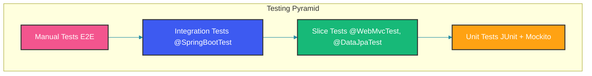

## Overview

Spring Boot provides slice testing annotations that load only the relevant part of the application context for focused testing. This approach leads to faster tests, better isolation, and clearer test intent. This guide covers all major slice annotations with practical examples.

The key insight is that `@SpringBootTest` loads the entire application context — all beans, all configurations. This is slow and makes tests brittle. Slice annotations load only the beans needed for a particular layer: controllers for `@WebMvcTest`, repositories for `@DataJpaTest`, JSON serializers for `@JsonTest`, REST clients for `@RestClientTest`.

## Testing Pyramid with Spring Boot



## @WebMvcTest

### Controller Testing

`@WebMvcTest` loads only the controller layer: the specified controller, security configuration, interceptors, and Jackson configuration. It does NOT load services, repositories, or any other beans. Dependencies of the controller must be mocked with `@MockBean`.

This isolation is intentional: controller tests verify HTTP mapping, input validation, response serialization, and status codes — not business logic. Business logic is tested at the service layer. The `mockMvc` field is auto-configured to send requests through the Spring MVC dispatcher.

```java
@WebMvcTest(UserController.class)
class UserControllerTest {
    @Autowired
    private MockMvc mockMvc;

    @MockBean
    private UserService userService;

    @Test
    void shouldReturnUserWhenFound() throws Exception {
        User user = new User(1L, "john.doe@example.com", "John Doe");
        when(userService.findById(1L)).thenReturn(Optional.of(user));

        mockMvc.perform(get("/api/users/{id}", 1L)
                .accept(MediaType.APPLICATION_JSON))
            .andExpect(status().isOk())
            .andExpect(jsonPath("$.id").value(1))
            .andExpect(jsonPath("$.email").value("john.doe@example.com"))
            .andExpect(jsonPath("$.name").value("John Doe"));
    }

    @Test
    void shouldReturn404WhenUserNotFound() throws Exception {
        when(userService.findById(99L)).thenReturn(Optional.empty());

        mockMvc.perform(get("/api/users/{id}", 99L)
                .accept(MediaType.APPLICATION_JSON))
            .andExpect(status().isNotFound());
    }

    @Test
    void shouldCreateUser() throws Exception {
        CreateUserRequest request = new CreateUserRequest("jane@example.com", "Jane Doe");
        User created = new User(2L, "jane@example.com", "Jane Doe");
        when(userService.createUser(any())).thenReturn(created);

        mockMvc.perform(post("/api/users")
                .contentType(MediaType.APPLICATION_JSON)
                .content("{\"email\":\"jane@example.com\",\"name\":\"Jane Doe\"}"))
            .andExpect(status().isCreated())
            .andExpect(header().exists("Location"))
            .andExpect(jsonPath("$.id").value(2));
    }

    @Test
    void shouldReturn400ForInvalidInput() throws Exception {
        mockMvc.perform(post("/api/users")
                .contentType(MediaType.APPLICATION_JSON)
                .content("{\"email\":\"invalid\"}"))
            .andExpect(status().isBadRequest());
    }
}
```

### Customizing @WebMvcTest

When your controller depends on beans beyond the web layer (like `@Import` for test security configuration), use `@Import` to bring in specific beans. The `excludeFilters` option excludes unwanted auto-configurations like the default security configuration.

```java
@WebMvcTest(controllers = {UserController.class, OrderController.class},
            excludeFilters = @ComponentScan.Filter(
                type = FilterType.ASSIGNABLE_TYPE,
                classes = SecurityConfig.class
            ))
@Import(TestSecurityConfig.class)
@AutoConfigureMockMvc(addFilters = false) // Disable security filters
class CombinedControllerTest {
    // Test setup
}
```

## @DataJpaTest

### Repository Testing

`@DataJpaTest` configures an in-memory database (by default H2), scans for `@Entity` classes, and configures Spring Data JPA repositories. It does NOT load services, controllers, or web configuration. Use `TestEntityManager` for test data setup — it's a wrapper around `EntityManager` with convenience methods like `persistFlushFind`.

The `@AutoConfigureTestDatabase(replace = AutoConfigureTestDatabase.Replace.NONE)` annotation tells Spring Boot to use the configured database instead of the default in-memory one. This is useful when your entity annotations rely on database-specific features.

```java
@DataJpaTest
@AutoConfigureTestDatabase(replace = AutoConfigureTestDatabase.Replace.NONE)
class UserRepositoryTest {
    @Autowired
    private TestEntityManager entityManager;

    @Autowired
    private UserRepository userRepository;

    private User savedUser;

    @BeforeEach
    void setUp() {
        savedUser = entityManager.persistFlushFind(
            new User("test@example.com", "Test User", UserRole.USER)
        );
    }

    @Test
    void shouldFindByEmail() {
        Optional<User> found = userRepository.findByEmail("test@example.com");
        assertThat(found).isPresent();
        assertThat(found.get().getName()).isEqualTo("Test User");
    }

    @Test
    void shouldFindActiveUsers() {
        Page<User> activeUsers = userRepository.findByActiveTrue(
            PageRequest.of(0, 10, Sort.by("createdAt").descending())
        );
        assertThat(activeUsers.getContent()).hasSize(1);
        assertThat(activeUsers.getTotalElements()).isEqualTo(1);
    }

    @Test
    void shouldReturnEmptyForNonExistentEmail() {
        Optional<User> found = userRepository.findByEmail("nonexistent@example.com");
        assertThat(found).isEmpty();
    }

    @Test
    void shouldUpdateUserRole() {
        int updated = userRepository.updateUserRole(UserRole.ADMIN, savedUser.getId());
        assertThat(updated).isEqualTo(1);

        entityManager.clear();
        User reloaded = entityManager.find(User.class, savedUser.getId());
        assertThat(reloaded.getRole()).isEqualTo(UserRole.ADMIN);
    }

    @Test
    void shouldExecuteNativeQuery() {
        List<Object[]> results = entityManager.getEntityManager()
            .createNativeQuery("SELECT COUNT(*), role FROM users GROUP BY role")
            .getResultList();

        assertThat(results).hasSize(1);
    }
}
```

### Customizing @DataJpaTest

For tests that rely on JPA auditing (createdBy, createdAt fields), import the auditing configuration with `@Import` and enable it with `@EnableJpaAuditing`. Without this, auditing fields remain null in tests.

```java
@DataJpaTest
@AutoConfigureTestDatabase(connection = EmbeddedDatabaseConnection.H2)
@Import(TestAuditingConfig.class)
@EnableJpaAuditing
class AuditableEntityTest {
    @Autowired
    private TestEntityManager entityManager;

    @Autowired
    private OrderRepository orderRepository;

    @Test
    void shouldSetAuditFieldsOnCreate() {
        Order order = orderRepository.save(new Order("CUST-001", BigDecimal.valueOf(100)));
        assertThat(order.getCreatedAt()).isNotNull();
        assertThat(order.getCreatedBy()).isNotNull();
        assertThat(order.getUpdatedAt()).isNotNull();
    }
}
```

## @JsonTest

### Serialization Testing

`@JsonTest` configures Jackson (or Gson) and auto-configures `JacksonTester` for testing serialization and deserialization. It does NOT load any other beans. Use it to verify that your JSON annotations (`@JsonProperty`, `@JsonFormat`, `@JsonIgnore`) work correctly and that custom serializers/deserializers produce the expected output.

Testing serialization in isolation catches annotation mistakes and format issues before they cause API contract violations.

```java
@JsonTest
class UserJsonTest {
    @Autowired
    private JacksonTester<User> json;

    @Test
    void shouldSerializeUser() throws Exception {
        User user = new User(1L, "john@example.com", "John Doe");

        assertThat(json.write(user))
            .hasJsonPathNumberValue("$.id")
            .hasJsonPathStringValue("$.email")
            .hasJsonPathStringValue("$.name")
            .extractingJsonPathNumberValue("$.id")
            .isEqualTo(1);
    }

    @Test
    void shouldDeserializeUser() throws Exception {
        String content = "{\"id\":1,\"email\":\"john@example.com\",\"name\":\"John Doe\"}";

        assertThat(json.parse(content))
            .isEqualTo(new User(1L, "john@example.com", "John Doe"));
    }

    @Test
    void shouldHandleNullFields() throws Exception {
        User user = new User(null, null, "John Doe");

        assertThat(json.write(user))
            .doesNotHaveJsonPath("$.id")
            .doesNotHaveJsonPath("$.email");
    }
}
```

### Custom ObjectMapper

When your application configures a custom `ObjectMapper`, import that configuration into the `@JsonTest`. The `@AutoConfigureJsonTesters` annotation enables the `JacksonTester`/`GsonTester`/`JsonbTester` injection.

```java
@JsonTest
@AutoConfigureJsonTesters
@Import(JacksonConfig.class)
class CustomJsonTest {
    @Autowired
    private JacksonTester<OrderEvent> json;

    @Test
    void shouldSerializeWithCustomDateFormat() throws Exception {
        OrderEvent event = new OrderEvent(
            "ORDER-123",
            Instant.parse("2026-05-11T10:00:00Z"),
            BigDecimal.valueOf(99.99)
        );

        String result = json.write(event).getJson();
        assertThat(result).contains("2026-05-11T10:00:00");
        assertThat(result).contains("\"amount\":99.99");
    }
}
```

## @RestClientTest

### REST Client Testing

`@RestClientTest` configures a mock HTTP server for testing REST clients. It auto-configures `MockRestServiceServer` and injects it into the test. The mock server lets you define expectations for outgoing requests and stub responses, without making actual HTTP calls.

This is essential for testing error handling, timeouts, and deserialization in REST clients without relying on external services.

```java
@RestClientTest(UserServiceClient.class)
class UserServiceClientTest {
    @Autowired
    private MockRestServiceServer server;

    @Autowired
    private UserServiceClient client;

    @Test
    void shouldFetchUser() {
        server.expect(requestTo("/api/users/1"))
            .andExpect(method(GET))
            .andRespond(withSuccess(
                "{\"id\":1,\"email\":\"john@example.com\",\"name\":\"John Doe\"}",
                MediaType.APPLICATION_JSON
            ));

        User user = client.getUser(1L);

        assertThat(user.getId()).isEqualTo(1L);
        assertThat(user.getEmail()).isEqualTo("john@example.com");
    }

    @Test
    void shouldHandle404() {
        server.expect(requestTo("/api/users/99"))
            .andExpect(method(GET))
            .andRespond(withStatus(HttpStatus.NOT_FOUND));

        assertThatThrownBy(() -> client.getUser(99L))
            .isInstanceOf(UserNotFoundException.class);
    }

    @Test
    void shouldHandleTimeout() {
        server.expect(requestTo("/api/users/1"))
            .andExpect(method(GET))
            .andRespond(withSuccess()
                .body("{}")
                .timeout(Duration.ofMillis(100))
            );

        assertThatThrownBy(() -> client.getUser(1L))
            .isInstanceOf(ResourceAccessException.class);
    }
}
```

## @WebFluxTest

### Reactive Controller Testing

`@WebFluxTest` is the reactive equivalent of `@WebMvcTest`. It auto-configures `WebTestClient` for making requests to reactive controllers without starting a server. `@MockBean` annotates mocked dependencies.

The `WebTestClient` API is similar to `MockMvc` but designed for reactive types: it can consume `Flux` and `Mono` responses and supports streaming endpoints.

```java
@WebFluxTest(ReactiveUserController.class)
class ReactiveUserControllerTest {
    @Autowired
    private WebTestClient webTestClient;

    @MockBean
    private ReactiveUserService userService;

    @Test
    void shouldReturnUser() {
        when(userService.findById(1L)).thenReturn(Mono.just(
            new User(1L, "john@example.com", "John Doe")
        ));

        webTestClient.get().uri("/api/users/{id}", 1L)
            .accept(MediaType.APPLICATION_JSON)
            .exchange()
            .expectStatus().isOk()
            .expectBody()
            .jsonPath("$.id").isEqualTo(1)
            .jsonPath("$.email").isEqualTo("john@example.com");
    }

    @Test
    void shouldReturnStreamOfUsers() {
        when(userService.findAll()).thenReturn(Flux.just(
            new User(1L, "john@example.com", "John Doe"),
            new User(2L, "jane@example.com", "Jane Doe")
        ));

        webTestClient.get().uri("/api/users")
            .accept(MediaType.APPLICATION_NDJSON)
            .exchange()
            .expectStatus().isOk()
            .expectBody()
            .consumeWith(result -> {
                String body = new String(result.getResponseBody());
                assertThat(body).contains("John Doe");
                assertThat(body).contains("Jane Doe");
            });
    }
}
```

## @SpringBootTest

### Full Integration Testing

`@SpringBootTest` starts the full application context. Use it sparingly — primarily for smoke tests that verify the context loads without errors, and for end-to-end flows that involve multiple layers. The `webEnvironment = RANDOM_PORT` option starts an embedded server on a random port.

`TestRestTemplate` is a convenience wrapper around `RestTemplate` that auto-configures for testing (including authentication and error handling). For REST-assured-style testing, consider `@AutoConfigureMockMvc` with `@SpringBootTest`.

```java
@SpringBootTest(webEnvironment = SpringBootTest.WebEnvironment.RANDOM_PORT)
class UserRegistrationIntegrationTest {
    @Autowired
    private TestRestTemplate restTemplate;

    @Autowired
    private UserRepository userRepository;

    @LocalServerPort
    private int port;

    @BeforeEach
    void setUp() {
        userRepository.deleteAll();
    }

    @Test
    void shouldRegisterUser() {
        ResponseEntity<User> response = restTemplate.postForEntity(
            "/api/users",
            new CreateUserRequest("new@example.com", "New User"),
            User.class
        );

        assertThat(response.getStatusCode()).isEqualTo(HttpStatus.CREATED);
        assertThat(response.getBody()).isNotNull();
        assertThat(response.getBody().getEmail()).isEqualTo("new@example.com");

        // Verify persistence
        assertThat(userRepository.findByEmail("new@example.com")).isPresent();
    }

    @Test
    void shouldReturnUsersPage() {
        // Seed data
        userRepository.saveAll(List.of(
            new User("user1@example.com", "User 1"),
            new User("user2@example.com", "User 2")
        ));

        ResponseEntity<Page<User>> response = restTemplate.exchange(
            "/api/users?page=0&size=10",
            HttpMethod.GET,
            null,
            new ParameterizedTypeReference<Page<User>>() {}
        );

        assertThat(response.getStatusCode()).isEqualTo(HttpStatus.OK);
        assertThat(response.getBody().getTotalElements()).isEqualTo(2);
    }
}
```

## Test Configuration Patterns

### Isolating Test Configuration

`@TestConfiguration` creates a configuration that is excluded from component scanning and is only active in tests. Use it to provide mock or alternative beans for testing. The test configuration is merged with the application's primary configuration.

```java
@TestConfiguration
public class TestSecurityConfig {
    @Bean
    public SecurityFilterChain testFilterChain(HttpSecurity http) throws Exception {
        http.authorizeHttpRequests(auth -> auth.anyRequest().permitAll());
        return http.build();
    }

    @Bean
    public UserDetailsService testUserService() {
        return username -> new User("test", "password", Collections.emptyList());
    }
}
```

### Using @TestComponent

`@TestComponent` is similar to `@TestConfiguration` but marks individual beans as test-only. Use it when you need a test-specific bean (like a fixed clock) that should not be picked up by `@SpringBootTest` bean scanning.

```java
@TestComponent
public class TestClock implements Clock {
    private Instant fixedInstant = Instant.parse("2026-05-11T10:00:00Z");

    @Override
    public Instant instant() {
        return fixedInstant;
    }

    public void setTime(Instant instant) {
        this.fixedInstant = instant;
    }
}

// In test
@WebMvcTest(OrderController.class)
@Import(TestClock.class)
class OrderControllerTest {
    @Autowired
    private TestClock testClock;

    @Test
    void testWithFixedTime() {
        testClock.setTime(Instant.parse("2026-06-01T00:00:00Z"));
        // Run test with controlled time
    }
}
```

## Best Practices

1. **Use slice tests** (@WebMvcTest, @DataJpaTest) for focused, fast testing
2. **Use @SpringBootTest sparingly** - mainly for smoke/integration tests
3. **Mock external dependencies** in slice tests with @MockBean
4. **Use TestEntityManager** instead of injecting repositories in @DataJpaTest
5. **Create @TestConfiguration** for test-specific bean overrides
6. **Use @DynamicPropertySource** for containerized test dependencies
7. **Avoid Spring context caching issues** by using @DirtiesContext when needed

## Common Mistakes

### Mistake 1: Using @SpringBootTest for Everything

```java
// Wrong: Slow, loads entire context
@SpringBootTest
class UserControllerTest {
    @Autowired
    private MockMvc mockMvc;

    @Test
    void testGetUser() {
        // Test controller
    }
}
```

```java
// Correct: Fast, focused slice test
@WebMvcTest(UserController.class)
class UserControllerTest {
    @Autowired
    private MockMvc mockMvc;

    @MockBean
    private UserService userService;

    @Test
    void testGetUser() {
        // Test controller with mocked service
    }
}
```

### Mistake 2: Testing Database Without Transaction Rollback

```java
// Wrong: Test data persists and affects other tests
@DataJpaTest
class UserRepositoryTest {
    @Autowired
    private UserRepository userRepository;

    @Test
    void testCreateUser() {
        userRepository.save(new User("test@example.com", "Test"));
        // Data persists after test
    }
}
```

```java
// Correct: DataJpaTest is transactional by default
@DataJpaTest
class UserRepositoryTest {
    @Autowired
    private UserRepository userRepository;

    @Test
    void testCreateUser() {
        userRepository.save(new User("test@example.com", "Test"));
        // Automatically rolled back after test
    }

    @Test
    @Rollback(false) // Explicitly disable rollback only when needed
    void testWithoutRollback() {
        userRepository.save(new User("persist@example.com", "Persist"));
    }
}
```

### Mistake 3: Forgetting to Clear EntityManager

```java
// Wrong: Stale data from EntityManager cache
@DataJpaTest
class UserRepositoryTest {
    @Autowired
    private TestEntityManager entityManager;

    @Test
    void testUpdate() {
        User user = entityManager.persistFlushFind(
            new User("test@example.com", "Test")
        );
        user.setName("Updated");
        entityManager.persistAndFlush(user);

        // Stale cache hit: still returns old name
        User cached = entityManager.find(User.class, user.getId());
    }
}
```

```java
// Correct: Clear EntityManager to get fresh data
@DataJpaTest
class UserRepositoryTest {
    @Autowired
    private TestEntityManager entityManager;

    @Test
    void testUpdate() {
        User user = entityManager.persistFlushFind(
            new User("test@example.com", "Test")
        );
        user.setName("Updated");
        entityManager.persistAndFlush(user);
        entityManager.clear(); // Clear cache

        User fresh = entityManager.find(User.class, user.getId());
        assertThat(fresh.getName()).isEqualTo("Updated");
    }
}
```

## Summary

Spring Boot's slice testing annotations enable fast, focused tests by loading only the necessary parts of the application context. Use @WebMvcTest for controllers, @DataJpaTest for repositories, @JsonTest for serialization, and @SpringBootTest sparingly for full integration tests. Always mock external dependencies and use test-specific configuration for isolated tests.

## References

- [Spring Boot Testing Documentation](https://docs.spring.io/spring-boot/reference/testing.html)
- [Slice Testing Annotations](https://docs.spring.io/spring-boot/reference/testing/spring-boot-applications.html#testing.spring-boot-applications.slice-configuration)
- [MockMvc Documentation](https://docs.spring.io/spring-framework/reference/testing/spring-mvc-test-framework.html)
- [TestEntityManager Javadoc](https://docs.spring.io/spring-boot/docs/current/api/org/springframework/boot/test/autoconfigure/orm/jpa/TestEntityManager.html)

Happy Coding
