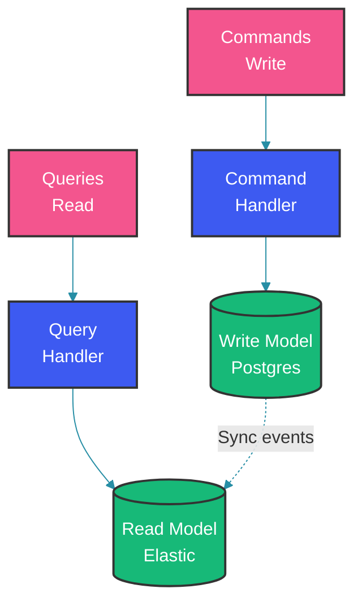

# Event-Driven Architecture

## Overview

Event-driven architecture (EDA) is a software architecture paradigm promoting the production, detection, consumption of, and reaction to events. It's the foundation for modern microservices communication, enabling loose coupling, scalability, and real-time processing.

---

## Core Patterns

### 1. Event Notification

```java
// Simple: Service emits event, others react
@Service
public class OrderService {
    
    @Autowired
    private ApplicationEventPublisher eventPublisher;
    
    public Order createOrder(CreateOrderRequest request) {
        Order order = Order.from(request);
        order = orderRepository.save(order);
        
        // Emit event
        eventPublisher.publishEvent(
            new OrderCreatedEvent(order.getId(), order.getUserId(), order.getTotal())
        );
        
        return order;
    }
}

// Listener
@Service
public class NotificationService {
    
    @EventListener
    @Async
    public void handleOrderCreated(OrderCreatedEvent event) {
        // Send email, push notification, etc.
        emailService.sendOrderConfirmation(event.getUserId(), event.getOrderId());
    }
}
```

### 2. Event Sourcing

```java
// Store all state changes as events
@Entity
public class BankAccount {
    
    @Id
    private String accountId;
    
    @Transient
    private BigDecimal balance;  // Derived from events
    
    @ElementCollection
    @OrderBy("timestamp ASC")
    private List<AccountEvent> events = new ArrayList<>();
    
    public void apply(AccountEvent event) {
        switch (event.getType()) {
            case DEPOSIT -> balance = balance.add(event.getAmount());
            case WITHDRAWAL -> balance = balance.subtract(event.getAmount());
        }
        events.add(event);
    }
}

@Service
public class AccountService {
    
    public void deposit(String accountId, BigDecimal amount) {
        AccountEvent event = AccountEvent.builder()
            .type(AccountEvent.Type.DEPOSIT)
            .amount(amount)
            .timestamp(Instant.now())
            .build();
        
        BankAccount account = accountRepository.findById(accountId);
        account.apply(event);
        accountRepository.save(account);
        
        // Publish to Kafka for other services
        kafkaTemplate.send("account-events", accountId, event);
    }
}
```

### 3. CQRS (Command Query Responsibility Segregation)



```java
// Command side
@Service
public class OrderCommandService {
    
    @Autowired
    private OrderRepository orderRepository;
    
    @Autowired
    private EventPublisher eventPublisher;
    
    public Order createOrder(CreateOrderCommand command) {
        Order order = Order.from(command);
        order = orderRepository.save(order);
        
        // Publish event to update read model
        eventPublisher.publishEvent(new OrderCreatedEvent(order));
        
        return order;
    }
}

// Query side
@Service
public class OrderQueryService {
    
    @Autowired
    private ElasticsearchTemplate elasticsearchTemplate;
    
    public List<OrderView> findOrders(String userId) {
        Query query = new NativeSearchQueryBuilder()
            .withQuery(matchQuery("userId", userId))
            .build();
        
        SearchHits<OrderView> hits = elasticsearchTemplate.search(query, OrderView.class);
        return hits.stream().map(SearchHit::getContent).collect(Collectors.toList());
    }
}

// Event handler updates read model
@Component
public class OrderViewUpdater {
    
    @KafkaListener(topics = "orders", groupId = "query-service")
    public void handle(OrderCreatedEvent event) {
        OrderView view = OrderView.from(event);
        elasticsearchTemplate.save(view);
    }
}
```

### 4. Saga Pattern

```java
// Orchestrated saga for distributed transactions
@Service
public class OrderSagaOrchestrator {
    
    @Autowired
    private OrderService orderService;
    @Autowired
    private PaymentService paymentService;
    @Autowired
    private InventoryService inventoryService;
    @Autowired
    private KafkaTemplate kafkaTemplate;
    
    public void executeOrderSaga(CreateOrderCommand command) {
        try {
            // Step 1: Create order (pending)
            Order order = orderService.createPending(command);
            
            // Step 2: Reserve inventory
            if (!inventoryService.reserve(command.getItems())) {
                throw new SagaStepException("Inventory reservation failed");
            }
            
            // Step 3: Process payment
            if (!paymentService.charge(command.getUserId(), command.getTotal())) {
                inventoryService.release(command.getItems());  // Compensate
                orderService.cancel(order.getId());           // Compensate
                throw new SagaStepException("Payment failed");
            }
            
            // Step 4: Confirm order
            orderService.confirm(order.getId());
            
        } catch (SagaStepException e) {
            // Already handled compensation above
            kafkaTemplate.send("order-errors", command, e.getMessage());
        }
    }
}

// Event-based saga (choreography)
@Service
public class OrderSagaChoreography {
    
    @KafkaListener(topics = "orders", groupId = "inventory-service")
    public void onOrderCreated(OrderCreatedEvent event) {
        boolean reserved = inventoryService.reserve(event.getItems());
        
        if (reserved) {
            kafkaTemplate.send("inventory-reserved", event.getOrderId());
        } else {
            kafkaTemplate.send("inventory-failed", event.getOrderId());
        }
    }
}
```

---

## Production Considerations

### Event Schema Evolution

```java
// Version events for backward compatibility
@Event
class OrderCreatedEvent {
    
    @Schema(version = 1)
    private Long orderId;
    
    @Schema(version = 2)
    private Long userId;
    
    @Schema(version = 2, defaultValue = "USD")
    private String currency;
}

// Use EventRouter to handle different versions
@Component
public class EventRouter {
    
    @EventListener
    public void route(Object event) {
        if (event instanceof OrderCreatedEvent v1) {
            handleV1(v1);
        }
    }
}
```

### Idempotency

```java
// Process events idempotently to handle duplicates
@Service
public class IdempotentProcessor {
    
    private Set<String> processedIds = ConcurrentHashMap.newKeySet();
    
    @KafkaListener(topics = "orders")
    public void process(OrderEvent event) {
        // Check if already processed
        if (!processedIds.add(event.getEventId())) {
            log.info("Skipping duplicate event: {}", event.getEventId());
            return;
        }
        
        // Process event
    }
}
```

---

## Common Mistakes

### Mistake 1: Synchronous Event Handling

```java
// WRONG: Block waiting for event processing
@Service
public class BadService {
    
    @Autowired
    private ApplicationEventPublisher publisher;
    
    public void create(Order order) {
        orderRepository.save(order);
        
        // Waits for all listeners - same as synchronous call!
        publisher.publishEvent(new OrderCreatedEvent(order));
        
        // Response returned only after notifications sent
    }
}

// CORRECT: Make event handling async
@Service
public class GoodService {
    
    @Async
    @EventListener
    public void handleOrderCreated(OrderCreatedEvent event) {
        // Runs asynchronously
    }
}
```

### Mistake 2: No Transactional Outbox

```java
// WRONG: Database and message not in sync
@Service
public class BadService {
    
    @Transactional
    public void create(Order order) {
        orderRepository.save(order);
        
        // If Kafka fails, database has order but no event!
        kafkaTemplate.send("orders", order);
    }
}

// CORRECT: Use transactional outbox
@Service
public class GoodService {
    
    @Transactional
    public void create(Order order) {
        orderRepository.save(order);
        
        // Save to outbox in same transaction
        outboxRepository.save(OutboxEvent.builder()
            .aggregateType("Order")
            .aggregateId(order.getId())
            .eventType("OrderCreated")
            .payload(toJson(order))
            .build()
        );
    }
}

// Separate process polls outbox and publishes
@Service
public class OutboxProcessor {
    
    @Scheduled(fixedRate = 1000)
    @Transactional
    public void processOutbox() {
        List<OutboxEvent> events = outboxRepository.findAllUnprocessed();
        
        for (OutboxEvent event : events) {
            kafkaTemplate.send(event.getAggregateType(), event.getPayload());
            event.setProcessed(true);
            outboxRepository.save(event);
        }
    }
}
```

---

## Summary

1. **Event Notification**: Simple, loosely coupled
2. **Event Sourcing**: Store state as sequence of events
3. **CQRS**: Separate read and write models
4. **Saga**: Handle distributed transactions
5. **Outbox Pattern**: Ensure reliable event publishing

---

## References

- [Event-Driven Architecture](https://martinfowler.com/articles/201701-event-driven.html)
- [CQRS Pattern](https://martinfowler.com/bliki/CQRS.html)
- [Saga Pattern](https://microservices.io/patterns/data/saga.html)
- [Event Sourcing](https://martinfowler.com/eaaDev/EventSourcing.html)

---

Happy Coding 👨‍💻