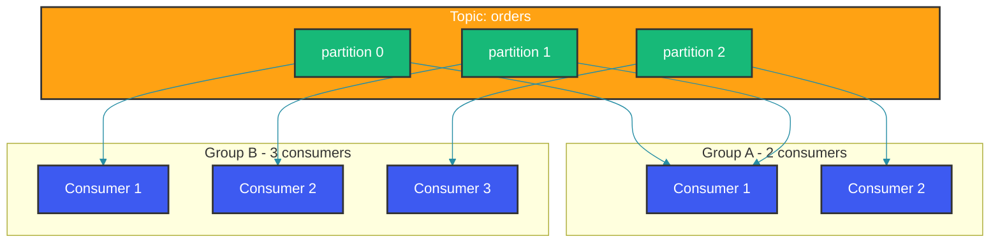

# Kafka Consumer Groups

## Overview

Consumer groups enable parallel processing in Kafka. Each group shares the workload of consuming from a topic, with partitions distributed among group members. Understanding how consumer groups work is essential for building scalable Kafka applications.

---

## How Consumer Groups Work

### Basic Group Behavior

A topic with 3 partitions can be consumed by multiple consumers in the same group. Kafka assigns each partition to exactly one consumer within the group — if you have more consumers than partitions, the extra consumers remain idle. The diagram below shows how two different groups (A and B) each receive every message, but within a group the work is divided.



### Implementation

When multiple instances of a service share the same `groupId`, Kafka distributes partitions among them. Here, all instances of `OrderProcessor` use the group `order-processor-group`, so partitions 0 and 1 go to one instance and partition 2 to another. This is how horizontal scaling works in Kafka — add more instances to increase throughput, up to the number of partitions.

```java
// All consumers in same group share partitions
@Service
public class OrderProcessor {
    
    @KafkaListener(
        topics = "orders",
        groupId = "order-processor-group"  // All instances share this group
    )
    public void processOrder(OrderEvent event) {
        log.info("Processed order: {}", event.getOrderId());
    }
}

// With multiple instances, partitions are split:
// Instance 1: partitions 0, 1
// Instance 2: partition 2
```

---

## Real-World Use Cases

### 1. Scaling Consumers

Setting `concurrency = "3"` tells Spring Kafka to create 3 consumer threads within the same JVM, each acting as a separate consumer in the group. This is useful for vertically scaling a single service instance. Each thread gets its own partition assignment, and Kafka automatically rebalances when threads are added or removed.

```java
// Scale by adding consumer instances
// Kafka automatically rebalances partitions

@Service
public class ScaledProcessor {
    
    @KafkaListener(
        topics = "orders",
        groupId = "scaled-group",
        concurrency = "3"  // Creates 3 consumer threads
    )
    public void process(OrderEvent event) {
        // Multiple threads process in parallel
    }
}
```

### 2. Different Processing Paths

Different consumer groups can process the same topic independently. Here, `NotificationService` and `AnalyticsService` both subscribe to the `orders` topic but use different group IDs (`notifications` and `analytics`). Each group gets a full copy of every message, enabling independent processing for different concerns like email notifications and usage analytics.

```java
// Same events, different consumers with different groups
@Service
public class NotificationService {
    
    @KafkaListener(topics = "orders", groupId = "notifications")
    public void sendNotification(OrderEvent event) {
        emailService.sendOrderConfirmation(event.getUserId());
    }
}

@Service
public class AnalyticsService {
    
    @KafkaListener(topics = "orders", groupId = "analytics")
    public void trackOrder(OrderEvent event) {
        analyticsService.track(event);
    }
}

// Orders are processed by both groups independently
```

---

## Production Considerations

### Rebalancing

Rebalancing is the process of reassigning partitions when consumers join, leave, or are considered dead. During a rebalance, all consumers in the group stop processing (stop-the-world) until the new assignment is complete. To minimize disruptions, tune `session.timeout.ms` (the time before a consumer is declared dead) and `heartbeat.interval.ms` (how often the consumer pings the coordinator). Longer timeouts reduce false rebalances but delay failure detection.

```java
// Rebalance occurs when:
// - Consumer joins/leaves group
// - Partition count changes
// - Consumer considered dead (session.timeout)

@Configuration
public class RebalanceConfig {
    
    @Bean
    public KafkaListenerContainerFactory<ConcurrentMessageListenerContainer<String, OrderEvent>> 
            kafkaListenerContainerFactory() {
        
        ConcurrentKafkaListenerContainerFactory<String, OrderEvent> factory = 
            new ConcurrentKafkaListenerContainerFactory<>();
        
        factory.getContainerProperties().setSessionTimeoutMs(45000);
        factory.getContainerProperties().setHeartbeatInterval(15000);
        
        return factory;
    }
}
```

### Offset Management

By default, Kafka commits offsets automatically, which can lead to at-most-once delivery if the consumer crashes between an auto-commit and message processing. Manual offset management with `Acknowledgment.acknowledge()` gives you control: commit only after the message is fully processed. If processing fails, don't acknowledge — the message will be redelivered (subject to the consumer's `max.poll.interval.ms`).

```java
// Manual offset management
@Service
public class ManualOffsetService {
    
    @KafkaListener(topics = "orders", groupId = "manual-group")
    public void process(
            @Payload OrderEvent event,
            @Header(KafkaHeaders.OFFSET) long offset,
            Acknowledgment ack) {
        
        try {
            processOrder(event);
            
            // Commit offset after successful processing
            ack.acknowledge();  
        } catch (Exception e) {
            log.error("Failed processing", e);
            // Don't acknowledge - will be redelivered
        }
    }
}
```

---

## Common Mistakes

### Mistake 1: Too Many Partitions

More partitions increase parallelism but also increase the overhead of leader election, file handle usage, and rebalance time. A common guideline is to size partitions based on `target_throughput / consumer_throughput`. Start conservatively — you can always add partitions later (though partition reduction is not supported).

```java
// WRONG: More partitions than needed
// Each partition means a potential processing bottleneck

// CORRECT: Size based on throughput needs
// Rule: target_throughput / consumer_throughput = num_partitions
// Start with 6 partitions, adjust based on metrics
```

### Mistake 2: Not Handling Rebalances

Without explicit rebalance handling, in-flight processing during a rebalance can cause duplicate processing or data loss. Implementing a `ConsumerSeekCallback` or registering a `ConsumerRebalanceListener` lets you commit offsets before partitions are revoked, ensuring a clean state for the consumer taking over the partition.

```java
// WRONG: No handling of rebalance events

// CORRECT: Add rebalance listener
@KafkaListener(topics = "orders")
public void handle(
        @Payload OrderEvent event,
        @Header(KafkaHeaders.OFFSET) long offset,
        Acknowledgment ack,
        ConsumerSeekCallback seekCallback) {
    
    // Process normally
}
```

---

## Summary

1. **Group ID**: Defines which consumers share partitions
2. **Scaling**: Add consumers up to partition count
3. **Rebalancing**: Automatic partition reassignment
4. **Offset**: Track processed messages for at-least-once delivery

---

## References

- [Kafka Consumer Groups](https://kafka.apache.org/documentation/#intro_consumers)
- [KIP-464: Rebalance Protocol](https://cwiki.apache.org/confluence/display/KAFKA/KIP-464%3A+Design+of+Consumer+Rebalance+Protocol)

---

Happy Coding
