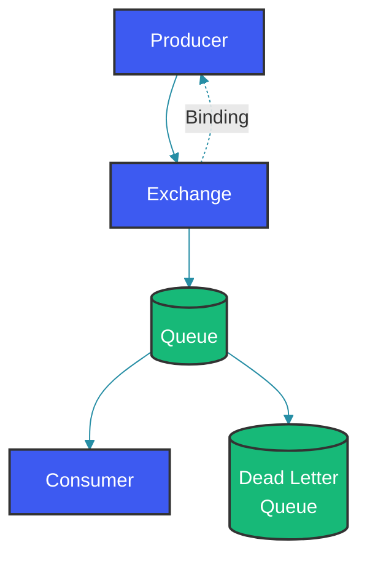

# RabbitMQ Fundamentals

## Overview

RabbitMQ is a feature-rich message broker implementing AMQP (Advanced Message Queuing Protocol). Unlike Kafka's log-based model, RabbitMQ uses traditional message queue semantics with exchanges, queues, and bindings. It's ideal for task queues, RPC, and complex routing scenarios.

---

## Architecture

RabbitMQ's core model is simple: producers send messages to an exchange, which routes them to queues based on bindings. Consumers then pull messages from queues. The diagram below shows this flow — a producer sends to an exchange, which routes to a queue, and the consumer receives it. A dead-letter queue (DLQ) catches messages that couldn't be processed, providing a safety net for failed messages.



---

## Exchange Types

### Direct Exchange

A direct exchange routes messages to queues where the routing key exactly matches the binding key. In this example, a message with routing key `order.urgent` goes only to the `orders.urgent` queue. This is the simplest exchange type and is ideal for unicast or single-worker patterns where you need precise message routing.

```java
// Direct: Exact matching on routing key
@Configuration
public class DirectExchangeConfig {
    
    @Bean
    public DirectExchange ordersExchange() {
        return new DirectExchange("orders.exchange");
    }
    
    @Bean
    public Queue urgentQueue() {
        return QueueBuilder.durable("orders.urgent").build();
    }
    
    @Bean
    public Binding urgentBinding() {
        return BindingBuilder.bind(urgentQueue())
            .to(ordersExchange())
            .with("order.urgent");  // Exact routing key match
    }
}

// Producer: Send with specific routing key
@Service
public class OrderProducer {
    
    @Autowired
    private RabbitTemplate rabbitTemplate;
    
    public void sendUrgentOrder(Order order) {
        rabbitTemplate.convertAndSend(
            "orders.exchange",
            "order.urgent",        // routing key
            order
        );
    }
}
```

### Topic Exchange

Topic exchanges use wildcard patterns for flexible routing. The `#` wildcard matches zero or more words, while `*` matches exactly one word. Here, `notification.email.#` matches `notification.email`, `notification.email.order`, `notification.email.order.created`, etc. This is ideal for publish-subscribe scenarios where consumers want only a subset of messages based on a hierarchical routing key.

```java
// Topic: Pattern-based matching
@Configuration
public class TopicExchangeConfig {
    
    @Bean
    public TopicExchange notificationsExchange() {
        return new TopicExchange("notifications.exchange");
    }
    
    @Bean
    public Queue emailQueue() {
        return QueueBuilder.durable("notifications.email").build();
    }
    
    @Bean
    public Queue smsQueue() {
        return QueueBuilder.durable("notifications.sms").build();
    }
    
    // Bind with wildcards: # = zero or more, * = exactly one word
    @Bean
    public Binding emailBinding() {
        return BindingBuilder.bind(emailQueue())
            .to(notificationsExchange())
            .with("notification.email.#");  // Matches notification.email, notification.email.order
    }
}
```

---

## Real-World Use Cases

### 1. Task Queue

The task queue pattern distributes work across multiple workers. The `TaskProducer` sends tasks to the `tasks` queue, and multiple `TaskWorker` instances consume them in a competing-consumers pattern. RabbitMQ delivers each message to exactly one consumer, making it perfect for load-balanced background job processing. If a worker dies mid-processing, the message is requeued (if not acknowledged) and delivered to another worker.

```java
@Service
public class TaskProducer {
    
    @Autowired
    private RabbitTemplate rabbitTemplate;
    
    public void queueTask(Task task) {
        rabbitTemplate.convertAndSend("tasks", task);
    }
}

@Component
public class TaskWorker {
    
    @RabbitListener(queues = "tasks")
    public void processTask(Task task) {
        log.info("Processing task: {}", task.getId());
        // Process...
    }
}
```

### 2. Dead Letter Queue

A dead letter queue (DLQ) provides a safety net for messages that cannot be processed. The main queue (`orders`) is configured with `x-dead-letter-exchange` and `x-dead-letter-routing-key`. When a message is rejected (nack'd with `requeue=false`) or expires, RabbitMQ routes it to the specified exchange with the dead routing key. The `deadLetterQueue` then holds these failed messages for diagnosis and reprocessing — no message is ever lost.

```java
@Configuration
public class DLQConfig {
    
    @Bean
    public Queue mainQueue() {
        return QueueBuilder.durable("orders")
            .withArgument("x-dead-letter-exchange", "orders.dlx")
            .withArgument("x-dead-letter-routing-key", "orders.dead")
            .build();
    }
    
    @Bean
    public Queue deadLetterQueue() {
        return QueueBuilder.durable("orders.dead").build();
    }
    
    @Bean
    public DirectExchange deadLetterExchange() {
        return new DirectExchange("orders.dlx");
    }
    
    @Bean
    public Binding deadBinding() {
        return BindingBuilder.bind(deadLetterQueue())
            .to(deadLetterExchange())
            .with("orders.dead");
    }
}
```

---

## Production Configuration

The production configuration below sets manual acknowledgment (`acknowledge-mode: manual`) for reliable processing, a prefetch count of 10 (how many messages are sent to a consumer at once), and concurrent consumers between 5 and 10 for throughput. Publisher confirms (`publisher-confirm-type: correlated`) ensure the producer knows when the broker has received the message.

```yaml
spring:
  rabbitmq:
    host: localhost
    port: 5672
    username: guest
    password: guest
    virtual-host: /
    listener:
      simple:
        acknowledge-mode: manual
        prefetch: 10
        concurrency: 5
        max-concurrency: 10
    publisher-confirm-type: correlated
    publisher-returns: true
```

---

## Common Mistakes

### Mistake 1: Not Using DLQ

Without a dead letter queue, messages that fail processing are either lost (if nack'd with `requeue=false`) or cause infinite redelivery loops (if nack'd with `requeue=true`). Always configure a DLQ to capture failed messages for monitoring and reprocessing.

```java
// WRONG: Lost messages when consumer fails

// CORRECT: Configure dead letter queue
```

### Mistake 2: Not Acknowledging Messages

If a `@RabbitListener` method returns without acknowledging, the message remains unacknowledged in the queue. Eventually, when the consumer channel is closed, the message is redelivered — but until then, it appears consumed. Always explicitly acknowledge (or nack) messages to give RabbitMQ clear signals about delivery status.

```java
// WRONG
@RabbitListener(queues = "tasks")
public void process(Task task) {
    // Process
    // No acknowledgment - message stays in queue but consumed
}

// CORRECT
@RabbitListener(queues = "tasks")
public void process(Task task, Channel channel, 
                    @Header(AmqpHeaders.DELIVERY_TAG) long tag) {
    try {
        process(task);
        channel.basicAck(tag, false);  // Acknowledge
    } catch (Exception e) {
        channel.basicNack(tag, false, true);  // Requeue
    }
}
```

---

## Summary

1. **Exchanges**: Route messages to queues
2. **Queues**: Store messages until consumed
3. **Bindings**: Connect exchanges to queues with routing keys
4. **DLQ**: Handle failed messages
5. **Acknowledgments**: Ensure reliable processing

---

## References

- [RabbitMQ Documentation](https://www.rabbitmq.com/documentation.html)
- [Spring AMQP Reference](https://docs.spring.io/spring-amqp/reference/)
- [RabbitMQ in Action](https://www.manning.com/books/rabbitmq-in-action)

---

Happy Coding
