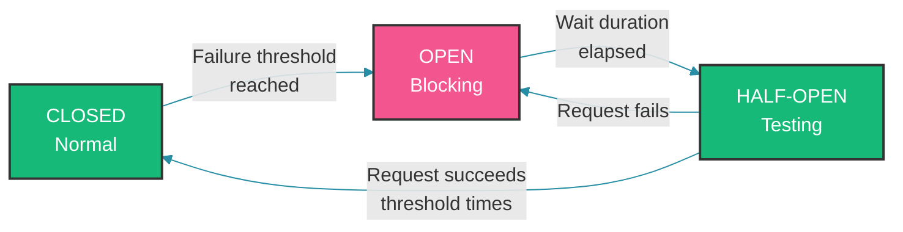

# Circuit Breaker with Resilience4j

## Overview

In distributed systems, failures are inevitable. Network timeouts, database issues, and service unavailability can cascade through your system if not handled properly. The Circuit Breaker pattern prevents cascading failures by wrapping potentially failing operations and detecting when a service is failing.

Resilience4j is the modern circuit breaker library for Java, providing a lightweight, functional approach to fault tolerance. This guide covers implementation patterns, configuration strategies, and common pitfalls.

---

## How Circuit Breaker Works Internally

### The Circuit Breaker State Machine

A circuit breaker has three states — CLOSED (normal operation), OPEN (blocking requests), and HALF-OPEN (testing recovery). The transition from CLOSED to OPEN occurs when the failure rate exceeds the configured threshold. After a wait duration, the circuit transitions to HALF-OPEN to probe whether the downstream service has recovered.



### Resilience4j Architecture

```java
// Core components
public interface CircuitBreaker {
    
    // State management
    String getState();
    
    // Event publishing
    void onSuccess(long duration);
    
    void onFailure(long duration, Throwable throwable);
    
    // Permission to execute
    boolean allowRequest();
    
    // Transition to half-open
    void transitionToHalfOpenState();
}

// Events published by circuit breaker
public class CircuitBreakerEvent {
    private CircuitBreakerStateTransition transition;
    private String circuitBreakerName;
    private Instant timestamp;
}

public class CircuitBreakerOnSuccessEvent extends CircuitBreakerEvent {
    private long duration;
}

public class CircuitBreakerOnFailureEvent extends CircuitBreakerEvent {
    private Throwable throwable;
    private long duration;
}
```

---

## Real-World Backend Use Cases

### Case 1: Basic Circuit Breaker Implementation

The configuration defines a sliding window of 10 calls — when at least 5 calls have been evaluated and the failure rate exceeds 50%, the circuit opens for 30 seconds. Both programmatic (decorator) and annotation-based approaches are shown; annotations are more concise while the decorator API offers finer control over fallback behavior.

```java
// Configure circuit breaker
@Configuration
public class ResilienceConfig {
    
    @Bean
    public CircuitBreakerRegistry circuitBreakerRegistry() {
        return CircuitBreakerRegistry.of(Map.of(
            "userService", CircuitBreakerConfig.custom()
                .failureRateThreshold(50)  // Open at 50% failure rate
                .waitDurationInOpenState(Duration.ofSeconds(30))  // Stay open for 30s
                .permittedNumberOfCallsInHalfOpenState(3)  // Test with 3 calls
                .slidingWindowType(SlidingWindowType.COUNT_BASED)
                .slidingWindowSize(10)  // Track last 10 calls
                .minimumNumberOfCalls(5)  // Need at least 5 calls before evaluating
                .build()
        ));
    }
}

// Using circuit breaker
@Service
public class UserService {
    
    private final CircuitBreakerRegistry circuitBreakerRegistry;
    
    @Autowired
    public UserService(CircuitBreakerRegistry circuitBreakerRegistry) {
        this.circuitBreakerRegistry = circuitBreakerRegistry;
    }
    
    public User getUserById(Long id) {
        CircuitBreaker circuitBreaker = circuitBreakerRegistry.circuitBreaker("userService");
        
        // Decorate the call with circuit breaker
        Supplier<User> decoratedSupplier = Decorators.ofSupplier(() -> {
            return userClient.getUser(id);  // Actual API call
        })
        .withCircuitBreaker(circuitBreaker)
        .withFallback(List.of(Exception.class), e -> {
            // Fallback when circuit is open
            log.warn("Circuit breaker fallback triggered for user service");
            return User.builder()
                .id(id)
                .name("Unknown User")
                .build();
        })
        .decorate();
        
        // Call returns fallback if circuit is open
        return decoratedSupplier.get();
    }
}

// Using Spring's annotation-based approach
@Service
public class AnnotatedUserService {
    
    @CircuitBreaker(name = "userService", fallbackMethod = "getUserFallback")
    public User getUserById(Long id) {
        return userClient.getUser(id);
    }
    
    private User getUserFallback(Long id, Throwable t) {
        log.warn("Fallback triggered for user {}", id, t);
        return User.builder()
            .id(id)
            .name("Unknown User")
            .build();
    }
}

@Configuration
@EnableCircuitBreaker
public class CircuitBreakerConfiguration {
    // Enables @CircuitBreaker annotation
}
```

### Case 2: Retry with Circuit Breaker

Retry and circuit breaker complement each other — retries handle transient failures (network blips), while the circuit breaker prevents repeated retries against a genuinely dead service. The ordering matters: retry should wrap the circuit breaker so that exhausted retries trigger the circuit. The YAML-driven configuration keeps tuning externalized without recompilation.

```java
// Retry configuration
@Configuration
public class RetryConfig {
    
    @Bean
    public RetryRegistry retryRegistry() {
        return RetryRegistry.of(Map.of(
            "userServiceRetry", RetryConfig.custom()
                .maxAttempts(3)
                .waitDuration(Duration.ofMillis(500))
                .retryExceptions(IOException.class, TimeoutException.class)
                .build()
        ));
    }
}

// Using retry with circuit breaker
@Service
public class ResilientOrderService {
    
    @CircuitBreaker(name = "orderService", fallbackMethod = "fallback")
    @Retry(name = "orderServiceRetry", maxAttempts = 3)
    public Order getOrder(Long orderId) {
        return orderClient.getOrder(orderId);
    }
    
    private Order fallback(Long orderId, Throwable t) {
        // Called after retry attempts are exhausted AND circuit breaker fails
        log.error("All retries failed and circuit is open", t);
        return null;
    }
}

// Configuration in application.yml
resilience4j:
  circuitbreaker:
    instances:
      orderService:
        failureRateThreshold: 50
        waitDurationInOpenState: 30s
        slidingWindowSize: 10
        permittedNumberOfCallsInHalfOpenState: 3
        minimumNumberOfCalls: 5
  retry:
    instances:
      orderServiceRetry:
        maxAttempts: 3
        waitDuration: 500ms
```

### Case 3: Bulkhead Pattern for Resource Isolation

The bulkhead pattern limits concurrent calls to each dependency. If payment processing has a capacity of 10 concurrent calls, excess requests wait up to 500ms in a queue before being rejected. This prevents a slow dependency from exhausting the entire application thread pool — failure in one bulkhead compartment stays contained.

```java
// Bulkhead configuration
@Configuration
public class BulkheadConfig {
    
    @Bean
    public BulkheadRegistry bulkheadRegistry() {
        return BulkheadRegistry.of(Map.of(
            "paymentService", BulkheadConfig.custom()
                .maxConcurrentCalls(10)  // Max concurrent calls
                .maxWaitDuration(Duration.ofMillis(500))  // Max wait time
                .build()
        ));
    }
}

// Using bulkhead
@Service
public class PaymentService {
    
    @Bulkhead(name = "paymentService")
    public PaymentResult processPayment(PaymentRequest request) {
        // Only 10 concurrent calls allowed
        // Excess calls wait up to 500ms, then fail
        return paymentClient.process(request);
    }
}

// Combine circuit breaker, retry, and bulkhead
@Service
public class CombinedService {
    
    @CircuitBreaker(name = "service", fallbackMethod = "fallback")
    @Retry(name = "serviceRetry")
    @Bulkhead(name = "serviceBulkhead")
    public Data getData(String id) {
        return externalClient.getData(id);
    }
    
    private Data fallback(String id, Throwable t) {
        return new Data();
    }
}
```

### Case 4: Rate Limiter

The rate limiter controls how many requests are allowed per time window — here 100 requests per second with a 100ms patience period. If the limit is exceeded, the caller can either wait (up to the timeout) or receive an immediate fallback response. Rate limiters are commonly applied at API endpoints exposed to external consumers.

```java
// Rate limiter configuration
@Configuration
public class RateLimiterConfig {
    
    @Bean
    public RateLimiterRegistry rateLimiterRegistry() {
        return RateLimiterRegistry.of(Map.of(
            "apiRateLimiter", RateLimiterConfig.custom()
                .limitForPeriod(100)  // 100 requests
                .limitRefreshPeriod(Duration.ofSeconds(1))  // per second
                .timeoutDuration(Duration.ofMillis(100))  // Wait up to 100ms
                .build()
        ));
    }
}

// Using rate limiter
@RestController
public class ResourceController {
    
    @RateLimiter(name = "apiRateLimiter")
    @GetMapping("/api/data")
    public ResponseEntity<Data> getData() {
        return ResponseEntity.ok(dataService.getData());
    }
    
    @RateLimiter(name = "apiRateLimiter", fallbackMethod = "rateLimitFallback")
    @PostMapping("/api/process")
    public ResponseEntity<Result> process(@RequestBody Request request) {
        return ResponseEntity.ok(service.process(request));
    }
    
    private ResponseEntity<Result> rateLimitFallback(Request request, Throwable t) {
        return ResponseEntity.status(HttpStatus.TOO_MANY_REQUESTS)
            .body(Result.error("Rate limit exceeded. Please try again later."));
    }
}
```

### Case 5: Monitoring Circuit Breaker Events

Circuit breakers publish events for every state transition, success, and failure. Listening to these events enables real-time dashboards and automated alerting. Combined with Actuator endpoints, operators can observe which circuits are open, what failure rates look like, and whether retries are being exhausted.

```java
// Event handler for circuit breaker
@Component
public class CircuitBreakerEventHandler {
    
    private static final Logger log = LoggerFactory.getLogger(CircuitBreakerEventHandler.class);
    
    @EventListener
    public void onStateTransition(CircuitBreakerStateTransitionEvent event) {
        log.info("Circuit breaker '{}' transitioned from {} to {}",
            event.getCircuitBreakerName(),
            event.getStateTransition().getFromState(),
            event.getStateTransition().getToState());
    }
    
    @EventListener
    public void onFailure(CircuitBreakerOnFailureEvent event) {
        log.warn("Circuit breaker '{}' call failed after {}ms",
            event.getCircuitBreakerName(),
            event.getDuration());
    }
    
    @EventListener
    public void onSuccess(CircuitBreakerOnSuccessEvent event) {
        log.debug("Circuit breaker '{}' call succeeded after {}ms",
            event.getCircuitBreakerName(),
            event.getDuration());
    }
}

// Expose metrics via actuator
@Configuration
public class MetricsConfig {
    
    @Bean
    public ReactiveMeterRegistryCustomizer<MeterRegistry> metricsCustomizer() {
        return registry -> {
            // Circuit breaker metrics automatically registered
            // Enable via actuator
        };
    }
}

management:
  endpoints:
    web:
      exposure:
        include: health,metrics,circuitbreakers,retries,bulkheads
  health:
    circuitbreakers:
      enabled: true
```

---

## Production Considerations

### 1. Gradual Rollout with Circuit Breakers

When introducing a new service, start with a lenient threshold (70% failure rate) to avoid false positives during the stabilization period. Once the service behavior is well-understood, tighten to the standard 50% threshold. This staged approach prevents the circuit breaker from masking deployment issues.

```java
// Start with higher threshold for new services
@Bean
public CircuitBreakerConfig slowStartConfig() {
    return CircuitBreakerConfig.custom()
        .failureRateThreshold(70)  // More tolerant initially
        .waitDurationInOpenState(Duration.ofMinutes(1))
        .slidingWindowSize(20)
        .minimumNumberOfCalls(10)
        .build();
}

// After stabilization, lower the threshold
@Bean
public CircuitBreakerConfig stableConfig() {
    return CircuitBreakerConfig.custom()
        .failureRateThreshold(50)
        .waitDurationInOpenState(Duration.ofSeconds(30))
        .slidingWindowSize(10)
        .minimumNumberOfCalls(5)
        .build();
}
```

### 2. Fallback Strategies

Fallbacks should be meaningful — returning stale cached data is often better than an error. For idempotent operations like notifications, queuing the failed request for later retry is a robust strategy. Avoid returning empty or default objects silently, as they can mask real failures from downstream callers.

```java
// Cache-based fallback
@Service
public class CacheFallbackService {
    
    private Map<Long, User> userCache = new ConcurrentHashMap<>();
    
    @CircuitBreaker(name = "userService", fallbackMethod = "userFallback")
    public User getUser(Long id) {
        return userClient.getUser(id);
    }
    
    private User userFallback(Long id, Throwable t) {
        log.warn("Fallback triggered for user {}", id);
        
        // Try to return cached data
        User cached = userCache.get(id);
        if (cached != null) {
            return cached;
        }
        
        // Return default/empty response
        return User.builder()
            .id(id)
            .name("Service temporarily unavailable")
            .build();
    }
    
    @Cacheable("userCache")
    public void updateCache(Long id, User user) {
        userCache.put(id, user);
    }
}

// Queue-based fallback for async processing
@Service
public class QueueFallbackService {
    
    @Autowired
    private MessageQueue messageQueue;
    
    @CircuitBreaker(name = "notificationService", fallbackMethod = "queueNotification")
    public void sendNotification(Notification notification) {
        notificationClient.send(notification);
    }
    
    private void queueNotification(Notification notification, Throwable t) {
        // Queue for later processing
        messageQueue.send("notifications", notification);
        log.info("Notification queued for later processing");
    }
}
```

### 3. Testing Circuit Breakers

Circuit breaker behavior must be verified under controlled conditions. Programmatic tests can simulate failure sequences and assert state transitions. For integration testing, WireMock provides realistic HTTP failure scenarios without spinning up real downstream services.

```java
@SpringBootTest
@Import(TestConfig.class)
class CircuitBreakerIntegrationTest {
    
    @Autowired
    private CircuitBreakerRegistry circuitBreakerRegistry;
    
    @Test
    void testCircuitBreakerOpens() {
        CircuitBreaker circuitBreaker = circuitBreakerRegistry.circuitBreaker("testService");
        
        // Simulate failures
        for (int i = 0; i < 10; i++) {
            try {
                circuitBreaker.onFailure(0, new RuntimeException("Test failure"));
            } catch (Exception e) {
                // Expected when circuit opens
            }
        }
        
        // Circuit should be OPEN now
        assertEquals(CircuitBreaker.State.OPEN, circuitBreaker.getState());
    }
    
    @Test
    void testFallbackIsReturned() {
        // When circuit is open, fallback should be returned
    }
}

// Use WireMock to test with actual failures
@SpringBootTest
@AutoConfigureWireMock(port = 0)
class WireMockCircuitBreakerTest {
    
    @Test
    void testCircuitBreakerWithWireMock(@WireMockStub("/api/users") Stub stub) {
        stub.willReturn(serverError());
        
        // Call service - will fail, circuit will open
    }
}
```

---

## Common Mistakes

### Mistake 1: Not Setting Appropriate Thresholds

```java
// WRONG: Too strict threshold causes false positives
@CircuitBreaker(name = "service", fallbackMethod = "fallback")
// 10% failure rate opens circuit - too sensitive for transient failures

// CORRECT: Allow for some transient failures
resilience4j:
  circuitbreaker:
    instances:
      service:
        failureRateThreshold: 50
        waitDurationInOpenState: 30s
        slidingWindowSize: 10
        minimumNumberOfCalls: 5
```

### Mistake 2: Swallowing All Exceptions in Fallback

```java
// WRONG: Fallback catches everything, hides real problems
@CircuitBreaker(name = "service")
public User getUser(Long id) {
    return userClient.getUser(id);
}

private User getUserFallback(Long id, Throwable t) {
    return new User();  // Returns empty user, caller doesn't know there was an error
}

// CORRECT: Distinguish between circuit open and other failures
private User getUserFallback(Long id, CallNotPermittedException e) {
    // Circuit is open - specific handling
    log.warn("Circuit breaker open for service");
    return new User();
}

private User getUserFallback(Long id, Exception e) {
    // Other exception - might want to propagate
    log.error("Unexpected error", e);
    throw new ServiceException("Service unavailable", e);
}
```

### Mistake 3: No Monitoring

```java
// WRONG: No visibility into circuit breaker state

// CORRECT: Enable monitoring
management:
  endpoints:
    web:
      exposure:
        include: health,metrics,circuitbreakers,retries
  health:
    circuitbreakers:
      enabled: true
  metrics:
    enable:
      resilience4j: true

// Add custom logging
@Component
public class CircuitBreakerLogging {
    
    @EventListener
    public void onEvent(CircuitBreakerEvent event) {
        log.info("Circuit breaker event: {} - {}",
            event.getCircuitBreakerName(),
            event.getClass().getSimpleName());
    }
}
```

### Mistake 4: Blocking Operations with Circuit Breaker

```java
// WRONG: Using circuit breaker with blocking call in reactive context
@Service
public class BadReactiveService {
    
    @CircuitBreaker(name = "service")
    public Mono<User> getUser(Long id) {
        // This is blocking but used in reactive chain
        return Mono.fromCallable(() -> userClient.getUser(id));  // Blocks!
    }
}

// CORRECT: Use non-blocking operations or wrap properly
@Service
public class GoodReactiveService {
    
    @CircuitBreaker(name = "service")
    public Mono<User> getUser(Long id) {
        return webClient.get()
            .uri("/users/" + id)
            .retrieve()
            .bodyToMono(User.class)
            .transformDeferred(circuitBreakerOperator);
    }
}
```

### Mistake 5: Not Handling Timeout Properly

```java
// WRONG: Circuit breaker doesn't handle slow responses
// A slow service might not fail the circuit breaker quickly

// CORRECT: Add timeout configuration
resilience4j:
  circuitbreaker:
    instances:
      slowService:
        failureRateThreshold: 50
        slowCallDurationThreshold: 2000ms  # Count calls taking >2s as failures
        slowCallRateThreshold: 50  # Open if 50% of calls are slow
        waitDurationInOpenState: 30s
        permittedNumberOfCallsInHalfOpenState: 3
```

---

## Summary

Resilience4j provides comprehensive fault tolerance for microservices:

1. **Circuit Breaker**: Prevents cascading failures by stopping calls to failing services

2. **Retry**: Handles transient failures with configurable retry attempts

3. **Bulkhead**: Isolates resources to prevent one service from affecting others

4. **Rate Limiter**: Controls request rates to protect services

Key production considerations:
- Set appropriate failure thresholds for your service's characteristics
- Implement meaningful fallback strategies
- Monitor circuit breaker state and events
- Use timeouts in combination with circuit breaker

The circuit breaker pattern is essential for building resilient distributed systems—without it, a single failing service can bring down your entire application.

---

## References

- [Resilience4j Documentation](https://resilience4j.readme.io/)
- [Circuit Breaker Pattern - Martin Fowler](https://martinfowler.com/bliki/CircuitBreaker.html)
- [Spring Cloud Circuit Breaker](https://spring.io/projects/spring-cloud-circuitbreaker)
- [Baeldung - Resilience4j Tutorial](https://www.baeldung.com/resilience4j)

---

Happy Coding