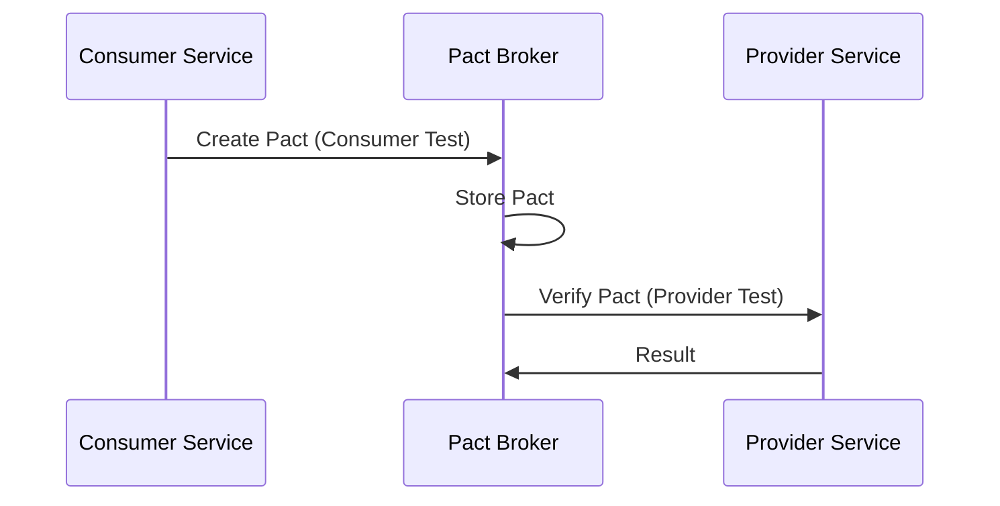

## Overview

Contract testing with Pact ensures that microservices can communicate correctly by verifying that provider APIs meet consumer expectations. Consumer-driven contracts (CDC) catch breaking changes early, before deployment.

## How Pact Works



## Maven Dependencies

Pact JVM provides both consumer and provider testing libraries. The consumer library runs tests against a mock server, generating Pact contract files. The provider library reads those contracts and verifies them against the actual provider implementation.

```xml
<dependency>
    <groupId>au.com.dius.pact.provider</groupId>
    <artifactId>spring</artifactId>
    <version>4.6.0</version>
    <scope>test</scope>
</dependency>
<dependency>
    <groupId>au.com.dius.pact.consumer</groupId>
    <artifactId>junit5</artifactId>
    <version>4.6.0</version>
    <scope>test</scope>
</dependency>
```

## Consumer Side Tests

### Order Service Consumer Test

The consumer test defines the expected interaction using Pact's DSL — the request payload, expected response status, headers, and body. Running this test starts a mock server on port 8089 that validates the actual client code against the contract. The generated Pact file is then shared with the provider team.

```java
@ExtendWith(PactConsumerTestExt.class)
@PactTestFor(providerName = "PaymentService", port = "8089")
class OrderServiceConsumerPactTest {

    @Pact(consumer = "OrderService")
    public V4Pact createPact(PactDslWithProvider builder) {
        return builder
            .given("payment service is available")
            .uponReceiving("a request to process a payment")
            .path("/api/payments/process")
            .method("POST")
            .headers("Content-Type", "application/json")
            .body(new PactDslJsonBody()
                .stringType("orderId", "order-123")
                .decimalType("amount", 99.99)
                .stringType("currency", "USD")
                .stringType("paymentMethod", "CREDIT_CARD")
            )
            .willRespondWith()
            .status(200)
            .headers(Map.of("Content-Type", "application/json"))
            .body(new PactDslJsonBody()
                .stringType("paymentId", "pay-456")
                .stringType("status", "SUCCESS")
                .stringType("message", "Payment processed successfully")
            )
            .toPact(V4Pact.class);
    }

    @Test
    @PactTestFor(pactMethod = "createPact")
    void shouldProcessPaymentSuccessfully(MockServer mockServer) {
        PaymentServiceClient client = new PaymentServiceClient(
            mockServer.getUrl()
        );

        PaymentRequest request = PaymentRequest.builder()
            .orderId("order-123")
            .amount(BigDecimal.valueOf(99.99))
            .currency("USD")
            .paymentMethod("CREDIT_CARD")
            .build();

        PaymentResponse response = client.processPayment(request);

        assertThat(response.getPaymentId()).isNotEmpty();
        assertThat(response.getStatus()).isEqualTo("SUCCESS");
    }

    @Pact(consumer = "OrderService")
    public V4Pact createPactForRefund(V4PactBuilder builder) {
        return builder
            .given("payment exists")
            .uponReceiving("a request to refund a payment")
            .path("/api/payments/refund")
            .method("POST")
            .body(new PactDslJsonBody()
                .stringType("paymentId", "pay-456")
                .stringType("reason", "CUSTOMER_REQUEST")
            )
            .willRespondWith()
            .status(200)
            .body(new PactDslJsonBody()
                .stringType("refundId", "ref-789")
                .stringType("status", "PROCESSED")
            )
            .toPact();
    }

    @Test
    @PactTestFor(pactMethod = "createPactForRefund")
    void shouldRefundPaymentSuccessfully(MockServer mockServer) {
        PaymentServiceClient client = new PaymentServiceClient(
            mockServer.getUrl()
        );

        RefundResponse response = client.refundPayment("pay-456", "CUSTOMER_REQUEST");

        assertThat(response.getRefundId()).isNotEmpty();
        assertThat(response.getStatus()).isEqualTo("PROCESSED");
    }
}
```

### Inventory Service Consumer Test

A consumer may have multiple contracts with different providers. Each contract focuses only on the interactions relevant to that consumer — the Order Service only tests the inventory and payment APIs it actually calls, not the entire provider surface.

```java
@ExtendWith(PactConsumerTestExt.class)
@PactTestFor(providerName = "InventoryService", port = "8090")
class InventoryServiceConsumerPactTest {

    @Pact(consumer = "OrderService")
    public V4Pact checkAvailabilityPact(V4PactBuilder builder) {
        DslPart body = new PactDslJsonBody()
            .booleanType("available", true)
            .integerType("quantity", 50)
            .eachLike("warehouses")
                .stringType("code", "WH-1")
                .integerType("stock", 30)
                .closeObject()
            .closeArray();

        return builder
            .given("product SKU-001 is in stock")
            .uponReceiving("a request to check product availability")
            .path("/api/inventory/SKU-001/availability")
            .method("GET")
            .query("quantity=10")
            .willRespondWith()
            .status(200)
            .headers(Map.of("Content-Type", "application/json"))
            .body(body)
            .toPact();
    }

    @Test
    @PactTestFor(pactMethod = "checkAvailabilityPact")
    void shouldCheckAvailability(MockServer mockServer) {
        InventoryClient client = new InventoryClient(mockServer.getUrl());

        AvailabilityResponse response = client.checkAvailability("SKU-001", 10);

        assertThat(response.isAvailable()).isTrue();
        assertThat(response.getQuantity()).isGreaterThanOrEqualTo(10);
    }
}
```

## Provider Side Verification

### Payment Service Provider Test

The provider test fetches contracts from the Pact Broker and verifies them against the running provider. The `@State` methods set up the necessary test data (e.g., "payment exists" creates a payment record). If the provider changes its API in a way that breaks a consumer contract, this test fails and prevents deployment.

```java
@SpringBootTest(webEnvironment = SpringBootTest.WebEnvironment.RANDOM_PORT)
@Provider("PaymentService")
@PactBroker(url = "${pact.broker.url:http://localhost:9292}")
@VerificationReport
class PaymentServiceProviderPactTest {

    @LocalServerPort
    private int port;

    @Autowired
    private PaymentController paymentController;

    @BeforeEach
    void setup(PactVerificationContext context) {
        context.setTarget(new MockMvcTestTarget(
            MockMvcBuilders.standaloneSetup(paymentController)
        ));
    }

    @TestTemplate
    @ExtendWith(PactVerificationInvocationContextProvider.class)
    void pactVerificationTestTemplate(PactVerificationContext context) {
        context.verifyInteraction();
    }

    @State("payment service is available")
    void paymentServiceIsAvailable() {
        // Set up state if needed
        log.info("Payment service is available");
    }

    @State("payment exists")
    void paymentExists() {
        Payment payment = new Payment("pay-456", "order-123",
            BigDecimal.valueOf(99.99), PaymentStatus.COMPLETED);
        paymentService.save(payment);
    }
}
```

### Inventory Service Provider Test

Provider tests can load pacts from a local folder (during development) or from the Pact Broker (in CI). The `MockMvcTestTarget` allows testing at the controller level without starting a full HTTP server, making provider verification fast enough to run on every commit.

```java
@SpringBootTest(webEnvironment = SpringBootTest.WebEnvironment.RANDOM_PORT)
@Provider("InventoryService")
@PactFolder("pacts")
class InventoryServiceProviderPactTest {

    @LocalServerPort
    private int port;

    @Autowired
    private InventoryController inventoryController;

    @TestTemplate
    @ExtendWith(PactVerificationInvocationContextProvider.class)
    void verifyPact(PactVerificationContext context) {
        context.verifyInteraction();
    }

    @BeforeEach
    void setUp(PactVerificationContext context) {
        context.setTarget(new MockMvcTestTarget(
            MockMvcBuilders.standaloneSetup(inventoryController)
        ));
    }

    @State("product SKU-001 is in stock")
    void productInStock() {
        InventoryItem item = new InventoryItem("SKU-001", "Test Product", 100);
        inventoryRepository.save(item);
    }
}
```

## Pact Broker Configuration

The Pact Broker is the central coordination point for contracts. Consumers publish contracts, providers verify them, and the `can-i-deploy` CLI checks whether a given version is compatible with its consumers/providers before allowing deployment. Postgres is the recommended database backend for production use.

```yaml
# docker-compose.yml for Pact Broker
version: '3'
services:
  pact-broker:
    image: pactfoundation/pact-broker:latest
    ports:
      - "9292:9292"
    environment:
      PACT_BROKER_DATABASE_ADAPTER: postgres
      PACT_BROKER_DATABASE_HOST: postgres
      PACT_BROKER_DATABASE_NAME: pact_broker
      PACT_BROKER_DATABASE_USERNAME: pact
      PACT_BROKER_DATABASE_PASSWORD: pact
    depends_on:
      - postgres

  postgres:
    image: postgres:15
    environment:
      POSTGRES_USER: pact
      POSTGRES_PASSWORD: pact
      POSTGRES_DB: pact_broker
```

## CI/CD Integration

CI/CD integration makes contract testing a gating step in the deployment pipeline. The `pact:publish` goal uploads contracts after consumer tests pass. The `pact:verify` goal validates that the provider still satisfies all consumer contracts. The `can-i-deploy` check prevents incompatible versions from reaching production.

```xml
<!-- Maven plugin for pact verification -->
<plugin>
    <groupId>au.com.dius.pact.provider</groupId>
    <artifactId>maven</artifactId>
    <version>4.6.0</version>
    <configuration>
        <pactBrokerUrl>${pact.broker.url}</pactBrokerUrl>
        <pactBrokerToken>${pact.broker.token}</pactBrokerToken>
        <projectVersion>${project.version}</projectVersion>
        <tags>
            <tag>latest</tag>
        </tags>
    </configuration>
</plugin>
```

```bash
# Publish pacts to broker
mvn pact:publish

# Verify pacts from broker
mvn pact:verify

# Can-i-deploy check
pact-broker can-i-deploy \
  --pacticipant OrderService \
  --version 1.0.0 \
  --to-environment production \
  --broker-base-url http://pact-broker:9292
```

## Best Practices

- Write consumer tests first, then verify on provider side.
- Use Pact Broker for sharing pacts between consumer and provider teams.
- Run pact verification in CI pipeline before deployment.
- Use `can-i-deploy` to check compatibility before releasing.
- Keep pacts focused on the contract, not the implementation.
- Version pacts alongside your services.

## Common Mistakes

### Mistake: Testing too much in contract tests

```java
// Wrong - testing implementation details
.body(new PactDslJsonBody()
    .stringType("internalField", "value") // Internal implementation detail
)
```

```java
// Correct - testing only the API contract
.body(new PactDslJsonBody()
    .stringType("paymentId")
    .stringType("status")
)
```

### Mistake: Not running pact verification in CI

```bash
# Wrong - pacts only verified locally
# Provider changes can break consumers without detection
```

```bash
# Correct - CI pipeline verifies pacts
mvn pact:verify
# OR
./gradlew pactVerify
```

## Summary

Consumer-driven contract testing with Pact catches API incompatibilities before deployment. Consumer tests define expected API behavior, provider tests verify those expectations, and the Pact Broker coordinates compatibility across services. This approach enables independent deployments with confidence.

## References

- [Pact Documentation](https://docs.pact.io/)
- [Pact JVM Documentation](https://docs.pact.io/implementation_guides/jvm/)
- [Spring Cloud Contract vs Pact](https://www.baeldung.com/spring-cloud-contract-vs-pact)

Happy Coding