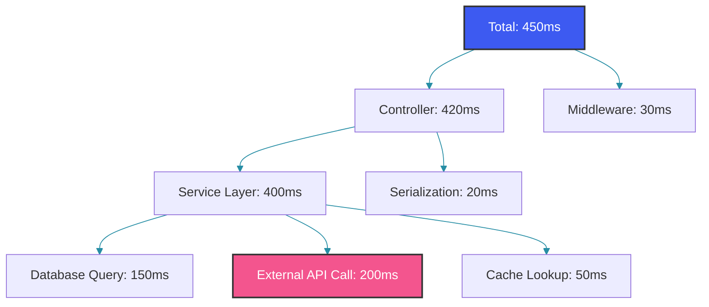
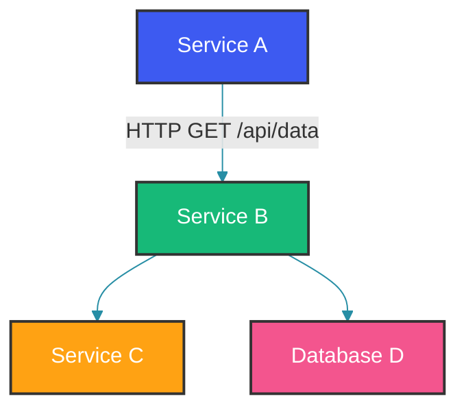

# Application Performance Monitoring

## Overview

Application Performance Monitoring (APM) is the practice of tracking and managing the performance, availability, and user experience of software applications. APM tools provide end-to-end visibility into application behavior, from user requests to database queries.

### What APM Provides

- **Transaction Tracing**: Track individual requests across services
- **Service Maps**: Visualize service dependencies
- **Real-User Monitoring**: Understand actual user experience
- **Code-Level Visibility**: Pinpoint slow methods and queries
- **Alerting**: Proactive notification of performance issues

---

## APM Instrumentation

### Bytecode Instrumentation

Modern APM tools use bytecode instrumentation to automatically add tracing without code changes:

```java
// Before instrumentation
public class OrderService {
    public Order createOrder(OrderRequest request) {
        // Business logic
        return orderRepository.save(new Order(request));
    }
}

// After bytecode instrumentation (what APM agent does)
public class OrderService {
    public Order createOrder(OrderRequest request) {
        Span span = tracer.spanBuilder("OrderService.createOrder").startSpan();
        try (Scope scope = span.makeCurrent()) {
            span.setAttribute("request.id", request.id().toString());
            Timer.Sample sample = Timer.start();
            
            Order result = orderRepository.save(new Order(request));
            
            sample.stop(meterRegistry.timer("OrderService.createOrder"));
            span.setAttribute("result.id", result.getId().toString());
            return result;
        } catch (Exception e) {
            span.recordException(e);
            throw e;
        } finally {
            span.end();
        }
    }
}
```

Bytecode instrumentation works by rewriting class bytecode at load time via a Java Agent (`-javaagent` flag). The advantage is zero code changes—the agent automatically wraps every method with span creation, timer recording, and exception handling. This is ideal for organizations with hundreds of services where retrofitting manual instrumentation is impractical. The cost is a slight CPU overhead at class-load time and a marginal per-invocation penalty from the wrapper logic.

### Manual Instrumentation

```java
@Service
@Observed
public class ManualInstrumentationService {

    @Observed(name = "order.create",
              contextualName = "create-order",
              lowCardinalityKeyValues = {"service", "order-service"})
    public Order createOrder(OrderRequest request) {
        // Automatically traced by Micrometer Observation
        return processOrder(request);
    }

    public void processPayment(PaymentRequest request) {
        Observation observation = Observation.start("payment.process",
            registry.observationConfig());

        try (Observation.Scope scope = observation.openScope()) {
            observation.lowCardinalityKeyValue("method", request.method());
            observation.highCardinalityKeyValue("userId", request.userId());

            paymentGateway.charge(request);

            observation.event(Observation.Event.of("payment.completed"));
        } catch (Exception e) {
            observation.error(e);
            throw e;
        } finally {
            observation.stop();
        }
    }
}
```

Micrometer Observation unifies metrics, tracing, and logging into a single API. The `@Observed` annotation handles the common case—method-level tracing with low-cardinality tags. For finer-grained control, the programmatic API gives access to `openScope()`, which binds the observation context to the current thread so that downstream calls (like `paymentGateway.charge()`) are automatically linked as child spans. The `highCardinalityKeyValue` field (e.g. `userId`) is particularly useful: the APM tool can index it for trace search without exploding metric cardinality, since metrics only aggregate the low-cardinality keys.

---

## Transaction Tracing

### Distributed Transaction

```java
@Service
public class CheckoutService {

    private final InventoryService inventoryService;
    private final PaymentService paymentService;
    private final ShippingService shippingService;

    @Observed
    public CheckoutResult checkout(CheckoutRequest request) {
        // APM traces this as a single transaction
        // Even though it calls 3 downstream services

        InventoryCheck inventoryCheck = inventoryService.checkStock(request.items());
        PaymentResult payment = paymentService.charge(request.payment());
        Shipment shipment = shippingService.createLabel(request.address());

        return new CheckoutResult(inventoryCheck, payment, shipment);
    }
}
```

Even though `checkout()` delegates to three separate services, a distributed tracing backend stitches the individual spans into a single trace tree rooted at this method. Each downstream call becomes a child span with its own timing, status, and attributes. This is essential for understanding whether a slow checkout is caused by inventory lookups, payment gateway latency, or shipping label generation.

### Transaction Breakdown

APM tools break down the transaction into segments:



---

## Service Maps

### Topology Discovery

APM tools automatically discover service dependencies:

```java
// Service A calls Service B which calls Service C and Database D
// APM builds a service map:
```



### Service Map Analysis

```java
// APM tools provide metrics for each connection:
// - Request rate: 100 req/s
// - Error rate: 2%
// - Latency: p50=50ms, p95=200ms, p99=500ms
// - Saturation: 60% CPU

public class ServiceMapMetrics {
    public void analyze() {
        // Service B to Database D:
        // - Slow queries detected
        // - Connection pool exhaustion
        // - Recommendation: Add index, increase pool size
    }
}
```

An auto-generated service map is a powerful tool for onboarding new team members and identifying unexpected dependencies. When the map shows a service calling a database it should not directly access, that is a strong signal for a refactoring opportunity. Most APM tools also overlay health status (green/yellow/red) on each node, giving an instant snapshot of system health.

---

## Code-Level Visibility

### Slow Method Detection

```java
@RestController
public class OrderController {

    @GetMapping("/api/orders/{id}")
    public Order getOrder(@PathVariable Long id) {
        // APM detects this method is slow (p95 > 500ms)
        // Recommends optimization
        return orderService.getOrderWithDetails(id);
    }
}

@Service
public class OrderService {

    public Order getOrderWithDetails(Long id) {
        // APM shows: This method takes 80% of transaction time
        Order order = orderRepository.findById(id).orElseThrow();

        // N+1 query detected (10 queries for 10 items)
        for (OrderItem item : order.getItems()) {
            // Each iteration executes a separate query
            Product product = productRepository.findById(item.getProductId());
            item.setProduct(product);
        }

        return order;
    }
}
```

The N+1 query pattern is one of the most common—and most invisible—performance killers. Without APM, each `findById` call may complete in under 5ms, making it hard to notice. But when you zoom out to the transaction level, a 50ms endpoint suddenly takes 300ms because 10 hidden queries ran sequentially. APM tools typically surface this by showing "10 database calls" on a single span, with the same query shape but different bind parameters.

### Database Query Analysis

```sql
-- APM captures every SQL query with execution time
-- Query: SELECT * FROM orders WHERE customer_id = ?
-- Duration: 250ms
-- Rows examined: 500,000
-- Recommendation: Add index on customer_id

CREATE INDEX idx_orders_customer_id ON orders(customer_id);
-- After index: 2ms
```

---

## Real-User Monitoring

### Browser Integration

```html
<script>
// RUM agent captures page load metrics
window.datadogRum && window.datadogRum.init({
    applicationId: 'xxx',
    clientToken: 'yyy',
    site: 'datadoghq.com',
    service: 'order-web',
    env: 'production',
    version: '1.2.0',
    sampleRate: 100,
    trackInteractions: true,
    trackResources: true,
    trackLongTasks: true
});
</script>
```

### Backend Correlation

```java
// RUM trace ID is propagated to backend
// Backend APM correlates frontend and backend traces
// User sees 2s page load time, backend shows API took 1.8s

@GetMapping("/api/page-data")
public PageData getPageData(@RequestHeader("x-datadog-trace-id") String traceId) {
    // APM correlates this trace with the browser RUM session
    return pageService.buildPageData();
}
```

Bridging Real-User Monitoring with backend traces closes the gap between user experience and server-side performance. A page that renders in 2 seconds may only spend 200ms on the server—the rest is client-side JavaScript execution, CSS rendering, or image loading. Without RUM, teams would optimize server code that was never the bottleneck.

---

## APM Implementation Patterns

### Alerting on Apdex

```yaml
# Apdex: Application Performance Index
# Satisfied: < 100ms, Tolerating: 100-400ms, Frustrated: > 400ms
# Target: Apdex > 0.95

alerts:
  - alert: LowApdexScore
    expr: |
      apdex_http_server_requests < 0.9
    for: 10m
    labels:
      severity: warning
    annotations:
      summary: "Apdex score below 0.9 for {{ $labels.service }}"
```

### Auto-Instrumentation

```xml
<!-- Attach APM agent via JVM argument -->
-javaagent:/opt/dd-java-agent.jar
-Ddd.service=order-service
-Ddd.env=production
-Ddd.version=1.2.0
-Ddd.logs.injection=true
-Ddd.trace.sample.rate=0.5
```

---

## Common Mistakes

### Mistake 1: No APM in Development

```java
// WRONG: Only using APM in production
// Performance issues found after deployment

// CORRECT: Use APM in all environments
// Development: 10% sampling
// Staging: 50% sampling
// Production: 1-10% sampling
```

### Mistake 2: Ignoring Baseline Metrics

```java
// WRONG: Only looking at current metrics
// A 5% error rate is bad, but was it 5% last week?

// CORRECT: Compare against baselines
// "Error rate increased from 0.1% to 5% after deployment v2.1"
```

### Mistake 3: Not Setting Up Custom Dashboards

```java
// WRONG: Default APM dashboards only
// Missing business-specific metrics

// CORRECT: Custom dashboards
// - Order checkout latency by payment method
// - Search query performance by category
// - User onboarding funnel
```

---

## Summary

APM provides essential visibility into application performance:

1. Automatic bytecode instrumentation captures transactions
2. Distributed tracing correlates requests across services
3. Service maps visualize complex dependencies
4. Code-level visibility pinpoints bottlenecks
5. Real-user monitoring captures actual experience
6. Database query analysis identifies slow SQL
7. Custom dashboards track business metrics
8. Apdex scoring measures user satisfaction

---

## References

- [Datadog APM Documentation](https://docs.datadoghq.com/tracing/)
- [New Relic APM Guide](https://docs.newrelic.com/docs/apm/)
- [Grafana Cloud Application Observability](https://grafana.com/docs/grafana-cloud/monitor-applications/)
- [OpenTelemetry APM](https://opentelemetry.io/docs/concepts/instrumentation/)

Happy Coding
