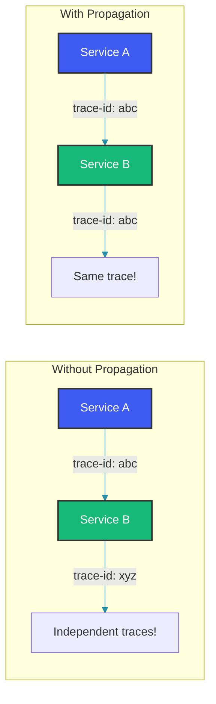

# Trace Context Propagation

## Overview

Trace context propagation is the mechanism by which distributed tracing systems pass trace and span identifiers across service boundaries. Without propagation, each service creates independent traces and the end-to-end request flow cannot be reconstructed.

### Why Propagation Matters



---

## Propagation Standards

### W3C Trace-Context (Recommended)

The W3C Trace-Context specification standardizes trace propagation:

```
traceparent: 00-0af7651916cd43dd8448eb211c80319c-b7ad6b7169203331-01
```

**Format**: `{version}-{trace_id}-{span_id}-{trace_flags}`

- **version**: 00 (current spec)
- **trace_id**: 16-byte hex-encoded (32 characters)
- **span_id**: 8-byte hex-encoded (16 characters)
- **trace_flags**: 01 = sampled, 00 = not sampled

```java
public class W3CPropagationExample {

    public static void parseTraceparent(String header) {
        String[] parts = header.split("-");
        String version = parts[0];
        String traceId = parts[1];
        String spanId = parts[2];
        String flags = parts[3];

        boolean sampled = (Integer.parseInt(flags, 16) & 0x01) == 1;
        System.out.println("Trace: " + traceId);
        System.out.println("Span: " + spanId);
        System.out.println("Sampled: " + sampled);
    }
}
```

The `traceFlags` byte is especially important for performance. When the edge service sets `01` (sampled), every downstream service knows to create spans. When set to `00`, downstream services can skip span creation entirely, avoiding the CPU and memory overhead of instrumentation at each hop. This single bit, propagated globally, is the most cost-effective sampling mechanism in distributed tracing.

### B3 Propagation (Zipkin)

```
X-B3-TraceId: 0af7651916cd43dd8448eb211c80319c
X-B3-SpanId: b7ad6b7169203331
X-B3-ParentSpanId: 1234567890abcdef
X-B3-Sampled: 1
X-B3-Flags: 1
```

B3 uses multiple headers rather than a single combined header like W3C. The `X-B3-ParentSpanId` field is notable—it encodes the parent-child relationship directly, which is redundant in W3C's model (the parent is always the span that created the child). B3 is still widely used in Zipkin-centric deployments, but W3C Trace-Context is the recommended standard for new projects.

---

## HTTP Propagation with RestTemplate

### Client-Side Injection

```java
@Component
public class TracingRestTemplateInterceptor implements ClientHttpRequestInterceptor {

    private final Tracer tracer;

    public TracingRestTemplateInterceptor(OpenTelemetry openTelemetry) {
        this.tracer = openTelemetry.getTracer("http-client");
    }

    @Override
    public ClientHttpResponse intercept(HttpRequest request, byte[] body,
            ClientHttpRequestExecution execution) throws IOException {

        Span span = tracer.spanBuilder(request.getURI().getPath())
            .setSpanKind(SpanKind.CLIENT)
            .setAttribute("http.method", request.getMethod().toString())
            .setAttribute("http.url", request.getURI().toString())
            .startSpan();

        try (Scope scope = span.makeCurrent()) {
            // Inject W3C trace context headers
            TextMapSetter<HttpHeaders> setter = (carrier, key, value) ->
                carrier.set(key, value);

            OpenTelemetry.getGlobalPropagators()
                .getTextMapPropagator()
                .inject(Context.current(), request.getHeaders(), setter);

            ClientHttpResponse response = execution.execute(request, body);

            span.setAttribute("http.status_code", response.getStatusCode().value());
            if (response.getStatusCode().isError()) {
                span.setStatus(StatusCode.ERROR);
            }

            return response;
        } catch (Exception e) {
            span.setStatus(StatusCode.ERROR);
            span.recordException(e);
            throw e;
        } finally {
            span.end();
        }
    }

    @Bean
    public RestTemplate tracingRestTemplate() {
        RestTemplate restTemplate = new RestTemplate();
        restTemplate.getInterceptors().add(this);
        return restTemplate;
    }
}
```

The `TextMapSetter` adapter converts OpenTelemetry's generic inject API to Spring's `HttpHeaders` class. The propagator writes the `traceparent` and `tracestate` headers into the outgoing request. When using the OpenTelemetry Java Agent, this interceptor is not needed—the agent instruments `RestTemplate` automatically. But in cases where the agent cannot be used (e.g., restricted environments), this pattern gives manual control.

### Server-Side Extraction

```java
@Component
public class TracingHandlerInterceptor implements HandlerInterceptor {

    private final Tracer tracer;

    public TracingHandlerInterceptor(OpenTelemetry openTelemetry) {
        this.tracer = openTelemetry.getTracer("http-server");
    }

    @Override
    public boolean preHandle(HttpServletRequest request,
            HttpServletResponse response, Object handler) {

        // Extract context from incoming request
        TextMapGetter<HttpServletRequest> getter = new TextMapGetter<>() {
            @Override
            public String get(HttpServletRequest carrier, String key) {
                return carrier.getHeader(key);
            }

            @Override
            public Iterable<String> keys(HttpServletRequest carrier) {
                return Collections.list(carrier.getHeaderNames());
            }
        };

        Context extracted = OpenTelemetry.getGlobalPropagators()
            .getTextMapPropagator()
            .extract(Context.current(), request, getter);

        Span span = tracer.spanBuilder(request.getMethod() + " " + request.getRequestURI())
            .setParent(extracted)
            .setSpanKind(SpanKind.SERVER)
            .setAttribute("http.method", request.getMethod())
            .setAttribute("http.url", request.getRequestURL().toString())
            .startSpan();

        span.makeCurrent();
        request.setAttribute("_otel_span_", span);

        return true;
    }

    @Override
    public void afterCompletion(HttpServletRequest request,
            HttpServletResponse response, Object handler, Exception ex) {

        Span span = (Span) request.getAttribute("_otel_span_");
        if (span != null) {
            span.setAttribute("http.status_code", response.getStatus());
            if (ex != null) {
                span.setStatus(StatusCode.ERROR);
                span.recordException(ex);
            }
            span.end();
        }
    }
}
```

On the server side, `TextMapGetter` extracts the propagated context from incoming HTTP headers. The `setParent(extracted)` call is what links this span to the trace started by the caller. Without this, a new trace would be created and the request would appear as an orphan. Storing the span in a request attribute ensures it can be retrieved and ended in `afterCompletion`, even if the request handler throws an exception.

---

## Async Context Propagation

### Thread Pool Propagation

```java
@Component
public class AsyncTracingWrapper {

    public <T> CompletableFuture<T> wrapAsync(Callable<T> callable) {
        Context currentContext = Context.current();

        return CompletableFuture.supplyAsync(() -> {
            try (Scope scope = currentContext.makeCurrent()) {
                return callable.call();
            } catch (Exception e) {
                throw new CompletionException(e);
            }
        });
    }

    @Bean
    public Executor tracingExecutor() {
        ThreadPoolTaskExecutor executor = new ThreadPoolTaskExecutor();
        executor.setCorePoolSize(10);
        executor.setMaxPoolSize(20);
        executor.setTaskDecorator(runnable -> {
            Context context = Context.current();
            return () -> {
                try (Scope scope = context.makeCurrent()) {
                    runnable.run();
                }
            };
        });
        return executor;
    }
}
```

Context propagation across thread boundaries is one of the hardest problems in distributed tracing. The `Context` object is stored in a `ThreadLocal`, so when work is submitted to another thread, the context must be captured before submission and restored in the executing thread. The `taskDecorator` pattern on `ThreadPoolTaskExecutor` is the cleanest solution for Spring Boot: every task submitted to the executor is automatically wrapped with context propagation, eliminating the risk of forgetting to capture context at call sites.

### Message Queue Propagation

```java
@Service
public class MessagingPropagationService {

    private final Tracer tracer;
    private final KafkaTemplate<String, String> kafkaTemplate;

    public void sendOrderEvent(OrderEvent event) {
        Span span = tracer.spanBuilder("kafka.send")
            .setSpanKind(SpanKind.PRODUCER)
            .setAttribute("messaging.system", "kafka")
            .setAttribute("messaging.destination", "orders")
            .startSpan();

        try (Scope scope = span.makeCurrent()) {
            // Inject context into message headers
            ProducerRecord<String, String> record =
                new ProducerRecord<>("orders", event.toJson());

            OpenTelemetry.getGlobalPropagators()
                .getTextMapPropagator()
                .inject(Context.current(), record.headers(),
                    (headers, key, value) -> headers.add(key, value));

            kafkaTemplate.send(record);
        } finally {
            span.end();
        }
    }

    @KafkaListener(topics = "orders")
    public void onOrderEvent(ConsumerRecord<String, String> record) {
        Context extracted = OpenTelemetry.getGlobalPropagators()
            .getTextMapPropagator()
            .extract(Context.current(), record.headers(),
                (headers, key) -> {
                    Header header = headers.lastHeader(key);
                    return header != null ? new String(header.value()) : null;
                });

        try (Scope scope = extracted.makeCurrent()) {
            processOrder(record.value());
        }
    }
}
```

Message queues introduce temporal decoupling—the producer and consumer may not overlap in time. The trace context is serialized into Kafka record headers. On the consumer side, the context is extracted before processing, so any spans created during message processing are linked back to the producer's trace. This works across service restarts and even across different time zones, as long as the W3C headers survive serialization.

---

## gRPC Context Propagation

### Client Interceptor

```java
@Component
public class GrpcTracingClientInterceptor implements ClientInterceptor {

    private final Tracer tracer;

    @Override
    public <ReqT, RespT> ClientCall<ReqT, RespT> interceptCall(
            MethodDescriptor<ReqT, RespT> method,
            CallOptions callOptions, Channel next) {

        return new ForwardingClientCall.SimpleForwardingClientCall<>(
            next.newCall(method, callOptions)) {

            @Override
            public void start(Listener<RespT> responseListener, Metadata headers) {
                // Inject context into gRPC metadata
                OpenTelemetry.getGlobalPropagators()
                    .getTextMapPropagator()
                    .inject(Context.current(), headers,
                        (carrier, key, value) ->
                            carrier.put(Metadata.Key.of(key, Metadata.ASCII_STRING_MARSHALLER), value));

                super.start(responseListener, headers);
            }
        };
    }
}
```

### Server Interceptor

```java
@Component
public class GrpcTracingServerInterceptor implements ServerInterceptor {

    @Override
    public <ReqT, RespT> ServerCall.Listener<ReqT> interceptCall(
            ServerCall<ReqT, RespT> call,
            Metadata headers,
            ServerCallHandler<ReqT, RespT> next) {

        Context extracted = OpenTelemetry.getGlobalPropagators()
            .getTextMapPropagator()
            .extract(Context.current(), headers,
                (carrier, key) -> carrier.get(
                    Metadata.Key.of(key, Metadata.ASCII_STRING_MARSHALLER)));

        Context contextWithSpan = extracted.with(createSpan(call, headers));

        return Contexts.interceptCall(contextWithSpan, call, headers, next);
    }
}
```

gRPC uses its own `Metadata` object instead of HTTP headers. The injection and extraction patterns are the same as HTTP; only the carrier type changes. grpc-java's `Contexts.interceptCall` ensures the OpenTelemetry context is active for the entire gRPC call lifecycle, including streaming responses where multiple messages arrive over time.

---

## Context Loss Scenarios

### 1. Thread Pool Context Loss

```java
// WRONG: Context lost when task runs in different thread
executor.submit(() -> {
    // Context.current() returns ROOT, not the caller's context
    Span.current(); // Wrong span!
});

// CORRECT: Wrap with context
Context context = Context.current();
executor.submit(() -> {
    try (Scope scope = context.makeCurrent()) {
        Span.current(); // Correct span!
    }
});
```

### 2. @Async Method Context Loss

```java
// WRONG: Spring @Async loses context
@Async
public CompletableFuture<Order> processAsync(Long id) {
    // No trace context here
    return CompletableFuture.completedFuture(process(id));
}

// CORRECT: Use context-aware executor
@Bean
public Executor asyncExecutor() {
    ThreadPoolTaskExecutor executor = new ThreadPoolTaskExecutor();
    executor.setTaskDecorator(new ContextPropagatingTaskDecorator());
    return executor;
}
```

---

## Best Practices

### 1. Always Propagate Context

```java
// CORRECT: Always extract and inject context
TextMapPropagator propagator = OpenTelemetry.getGlobalPropagators()
    .getTextMapPropagator();

// Extract on incoming request
Context context = propagator.extract(Context.current(), carrier, getter);

// Inject on outgoing request
propagator.inject(context, carrier, setter);
```

### 2. Use W3C Trace-Context as Standard

```java
// OpenTelemetry defaults to W3C Trace-Context
// B3 headers are also supported for backward compatibility

@Bean
public TextMapPropagator propagator() {
    return TextMapPropagator.composite(
        W3CTraceContextPropagator.getInstance(),
        W3CBaggagePropagator.getInstance()
    );
}
```

Using `TextMapPropagator.composite` allows both W3C Trace-Context and W3C Baggage to be propagated simultaneously. The `Baggage` propagator carries non-identifying metadata (e.g., `user.tier=premium`) alongside the trace context, enabling downstream services to make decisions based on request attributes without parsing HTTP headers.

---

## Common Mistakes

### Mistake 1: Not Propagating to Async Operations

```java
// WRONG: Async processing loses trace
@Async
public void processPayment(Payment payment) {
    // Context lost - trace broken
    paymentService.charge(payment);
}

// CORRECT: Use context-aware executors
```

### Mistake 2: Inconsistent Header Names

```java
// WRONG: Different services use different headers
// Service A sends: X-B3-TraceId
// Service B reads: traceparent

// CORRECT: Standardize on W3C Trace-Context
```

---

## Summary

Trace context propagation is essential for distributed tracing:

1. W3C Trace-Context is the industry standard
2. B3 headers are used for Zipkin compatibility
3. Inject context on outgoing requests
4. Extract context on incoming requests
5. Propagate context across thread boundaries
6. Support async operations with context decorators
7. Message queues need special propagation handling
8. Consistent header names across all services

---

## References

- [W3C Trace-Context Specification](https://www.w3.org/TR/trace-context/)
- [OpenTelemetry Context Propagation](https://opentelemetry.io/docs/concepts/context-propagation/)
- [Zipkin B3 Headers](https://github.com/openzipkin/b3-propagation)

Happy Coding
