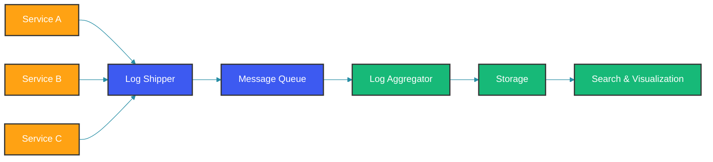
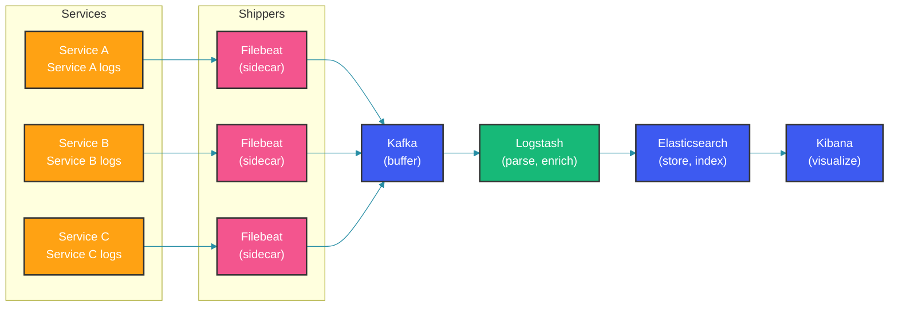

# Centralized Logging Patterns

## Overview

Centralized logging aggregates logs from multiple services into a single platform for search, analysis, and alerting. In microservices architectures, centralized logging is essential for debugging cross-service transactions and understanding system behavior.

### Why Centralized Logging?

- **No SSH access** required to view logs
- **Cross-service correlation** of requests
- **Historical analysis** and trend detection
- **Alerting** based on aggregated patterns
- **Compliance** and audit requirements

---

## Log Aggregation Architecture

### Basic Architecture



### Production Architecture



The pipeline from logs to visualization involves several stages. Each service writes logs to a local file (or stdout). A log shipper (Filebeat) tails these files, optionally sends to a buffering layer (Kafka), and forwards to a transformation layer (Logstash) before the data lands in Elasticsearch for indexing and storage. The message queue (Kafka) is optional but highly recommended: it absorbs traffic spikes when the downstream pipeline is slow and provides replay capability if Logstash or Elasticsearch need to be restarted.

---

## Log Shipping Patterns

### Sidecar Pattern (Kubernetes)

```yaml
# kubernetes sidecar deployment
apiVersion: apps/v1
kind: Deployment
metadata:
  name: order-service
spec:
  replicas: 3
  template:
    spec:
      containers:
      - name: app
        image: order-service:latest
        volumeMounts:
        - name: logs
          mountPath: /var/log/app
      
      - name: filebeat
        image: docker.elastic.co/beats/filebeat:8.12.0
        volumeMounts:
        - name: logs
          mountPath: /var/log/app
          readOnly: true
        - name: filebeat-config
          mountPath: /usr/share/filebeat/filebeat.yml
          subPath: filebeat.yml
      
      volumes:
      - name: logs
        emptyDir: {}
      - name: filebeat-config
        configMap:
          name: filebeat-config
```

In Kubernetes, the sidecar pattern runs Filebeat in the same pod as the application, sharing a log directory via an `emptyDir` volume. This isolates each application's log shipping configuration and prevents a single misconfigured Filebeat from affecting multiple applications. The downside is resource overhead: each pod now runs two containers instead of one, consuming extra CPU and memory.

### Agent Pattern (Node-Level)

```yaml
# DaemonSet running Filebeat on every node
apiVersion: apps/v1
kind: DaemonSet
metadata:
  name: filebeat
spec:
  selector:
    matchLabels:
      app: filebeat
  template:
    spec:
      containers:
      - name: filebeat
        image: docker.elastic.co/beats/filebeat:8.12.0
        volumeMounts:
        - name: varlog
          mountPath: /var/log
          readOnly: true
        - name: containers
          mountPath: /var/lib/docker/containers
          readOnly: true
      volumes:
      - name: varlog
        hostPath:
          path: /var/log
      - name: containers
        hostPath:
          path: /var/lib/docker/containers
```

The DaemonSet pattern runs one Filebeat per Kubernetes node, reading all container logs from the host filesystem. This is more resource-efficient than the sidecar approach because a single agent handles dozens of pods per node. The trade-off is that log metadata (pod name, namespace, container name) must be inferred from the container log filename rather than injected by a co-located sidecar.

---

## Message Queue Integration

### Kafka as Log Buffer

```yaml
# docker-compose with Kafka for log buffering
version: '3.8'
services:
  zookeeper:
    image: confluentinc/cp-zookeeper:7.5.0
    environment:
      ZOOKEEPER_CLIENT_PORT: 2181

  kafka:
    image: confluentinc/cp-kafka:7.5.0
    depends_on:
      - zookeeper
    environment:
      KAFKA_BROKER_ID: 1
      KAFKA_ZOOKEEPER_CONNECT: zookeeper:2181
      KAFKA_ADVERTISED_LISTENERS: PLAINTEXT://kafka:9092
      KAFKA_OFFSETS_TOPIC_REPLICATION_FACTOR: 1

  logstash:
    image: docker.elastic.co/logstash/logstash:8.12.0
    volumes:
      - ./logstash/pipeline:/usr/share/logstash/pipeline
    depends_on:
      - kafka
```

```ruby
# Logstash pipeline with Kafka input
input {
  kafka {
    bootstrap_servers => "kafka:9092"
    topics => ["application-logs"]
    consumer_threads => 4
    codec => json
    auto_offset_reset => "latest"
  }
}

filter {
  # Skip invalid JSON
  if "_jsonparsefailure" in [tags] {
    drop {}
  }
}

output {
  elasticsearch {
    hosts => ["elasticsearch:9200"]
    index => "app-logs-%{+YYYY.MM.dd}"
  }
}
```

Kafka in the logging pipeline serves three purposes: buffering (smoothes out traffic bursts), decoupling (Logstash can be restarted without losing logs), and multi-consumer (multiple consumers can read the same log stream for different purposes). The Logstash Kafka input uses `consumer_threads` to parallelize consumption—each thread reads from a different Kafka partition, matching the partition count for optimal throughput.

---

## Multi-Tenant Log Isolation

### Index-Based Isolation

```ruby
output {
  elasticsearch {
    index => "logs-${service}-%{+YYYY.MM.dd}"
  }
}
```

### Field-Based Isolation

```ruby
filter {
  mutate {
    add_field => {
      "tenant_id" => "%{[@metadata][tenant]}"
    }
  }
}

# Elasticsearch field-level security
PUT _security/role/tenant-a-role
{
  "indices": [
    {
      "names": ["app-logs-*"],
      "privileges": ["read"],
      "field_security": {
        "grant": ["*"],
        "except": ["tenant_id:tenant-b-*"]
      }
    }
  ]
}
```

Index-based isolation creates a separate Elasticsearch index per tenant, simplifying shard management and enabling per-tenant retention policies. Field-based isolation uses a single index with Elasticsearch field-level security to restrict access—simpler to manage but requires Elasticsearch's security features (paid license). The choice depends on whether you need per-tenant retention tuning (choose index-based) or ease of administration (choose field-based).

---

## Log Enrichment Patterns

### Enrichment Pipeline

```ruby
filter {
  # Add Kubernetes metadata
  kubernetes {
    source => "message"
    target => "kubernetes"
  }

  # Add service version
  mutate {
    add_field => {
      "service_version" => "%{[metadata][version]}"
    }
  }

  # Normalize log levels
  mutate {
    lowercase => ["severity"]
    replace => {
      "severity" => "error"
    }
    if [severity] in ["warn", "warning"] {
      mutate { replace => { "severity" => "warn" } }
    }
  }

  # Add environmental context
  translate {
    source => "[kubernetes][namespace]"
    target => "environment"
    dictionary => {
      "production" => "prod"
      "staging" => "stg"
      "default" => "dev"
    }
    fallback => "unknown"
  }
}
```

Log enrichment adds context that the application itself may not know. The Kubernetes filter adds pod name, namespace, and container name from the environment. The `translate` filter maps namespace names to deployment environments—critical for setting up cross-environment dashboards that use consistent labels.

---

## Correlation Patterns

### Trace ID Propagation

```java
@Component
public class LogCorrelationFilter extends OncePerRequestFilter {

    @Override
    protected void doFilterInternal(HttpServletRequest request,
            HttpServletResponse response, FilterChain chain)
            throws ServletException, IOException {

        String traceId = request.getHeader("X-Trace-Id");
        if (traceId == null || traceId.isEmpty()) {
            traceId = UUID.randomUUID().toString();
        }

        MDC.put("trace_id", traceId);
        MDC.put("span_id", UUID.randomUUID().toString());
        response.setHeader("X-Trace-Id", traceId);

        try {
            chain.doFilter(request, response);
        } finally {
            MDC.clear();
        }
    }
}
```

The correlation ID pattern ensures that every log line emitted during a request carries the same `trace_id`. When combined with structured JSON logging, the `trace_id` becomes a queryable field in Elasticsearch—allowing operators to find all log entries across all services for a single request by searching: `trace_id: abc123`.

### Service-to-Service Correlation

```java
@Configuration
public class RestTemplateCorrelationConfig {

    @Bean
    public RestTemplate restTemplate() {
        RestTemplate restTemplate = new RestTemplate();
        restTemplate.getInterceptors().add((request, body, execution) -> {
            String traceId = MDC.get("trace_id");
            if (traceId != null) {
                request.getHeaders().add("X-Trace-Id", traceId);
            }
            return execution.execute(request, body);
        });
        return restTemplate;
    }
}
```

---

## Best Practices

### 1. Structured JSON Logging

```java
// All services must produce JSON logs
log.info(JsonOutput.toJson(Map.of(
    "event", "order.created",
    "orderId", order.getId(),
    "customerId", order.getCustomerId(),
    "amount", order.getTotal(),
    "timestamp", Instant.now().toString()
)));
```

### 2. Consistent Field Names

```java
public class LogFields {
    // Required fields for every log entry
    public static final String TIMESTAMP = "@timestamp";
    public static final String SERVICE = "service";
    public static final String ENVIRONMENT = "environment";
    public static final String TRACE_ID = "trace_id";
    public static final String SEVERITY = "severity";
    public static final String MESSAGE = "message";
}
```

### 3. Log Sampling for High-Volume Services

```java
@Service
public class SampledLoggingService {

    private static final Logger log = LoggerFactory.getLogger(SampledLoggingService.class);
    private final Random random = new Random();
    private static final double SAMPLE_RATE = 0.01; // 1%

    public void handleRequest(Request request) {
        if (random.nextDouble() < SAMPLE_RATE) {
            log.info("Sampled request: method={}, path={}, duration={}ms",
                request.getMethod(), request.getPath(), request.getDuration());
        }
    }
}
```

---

## Common Mistakes

### Mistake 1: No Buffering Between Shipper and Aggregator

```java
// WRONG: Direct connection from shipper to Elasticsearch
// ES downtime = log loss

// CORRECT: Buffer with Kafka or Redis
// ES downtime = logs queue in Kafka
```

### Mistake 2: Inconsistent Log Format Across Services

```java
// WRONG: Each service has its own format
// Service A: "User 123 logged in"
// Service B: "login: userId=123"
// Service C: {"user_id": 123, "action": "login"}

// CORRECT: Standardized JSON format across all services
{"event": "user.login", "user_id": 123, "timestamp": "2026-05-11T10:00:00Z"}
```

### Mistake 3: Not Handling Backpressure

```ruby
# WRONG: No rate limiting
input {
  tcp { port => 5000 }
}

# CORRECT: Rate limit the input
input {
  tcp { port => 5000 }
}

filter {
  throttle {
    before_count => -1
    after_count => 1000
    period => 1
    max_age => 1
    key => "%{message}"
    add_tag => ["throttled"]
  }
}
```

---

## Summary

Centralized logging patterns for microservices:

1. Use sidecar or daemonset shippers for log collection
2. Buffer logs with Kafka for resilience
3. Enrich logs with Kubernetes metadata
4. Correlate logs across services with trace IDs
5. Maintain consistent JSON format across services
6. Implement ILM for log retention management
7. Monitor log shipping health and backpressure

---

## References

- [ELK Stack Centralized Logging](https://www.elastic.co/guide/en/elastic-stack/current/centralized-logging.html)
- [Kubernetes Logging Architecture](https://kubernetes.io/docs/concepts/cluster-administration/logging/)
- [The Log: What Every Software Engineer Should Know](https://engineering.linkedin.com/distributed-systems/log-what-every-software-engineer-should-know-about-real-time-datas-unifying)

Happy Coding
