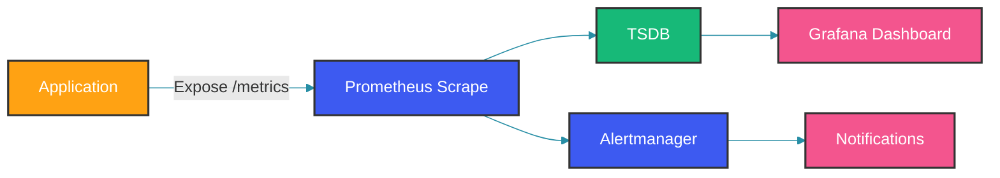

# Prometheus and Grafana

## Overview

Prometheus and Grafana are the most widely used open-source monitoring stack. Prometheus collects metrics via pull model, stores them in a time-series database, and provides a powerful query language (PromQL). Grafana visualizes metrics from Prometheus and other data sources.

### Architecture



---

## Prometheus Setup

### Configuration

```yaml
# prometheus.yml
global:
  scrape_interval: 15s
  evaluation_interval: 15s
  scrape_timeout: 10s

scrape_configs:
  - job_name: 'spring-boot-apps'
    metrics_path: '/actuator/prometheus'
    scrape_interval: 10s
    static_configs:
      - targets:
        - 'localhost:8080'
        - 'localhost:8081'
        labels:
          application: 'order-service'
          environment: 'production'

  - job_name: 'kubernetes-pods'
    kubernetes_sd_configs:
      - role: pod
    relabel_configs:
      - source_labels: [__meta_kubernetes_pod_annotation_prometheus_io_scrape]
        action: keep
        regex: true
      - source_labels: [__address__, __meta_kubernetes_pod_annotation_prometheus_io_port]
        action: replace
        regex: ([^:]+)(?::\d+)?;(\d+)
        replacement: $1:$2
        target_label: __address__
      - source_labels: [__meta_kubernetes_pod_annotation_prometheus_io_path]
        action: replace
        target_label: __metrics_path__
        regex: (.+)

rule_files:
  - 'alerts/*.yml'

alerting:
  alertmanagers:
    - static_configs:
        - targets:
          - 'alertmanager:9093'
```

Prometheus uses a pull model: it scrapes metrics from HTTP endpoints at regular intervals. The `scrape_interval` of 10 seconds for Spring Boot applications provides a good balance between data granularity and storage volume. For Kubernetes service discovery, the relabeling configuration selects pods annotated with `prometheus.io/scrape: true` and constructs the correct target address from the pod IP and port annotation.

### Docker Compose

```yaml
version: '3.8'
services:
  prometheus:
    image: prom/prometheus:v2.51.0
    volumes:
      - ./prometheus/prometheus.yml:/etc/prometheus/prometheus.yml
      - ./prometheus/alerts:/etc/prometheus/alerts
      - prometheus-data:/prometheus
    command:
      - '--config.file=/etc/prometheus/prometheus.yml'
      - '--storage.tsdb.path=/prometheus'
      - '--storage.tsdb.retention.time=30d'
      - '--storage.tsdb.retention.size=50GB'
    ports:
      - "9090:9090"
    networks:
      - monitoring

  grafana:
    image: grafana/grafana:10.3.0
    volumes:
      - grafana-data:/var/lib/grafana
      - ./grafana/dashboards:/etc/grafana/provisioning/dashboards
      - ./grafana/datasources:/etc/grafana/provisioning/datasources
    environment:
      - GF_SECURITY_ADMIN_PASSWORD=admin
      - GF_INSTALL_PLUGINS=grafana-piechart-panel
    ports:
      - "3000:3000"
    depends_on:
      - prometheus
    networks:
      - monitoring

  alertmanager:
    image: prom/alertmanager:v0.27.0
    volumes:
      - ./alertmanager/alertmanager.yml:/etc/alertmanager/alertmanager.yml
    ports:
      - "9093:9093"
    networks:
      - monitoring

volumes:
  prometheus-data:
  grafana-data:

networks:
  monitoring:
    driver: bridge
```

The Prometheus data directory is persisted on a Docker volume to survive container restarts. Retention is limited by both time (30 days) and size (50 GB)—whichever is reached first. This prevents a traffic spike from filling the disk and crashing the monitoring stack. Grafana is configured with provisioning directories so that dashboards and data sources are automatically loaded at startup, eliminating manual setup after deployment.

---

## Spring Boot Actuator Integration

### Maven Dependencies

```xml
<dependency>
    <groupId>org.springframework.boot</groupId>
    <artifactId>spring-boot-starter-actuator</artifactId>
</dependency>
<dependency>
    <groupId>io.micrometer</groupId>
    <artifactId>micrometer-registry-prometheus</artifactId>
</dependency>
```

### Application Configuration

```yaml
# application.yml
management:
  endpoints:
    web:
      exposure:
        include: health,info,prometheus,metrics
      base-path: /actuator
  metrics:
    export:
      prometheus:
        enabled: true
    tags:
      application: ${spring.application.name}
      environment: ${spring.profiles.active:development}
  endpoint:
    prometheus:
      enabled: true
    metrics:
      enabled: true
```

### Security Configuration

```java
@Configuration
public class ActuatorSecurityConfig {

    @Bean
    public SecurityFilterChain actuatorFilterChain(HttpSecurity http) throws Exception {
        http.securityMatcher("/actuator/**")
            .authorizeHttpRequests(auth -> auth
                .requestMatchers("/actuator/health").permitAll()
                .requestMatchers("/actuator/prometheus").hasIpAddress("10.0.0.0/8")
                .requestMatchers("/actuator/**").hasRole("ADMIN")
            )
            .httpBasic(Customizer.withDefaults());
        return http.build();
    }
}
```

The `/actuator/prometheus` endpoint is restricted to the internal network (10.0.0.0/8) so that only Prometheus servers within the cluster can scrape it. The `/actuator/health` endpoint is public so that load balancers can perform health checks without authentication. This layered security ensures that sensitive metric data is not exposed externally.

---

## Grafana Configuration

### Provisioning Datasource

```yaml
# grafana/datasources/datasource.yml
apiVersion: 1

datasources:
  - name: Prometheus
    type: prometheus
    access: proxy
    url: http://prometheus:9090
    isDefault: true
    editable: false
    jsonData:
      timeInterval: "5s"
      queryTimeout: "30s"
      httpMethod: "POST"
```

### Provisioning Dashboard

```yaml
# grafana/dashboards/dashboard.yml
apiVersion: 1

providers:
  - name: 'Application Metrics'
    orgId: 1
    folder: 'Applications'
    type: file
    disableDeletion: true
    editable: false
    options:
      path: /etc/grafana/provisioning/dashboards
```

```json
// grafana/dashboards/spring-boot-app.json
{
  "title": "Spring Boot Application Dashboard",
  "panels": [
    {
      "title": "Request Rate",
      "type": "graph",
      "targets": [
        {
          "expr": "rate(http_server_requests_seconds_count[5m])",
          "legendFormat": "{{method}} {{uri}}"
        }
      ]
    },
    {
      "title": "P99 Latency",
      "type": "graph",
      "targets": [
        {
          "expr": "histogram_quantile(0.99, rate(http_server_requests_seconds_bucket[5m]))",
          "legendFormat": "{{method}} {{uri}}"
        }
      ]
    },
    {
      "title": "JVM Memory",
      "type": "graph",
      "targets": [
        {
          "expr": "sum(jvm_memory_used_bytes{area=\"heap\"}) by (instance)",
          "legendFormat": "Heap - {{instance}}"
        },
        {
          "expr": "sum(jvm_memory_used_bytes{area=\"nonheap\"}) by (instance)",
          "legendFormat": "Non-Heap - {{instance}}"
        }
      ]
    },
    {
      "title": "GC Pause Time",
      "type": "graph",
      "targets": [
        {
          "expr": "rate(jvm_gc_pause_seconds_sum[5m])",
          "legendFormat": "{{cause}}"
        }
      ]
    }
  ]
}
```

The provisioning system allows dashboards to be version-controlled alongside application code. The `timeInterval: "5s"` in the datasource config tells Grafana to auto-adjust the Prometheus step parameter to at least 5 seconds, preventing excessive query load when zoomed into short time ranges.

---

## PromQL Query Examples

### Basic Queries

```promql
# Request rate per endpoint
rate(http_server_requests_seconds_count{application="order-service"}[5m])

# Error rate (5xx responses)
rate(http_server_requests_seconds_count{status=~"5.."}[5m])

# P95 latency
histogram_quantile(0.95, rate(http_server_requests_seconds_bucket[5m]))

# CPU usage by instance
rate(process_cpu_usage[1m])

# Memory usage
jvm_memory_used_bytes{area="heap"}
```

### Advanced Queries

```promql
# Apdex score (satisfied < 100ms, tolerating < 400ms)
(
  sum(rate(http_server_requests_seconds_bucket{le="0.1"}[5m]))
  + sum(rate(http_server_requests_seconds_bucket{le="0.4"}[5m]))
) / 2 / sum(rate(http_server_requests_seconds_count[5m]))

# Error budget (30-day SLO of 99.9%)
1 - (
  sum(rate(http_server_requests_seconds_count{status=~"5.."}[30d]))
  / sum(rate(http_server_requests_seconds_count[30d]))
)
```

The `rate()` function computes a per-second average over the specified time window. For histograms, `rate()` on bucket counters gives the per-second rate of requests falling into each bucket. The `histogram_quantile()` function then interpolates the exact percentile from the bucket boundaries. This two-step process (rate then quantile) is essential for combining data across multiple Prometheus server restarts.

---

## Alerting Rules

### Prometheus Alert Rules

```yaml
# alerts/application.yml
groups:
  - name: application
    rules:
      - alert: HighErrorRate
        expr: |
          rate(http_server_requests_seconds_count{status=~"5.."}[5m])
          / rate(http_server_requests_seconds_count[5m]) > 0.05
        for: 5m
        labels:
          severity: critical
        annotations:
          summary: "High error rate on {{ $labels.instance }}"
          description: "Error rate is {{ $value | humanizePercentage }}"

      - alert: HighLatency
        expr: |
          histogram_quantile(0.99, rate(http_server_requests_seconds_bucket[5m])) > 2
        for: 5m
        labels:
          severity: warning
        annotations:
          summary: "High latency on {{ $labels.instance }}"

      - alert: InstanceDown
        expr: up == 0
        for: 1m
        labels:
          severity: critical
        annotations:
          summary: "Instance {{ $labels.instance }} is down"

      - alert: HighMemoryUsage
        expr: |
          jvm_memory_used_bytes{area="heap"}
          / jvm_memory_max_bytes{area="heap"} > 0.9
        for: 10m
        labels:
          severity: warning
        annotations:
          summary: "High memory usage on {{ $labels.instance }}"
```

### Alertmanager Configuration

```yaml
# alertmanager/alertmanager.yml
global:
  resolve_timeout: 5m
  slack_api_url: 'https://hooks.slack.com/services/YOUR/WEBHOOK'

route:
  receiver: 'default'
  routes:
    - match:
        severity: critical
      receiver: 'pagerduty'
      repeat_interval: 5m
    - match:
        severity: warning
      receiver: 'slack'
      repeat_interval: 30m

receivers:
  - name: 'default'
    slack_configs:
      - channel: '#alerts'
        title: '{{ .GroupLabels.alertname }}'
        text: '{{ .CommonAnnotations.description }}'

  - name: 'pagerduty'
    pagerduty_configs:
      - routing_key: 'YOUR-PAGERDUTY-KEY'
        severity: 'critical'

  - name: 'slack'
    slack_configs:
      - channel: '#alerts-warning'
        send_resolved: true
```

---

## Best Practices

### 1. Metric Naming Convention

```yaml
# Follow the naming convention:
# <namespace>_<name>_<unit>_<suffix>
# Examples:
http_server_requests_seconds_count  # Counter
jvm_memory_used_bytes               # Gauge
application_orders_created_total    # Business counter
```

### 2. Cardinality Management

```java
// WRONG: High cardinality (user_id in tags)
Counter.builder("api.calls")
    .tag("user_id", userId) // High cardinality!
    .register(registry);

// CORRECT: Use low-cardinality tags
Counter.builder("api.calls")
    .tag("endpoint", "/api/orders")
    .tag("method", "POST")
    .tag("status", "2xx")
    .register(registry);
```

---

## Common Mistakes

### Mistake 1: No Alerting Rules

```yaml
# WRONG: Prometheus with no alerting rules
# Metrics are collected but no one is notified

# CORRECT: Configure alerts for critical conditions
```

### Mistake 2: Too Many Grafana Dashboards

```json
// WRONG: One dashboard per service with 50+ panels
// Causes confusion and slow loading

// CORRECT: Standardized dashboards
// - Application Overview: 8-10 panels
// - JVM Details: 6-8 panels
// - Business Metrics: 5-6 panels
```

### Mistake 3: Not Setting Retention

```yaml
# WRONG: Unlimited storage (fills disk)
# CORRECT: Set retention limits
--storage.tsdb.retention.time=30d
--storage.tsdb.retention.size=50GB
```

---

## Summary

Prometheus and Grafana provide a powerful monitoring stack:

1. Prometheus scrapes metrics from applications
2. Spring Boot Actuator exposes metrics via Micrometer
3. PromQL enables powerful metric queries
4. Grafana provides visualization and dashboards
5. Alertmanager handles notification routing
6. Proper tagging enables multi-dimensional analysis
7. Manage cardinality to prevent TSDB overload

---

## References

- [Prometheus Documentation](https://prometheus.io/docs/introduction/overview/)
- [Grafana Documentation](https://grafana.com/docs/)
- [Spring Boot Actuator](https://docs.spring.io/spring-boot/docs/current/actuator-api/html/)
- [PromQL Cheat Sheet](https://promlabs.com/promql-cheat-sheet/)

Happy Coding
