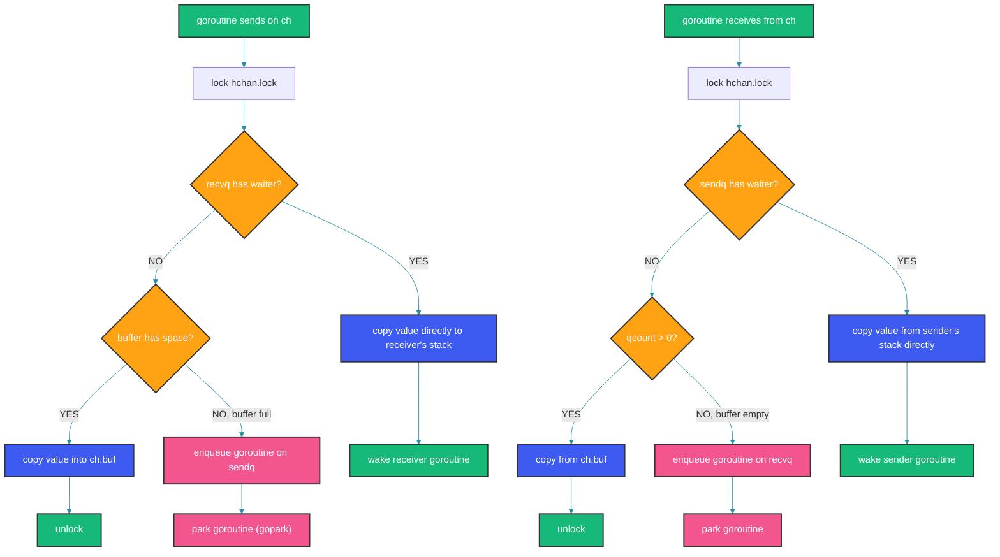
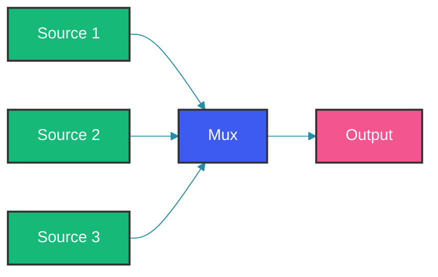
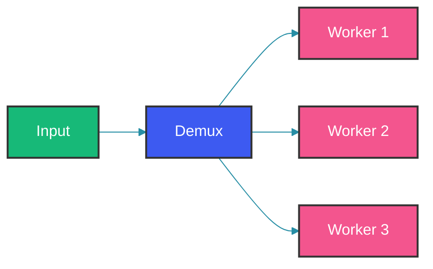

# Go Channels: Patterns and Internals

## Overview

Go's channel is not a concurrent queue. It's a synchronization primitive built on CSP (Communicating Sequential Processes). The mantra: "Do not communicate by sharing memory; instead, share memory by communicating." A channel coordinates goroutines — it tells one goroutine "data is ready" and another "someone is waiting."

Understanding channels at the implementation level changes how you design concurrent systems.

---

## Problem Statement

Concurrent programming has two fundamental coordination problems:

1. **Synchronization**: Goroutine A must wait for goroutine B to finish a task before continuing.
2. **Data transfer**: Goroutine A produces data that goroutine B needs.

Without channels, you'd reach for mutexes + condition variables + shared memory. This is error-prone and doesn't enforce ownership at the type level. Channels solve both problems with a single, typed primitive.

---

## Mental Model

Think of channels as typed pipes with built-in flow control.

```
                    ┌──────────────────────────┐
  Goroutine A ─────►│                          │──────► Goroutine B
   (sender)         │   hchan (channel struct)  │        (receiver)
                    │                          │
                    │  ┌────┐ ┌────┐ ┌────┐   │
                    │  │buf[0]│ │buf[1]│ │buf[2]│   │  (buffered)
                    │  └────┘ └────┘ └────┘   │
                    │  sendq: G1◄─►G2◄─►G3    │
                    │  recvq: G4◄─►G5         │
                    └──────────────────────────┘
```

Unbuffered: synchronous. Sender blocks until receiver is ready.
Buffered: async up to capacity. Sender blocks only if buffer is full.

---

## Channel Internals

The runtime representation is `hchan` in `runtime/chan.go`:

```go
type hchan struct {
    qcount   uint           // total data items in queue
    dataqsiz uint           // size of circular queue (buffer capacity)
    buf      unsafe.Pointer // pointer to buffer (array of elemsize)
    elemsize uint16         // size of each element
    closed   uint32         // channel closed flag
    elemtype *_type         // element type for GC
    sendx    uint           // send index in buffer
    recvx    uint           // receive index in buffer
    recvq    waitq          // list of goroutines waiting to receive
    sendq    waitq          // list of goroutines waiting to send
    lock     mutex          // protects all fields
}

type waitq struct {
    first *sudog
    last  *sudog
}
```

Key insight: channels are just a struct with a lock, a circular buffer, and two linked lists of waiting goroutines.

The `lock` protects the channel. Every send, receive, and close acquires this lock. This is fine because the critical section is tiny (copying data, adjusting pointers).

### Send Flow (unbuffered)

```
goroutine G1 sends value V on channel ch

1. Lock ch.lock
2. Check ch.recvq: is there a waiter G2?
3.   YES: Dequeue G2 from recvq
4.        Copy V directly to G2's stack (no buffer copy)
5.        Unlock ch.lock
6.        Wake G2 (make it runnable)
7.   NO:  Block G1
8.        Enqueue G1 on sendq
9.        Unlock ch.lock
10.       Park G1 (gopark)
```

### Send Flow (buffered, space available)

```
1. Lock ch.lock
2. Copy V into ch.buf[ch.sendx]
3. Increment ch.sendx (circular)
4. Increment ch.qcount
5. Unlock ch.lock
6. G1 continues (non-blocking)
```

### Receive Flow

```
goroutine G2 receives from channel ch

1. Lock ch.lock
2. Check ch.sendq: is there a sender G1 waiting?
3.   YES: Dequeue G1 from sendq
4.        Copy V from G1's stack (or from G1's send buffer)
5.        Unlock ch.lock
6.        Wake G1
7.   NO:  Check ch.qcount > 0
8.        YES: Copy from ch.buf
9.             If a sender is waiting, copy directly to receiver (instead of buffer)
10.            Decrement qcount, advance recvx
11.            Unlock
12.        NO: Block G2
13.            Enqueue G2 on recvq
14.            Unlock
15.            Park G2
```

---

## Channel Send/Receive Flow



---

## Unbuffered vs Buffered

| Unbuffered `make(chan T)` | Buffered `make(chan T, N)` |
|---|---|
| Synchronous handoff | Async up to N items |
| Sender blocks until receiver is ready | Sender blocks only if buffer full |
| Guarantees that send and receive happen at the same time | No such guarantee |
| Used for synchronization / signaling | Used for decoupling producers and consumers |

### Unbuffered example: signaling

```go
done := make(chan struct{})
go func() {
    doWork()
    close(done) // signal completion
}()
<-done // wait for work to finish
```

### Buffered example: decoupling

```go
type EmailJob struct {
    To      string
    Subject string
    Body    string
}

queue := make(chan EmailJob, 1000)

// Producer
func emailHandler(w http.ResponseWriter, r *http.Request) {
    job := parseEmailRequest(r)
    select {
    case queue <- job:
        w.WriteHeader(http.StatusAccepted)
    default:
        w.WriteHeader(http.StatusServiceUnavailable)
    }
}

// Consumer
func emailWorker(queue <-chan EmailJob) {
    for job := range queue {
        sendEmail(job)
    }
}
```

---

## Nil Channel

A nil channel is not zero-value usable. It's a common gotcha:

```go
var ch chan int // nil

ch <- 42   // blocks forever (deadlock!)
<-ch       // blocks forever
close(ch)  // panic: close of nil channel
```

But nil channels are useful! You can selectively disable a channel in a select:

```go
func merge(ch1, ch2 <-chan int) <-chan int {
    out := make(chan int)
    go func() {
        defer close(out)
        for ch1 != nil || ch2 != nil {
            select {
            case v, ok := <-ch1:
                if !ok { ch1 = nil; continue }
                out <- v
            case v, ok := <-ch2:
                if !ok { ch2 = nil; continue }
                out <- v
            }
        }
    }()
    return out
}
```

---

## Select Statement

`select` lets a goroutine wait on multiple channel operations.

### Uniform Pseudo-Random Selection

When multiple cases are ready, Go picks one with uniform pseudo-random distribution:

```go
select {
case ch1 <- 1:
    fmt.Println("sent to ch1")
case ch2 <- 1:
    fmt.Println("sent to ch2")
default:
    fmt.Println("neither ready")
}
```

This is deliberate. Random selection prevents starvation without requiring priority semantics.

### Default Case

The default case makes select non-blocking:

```go
select {
case msg := <-inbox:
    process(msg)
default:
    // No message, continue
}
```

---

## Pipeline Patterns

### Fan-In (multiplexing multiple inputs into one output)



```go
func fanIn(channels ...<-chan int) <-chan int {
    out := make(chan int)
    var wg sync.WaitGroup
    for _, ch := range channels {
        wg.Add(1)
        go func(c <-chan int) {
            defer wg.Done()
            for v := range c {
                out <- v
            }
        }(ch)
    }
    go func() {
        wg.Wait()
        close(out)
    }()
    return out
}
```

### Fan-Out (distributing work to multiple workers)



```go
func fanOut(in <-chan int, workers int) []<-chan int {
    channels := make([]chan int, workers)
    for i := 0; i < workers; i++ {
        channels[i] = make(chan int)
    }

    go func() {
        defer func() {
            for _, ch := range channels {
                close(ch)
            }
        }()

        idx := 0
        for v := range in {
            channels[idx] <- v
            idx = (idx + 1) % workers
        }
    }()

    result := make([]<-chan int, workers)
    for i, ch := range channels {
        result[i] = ch
    }
    return result
}
```

### Tee (splitting a stream into two)

```go
func tee(in <-chan int) (_, _ <-chan int) {
    out1 := make(chan int)
    out2 := make(chan int)

    go func() {
        defer close(out1)
        defer close(out2)

        for v := range in {
            out1 <- v
            out2 <- v
        }
    }()

    return out1, out2
}
```

### Or-Channel (combine multiple done channels)

```go
func orChannel(channels ...<-chan struct{}) <-chan struct{} {
    switch len(channels) {
    case 0:
        return nil
    case 1:
        return channels[0]
    }

    done := make(chan struct{})
    go func() {
        defer close(done)
        select {
        case <-channels[0]:
        case <-channels[1]:
        case <-orChannel(append(channels[2:], done)...):
        }
    }()
    return done
}
```

---

## Error Handling with Channels

Channels and errors are tricky. The common pattern is to use a struct that packages the value with an error:

```go
type Result struct {
    Value int
    Err   error
}

func processItems(ctx context.Context, items []int) <-chan Result {
    out := make(chan Result)
    go func() {
        defer close(out)
        for _, item := range items {
            select {
            case out <- func() Result {
                v, err := process(item)
                return Result{v, err}
            }():
            case <-ctx.Done():
                return
            }
        }
    }()
    return out
}
```

---

## Channel vs Mutex Decision Guide

| Use Channel When | Use Mutex When |
|---|---|
| Ownership of data transfers between goroutines | Multiple goroutines access shared state |
| You need signaling (wake up / notify) | You need to protect a critical section |
| Fan-in / fan-out / pipeline patterns | Complex data structures (maps, slices) |
| You want to compose concurrency | Performance of hot path (mutex is faster) |

The rule of thumb: **channels for orchestration, mutexes for state protection**.

---

## Production Patterns

### Rate Limiting

```go
func rateLimiter(ctx context.Context, requests <-chan Request, maxPerSec int) <-chan Response {
    tick := time.NewTicker(time.Second / time.Duration(maxPerSec))
    out := make(chan Response)

    go func() {
        defer tick.Stop()
        for req := range requests {
            <-tick.C
            select {
            case out <- handle(req):
            case <-ctx.Done():
                return
            }
        }
    }()
    return out
}
```

### Heartbeat

```go
func heartbeat(ctx context.Context, interval time.Duration) <-chan struct{} {
    beat := make(chan struct{})
    go func() {
        tick := time.NewTicker(interval)
        defer tick.Stop()
        for {
            select {
            case <-tick.C:
                select {
                case beat <- struct{}{}:
                default:
                }
            case <-ctx.Done():
                return
            }
        }
    }()
    return beat
}
```

---

## Best Practices

1. **Make zero-value channels nil** and use them intentionally to disable select cases.
2. **Always close channels from the sender side**, never the receiver.
3. **Use `_, ok := <-ch`** to distinguish between a value and channel closure.
4. **Prefer `chan struct{}` for signaling** — zero bytes, conveys intent.
5. **Limit channel buffer sizes** — unbounded buffers hide backpressure and can cause OOM.
6. **Name channel direction** in function signatures (`chan<-` for send-only, `<-chan` for receive-only).

---

## Common Mistakes

1. **Sending on a closed channel** causes a panic. Use `sync.Once` or a dedicated closer.
2. **Closing a channel twice** causes a panic. Always use `sync.Once` or check with a mutex.
3. **Goroutine leak via blocked send**: sender blocks because nobody reads. Use buffered channels or a select with default.
4. **Deadlock with unbuffered channels**: both sides must be ready simultaneously. Ensure sender and receiver are scheduled concurrently.
5. **Nil channel in select**: sending/receiving on nil channel blocks forever. Use it deliberately to disable cases.
6. **Assuming channel operations are lock-free**: they're not. The mutex in `hchan` serializes all operations.

---

## Interview Perspective

Channel questions separate engineers who read a tutorial from those who understand concurrency.

1. **What happens when you send to a closed channel?** Panic.
2. **What happens when you receive from a closed channel?** Returns zero value immediately (with `ok=false`).
3. **How does `select` choose when multiple cases are ready?** Uniform pseudo-random.
4. **Can a channel deadlock?** Yes. All goroutines blocked on channel operations with no possibility of progress.
5. **What's the difference between `close(ch)` and `ch <- struct{}{}`?** Close signals "no more data". Send signals "event occurred". Channel close is broadcast to all receivers.

---

## Summary

Channels are Go's primary concurrency primitive. They implement CSP, providing typed, synchronized communication between goroutines. The runtime represents channels as a struct with a lock, circular buffer, and linked lists of blocked goroutines. Unbuffered channels provide synchronous handoff, buffered channels provide async decoupling, and select enables dynamic multiplexing.

Pipeline patterns (fan-in, fan-out, tee) compose channels into data processing systems. The choice between channels and mutexes depends on whether you're orchestrating (channels) or protecting state (mutexes).

Happy Coding
