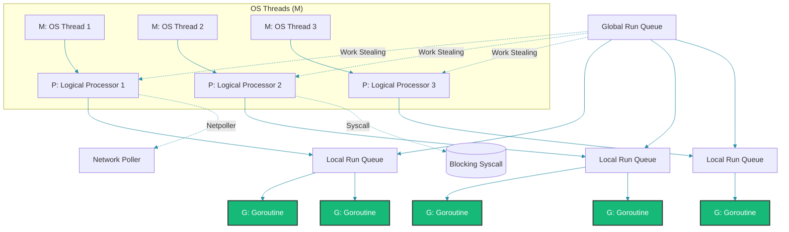

# Go Goroutines: Anatomy and Internals

## Overview

You have a service that needs to handle 10,000 concurrent WebSocket connections. In Java, you'd reach for a thread pool — but each thread costs ~1MB of stack memory. 10,000 threads would consume 10GB before doing any real work. In Go, you launch 10,000 goroutines, each starting with ~4KB. That's 40MB total. This is possible because goroutines are not OS threads.

Let's understand how.

---

## Problem Statement

Operating system threads are expensive:
- **Creation**: ~1MB stack reserve per thread
- **Context switch**: Kernel-mode transition, TLB flush, register save/restore
- **Blocking**: A blocked thread holds an OS thread hostage
- **Scaling**: You cannot run 100K OS threads effectively

Backend services need massive concurrency without massive resource consumption.

---

## Mental Model

Goroutines are user-space threads managed by the Go runtime. Think of them as coroutines that can be scheduled preemptively. The runtime multiplexes goroutines onto OS threads using a scheduler called the GMP model.

```
┌─────────────────────────────────────────────────────┐
│                   OS Threads (M)                     │
│  ┌──────────┐  ┌──────────┐  ┌──────────┐  ┌─────┐ │
│  │ Thread 1 │  │ Thread 2 │  │ Thread 3 │  │ ... │ │
│  └────┬─────┘  └────┬─────┘  └────┬─────┘  └─────┘ │
│       │              │              │                │
│  ┌────▼─────┐  ┌────▼─────┐  ┌────▼─────┐          │
│  │ Processor │  │ Processor │  │ Processor │          │
│  │  (P) #1   │  │  (P) #2   │  │  (P) #3   │          │
│  │ ┌───────┐ │  │ ┌───────┐ │  │ ┌───────┐ │          │
│  │ │Goroutine│ │  │ │Goroutine│ │  │ │Goroutine│ │          │
│  │ │   G1   │ │  │ │   G2   │ │  │ │   G3   │ │          │
│  │ │   G4   │ │  │ │   G5   │ │  │ │   G6   │ │          │
│  │ │   G7   │ │  │ │   G8   │ │  │ │   G9   │ │          │
│  │ └───────┘ │  │ └───────┘ │  │ └───────┘ │          │
│  └───────────┘  └───────────┘  └───────────┘          │
│                                                        │
│  ┌──────────────────────────────────────────┐          │
│  │          Global Run Queue (GRQ)           │          │
│  │     [G10] [G11] [G12] [G13] [G14]       │          │
│  └──────────────────────────────────────────┘          │
└─────────────────────────────────────────────────────────┘
```



---

## The GMP Model

Three core abstractions:

### G - Goroutine

A goroutine is a structure in the runtime containing:
- **Stack**: Starts at 2KB-4KB, grows dynamically via stack copying
- **PC/SP**: Program counter and stack pointer (saved when not running)
- **State**: Idle, Runnable, Running, Waiting (channel, mutex, syscall, network)
- **goid**: Unique identifier (though not exposed to user code by design)
- **Context**: Local storage for the scheduler (not accessible from user code)

### M - Machine (OS Thread)

An OS thread. The runtime creates at most `GOMAXPROCS` active Ms (default: number of CPUs). Additional Ms can be created for:
- Cgo calls
- Blocking system calls
- Threads blocked on non-network I/O

### P - Processor

A logical processor. `GOMAXPROCS` determines the number of Ps. Each P has:
- A local run queue (LRQ) of runnable goroutines
- A reference to the M currently attached to it
- Memory caches (mcache) for the allocator

---

## Goroutine Lifecycle

```
         ┌──────────┐
         │  Create  │
         └────┬─────┘
              │
              ▼
         ┌──────────┐
         │ Runnable │◄────────────────────┐
         └────┬─────┘                     │
              │                           │
              ▼                           │
         ┌──────────┐     preempt/return  │
         │ Running  ├─────────────────────┘
         └────┬─────┘
              │
       ┌──────┴──────┐
       ▼              ▼
  ┌─────────┐   ┌──────────┐
  │ Blocked │   │ Exiting  │
  │(chan/IO)│   └──────────┘
  └────┬────┘
       │ unblocked
       └─────────────────► Runnable
```

### 1. Creation

When you write `go fn()`, the compiler emits `runtime.newproc`. This:
1. Allocates a `g` struct (~500 bytes)
2. Allocates a small stack (2KB-4KB)
3. Sets up the function pointer and arguments
4. Puts the goroutine on the local or global run queue

The goroutine is created instantly — no syscall, no 1MB stack reservation.

### 2. Running

A P picks a G from its LRQ and executes it on the attached M. The goroutine runs until:
- It blocks on a channel, mutex, or syscall
- It calls `runtime.Gosched()`
- The preemption timer fires (10ms default)
- It completes

### 3. Blocking

When a goroutine blocks (e.g., `<-ch`, `mu.Lock()`, `time.Sleep`):
- The scheduler detaches the G from the M
- The G is parked in a wait queue
- The M picks another G from the LRQ and continues
- When the blocking condition resolves, the G is moved back to a run queue

### 4. Preemption

Since Go 1.14, goroutines are preemptible. A watchdog thread delivers a signal (SIGURG on Linux) every 10ms. The signal handler saves the goroutine's state and reschedules. This prevents runaway goroutines from starving others.

### 5. Exit

When a goroutine returns, it cleans up its stack and returns the g struct to a free list. The M continues with the next goroutine.

---

## Stack Management

This is where the magic lives. Each goroutine starts with a small stack (2KB on Go 1.4+, 4KB on some platforms). When the stack needs to grow:

### Stack Copying (v1.3+)

Before Go 1.3, stacks used a segmented approach (linked list of fixed-size segments). Since 1.3, stacks are contiguous and dynamically resized via copying:

1. The stack is full (a guard page triggers a stack overflow check)
2. `runtime.morestack()` is called
3. A new stack is allocated (doubled in size: 4KB → 8KB → 16KB ... up to 1GB max)
4. All stack frame data is copied
5. Pointers to stack locations are adjusted (relocation)
6. The old stack is freed

```go
// This causes stack growth on each recursion
func recurse(depth int) int {
    if depth == 0 {
        return 0
    }
    // Stack check inserted here by compiler
    return depth + recurse(depth-1)
}
```

Stack copying is fast because:
- Go knows the exact layout of each frame (no stack walking needed)
- Pointers between frames are known and can be adjusted precisely
- The cost is amortized: copying 8KB is ~1μs

---

## Network Poller Integration

Go integrates directly with the OS's event notification system:
- **Linux**: epoll
- **macOS/iOS**: kqueue
- **Windows**: IOCP (I/O Completion Ports)

When a goroutine does a network read/write:

```go
conn, _ := net.DialTimeout("tcp", "example.com:80", 5*time.Second)
conn.Write(data)  // If write would block, goroutine sleeps
```

1. The write returns `EAGAIN` / `EWOULDBLOCK`
2. The goroutine registers the fd with the netpoller
3. The goroutine parks (gopark)
4. When the fd becomes ready, the netpoller unparks the goroutine
5. The goroutine is moved to LRQ and resumes

This means thousands of goroutines can wait on network IO without tying up OS threads.

---

## System Call Handling

Blocking system calls (file I/O, DNS, etc.) are handled differently:

1. Before the syscall, `runtime.entersyscall()` is called
2. The P is released from the M (P can pick up another M)
3. The M blocks in the kernel
4. After the syscall, `runtime.exitsyscall()` tries to reacquire a P
5. If a P is available, the G continues
6. If not, the G goes to the global run queue, the M goes idle

For non-blocking syscalls (most network operations), this dance doesn't happen — the netpoller handles it.

---

## Worker Pool Pattern

Goroutines are cheap, but unlimited goroutines can still cause issues (memory pressure, GC overhead). The worker pool pattern limits concurrency:

```go
func workerPool(workers int, jobs <-chan Job, results chan<- Result) {
    var wg sync.WaitGroup
    for i := 0; i < workers; i++ {
        wg.Add(1)
        go func(id int) {
            defer wg.Done()
            for job := range jobs {
                results <- process(job)
            }
        }(i)
    }
    wg.Wait()
    close(results)
}
```

### Semaphore Pattern (without channels)

```go
func boundedWork(values []int, concurrency int) []int {
    sem := make(chan struct{}, concurrency)
    results := make([]int, len(values))

    var wg sync.WaitGroup
    for i, v := range values {
        wg.Add(1)
        sem <- struct{}{}
        go func(idx, val int) {
            defer wg.Done()
            defer func() { <-sem }()
            results[idx] = expensiveOp(val)
        }(i, v)
    }
    wg.Wait()
    return results
}
```

---

## Goroutine Leaks

The most common production bug with goroutines: they never exit.

```go
// BUG: goroutine leaks
func leak() {
    ch := make(chan int)
    go func() {
        val := <-ch // waits forever, nobody sends
        fmt.Println(val)
    }()
    // function returns, goroutine lives on
}
```

```go
// FIX: use context for cancellation
func noLeak(ctx context.Context) {
    ch := make(chan int)
    go func() {
        select {
        case val := <-ch:
            fmt.Println(val)
        case <-ctx.Done():
            return
        }
    }()
}
```

### Detecting Leaks

```go
import "runtime"

func printGoroutineCount() {
    buf := make([]byte, 1<<16)
    n := runtime.Stack(buf, true)
    count := bytes.Count(buf[:n], []byte("goroutine"))
    log.Printf("Active goroutines: %d", count)
}
```

---

## GOMAXPROCS

`GOMAXPROCS` controls the number of OS threads executing Go code simultaneously.

```go
runtime.GOMAXPROCS(4) // Limit to 4 OS threads
```

Default: number of CPU cores (or `runtime.NumCPU()`).

**Container caveat**: Before Go 1.24, `GOMAXPROCS` defaults to the host CPU count, not the container limit. In Kubernetes with CPU limits, you need:

```go
import _ "go.uber.org/automaxprocs"
// Automatically sets GOMAXPROCS to the container's CPU limit
```

---

## Best Practices

1. **Know when a goroutine exits**. Every `go fn()` should have a clear termination condition.
2. **Use `errgroup` for error propagation** across goroutines, not raw `sync.WaitGroup`.
3. **Don't guess about goroutine stack size**. The runtime manages it. Trust it.
4. **Limit goroutine creation** for CPU-bound work to `GOMAXPROCS`.
5. **Use `-race` flag** during development and CI to detect race conditions.
6. **Avoid `go func()` in libraries**. Let the caller decide concurrency.
7. **Prefer channels for signaling**, mutexes for state protection.

---

## Common Mistakes

1. **Launching goroutines in a loop capturing loop variables** (pre-Go 1.22 needed closure fix; Go 1.22+ fixed loop variable semantics).
2. **Not waiting for goroutines to finish** before the main function exits.
3. **Assuming goroutines have thread-local storage** — use `context.Context` instead.
4. **Using `time.Sleep` for synchronization** instead of channels or `sync.WaitGroup`.
5. **Recovering panics in goroutines** — if a goroutine panics without recovery, the whole process crashes.

---

## Interview Perspective

Goroutine questions test your understanding of the runtime:

1. **How does Go decide when to preempt a goroutine?** 10ms timer via SIGURG.
2. **What happens during a channel send on a full buffered channel?** The goroutine parks, adds itself to `sendq`.
3. **Why can't goroutines be killed externally?** No `Thread.Abort()` equivalent. Use context cancellation.
4. **How does stack copying work?** Doubling strategy, relocation of pointers.
5. **How does Go handle a goroutine blocked on a syscall?** Releases P, creates/hires a new M.

---

## Summary

Goroutines are lightweight user-space threads multiplexed by the Go runtime onto OS threads. They start with minimal stack, grow dynamically via stack copying, integrate with the OS's event notification system for network I/O, and are scheduled preemptively with work stealing. This design enables massive concurrency without massive resource consumption.

Understanding the GMP model, goroutine lifecycle, and stack management lets you write efficient, leak-free concurrent Go programs.

Happy Coding
