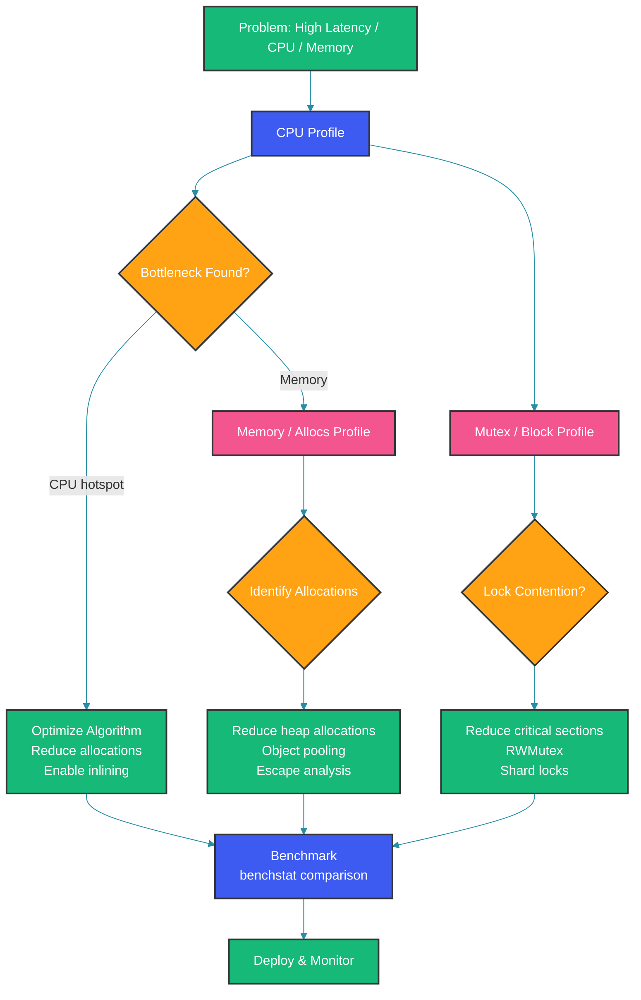

# Go Performance Optimization and Profiling

## Overview

Your Go service handles 5K RPS fine. Then a new feature ships and latency spikes. CPU is pegged at 90%, heap is growing, GC is running 10 times per second. You need to find the bottleneck and fix it — not guess, not randomly optimize.

This guide gives you a systematic approach: measure, identify, optimize, verify.

---

## Problem Statement

Performance optimization without profiling is superstition. Engineers waste days optimizing code that accounts for 1% of CPU time while ignoring the 40% bottleneck. Go provides world-class tooling (pprof, trace, benchstat) — but only if you know how to use it.

The methodology:
1. **Define the goal**: latency p99, throughput RPS, memory budget
2. **Measure**: profile CPU, memory, blocking, mutexes
3. **Identify**: find the hot path, allocation hotspot, lock contention
4. **Optimize**: apply targeted optimizations
5. **Verify**: benchmark before and after, compare with benchstat

---

## Mental Model

Performance optimization is about three resources:

```
┌──────────────────────────────────────────────────┐
│                  Performance                       │
├──────────────┬──────────────────┬─────────────────┤
│    CPU        │     Memory       │   Concurrency   │
│              │                   │                 │
│ • Algorithm  │ • Heap allocs    │ • Lock contention│
│ • Inlining   │ • GC frequency   │ • Goroutine sync│
│ • Bounds     │ • Object pooling  │ • Channel bloat │
│   checking   │ • Escape analysis│ • False sharing  │
│ • Syscalls   │ • Stack vs heap  │ • Work stealing  │
└──────────────┴──────────────────┴─────────────────┘
```

Each resource has its own profiling tool. The art is knowing which to use when.

---

## Profiling Tools

### CPU Profiling

```go
import _ "net/http/pprof"

// Enable: go tool pprof http://localhost:6060/debug/pprof/profile?seconds=30
// Then: go tool pprof -http=:8080 /path/to/profile
```

```go
// Or programmatically
f, _ := os.Create("cpu.pprof")
pprof.StartCPUProfile(f)
defer pprof.StopCPUProfile()
// run your code
```

### Memory Profiling

```go
// Heap profile (current memory)
// http://localhost:6060/debug/pprof/heap

// Allocation profile (where allocations happen)
// http://localhost:6060/debug/pprof/allocs
```

```bash
go tool pprof -http=:8080 http://localhost:6060/debug/pprof/heap
go tool pprof -http=:8080 http://localhost:6060/debug/pprof/allocs
```

### Mutex Profiling

```go
import "runtime"
runtime.SetMutexProfileFraction(1) // enable mutex profiling

// http://localhost:6060/debug/pprof/mutex
```

### Block Profiling

```go
runtime.SetBlockProfileRate(1) // enables goroutine blocking profiles

// http://localhost:6060/debug/pprof/block
```

### Trace

```go
import "runtime/trace"

f, _ := os.Create("trace.out")
trace.Start(f)
defer trace.Stop()
```

```bash
go tool trace trace.out
```

---

## Profiling Workflow



---

## Benchmarking

Go's testing framework includes first-class benchmarking.

### Writing Benchmarks

```go
func BenchmarkJSONMarshal(b *testing.B) {
    data := User{Name: "Alice", Age: 30, Email: "alice@example.com"}
    for b.Loop() { // Go 1.24+ API
        json.Marshal(data)
    }
}
```

Before Go 1.24, the pattern was:

```go
func BenchmarkJSONMarshal(b *testing.B) {
    data := User{Name: "Alice", Age: 30}
    b.ResetTimer()
    for i := 0; i < b.N; i++ {
        json.Marshal(data)
    }
}
```

### Running Benchmarks

```bash
go test -bench=. -benchmem ./...

# Run specific benchmark
go test -bench=BenchmarkJSONMarshal -benchmem ./...

# CPU profile of a benchmark
go test -bench=. -cpuprofile=cpu.out -memprofile=mem.out .

# Compare multiple runs
go test -bench=. -count=10 > old.txt
# make changes
go test -bench=. -count=10 > new.txt
benchstat old.txt new.txt
```

### Benchmarking Best Practices

```go
// 1. Reset timer after setup
func Benchmark(b *testing.B) {
    data := expensiveSetup()
    b.ResetTimer()
    for b.Loop() {
        doWork(data)
    }
}

// 2. Avoid compiler optimizations
func Benchmark(b *testing.B) {
    result int
    for b.Loop() {
        result = compute()
    }
    _ = result // prevent dead code elimination
}

// 3. b.RunParallel for concurrency benchmarks
func BenchmarkParallel(b *testing.B) {
    b.RunParallel(func(pb *testing.PB) {
        for pb.Next() {
            concurrentWork()
        }
    })
}
```

---

## CPU Optimization

### 1. Inlining

The compiler inlines small functions to avoid call overhead.

```go
// This gets inlined
func min(a, b int) int {
    if a < b { return a }
    return b
}

// This does not (too complex)
func process(records []Record) error {
    // complex logic
}
```

Check inlining:

```bash
go build -gcflags="-m" .
# output: ./main.go:10:6: can inline min
```

### 2. Bounds Check Elimination (BCE)

The compiler eliminates bounds checks when it can prove safety.

```go
func sum(nums []int) int {
    var total int
    for i := 0; i < len(nums); i++ { // compiler knows i < len
        total += nums[i] // no bounds check
    }
    return total
}

// More efficient version
func sum(nums []int) int {
    _ = nums[2] // hint: len >= 3
    return nums[0] + nums[1] + nums[2] // all bounds checks eliminated
}
```

### 3. Dead Code Elimination

```go
func debugLog(msg string) {
    if false { // compiler removes this entire block
        fmt.Println(msg)
    }
}
```

---

## Memory Optimization

### Reducing Allocations

```go
// BEFORE: 2 allocations per call
func parseID(r *http.Request) (int, error) {
    id := r.URL.Query().Get("id") // allocation for query params
    return strconv.Atoi(id)       // no new allocation
}

// AFTER: avoid query parsing allocation (reuse)
var queryCache = sync.Pool{
    New: func() any {
        return make(url.Values)
    },
}

func parseID(r *http.Request) (int, error) {
    // Still allocates internally, but pattern shown
    return strconv.Atoi(r.URL.Query().Get("id"))
}
```

### Object Pooling

```go
type Packet struct {
    Data  []byte
    Addr  net.Addr
    Size  int
}

var packetPool = sync.Pool{
    New: func() any {
        return &Packet{
            Data: make([]byte, 0, 1500), // Ethernet MTU
        }
    },
}

func handlePacket(conn net.PacketConn) {
    pkt := packetPool.Get().(*Packet)
    defer packetPool.Put(pkt)
    pkt.Data = pkt.Data[:cap(pkt.Data)]
    n, addr, _ := conn.ReadFrom(pkt.Data)
    pkt.Size = n
    pkt.Addr = addr
    process(pkt)
}
```

### String Concatenation

```go
// BAD: O(n^2) allocations
var result string
for _, s := range items {
    result += s
}

// GOOD: O(n) with 1 allocation
var b strings.Builder
b.Grow(totalSize)
for _, s := range items {
    b.WriteString(s)
}
result := b.String()
```

---

## Concurrency Optimization

### 1. Lock Contention

```go
// BAD: global mutex, high contention
var mu sync.Mutex
var cache = make(map[string]*User)

func getUser(id string) *User {
    mu.Lock()
    defer mu.Unlock()
    return cache[id]
}

// BETTER: sharded locks
type Cache struct {
    shards [64]shard
}

type shard struct {
    mu    sync.Mutex
    items map[string]*User
}

func (c *Cache) getShard(key string) *shard {
    h := fnv.New32a()
    h.Write([]byte(key))
    return &c.shards[h.Sum32()%64]
}

func (c *Cache) Get(key string) *User {
    s := c.getShard(key)
    s.mu.Lock()
    defer s.mu.Unlock()
    return s.items[key]
}
```

### 2. False Sharing

False sharing happens when goroutines on different CPUs modify variables on the same cache line (64 bytes).

```go
// BAD: counters likely share a cache line
type Counter struct {
    a int64
    b int64
}

// GOOD: padding ensures separate cache lines
type Counter struct {
    a int64
    _ [56]byte // padding to 64 bytes
    b int64
    _ [56]byte
}
```

### 3. Goroutine Pooling

For CPU-bound work, limit goroutines to `GOMAXPROCS`.

```go
func parallelSum(items []int, numWorkers int) int {
    if numWorkers <= 0 {
        numWorkers = runtime.GOMAXPROCS(0)
    }

    chunkSize := (len(items) + numWorkers - 1) / numWorkers
    results := make(chan int, numWorkers)

    for i := 0; i < numWorkers; i++ {
        start := i * chunkSize
        end := min(start+chunkSize, len(items))
        go func(s, e int) {
            var sum int
            for _, v := range items[s:e] {
                sum += v
            }
            results <- sum
        }(start, end)
    }

    var total int
    for i := 0; i < numWorkers; i++ {
        total += <-results
    }
    return total
}
```

---

## I/O Optimization

### Buffered I/O

```go
// BAD: unbuffered writes
f, _ := os.Create("output.txt")
for _, line := range lines {
    f.WriteString(line + "\n") // each write = syscall
}

// GOOD: buffered writes
f, _ := os.Create("output.txt")
buf := bufio.NewWriterSize(f, 64*1024)
for _, line := range lines {
    buf.WriteString(line + "\n")
}
buf.Flush()
```

### Connection Pooling

`http.Transport` provides built-in connection pooling:

```go
transport := &http.Transport{
    MaxIdleConns:        100,
    MaxIdleConnsPerHost: 10,
    IdleConnTimeout:     90 * time.Second,
}

client := &http.Client{Transport: transport}
```

---

## Compiler Optimizations

### Go 1.22+ Optimizations

- **Profile-guided optimization (PGO)**: Use production profiles to guide compiler inlining and code generation.

```bash
# Collect profile in production
curl http://localhost:6060/debug/pprof/profile?seconds=30 > default.pgo

# Build with PGO
go build -pgo=default.pgo .
```

- **Loop variable fix**: No more copies in loop closures (Go 1.22).
- **Improved defers**: Stack-allocated defers (Go 1.14+), lower overhead.
- **Range over integers**: Cleaner iteration.

---

## Production Monitoring

### Metrics to Monitor

```go
import "runtime/metrics"

var m [10]metrics.Sample
m[0].Name = "/gc/cycles/automatic:gc-cycles"
m[1].Name = "/memory/classes/heap/objects:bytes"
m[2].Name = "/sched/goroutines:goroutines"
m[3].Name = "/cpu/classes/gc/total:cpu-seconds"

metrics.Read(m[:])

for _, s := range m {
    fmt.Printf("%s: %v\n", s.Name, s.Value)
}
```

### Common Production Issues

1. **High GC CPU**: `GOGC=200` reduces GC frequency. `GOMEMLIMIT` prevents OOM.
2. **Goroutine leaks**: Monitor `runtime.NumGoroutine()` in metrics. Rising trend = leak.
3. **Memory growth without GC recovery**: Stale references prevent GC from freeing memory.
4. **CPU throttling in containers**: Use `uber-go/automaxprocs` to detect CPU limits.

---

## Best Practices

1. **Always benchmark before and after** an optimization. Use `benchstat` to compare.
2. **Profile in production-like environments** — local dev profiles differ from production.
3. **Start with CPU profile** — it often reveals the real bottleneck.
4. **Reduce allocations first** — fewer allocations = less GC work.
5. **Use PGO** for production builds — it's free performance (~5-10%).
6. **Set GOMEMLIMIT** in containerized deployments (Go 1.19+).
7. **Don't optimize what you haven't measured**. The first 80% of optimization is profiling.

---

## Common Mistakes

1. **Optimizing before profiling**: The most common and most expensive mistake.
2. **Micro-benchmarking without considering real-world patterns**: A function that's fast in isolation may be slow under different GC pressure.
3. **Ignoring GC overhead**: Reducing allocations by 50% often reduces total latency by more than 50% because GC CPU time drops.
4. **Over-optimizing cold paths**: Optimize the hot path (the 20% of code that runs 80% of the time).
5. **Not checking escape analysis**: A "stack allocation" may escape without you knowing.

---

## Interview Perspective

1. **How do you find a CPU bottleneck in Go?** CPU profile via pprof, look for hot functions in the flame graph.
2. **What's the impact of heap allocations on performance?** Each allocation costs ~100ns plus GC overhead. Reducing allocations reduces GC CPU time.
3. **How do you benchmark correctly?** Use `b.Loop()` or `b.N`, reset timer after setup, avoid compiler optimizations with result assignment.
4. **What's false sharing and how do you fix it?** Multiple goroutines writing to adjacent memory on the same cache line. Fix with padding or restructuring.
5. **How does PGO improve performance?** The compiler uses production profile data to make better inlining and code layout decisions.

---

## Summary

Performance optimization is a systematic process: profile, identify, optimize, verify. Go's tooling (pprof, trace, benchstat) gives you everything you need. Focus on reducing heap allocations, identifying lock contention, and using compiler optimizations (inlining, PGO). Always measure before optimizing — the data tells you what matters.

Happy Coding
