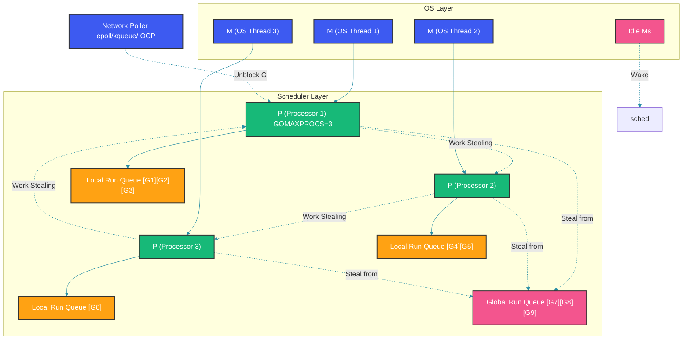
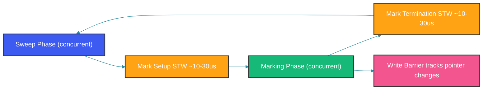
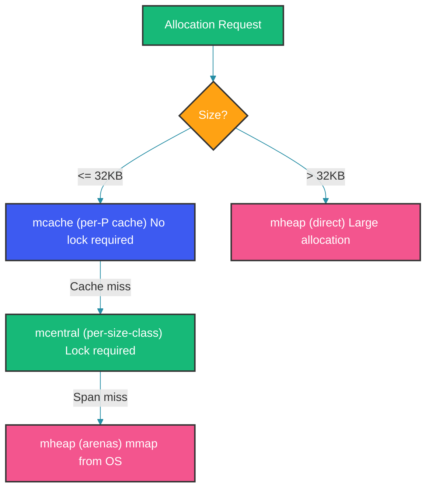

---
title: "Go Runtime: Scheduler, GC, and Internals"
description: "Deep dive into Go runtime: GMP scheduler, garbage collector, memory allocator, network poller, and runtime internals"
date: "2026-05-14"
author: "Abhishek Tiwari"
tags:
  - go
  - runtime
  - scheduler
  - gc
  - internals
coverImage: "/images/go-runtime.png"
draft: false
---

# Go Runtime: Scheduler, GC, and Internals

## Overview

Go is not a language that compiles to machine code and leaves you alone. Go includes a runtime — a library linked into every Go binary that manages goroutines, memory, garbage collection, and network I/O. Understanding the runtime means understanding how your program actually executes on the machine.

Every Go program includes:
- **Scheduler**: Multiplexes goroutines onto OS threads
- **Garbage Collector**: Reclaims unused heap memory
- **Memory Allocator**: Manages heap and stack allocation
- **Network Poller**: Integrates with epoll/kqueue/IOCP
- **Runtime metrics**: Exposes memory, goroutine, and GC statistics

---

## Problem Statement

You write go fn() and it "just works" — 10K goroutines created, scheduled, blocked, resumed, and destroyed without you thinking about OS threads, context switches, or stack management. How?

The runtime is the invisible operating system for your Go program. Understanding it lets you write more efficient code, debug production issues, and tune performance.

---

## Mental Model

Think of the Go runtime as a miniature operating system running inside your process:

| OS Feature | Go Runtime Equivalent |
|---|---|
| Process scheduling (kernel) | GMP Scheduler |
| Virtual memory management | Memory allocator + GC |
| I/O multiplexing (epoll/kqueue) | Network poller |
| System calls | entersyscall / exitsyscall |
| Process state | Goroutine states (runnable, running, waiting) |

---

## GMP Scheduler

### The Three Abstractions

G (Goroutine): Represents an execution context. Stack, program counter, state.

M (Machine): An OS thread. Does actual computation.

P (Processor): Scheduling context with local run queue. GOMAXPROCS limits active Ps.

```go
// Simplified runtime.schedt (the scheduler struct)
type schedt struct {
    midle        muintptr    // idle Ms
    nmidle       int32       // count of idle Ms
    nmspinning   int32       // spinning Ms looking for work
    runq         gQueue      // global run queue
    runqsize     int32
}

// Simplified runtime.p struct
type p struct {
    id          int32
    m           muintptr     // attached M
    runqhead    uint32       // local run queue head
    runqtail    uint32       // local run queue tail
    runq        [256]guintptr // local run queue (array, not slice)
}
```

### GMP Scheduler Model



### Scheduling Events

The scheduler runs (i.e., a decision is made) when:

1. A goroutine blocks on channel, mutex, syscall, network I/O
2. A goroutine is created (go fn())
3. A goroutine exits
4. Preemption fires (10ms timer via SIGURG)
5. A syscall returns

### Work Stealing

When a P's local run queue is empty:

1. Try to steal from another P's run queue (steal half)
2. Check the global run queue
3. Run the network poller (netpoll)
4. If nothing available, M goes idle (spinning M waits briefly before sleeping)

### Hand Off

When a G makes a blocking syscall:

1. runtime.entersyscall() is called
2. The M is released from the P
3. The P looks for another M (or creates one)
4. When the syscall returns, the G tries to reacquire a P
5. If no P available, the G goes to the global run queue

### Syscall Handling

```go
// Before syscall
func entersyscall() {
    // Save PC/SP of calling goroutine
    // Set G status to _Gsyscall
    // Release P from current M
}

// After syscall
func exitsyscall() {
    // Try to reacquire P
    // If no P, put G on global run queue
    // Wake up a P if needed
}
```
---

## Garbage Collector

### GC Phases



### Tri-Color Marking

- **White**: Not yet visited. Candidate for collection.
- **Gray**: Visited, but children have not been scanned yet.
- **Black**: Visited and all children scanned. Known to be reachable.

The invariant: there is no black-to-white pointer (unless protected by the write barrier).

### Write Barrier

During concurrent marking, the mutator (your code) runs alongside the GC. If the mutator modifies a pointer, the write barrier catches it:

- If the mutator assigns a white object to a black object, the barrier shades the white object gray.
- This ensures no reachable object is missed.

### GC Pacing

```go
// gcTrigger determines when to start a GC cycle
type gcTrigger uint8

const (
    gcTriggerHeap gcTrigger = iota  // heap size trigger (default)
    gcTriggerTime                    // 2 minutes since last GC
    gcTriggerCycle                   // runtime.GC() called
)
```

Heap trigger: next_trigger = live_heap + live_heap * GOGC / 100

Example: live heap = 100MB, GOGC = 100 -> trigger at 200MB.
---

## Memory Allocator

### Three-tier Allocation



### Size Classes

Objects are rounded up to size classes:

| Range | Size Class |
|---|---|
| 1 -> 8 bytes | class 1 |
| 2 -> 16 bytes | class 2 |
| 1024 -> 1024 bytes | class 33 |
| 32768 -> 32768 bytes | class 67 |

Each size class has its own free list in mcache and mcentral.

### Spans

A span is a contiguous region of memory (usually 8KB or larger). Spans are divided into objects of equal size based on the size class.

```go
type mspan struct {
    next        *mspan
    prev        *mspan
    startAddr   uintptr
    npages      uintptr
    spanclass   spanClass
    state       mSpanState // free, inUse, msSpanInUse
}
```

### Arenas

Large regions of virtual memory (64MB on 64-bit systems). The heap grows by allocating new arenas from the OS.
---

## Network Poller

The netpoller integrates Go scheduler with the OS I/O event notification system:

| Platform | Mechanism |
|---|---|
| Linux | epoll |
| macOS/iOS | kqueue |
| Windows | IOCP |

### How it works

1. When a goroutine performs non-blocking network I/O that would block (EAGAIN):
   - The fd is registered with the netpoller
   - The goroutine parks
2. The netpoller runs when:
   - A P is idle and looking for work
   - The dedicated sysmon thread periodically polls
3. When an fd becomes ready:
   - The associated goroutine is unblocked
   - It is moved to a P local run queue or the global run queue

```go
// Simplified: pollDesc wraps a network connection
type pollDesc struct {
    fd         *pollFD
    rg         *g       // goroutine waiting to read
    wg         *g       // goroutine waiting to write
}
```

---

## Goroutine Stacks

### Initial Stack

Each goroutine starts with a small stack (2KB on most platforms). This is allocated from the stack pool or the heap.

### Stack Growth

When a goroutine needs more stack:

1. runtime.morestack() is called (inserted by compiler at function prologue)
2. Current stack size is checked against needed size
3. A new stack is allocated (typically 2x the current size)
4. All frames are copied to the new stack
5. Pointers in the stack are relocated
6. The old stack is freed

### Stack Limits

- Minimum: 2KB
- Maximum: 1GB on 64-bit systems
- Growth factor: 2x each time (up to some limit, then 1.25x)
- Stack copying is safe because Go knows exact frame layout
---

## Runtime Monitoring

### GOMAXPROCS

Controls number of Ps:

```
runtime.GOMAXPROCS(4) // limit to 4 scheduler processors
```

Default: number of logical CPUs (or container limit with automaxprocs).

### GODEBUG

Environment variable for runtime debugging:

```
GODEBUG=gctrace=1,schedtrace=1000 ./server
```

- gctrace=1: Print GC cycle info
- schedtrace=1000: Print scheduler stats every 1000ms
- inittrace=1: Trace init functions
- clobberfree=1: Debug memory corruption

### runtime.ReadMemStats

```go
var m runtime.MemStats
runtime.ReadMemStats(&m)

fmt.Printf("Alloc: %d MB\n", m.Alloc/1024/1024)
fmt.Printf("TotalAlloc: %d MB\n", m.TotalAlloc/1024/1024)
fmt.Printf("Sys: %d MB\n", m.Sys/1024/1024)
fmt.Printf("NumGC: %d\n", m.NumGC)
```

### runtime.Metrics (Go 1.16+)

```go
const metricsName = "/gc/cycles/automatic:gc-cycles"
s := make([]metrics.Sample, 1)
s[0].Name = metricsName
metrics.Read(s)
```

---

## Runtime Packages

| Package | Purpose |
|---|---|
| runtime | Core runtime functions (GC, scheduler, goroutines) |
| runtime/pprof | Runtime profiling data |
| runtime/trace | Execution tracing |
| runtime/metrics | Named runtime metrics (Go 1.16+) |
| runtime/debug | Debugging, SetGCPercent, FreeOSMemory |

---

## Best Practices

1. **Trust the runtime** — it is battle-tested at Google scale. Do not try to outsmart it without profiling.
2. **Set GOMEMLIMIT** in containerized deployments to prevent OOM.
3. **Use GOMAXPROCS = container CPU limit** (auto with uber-go/automaxprocs).
4. **Check goroutine count in production** — rising count signals a leak.
5. **Understand GC pacing** before tuning GOGC.
6. **Use GODEBUG** during debugging, not in production (performance overhead).

---

## Common Mistakes

1. **Creating too many OS threads**: Cgo calls and blocking syscalls create Ms. In excess, they overwhelm the OS.
2. **Ignoring STW pauses**: With large heaps (>100GB) or many pointers, mark termination STW can reach milliseconds.
3. **Not understanding GOMAXPROCS in containers**: Go defaults to host CPU count, leading to oversubscription in containers.
4. **Holding references in long-lived goroutines**: Prevents GC from freeing memory, causing RSS growth.
5. **Modifying the GC default without measuring**: Changing GOGC from 100 to a higher value without profiling can cause OOM.

---

## Interview Perspective

1. **Describe the GMP model**. G = Goroutine (execution context), M = Machine (OS thread), P = Processor (scheduling context with run queue).
2. **How does Go decide when to run a goroutine?** When a P has available slots, it picks from local run queue, then global, then steals, then netpoller.
3. **What happens during a blocking syscall?** The M releases the P, the P picks up another M, and the blocked M waits in the kernel.
4. **How does the GC handle concurrent mutation?** Write barrier: when a pointer assignment creates a new black-to-white edge, the white object is shaded gray.
5. **What causes a goroutine to be preempted?** A 10ms timer (SIGURG) triggers a signal, forcing the goroutine to yield.

---

## Summary

The Go runtime is the invisible operating system for your program. The GMP scheduler multiplexes millions of goroutines onto a handful of OS threads. The concurrent GC manages heap memory with minimal pause times. The memory allocator uses a three-tier cache hierarchy. The network poller integrates with epoll/kqueue/IOCP for non-blocking I/O. Understanding the runtime lets you build efficient, scalable backend services.

Happy Coding
